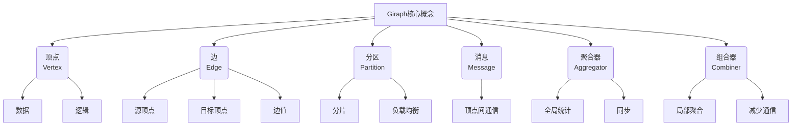

# Giraph在水资源管理中的应用

## 1. 背景介绍

### 1.1 问题的由来

水资源是人类赖以生存的关键资源,合理有效地管理水资源对于可持续发展至关重要。随着全球人口不断增长和城镇化进程加快,对淡水资源的需求与日俱增。然而,由于气候变化、环境污染和不合理的用水行为,可用的淡水资源日益减少,水资源短缺已成为全球性挑战。

传统的水资源管理方式存在诸多问题,如数据采集困难、决策缺乏科学依据、管理效率低下等。随着大数据时代的到来,海量的水资源相关数据不断积累,亟需借助先进的大数据技术来实现高效、智能的水资源管理。

### 1.2 研究现状

近年来,大数据技术在水资源管理领域的应用日益受到重视。研究人员提出了多种基于大数据的水资源管理模型和算法,如基于机器学习的需水量预测模型、基于优化理论的调度算法等。然而,这些模型和算法大多局限于特定场景,缺乏通用性和可扩展性。

### 1.3 研究意义

Giraph是Apache开源的一款可扩展的大规模图形并行处理系统,可高效处理大规模数据集。由于水资源系统本质上是一个复杂的网络结构,采用Giraph进行建模和分析具有天然的优势。本文将探讨如何将Giraph应用于水资源管理,旨在提出一种通用、高效的大数据驱动的水资源管理解决方案。

### 1.4 本文结构

本文首先介绍Giraph的核心概念和算法原理,然后详细阐述如何构建水资源管理的数学模型,并给出相应的公式推导过程。接下来,通过一个实际项目案例,展示如何使用Giraph进行水资源管理系统的开发实践。最后,探讨Giraph在水资源管理领域的应用前景,并总结未来的发展趋势和挑战。

## 2. 核心概念与联系



Giraph是一个用于构建和运行迭代图算法的框架,其核心概念包括:

- **顶点(Vertex)**: 表示图中的节点,包含数据和逻辑。
- **边(Edge)**: 连接两个顶点,包含源顶点、目标顶点和边值。
- **分区(Partition)**: 将大规模图数据分片存储,实现负载均衡。
- **消息(Message)**: 顶点之间通信的载体。
- **聚合器(Aggregator)**: 用于全局统计和同步。
- **组合器(Combiner)**: 进行局部聚合,减少通信开销。

在水资源管理中,我们可以将水资源系统建模为一个大规模图,其中:

- **顶点**: 表示水源、水库、管道节点等基础设施。
- **边**: 表示管道连接,边值可以是管径、长度等属性。
- **分区**: 根据地理位置或管理区域对图进行分区。
- **消息**: 用于传递水量、水压等动态信息。
- **聚合器**: 统计全局用水量、水资源总量等指标。
- **组合器**: 对局部区域的用水量进行聚合,减少通信开销。

通过将水资源系统映射到Giraph的核心概念,我们可以高效地建模和分析复杂的水资源网络,实现智能化的水资源调度和优化。

## 3. 核心算法原理与具体操作步骤

### 3.1 算法原理概述

Giraph采用"顶点计算(Vertex-Centric)"的编程模型,算法的执行过程由一系列超步(Superstep)组成。每个超步包括以下阶段:

1. **顶点计算阶段**: 每个顶点并行执行用户定义的计算逻辑,处理收到的消息,并可选择发送新消息。
2. **消息传递阶段**: 将上一阶段发送的消息传递给目标顶点。
3. **聚合器计算阶段**: 执行用户定义的聚合器逻辑,计算全局统计量。
4. **组合器计算阶段**: 执行用户定义的组合器逻辑,对消息进行局部聚合。
5. **检查终止条件**: 根据用户定义的条件,判断是否终止算法。

算法通过多次迭代上述超步,直至满足终止条件。Giraph自动处理顶点和消息的分布式存储、并行计算和容错,从而实现高效的大规模图形处理。

### 3.2 算法步骤详解

以下是Giraph算法的具体执行步骤:

1. **初始化**: 根据输入数据构建初始图结构,包括顶点、边和分区信息。
2. **启动超步循环**:
   a. **顶点计算阶段**:
      - 每个顶点并行执行`compute()`方法,处理收到的消息。
      - 根据计算逻辑,顶点可以修改自身状态、发送消息或投票终止。
   b. **消息传递阶段**:
      - 将上一阶段发送的消息传递给目标顶点。
      - 消息传递过程由框架自动完成,确保高效和容错。
   c. **聚合器计算阶段**:
      - 执行用户定义的`aggregate()`方法,计算全局统计量。
      - 统计量可用于同步、终止检测等。
   d. **组合器计算阶段**:
      - 执行用户定义的`combine()`方法,对消息进行局部聚合。
      - 减少网络通信开销,提高效率。
   e. **检查终止条件**:
      - 根据用户定义的条件(如最大超步数、全局统计量等),判断是否终止算法。
      - 如果不满足终止条件,进入下一个超步循环。
3. **输出结果**: 算法终止后,输出最终的顶点状态或其他计算结果。

通过上述步骤,Giraph可以高效地执行各种图形算法,如最短路径、页面排名、社区发现等,同时具有良好的容错性和可扩展性。

### 3.3 算法优缺点

**优点**:

- **高效并行**: Giraph采用"思考像一个顶点"的编程模型,天生支持数据并行,可充分利用集群资源。
- **容错性强**: Giraph基于Hadoop的容错机制,能够自动处理节点故障,确保计算的可靠性。
- **可扩展性好**: Giraph可以在大规模集群上运行,处理大规模图形数据,具有良好的横向扩展能力。
- **开源灵活**: Giraph是Apache开源项目,用户可以根据需求定制和扩展算法。

**缺点**:

- **学习曲线陡峭**: Giraph的编程模型和API相对复杂,需要一定的学习成本。
- **内存开销大**: Giraph将图形数据全部加载到内存中,对内存的需求较高。
- **迭代效率有待提高**: Giraph的每个超步都需要进行消息传递和同步,迭代效率受到一定影响。
- **调试困难**: 分布式环境下的调试相对困难,需要专门的工具和技巧。

### 3.4 算法应用领域

Giraph作为一种通用的大规模图形并行处理框架,可以应用于多个领域,包括但不限于:

- **社交网络分析**: 发现社交网络中的社区结构、影响力传播等。
- **网页排名**: 实现PageRank等网页排名算法。
- **推荐系统**: 基于用户兴趣关系图进行个性化推荐。
- **交通规划**: 分析交通网络,优化路径规划。
- **金融风险管理**: 分析金融交易网络,识别潜在风险。
- **生物信息学**: 分析蛋白质互作网络、基因调控网络等。

在水资源管理领域,Giraph可以高效地处理复杂的水资源网络数据,实现智能化的水资源调度、优化和决策支持。

## 4. 数学模型和公式详细讲解举例说明

### 4.1 数学模型构建

为了利用Giraph进行水资源管理,我们需要将水资源系统建模为一个大规模有向图 $G=(V, E)$,其中:

- $V$ 表示顶点集合,每个顶点 $v \in V$ 代表一个水资源基础设施,如水源、水库、管道节点等。
- $E$ 表示边集合,每条边 $e=(u, v) \in E$ 表示从顶点 $u$ 到顶点 $v$ 的管道连接。

每个顶点 $v$ 都有以下属性:

- $s_v$: 顶点的水量存储能力(如水库容量)。
- $q_v$: 顶点的当前水量。
- $r_v$: 顶点的用水需求量。

每条边 $e=(u, v)$ 也有以下属性:

- $c_e$: 管道的最大输送能力(如管径)。
- $f_e$: 管道的当前输送水量。

我们的目标是通过合理调度水资源网络,使得:

1. 满足每个顶点的用水需求,即 $q_v \geq r_v, \forall v \in V$。
2. 不超过每条管道的输送能力,即 $f_e \leq c_e, \forall e \in E$。
3. 全局总用水量最小化。

### 4.2 公式推导过程

我们将水资源调度问题建模为一个网络流优化问题。引入以下变量:

- $x_{uv}$: 从顶点 $u$ 流向顶点 $v$ 的水量。

我们需要最小化目标函数:

$$
\min \sum_{v \in V} r_v
$$

满足以下约束条件:

$$
\begin{aligned}
\sum_{u:(u,v)\in E} x_{uv} - \sum_{w:(v,w)\in E} x_{vw} &= r_v, &\forall v \in V \\
0 \leq x_{uv} &\leq c_{(u,v)}, &\forall (u,v) \in E \\
0 \leq q_v &\leq s_v, &\forall v \in V
\end{aligned}
$$

第一个约束条件保证每个顶点的用水需求得到满足,第二个约束条件限制了管道的输送能力,第三个约束条件限制了顶点的水量存储能力。

为了求解这个优化问题,我们可以使用Giraph实现一种分布式的网络流算法,如Push-Relabel算法。算法的基本思路是:

1. 初始化每个顶点的高度(height)和溢出(excess)值。
2. 在每个超步中,并行执行以下操作:
   a. 对于每个有溢出的顶点 $u$,尝试将溢出量推送(push)到相邻的较低高度顶点 $v$,更新 $x_{uv}$ 和 $x_{vu}$。
   b. 如果无法推送,则重新标记(relabel)顶点 $u$ 的高度。
3. 重复上述过程,直到所有顶点的溢出值为 0。

通过上述算法,我们可以得到一组满足约束条件的流量值 $x_{uv}$,从而实现全局最优的水资源调度。

### 4.3 案例分析与讲解

为了更好地理解上述数学模型和算法,我们以一个简单的水资源网络为例进行分析。

假设有 4 个顶点 $\{A, B, C, D\}$,分别表示一个水源、两个用水点和一个水库。它们之间由 5 条管道相连,如下图所示:

```mermaid
graph LR
  A[水源] -- 10 --> B[用水点]
  A -- 15 --> C[用水点]
  B -- 5 --> D[水库]
  C -- 8