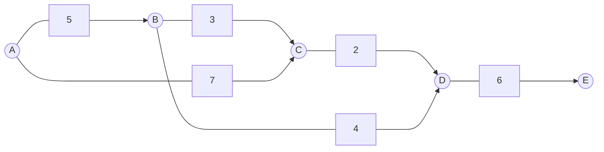

以下是标题为《Giraph在物流运输监控中的应用》的技术博客文章正文内容：

# Giraph在物流运输监控中的应用

## 1. 背景介绍

### 1.1 问题的由来

在当今快节奏的商业环境中，高效的物流运输系统对于企业的成功至关重要。随着电子商务的蓬勃发展和客户对及时送货的日益增长的期望,物流公司面临着前所未有的压力,需要实时监控和优化运输过程。传统的物流监控系统通常依赖于中央数据库,难以应对海量数据和复杂的计算需求。

### 1.2 研究现状  

为了解决这一挑战,研究人员开始探索大数据技术在物流运输监控领域的应用。Apache Giraph作为一种基于Bulk Synchronous Parallel(BSP)模型的开源图形处理系统,凭借其出色的可扩展性和高效的并行计算能力,成为物流运输大数据分析的有力工具。

### 1.3 研究意义

本文旨在探讨Giraph在物流运输监控中的应用,阐述其核心概念、算法原理和实现细节。通过实际案例分析,展示Giraph如何高效处理物流大数据,实现对运输路线的实时优化、异常检测和风险管理。这不仅有助于提高物流运营效率,还可以降低成本并提供更好的客户体验。

### 1.4 本文结构

本文首先介绍Giraph的核心概念和算法原理,包括图形数据模型、BSP计算模型和核心算法流程。接下来,详细阐述Giraph在物流运输监控中的应用场景,包括数学建模、算法实现和代码示例。最后,探讨Giraph在该领域的未来发展趋势和面临的挑战。

## 2. 核心概念与联系

Giraph是一个用于构建和运行在大规模集群上的迭代图形处理应用程序的开源系统。它基于Bulk Synchronous Parallel(BSP)计算模型,能够高效地处理大规模图形数据。

在Giraph中,图形数据被表示为一组顶点(Vertex)和边(Edge)。每个顶点可以存储任意数据,并通过消息传递与其他顶点进行通信。Giraph采用"顶点计算"的方式,即将计算任务分配给每个顶点,由顶点并行执行相应的计算逻辑。

BSP计算模型将计算过程划分为一系列超步(Superstep)。在每个超步中,所有顶点并行执行计算,并向其他顶点发送消息。当所有顶点完成计算后,系统进入下一个超步,处理上一超步发送的所有消息。这种同步机制确保了计算的正确性和一致性。

Giraph的核心算法包括图形分区、消息传递和容错机制等。图形分区决定了如何在集群中分布图形数据,而消息传递则实现了顶点之间的通信。容错机制则确保了计算的可靠性,能够在发生故障时自动恢复计算。

通过将物流运输数据建模为图形结构,Giraph可以高效地执行各种图形算法,如最短路径、连通分量和页面排名等,从而实现对运输路线的优化、异常检测和风险管理。

## 3. 核心算法原理与具体操作步骤

### 3.1 算法原理概述

Giraph的核心算法基于BSP计算模型,将图形处理任务划分为一系列超步。在每个超步中,所有顶点并行执行计算,并向其他顶点发送消息。当所有顶点完成计算后,系统进入下一个超步,处理上一超步发送的所有消息。

算法的执行过程如下:

1. 初始化图形数据和计算任务。
2. 将图形数据分区,并分布到集群中的不同工作节点。
3. 进入第一个超步,所有顶点并行执行计算逻辑。
4. 顶点向其他顶点发送消息。
5. 等待所有顶点完成计算,进入下一个超步。
6. 重复步骤4和5,直到满足终止条件。
7. 汇总计算结果并输出。

### 3.2 算法步骤详解

1. **初始化**

   在初始化阶段,Giraph会读取输入数据,构建图形结构。对于物流运输数据,每个城市可以表示为一个顶点,而城市之间的运输路线则表示为边。顶点可以存储城市的相关信息,如名称、位置坐标等。

2. **图形分区**

   为了在集群中并行执行计算,Giraph需要将图形数据分区。常用的分区策略包括哈希分区、范围分区和二次剖分等。分区后,每个工作节点负责处理一部分图形数据。

3. **超步计算**

   进入第一个超步,所有顶点并行执行计算逻辑。对于物流运输监控,计算逻辑可能包括:

   - 计算最短运输路径
   - 检测异常情况(如交通拥堵、天气变化等)
   - 评估风险并进行路线调整
   - 更新顶点状态(如货物位置、预计到达时间等)

   在计算过程中,顶点可以通过发送消息与其他顶点进行通信和协作。

4. **消息传递**

   在每个超步结束时,Giraph会收集所有顶点发送的消息,并在下一个超步开始时将这些消息传递给相应的目标顶点。消息传递机制确保了顶点之间的协作和数据共享。

5. **终止条件**

   算法会重复执行超步计算和消息传递,直到满足预定义的终止条件。对于物流运输监控,终止条件可能是所有货物安全送达目的地,或者达到最大迭代次数。

6. **结果输出**

   当算法终止后,Giraph会汇总计算结果并输出。对于物流运输监控,输出可能包括优化后的运输路线、异常情况报告、风险评估结果等。

### 3.3 算法优缺点

**优点:**

- 高度并行化,能够在大规模集群上高效执行计算。
- 基于BSP模型,确保了计算的正确性和一致性。
- 支持各种图形算法,如最短路径、连通分量和页面排名等。
- 具有良好的容错机制,能够自动恢复计算。

**缺点:**

- 对于非结构化数据或动态变化的数据,建模为图形结构可能会增加复杂性。
- 消息传递机制可能会引入额外的开销,影响计算效率。
- 需要专门的图形处理框架,增加了学习和部署的复杂性。

### 3.4 算法应用领域

除了物流运输监控外,Giraph还可以应用于以下领域:

- 社交网络分析
- 网页链接分析
- 推荐系统
- 金融风险分析
- 生物信息学
- 交通路线规划

任何可以建模为图形结构的问题,都可以使用Giraph进行高效的并行计算和分析。

## 4. 数学模型和公式详细讲解与举例说明

### 4.1 数学模型构建

在物流运输监控中,我们可以将整个运输网络建模为一个加权无向图 $G=(V,E,W)$,其中:

- $V$ 表示顶点集合,每个顶点 $v \in V$ 代表一个城市或物流中心。
- $E$ 表示边集合,每条边 $e=(u,v) \in E$ 代表城市 $u$ 和城市 $v$ 之间的运输路线。
- $W$ 是一个边权重函数,对于每条边 $e=(u,v)$,$W(e)$ 表示从城市 $u$ 运输到城市 $v$ 的成本或距离。

基于这个图形模型,我们可以定义和求解各种优化问题,如最短路径问题、最小生成树问题等,从而优化运输路线和降低成本。

### 4.2 公式推导过程

**1. 最短路径问题**

最短路径问题是物流运输监控中的一个核心问题。给定起点城市 $s$ 和终点城市 $t$,我们需要找到从 $s$ 到 $t$ 的最短路径,即路径上所有边权重之和最小。

设 $d(u,v)$ 表示从顶点 $u$ 到顶点 $v$ 的最短路径长度,则最短路径问题可以用动态规划方法求解:

$$
d(u,v) = \begin{cases}
0 & \text{if } u=v \\
\min\limits_{w \in N(u)} \{d(u,w) + W(u,w)\} & \text{if } u \neq v
\end{cases}
$$

其中 $N(u)$ 表示顶点 $u$ 的邻居集合。

**2. 最小生成树问题**

最小生成树问题旨在找到一个连通无环子图,使得该子图包含所有顶点,且边权重之和最小。这在物流运输网络设计中非常有用,可以帮助确定最优的物流中心布局。

设 $T=(V_T,E_T)$ 是图 $G$ 的一个生成树,则最小生成树问题可以表示为:

$$
\min\limits_{T} \sum\limits_{e \in E_T} W(e)
$$

该问题可以使用著名的Kruskal算法或Prim算法求解。

### 4.3 案例分析与讲解

考虑一个简单的物流运输网络,包含5个城市 $\{A,B,C,D,E\}$,边权重表示两个城市之间的距离(单位:公里)。我们的目标是找到从城市A到城市E的最短路径。

根据最短路径公式,我们可以计算出从A到其他城市的最短路径长度:

- $d(A,A) = 0$
- $d(A,B) = 5$
- $d(A,C) = \min\{5+3, 7\} = 8$
- $d(A,D) = \min\{5+3+2, 7+2\} = 10$
- $d(A,E) = \min\{5+3+2+6, 7+2+6\} = 16$

因此,从A到E的最短路径为 $A \rightarrow B \rightarrow C \rightarrow D \rightarrow E$,路径长度为16公里。

### 4.4 常见问题解答

**1. 如何处理动态变化的运输网络?**

对于动态变化的运输网络(如新增或删除路线),Giraph可以通过增量计算的方式进行更新。只需要更新相应的顶点和边数据,并重新执行计算,就可以得到最新的优化结果。

**2. 如何处理异常情况,如交通拥堵或天气变化?**

我们可以在图形模型中引入额外的权重或约束,来表示异常情况对运输路线的影响。例如,可以为拥堵路段增加较高的权重,或者为恶劣天气条件下的路段添加约束。然后,使用相应的算法(如最短路径算法)重新计算优化路线。

**3. 如何确保计算结果的准确性和可靠性?**

Giraph采用BSP计算模型,能够保证计算的正确性和一致性。此外,Giraph还具有容错机制,可以自动检测和恢复计算过程中的故障,确保计算结果的可靠性。

**4. Giraph与其他大数据框架(如Spark或Hadoop)相比,有何优缺点?**

Giraph专门针对图形处理问题进行了优化,在处理大规模图形数据时具有更高的效率。但是,对于非图形数据或非迭代计算,Spark或Hadoop可能会表现更好。选择合适的框架需要根据具体的应用场景和数据特征。

## 5. 项目实践:代码实例和详细解释说明

### 5.1 开发环境搭建

要在Giraph上开发和运行物流运输监控应用程序,我们需要先搭建开发环境。以下是主要步骤:

1. 安装Java开发环境(JDK)。
2. 下载并解压Giraph发行版。
3. 配置Hadoop环境,因为Giraph依赖于Hadoop进行分布式计算。
4. 设置Giraph的环境变量。

完成上述步骤后,我们就可以开