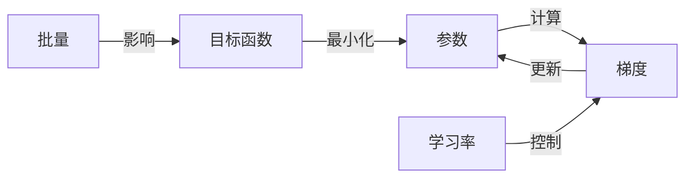

# Gradient Descent 原理与代码实战案例讲解

## 1. 背景介绍
### 1.1 问题的由来
在机器学习和深度学习领域,优化算法是模型训练的核心。而在众多优化算法中,梯度下降(Gradient Descent)可以说是应用最广泛、最成功的一种。无论是经典的逻辑回归、支持向量机,还是复杂的神经网络,几乎所有模型的训练都离不开梯度下降。因此,深入理解梯度下降的原理,掌握其代码实现,对于AI从业者来说至关重要。

### 1.2 研究现状
关于梯度下降,学术界已有大量研究。1847年,Cauchy首次提出了梯度下降的概念。此后,众多学者对其进行了改进和推广,如Hestenes和Stiefel提出的共轭梯度下降,Duchi等人提出的AdaGrad,Kingma和Ba提出的Adam等。这些变种在一定程度上克服了经典梯度下降的缺陷,加速了收敛。同时,分布式梯度下降算法如ADMM、SVRG也被广泛研究,用于处理海量数据。

### 1.3 研究意义 
深入研究梯度下降,一方面有助于我们理解各种机器学习算法的本质,提升建模和调参能力;另一方面,对梯度下降代码的掌握,也是实现各类模型的基础。此外,梯度下降思想还被应用到其他领域,如图像处理、自然语言理解等。可以说,梯度下降已经成为了现代人工智能的基石之一。

### 1.4 本文结构
本文将全面探讨梯度下降算法。第2部分介绍相关概念。第3部分详解算法原理和步骤。第4部分建立数学模型并给出公式推导。第5部分提供Python代码实现。第6部分讨论应用场景。第7部分推荐学习资源。第8部分总结全文并展望未来。第9部分列出常见问题解答。

## 2. 核心概念与联系
在详细讨论梯度下降之前,我们先来了解几个核心概念:

- 目标函数(Objective Function):衡量模型性能的函数,通常记为$J(\theta)$。优化的目标就是最小化目标函数。
- 参数(Parameters):模型中需要学习的变量,通常记为$\theta$。
- 梯度(Gradient):目标函数对参数的偏导数,记为$\nabla_\theta J(\theta)$。梯度方向是函数值增长最快的方向。
- 学习率(Learning Rate):每次参数更新的步长,通常记为$\alpha$。学习率过大会导致振荡,过小收敛又慢。
- 批量(Batch):每次参与训练的样本数量。批量过小会增加训练时间,过大又占内存。

这些概念的关系可以用下图表示:

目标函数依赖于参数,我们计算目标函数对参数的梯度,并沿着负梯度方向更新参数,使目标函数最小化。学习率控制每次更新的幅度,批量大小影响目标函数的计算。

## 3. 核心算法原理 & 具体操作步骤
### 3.1 算法原理概述
梯度下降的核心思想非常简单:沿着目标函数下降最快的方向(负梯度方向)更新参数,直到函数值达到局部最小。设第$t$步的参数为$\theta_t$,学习率为$\alpha_t$,则更新公式为:

$$
\theta_{t+1} = \theta_t - \alpha_t \nabla_\theta J(\theta_t)
$$

可见,梯度下降包含两个关键步骤:计算梯度和更新参数。不同的梯度下降变种在这两个步骤上有所创新。

### 3.2 算法步骤详解
下面我们详细讨论梯度下降的步骤:

1. 初始化参数$\theta_0$,设置学习率$\alpha$和迭代次数$T$。
2. 对于$t=1,2,...,T$:
   a) 计算梯度$g_t=\nabla_\theta J(\theta_t)$
   b) 更新参数$\theta_{t+1} = \theta_t - \alpha g_t$
3. 输出最终的参数$\theta_T$

可见,梯度下降是一个迭代优化的过程。每一步都沿着负梯度方向更新参数,直到满足停止条件(如达到迭代次数或梯度范数小于阈值)。

根据计算梯度时用到的数据量,梯度下降可分为三种形式:
- 批量梯度下降(Batch Gradient Descent):每次使用全部数据计算梯度,更新一次参数。稳定但是慢。 
- 随机梯度下降(Stochastic Gradient Descent):每次随机选取一个样本计算梯度,更新一次参数。快但是不稳定。
- 小批量梯度下降(Mini-batch Gradient Descent):每次选取一个小批量样本计算梯度,更新一次参数。在前两者之间取得平衡。

### 3.3 算法优缺点
梯度下降的主要优点有:
- 原理简单,易于实现。只需要求导和迭代优化。
- 适用范围广。只要目标函数可导,都可以用梯度下降优化。
- 可扩展性强。引入Nesterov动量、AdaGrad自适应学习率等技巧可以加速收敛。

但梯度下降也有一些缺陷:
- 可能收敛到局部最优而非全局最优。
- 对学习率、批量大小等超参数敏感。
- 对非凸问题,难以保证全局收敛。

针对这些问题,学者们提出了很多改进措施,如引入二阶梯度信息的牛顿法、结合随机和批量的SVRG等。

### 3.4 算法应用领域
梯度下降在机器学习和优化领域应用极其广泛,几乎是许多算法的标配:
- 在有监督学习如分类、回归问题中,用梯度下降优化对数似然、平方损失等目标函数。
- 在无监督学习如聚类、降维问题中,用梯度下降优化K-means、PCA的目标函数。 
- 在强化学习中,用梯度下降优化值函数、策略梯度等。
- 在深度学习中,反向传播就是一种梯度下降。
- 在凸优化、信号处理等领域,梯度下降也是常用的求解方法。

## 4. 数学模型和公式 & 详细讲解 & 举例说明
### 4.1 数学模型构建
考虑一个最简单的线性回归问题:

$$h_\theta(x) = \theta_0 + \theta_1 x$$

其中$x$为输入,$\theta=(\theta_0,\theta_1)$为参数。给定训练集$\{(x^{(i)},y^{(i)})\}_{i=1}^m$,我们希望学得一组参数,使得预测值$h_\theta(x)$和真实值$y$的差距最小。

因此,我们定义均方误差作为损失函数:

$$J(\theta) = \frac{1}{2m}\sum_{i=1}^m(h_\theta(x^{(i)})-y^{(i)})^2$$

优化的目标就是最小化损失函数:

$$\min_\theta J(\theta)$$

### 4.2 公式推导过程
根据梯度下降法,参数$\theta$沿着损失函数$J(\theta)$的负梯度方向更新:

$$\theta_j := \theta_j - \alpha \frac{\partial}{\partial \theta_j} J(\theta) \quad (j=0,1)$$

其中$\alpha$为学习率。接下来的关键就是求解梯度$\frac{\partial}{\partial \theta_j} J(\theta)$。

对于$\theta_0$,有:

$$\begin{aligned}
\frac{\partial}{\partial \theta_0} J(\theta) &= \frac{\partial}{\partial \theta_0} \frac{1}{2m}\sum_{i=1}^m(h_\theta(x^{(i)})-y^{(i)})^2 \\
&= \frac{1}{m}\sum_{i=1}^m(h_\theta(x^{(i)})-y^{(i)}) \frac{\partial}{\partial \theta_0} (h_\theta(x^{(i)})-y^{(i)}) \\
&= \frac{1}{m}\sum_{i=1}^m(h_\theta(x^{(i)})-y^{(i)}) \cdot 1 \\
&= \frac{1}{m}\sum_{i=1}^m(h_\theta(x^{(i)})-y^{(i)})
\end{aligned}$$

同理,对于$\theta_1$,有:

$$\begin{aligned}
\frac{\partial}{\partial \theta_1} J(\theta) &= \frac{1}{m}\sum_{i=1}^m(h_\theta(x^{(i)})-y^{(i)}) \frac{\partial}{\partial \theta_1} (h_\theta(x^{(i)})-y^{(i)}) \\
&= \frac{1}{m}\sum_{i=1}^m(h_\theta(x^{(i)})-y^{(i)}) \cdot x^{(i)}
\end{aligned}$$

综上,参数更新公式为:

$$\begin{aligned}
\theta_0 &:= \theta_0 - \alpha \frac{1}{m}\sum_{i=1}^m(h_\theta(x^{(i)})-y^{(i)}) \\
\theta_1 &:= \theta_1 - \alpha \frac{1}{m}\sum_{i=1}^m(h_\theta(x^{(i)})-y^{(i)}) \cdot x^{(i)}
\end{aligned}$$

### 4.3 案例分析与讲解
下面我们用一个具体的例子来说明梯度下降的计算过程。

假设训练集为:

$$\begin{array}{c|lcr}
i & x^{(i)} & y^{(i)} \\
\hline
1 & 1 & 3 \\
2 & 2 & 5 \\
3 & 3 & 7
\end{array}$$

初始化参数$\theta_0=0,\theta_1=0$,取学习率$\alpha=0.01$。根据前面的更新公式,有:

$$\begin{aligned}
\theta_0 &:= \theta_0 - \alpha \frac{1}{3}\sum_{i=1}^3(h_\theta(x^{(i)})-y^{(i)}) \\
&= 0 - 0.01 \cdot \frac{1}{3}[(0+0 \cdot 1-3)+(0+0 \cdot 2-5)+(0+0 \cdot 3-7)] \\
&= 0 - 0.01 \cdot \frac{1}{3}(-15) = 0.05 \\
\theta_1 &:= \theta_1 - \alpha \frac{1}{3}\sum_{i=1}^3(h_\theta(x^{(i)})-y^{(i)}) \cdot x^{(i)} \\
&= 0 - 0.01 \cdot \frac{1}{3}[(-3) \cdot 1+(-5) \cdot 2+(-7) \cdot 3] \\
&= 0 - 0.01 \cdot \frac{1}{3}(-34) \approx 0.1133
\end{aligned}$$

可见经过一次迭代,参数变为$\theta_0=0.05,\theta_1=0.1133$。重复这一过程直到收敛,就得到了最优参数。

### 4.4 常见问题解答
问:为什么梯度下降要沿着负梯度方向更新参数?

答:直观地说,梯度方向是函数值增长最快的方向,而我们的优化目标是最小化函数值,所以参数应该向着负梯度方向更新。从数学上看,参数沿负梯度方向更新,可以保证函数值是单调递减的。

问:如何选择合适的学习率?

答:学习率是梯度下降中最重要的超参数。如果太小,收敛速度会很慢;如果太大,可能会越过最小值导致振荡。一般来说,学习率取值在0.01到0.1之间。此外,采用自适应学习率(如AdaGrad、Adam)或者循环学习率等策略,可以一定程度上减轻学习率选择的难度。在实践中,通常采用网格搜索等方法来寻找最优学习率。

## 5. 项目实践：代码实例和详细解释说明
### 5.1 开发环境搭建
本节我们将使用Python语言和NumPy库来实现梯度下降算法。读者需要安装