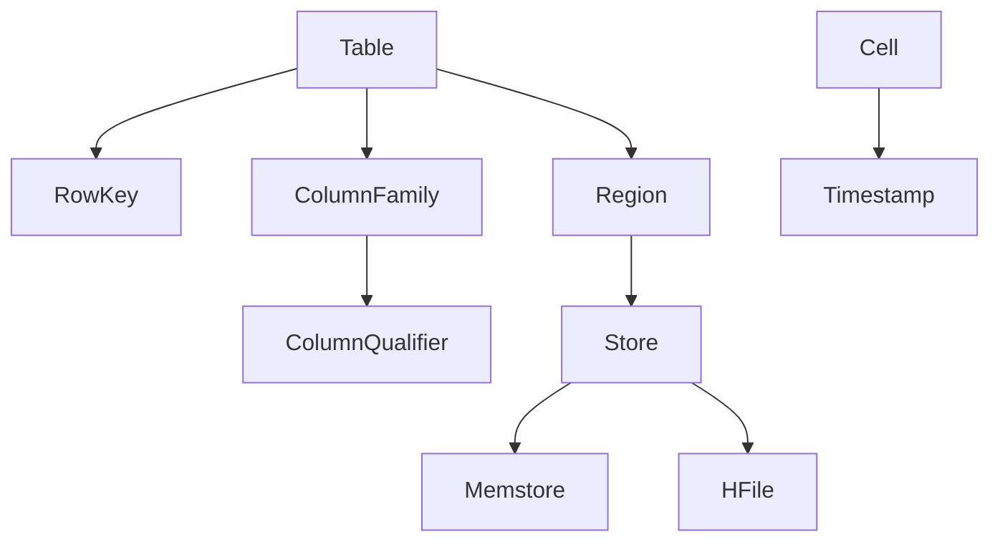

# HBase二级索引原理与代码实例讲解

关键词：HBase, 二级索引, Coprocessor, 索引原理, 索引构建, 代码实例

## 1. 背景介绍
### 1.1  问题的由来
随着大数据时代的到来,海量数据的存储和查询成为企业面临的主要挑战之一。HBase作为一种高可靠、高性能、面向列的分布式数据库,在大数据存储领域得到了广泛应用。然而,HBase在查询性能上仍存在一些局限性,特别是在复杂条件查询和非RowKey字段查询方面。为了提升HBase的查询效率,引入二级索引成为必然选择。

### 1.2  研究现状
目前,针对HBase二级索引的研究主要集中在以下几个方面:
1. 索引模型设计:主要包括协处理器Coprocessor索引、Solr/ES集成索引等。
2. 索引更新策略:同步更新、异步更新等。
3. 索引存储方式:本地存储、分布式存储等。
4. 索引查询优化:谓词下推、并行查询等。

一些主流的开源方案如Lily HBase Indexer、hindex、Phoenix Secondary Index等都在积极探索HBase二级索引的实现。

### 1.3  研究意义
HBase二级索引在提升数据查询效率、支持灵活的数据检索方面具有重要意义:

1. 提升查询性能,实现毫秒级的随机读取。
2. 支持多维度、复杂条件的数据检索。
3. 降低查询的资源消耗,提高集群的吞吐量。
4. 为上层业务提供更加灵活、高效的数据服务。

深入研究HBase二级索引的原理和实现,对于优化HBase查询性能、拓展其应用场景具有重要的理论和实践价值。

### 1.4  本文结构
本文将围绕HBase二级索引展开深入探讨,内容组织如下:

1. 介绍HBase二级索引的核心概念与理论基础。
2. 详细阐述基于协处理器的索引构建原理和实现步骤。 
3. 建立HBase二级索引的数学模型,推导相关公式。
4. 通过代码实例和详细注释,演示二级索引开发的关键流程。
5. 总结HBase二级索引的实际应用场景和案例。
6. 推荐HBase二级索引相关的学习资源和开发工具。
7. 展望HBase二级索引技术的未来发展趋势和挑战。
8. 梳理HBase二级索引常见问题,给出解决方案。

## 2. 核心概念与联系

在讨论HBase二级索引原理之前,我们先来了解几个核心概念:

1. RowKey:HBase表的主键,用于表中数据的检索。
2. Column Family:列族,HBase表在水平方向上的逻辑划分。
3. Column Qualifier:列限定符,列族中的具体列。
4. Timestamp:时间戳,用于标识数据的不同版本。
5. Region:HBase表的分片,一个Region由多个Store组成。
6. Store:Region的子集,对应一个列族的存储。
7. Memstore:Store在内存中的缓存,用于数据的批量写入。
8. HFile:Store在磁盘上的存储文件,以有序KV形式存储。

这些概念之间的关系如下图所示:



由此可见,HBase的数据模型是一个稀疏、多维度的映射表。RowKey作为表的主键,支持快速的数据检索。但对于非RowKey的列查询或复杂条件过滤,原生HBase的查询效率较低。引入二级索引,就是为了解决这一痛点。

二级索引的核心思想是:以 Column Family 或 Column Qualifier 作为索引键,在写入数据时同步或异步地构建索引表,查询时先检索索引表缩小数据扫描范围,再回查原表获取完整数据。这样可以显著提升HBase的查询性能。

常见的HBase二级索引方案有:

1. 协处理器Coprocessor索引
2. Solr/ES集成索引
3. MapReduce/Spark索引构建
4. Hive外部表索引
5. Phoenix二级索引

本文将重点介绍基于协处理器的二级索引方案,探究其原理和实现。

## 3. 核心算法原理 & 具体操作步骤
### 3.1  算法原理概述
HBase协处理器Coprocessor提供了Region级别的数据处理接口,可以通过Hook方法在数据写入、删除、flush等关键时机嵌入定制化逻辑,实现二级索引的构建和维护。

常用的Coprocessor接口有:

- RegionObserver:提供Region级别的监听接口。
- RegionCoprocessor:提供Region级别的终端接口。

基于Coprocessor的二级索引构建流程如下:

1. 创建索引表,RowKey为索引键,Value为原表RowKey。
2. 通过RegionObserver接口,监听原表数据的写入、删除等事件。
3. 在数据写入时,解析出索引键,同步或异步写入索引表。
4. 在数据删除时,解析出索引键,删除索引表对应的索引数据。
5. 查询时,先根据索引键检索索引表,得到原表RowKey。
6. 根据原表RowKey,回查原表获取完整数据。

索引表的设计有两种主要方式:

1. 索引表每行存储一个索引键,适合单值索引。
2. 索引表每行存储多个索引键,适合组合索引。

### 3.2  算法步骤详解

下面我们详细讲解二级索引构建的核心步骤。

#### 3.2.1 创建索引表

首先,我们需要创建一张索引表,用于存储索引数据。索引表的RowKey为索引键,Value为原表的RowKey。

```sql
create 'index_table', {NAME => 'cf', VERSIONS => 1}
```

其中,index_table为索引表名称,cf为索引表的列族。

#### 3.2.2 实现RegionObserver接口

通过实现RegionObserver接口,我们可以监听原表数据的写入、删除等事件,在关键时机构建和维护索引。

以下是RegionObserver的主要方法:

```java
public interface RegionObserver {
  void postPut(ObserverContext<RegionCoprocessorEnvironment> c, Put put, WALEdit edit, Durability durability) throws IOException;
  void postDelete(ObserverContext<RegionCoprocessorEnvironment> c, Delete delete, WALEdit edit, Durability durability) throws IOException;
  void postBatchMutate(ObserverContext<RegionCoprocessorEnvironment> c, MiniBatchOperationInProgress<Mutation> miniBatchOp) throws IOException;
  // other methods
}
```

其中,postPut用于监听数据写入事件,postDelete用于监听数据删除事件,postBatchMutate用于监听批量写入事件。

#### 3.2.3 数据写入时构建索引

在postPut方法中,我们可以获取写入的数据,解析出索引键,然后将索引键和原表RowKey写入索引表。

```java
@Override
public void postPut(ObserverContext<RegionCoprocessorEnvironment> c, Put put, WALEdit edit, Durability durability) throws IOException {
  // 获取原表名称
  String tableName = c.getEnvironment().getRegion().getRegionInfo().getTable().getNameAsString();
  // 获取原表RowKey
  String rowKey = Bytes.toString(put.getRow());
  // 获取索引列的值  
  String indexValue = Bytes.toString(put.get(Bytes.toBytes("cf"), Bytes.toBytes("column")).get(0).getValue());
  // 构建索引表Put对象
  Put indexPut = new Put(Bytes.toBytes(indexValue));
  indexPut.addColumn(Bytes.toBytes("cf"), Bytes.toBytes("rowkey"), Bytes.toBytes(rowKey));
  // 写入索引表
  c.getEnvironment().getTable(TableName.valueOf("index_table")).put(indexPut);
}
```

#### 3.2.4 数据删除时移除索引

类似地,在postDelete方法中,我们可以获取删除的数据,解析出索引键,然后在索引表中删除对应的索引数据。

```java
@Override
public void postDelete(ObserverContext<RegionCoprocessorEnvironment> c, Delete delete, WALEdit edit, Durability durability) throws IOException {
  // 获取原表名称
  String tableName = c.getEnvironment().getRegion().getRegionInfo().getTable().getNameAsString();
  // 获取原表RowKey
  String rowKey = Bytes.toString(delete.getRow());
  // 获取索引列的值
  String indexValue = Bytes.toString(delete.get(Bytes.toBytes("cf"), Bytes.toBytes("column")).get(0).getValue());  
  // 构建索引表Delete对象
  Delete indexDelete = new Delete(Bytes.toBytes(indexValue));
  // 从索引表删除数据
  c.getEnvironment().getTable(TableName.valueOf("index_table")).delete(indexDelete);
}
```

#### 3.2.5 查询索引表

在查询时,我们首先根据索引键检索索引表,得到原表的RowKey,然后再根据RowKey回查原表获取完整数据。

```java
// 创建索引表对象
Table indexTable = connection.getTable(TableName.valueOf("index_table"));
// 构建索引表Get对象
Get indexGet = new Get(Bytes.toBytes("index_key"));
// 检索索引表  
Result indexResult = indexTable.get(indexGet);
// 获取原表RowKey
String rowKey = Bytes.toString(indexResult.getValue(Bytes.toBytes("cf"), Bytes.toBytes("rowkey")));

// 创建原表对象
Table originTable = connection.getTable(TableName.valueOf("origin_table"));  
// 构建原表Get对象
Get originGet = new Get(Bytes.toBytes(rowKey));
// 检索原表
Result originResult = originTable.get(originGet);
```

通过上述步骤,我们就实现了基于HBase协处理器的二级索引构建和查询。

### 3.3  算法优缺点

基于协处理器的二级索引具有以下优点:

1. 索引构建和数据写入同步进行,实时性强。
2. 索引表与原表解耦,互不影响。
3. 支持灵活的索引键设计,可以支持组合索引。
4. 查询性能大幅提升,避免了全表扫描。

同时,该方案也存在一些局限性:

1. 索引构建依赖于协处理器,实现复杂度较高。
2. 索引数据与原表数据存储在不同的表中,存在一定的空间冗余。
3. 索引表的Region分布不均衡,可能导致热点问题。

### 3.4  算法应用领域

HBase二级索引在以下领域有广泛应用:

1. 时序数据分析:针对时间维度的范围查询。
2. 用户画像:针对用户属性的组合条件查询。
3. 广告检索:针对广告属性的多维度检索。
4. 物联网数据:针对设备状态的实时查询。

通过二级索引,可以显著提升HBase在这些场景下的查询性能和用户体验。

## 4. 数学模型和公式 & 详细讲解 & 举例说明
### 4.1  数学模型构建

我们可以使用集合论的方式,对HBase二级索引进行数学建模。

设原表数据集合为$D$,索引键集合为$I$,索引表数据集合为$D_I$。

则索引构建过程可以表示为一个映射函数$f$:

$$f: D \rightarrow D_I$$

其中,$f$函数的定义为:

$$f(d) = \{(i, rowkey(d)) | i \in I(d)\}$$

即,对于原表中的每条数据$d$,提取其索引键集合$I(d)$,然后生成一组索引表数据$(i, rowkey(d))$。

### 4.2  公式推导过程

基于上述数学模型,我们可以推导出一些有用的公式。

#### 4.2.1 索引数据量估计

假设原表数据量为$|D|$,平均每条数据包含$n$个索引键,则索引表数据量$|D_I|$可以估计为:

$$|D_I| = n \times |D|$$

这意味着,索引表的数据量与原表数据量和索引键个数成正比。

#### 4.2.2 查询性能提升

设查询条件为$Q$,使用索引查询的时间复杂度为$O(log|D_I|) + O(|D_Q|)$,其中$|D_Q|$为满足查询条件的原表数据量。

不使用索引查询的时间复杂度为$O(|D|)$。

假设满足查询条件的数据占原表数据的