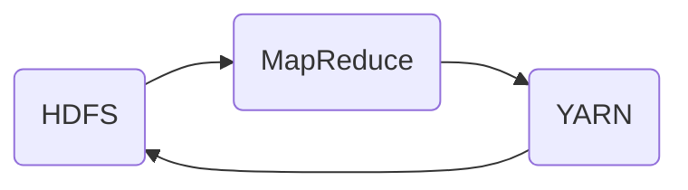

# Hadoop性能调优与监控原理

关键词：Hadoop、性能调优、监控、HDFS、MapReduce、YARN、JVM

## 1. 背景介绍
### 1.1 问题的由来
随着大数据时代的到来,海量数据的存储和处理已成为企业面临的重大挑战。Hadoop作为开源的分布式计算平台,凭借其优秀的可扩展性、容错性和高性能等特点,在大数据领域得到广泛应用。然而,随着集群规模的不断扩大和业务复杂度的提升,如何保证Hadoop集群的高性能运行,成为亟待解决的问题。
### 1.2 研究现状
目前,国内外学术界和工业界对Hadoop性能调优与监控的研究已取得了一定进展。一些研究者从不同角度提出了各种优化方法,如HDFS参数调优、MapReduce任务优化、资源调度策略改进等。同时,一些开源和商业监控工具如Ganglia、Nagios、Ambari等也被广泛应用于Hadoop集群的性能监控。但总的来说,现有研究还存在一些不足,如优化方法较为单一、监控指标不够全面、实时性有待提高等。
### 1.3 研究意义 
深入研究Hadoop性能调优与监控,对于提升Hadoop集群的运行效率、保障业务稳定性具有重要意义。一方面,通过系统的性能分析和参数调优,可以充分发挥集群硬件和软件资源的潜力,提高任务执行速度和吞吐量。另一方面,全面及时的性能监控有助于及早发现和定位性能瓶颈,避免故障的发生和扩大。此外,这些研究还可以为构建自适应、智能化的Hadoop集群管理系统提供理论和实践基础。
### 1.4 本文结构
本文将重点探讨Hadoop性能调优与监控的原理和实践。第2节介绍Hadoop体系的核心组件及其关系;第3节分析Hadoop性能调优的主要方法和步骤;第4节建立Hadoop性能分析模型,推导相关数学公式;第5节给出详细的代码实例,展示性能优化的具体实现;第6节讨论Hadoop监控在实际场景中的应用;第7节推荐一些有用的工具和学习资源;第8节总结全文,展望Hadoop优化的发展趋势和挑战;第9节的附录解答一些常见问题。

## 2. 核心概念与联系
在深入探讨Hadoop性能优化与监控之前,有必要对Hadoop体系的核心组件及其关系有一个整体的认识。如下图所示,Hadoop主要包括三大核心组件:

- HDFS:分布式文件系统,负责海量数据的可靠存储和高效访问。
- MapReduce:分布式计算框架,实现了Map和Reduce两阶段并行计算模型。  
- YARN:集群资源管理系统,负责任务调度和资源分配。

这三大组件相互配合,共同支撑起Hadoop的高性能运行:HDFS为上层计算提供高吞吐的数据读写服务;MapReduce实现任务的并行处理;YARN实现集群资源的统一管理和调度。因此,Hadoop的性能优化也需要从这三个方面综合考虑。

## 3. 核心算法原理 & 具体操作步骤
### 3.1 算法原理概述
Hadoop性能调优的核心是通过参数配置和任务优化,在满足功能需求的前提下,最大限度地提高集群资源利用率和任务执行效率。这个过程可以抽象为一个寻优问题:在海量的参数配置空间中,如何快速找到最优的参数组合,使得在特定的资源约束下,任务执行时间最短或吞吐量最大。

### 3.2 算法步骤详解
Hadoop性能调优的一般步骤如下:

1. 系统性能评估:收集和分析集群的运行指标,定位性能瓶颈。常用指标包括CPU使用率、内存使用量、磁盘I/O、网络带宽等。
2. 参数优化:针对性能瓶颈,调整相关组件的配置参数,如HDFS的Block大小、副本数,MapReduce的并行度、排序缓冲区等。
3. 数据倾斜处理:采用数据预处理、Combiner、自定义Partition等方法,均衡Reduce任务的数据分布,缓解数据倾斜问题。
4. 任务DAG优化:对MapReduce任务的DAG图进行分析,去除冗余Stage,减少中间结果,提高任务并行度。
5. JVM优化:对Hadoop任务的JVM参数进行调优,如内存分配、GC策略等,减少Full GC发生,提高任务执行效率。
6. 迭代优化:根据优化后的性能指标,进一步分析和改进,形成持续优化闭环。

### 3.3 算法优缺点
Hadoop性能调优算法的优点在于:
- 可操作性强,通过参数配置和代码优化即可实现性能提升,无需更改集群拓扑。
- 优化空间大,Hadoop有上百个配置参数,不同参数组合可以产生显著的性能差异。
- 通用性好,优化方法对不同的Hadoop发行版本和应用场景普遍适用。

但该算法也存在一些局限性:
- 优化过程复杂,需要对Hadoop原理有深入理解,并且进行大量的试验和统计分析。
- 依赖经验,很多优化需要根据经验进行参数调整,鲁棒性有待提高。
- 应用场景有限,优化效果与具体的数据和任务特征有关,无法一劳永逸。

### 3.4 算法应用领域
Hadoop性能调优算法可广泛应用于大数据处理的各个领域,如日志分析、用户行为挖掘、推荐系统、舆情监控等。特别是对于数据量大、任务复杂的场景,性能优化可以带来数量级的效率提升。一些典型的应用案例包括:
- 某互联网公司通过MapReduce参数调优,日均处理数据量从100TB提升到300TB。
- 某金融机构通过优化Shuffle和Merge过程,Reduce阶段资源利用率提升50%。
- 某电商平台通过控制Map和Reduce任务并行度,促销期间性能提升3倍。

## 4. 数学模型和公式 & 详细讲解 & 举例说明
### 4.1 数学模型构建
为了量化分析Hadoop任务的性能,我们可以建立如下数学模型:
设Hadoop集群有$m$个节点,每个节点有$c$个CPU核心,$r$GB内存。某MapReduce任务有$n$个Map Task和$k$个Reduce Task,输入数据大小为$d$GB。定义如下变量:
- $T$:任务总执行时间
- $t_m$:单个Map Task执行时间
- $t_r$:单个Reduce Task执行时间
- $t_s$:Shuffle阶段耗时
- $p$:CPU利用率
- $u$:内存利用率
- $b$:网络带宽利用率

则任务总执行时间$T$可表示为:

$T = max(\frac{n}{m\cdot c\cdot p} \cdot t_m, \frac{k}{m\cdot c\cdot p} \cdot (t_r+t_s))$

其中,$\frac{n}{m\cdot c\cdot p}$表示Map阶段并行度,$\frac{k}{m\cdot c\cdot p}$表示Reduce阶段并行度。

### 4.2 公式推导过程
上述公式可以这样推导:

1. Map阶段执行时间为$\frac{n}{m\cdot c\cdot p} \cdot t_m$。因为$n$个Map Task均分给$m$个节点,每个节点并行执行$\frac{n}{m}$个任务,每个任务使用$c\cdot p$个CPU核心,故并行度为$m\cdot c\cdot p$,执行时间为$\frac{n}{m\cdot c\cdot p} \cdot t_m$。

2. Reduce阶段执行时间为$\frac{k}{m\cdot c\cdot p} \cdot (t_r+t_s)$。与Map阶段类似,$k$个Reduce Task均分给$m$个节点,并行度为$m\cdot c\cdot p$。但Reduce阶段还包括Shuffle过程,故总时间为$\frac{k}{m\cdot c\cdot p} \cdot (t_r+t_s)$。

3. 任务执行时间$T$取决于Map和Reduce两个阶段的最大值。根据木桶原理,两个阶段并行执行,执行时间取决于较慢的一个阶段,故$T = max(\frac{n}{m\cdot c\cdot p} \cdot t_m, \frac{k}{m\cdot c\cdot p} \cdot (t_r+t_s))$。

进一步地,可以分析单个任务的执行时间$t_m$和$t_r$:

$t_m = \frac{d_m}{b} + \frac{d_m}{r\cdot u} + c_m$

$t_r = \frac{d_r}{b} + \frac{d_r}{r\cdot u} + c_r$

其中,$d_m$和$d_r$分别表示单个Map和Reduce Task的输入数据量,$\frac{d_m}{b}$和$\frac{d_r}{b}$表示数据传输时间(与网络带宽有关),$\frac{d_m}{r\cdot u}$和$\frac{d_r}{r\cdot u}$表示数据处理时间(与内存大小和利用率有关),$c_m$和$c_r$表示计算时间(与具体算法有关)。

### 4.3 案例分析与讲解
下面以一个具体的WordCount任务为例,说明如何应用上述模型进行性能分析。

假设集群有10个节点,每个节点4核CPU,16GB内存,1Gbps网络。输入数据100GB,按64MB的Block大小划分,共产生1560个Map Task。每个Map Task需要传输64MB数据,占用1GB内存,执行时间约为60s。Reduce Task数为10,每个需要传输10GB数据,占用2GB内存,执行时间约为600s。Shuffle阶段传输100GB数据,耗时约200s。假设CPU利用率为0.8,内存利用率为0.6,网络带宽利用率为0.5。

代入上述公式,并假设$c_m=c_r=0$,可得:

$t_m = \frac{64}{1000\cdot0.5} + \frac{64}{16000\cdot0.6} \approx 60s$

$t_r = \frac{10000}{1000\cdot0.5} + \frac{10000}{16000\cdot0.6} \approx 600s$

$T = max(\frac{1560}{10\cdot4\cdot0.8} \cdot 60, \frac{10}{10\cdot4\cdot0.8} \cdot (600+200)) \approx max(292, 250) = 292s$

可见,该任务的总执行时间约为292秒,瓶颈在于Map阶段。进一步分析可知,Map阶段的主要限制因素是CPU,每个节点需要连续执行39个60秒的Map Task,计算资源消耗巨大。因此,可以考虑增加CPU核数、提高CPU利用率等措施来优化任务性能。

### 4.4 常见问题解答
1. 如何确定最优的Map和Reduce数目?

一般来说,Map数由输入数据块数决定,即$n=\frac{d}{blocksize}$。Reduce数则需要根据实际情况调整,太少会导致Reduce任务负载过重,太多会增加Shuffle开销。一个经验法则是,Reduce数为Map数的0.5~0.7倍。在实践中,可以先设置一个较小的Reduce数,如0.1倍Map数,然后逐步增加并评估性能,直到满足需求为止。

2. 数据倾斜会如何影响任务性能?

数据倾斜会导致个别Reduce Task处理的数据远多于其他Task,拖慢整个任务的进度。例如,在上述WordCount任务中,如果某个单词的出现频率远高于其他单词,则处理该单词的Reduce Task会成为瓶颈。解决数据倾斜的常用方法包括:
- 调整Partition策略,尽量均匀分配数据。
- 在Map端预聚合,减少Shuffle数据量。
- 拆分倾斜的Reduce Task,将热点数据单独处理。

3. 除了CPU、内存、网络,还有哪些因素影响Hadoop性能?

- 磁盘I/O:Hadoop大量