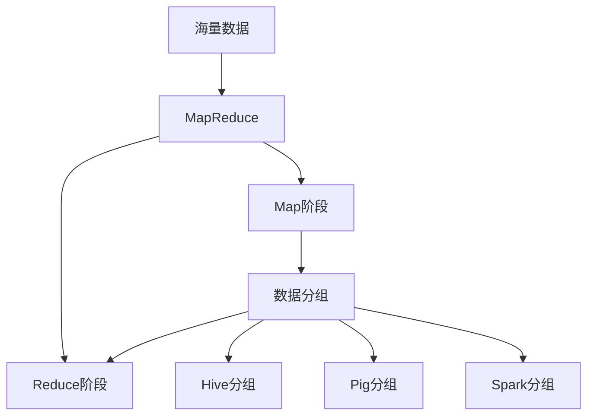

# Hadoop数据分组与数据分组工具

关键词：Hadoop、数据分组、数据分组工具、MapReduce、Hive、Pig、Spark、Shuffle

## 1. 背景介绍

### 1.1 问题的由来
在大数据时代,海量数据的处理和分析是一个巨大的挑战。传统的数据处理方式已经无法满足快速增长的数据量和复杂的计算需求。Hadoop作为一个开源的分布式计算平台,为大数据处理提供了高效、可靠的解决方案。而在Hadoop生态系统中,数据分组是一个非常重要和常见的操作,它直接影响到数据处理的效率和结果的准确性。

### 1.2 研究现状
目前,围绕Hadoop数据分组已经有了大量的研究和实践。一方面,Hadoop自身提供了多种数据分组的工具和方法,如MapReduce、Hive、Pig等;另一方面,很多第三方工具如Spark也提供了更加高效灵活的数据分组功能。这些工具和方法在不同的应用场景下各有优劣,需要根据具体的需求来选择。

### 1.3 研究意义
深入研究Hadoop数据分组及其相关工具,对于提高大数据处理的效率、优化资源利用、改进数据分析的质量都有重要意义。通过总结不同工具的特点、对比分组算法的性能、探索最佳实践,可以为广大的数据工程师和数据分析师提供有价值的参考和指导,让他们在海量数据面前能够游刃有余。

### 1.4 本文结构
本文将首先介绍Hadoop数据分组的核心概念和常见工具,然后重点剖析几种主要的分组算法原理,并给出详细的操作步骤。接着,我们将通过数学模型和代码实例来加深理解。最后,本文还将讨论数据分组在实际场景中的应用、分享一些学习资源,并对未来的发展趋势和挑战做出展望。

## 2. 核心概念与联系

在Hadoop中,数据分组(Data Grouping)是指将大规模数据集按照某些条件划分成若干个小的数据子集的过程。每个子集内的数据都满足特定的条件,如具有相同的键值(Key)。分组后的数据更易于进一步的聚合计算、排序等操作。

数据分组与Hadoop的核心设计理念MapReduce密切相关。MapReduce采用"分而治之"的思想,将复杂的计算任务分解为Map和Reduce两个阶段。其中,Map阶段负责对原始数据进行处理,转换成<key, value>形式的键值对;Reduce阶段则对Map的输出结果按照key进行分组,对每一组数据进行归约计算。可见,数据分组是连接Map和Reduce的桥梁,直接影响了任务的执行效率。

除了MapReduce,Hadoop生态系统中还有一些专门用于数据分组的工具:

- Hive:基于Hadoop的数据仓库工具,提供了类SQL的查询语言HQL,支持对表数据进行分组(GROUP BY)。
- Pig:基于Hadoop的大规模数据分析平台,使用类似SQL的Pig Latin语言,提供了丰富的数据操作函数,包括分组函数(GROUP)。 
- Spark:专为大规模数据处理设计的快速通用计算引擎,提供了Scala、Java、Python等多种API,支持多种数据分组操作(groupBy, groupByKey等)。

下图展示了Hadoop数据分组的核心概念之间的关系:



## 3. 核心算法原理 & 具体操作步骤

### 3.1 算法原理概述
Hadoop数据分组的核心算法是MapReduce中的Shuffle过程。Shuffle发生在Map和Reduce阶段之间,负责将Map输出的中间结果数据按照Key进行分区,并将具有相同Key的数据聚合在一起,发送给对应的Reduce任务进行处理。

### 3.2 算法步骤详解
具体来说,Shuffle分组算法可以分为以下几个步骤:

1. Map端的数据分区。Map任务会为每个<Key, Value>键值对计算一个分区号Partition,决定该数据应该被发送到哪个Reduce任务。默认使用HashPartitioner,即对Key进行哈希取模: 
$$ Partition = HashCode(Key) \bmod NumReduceTasks $$

2. Map端的数据收集。Map会为每个分区创建一个缓冲区,将数据暂存到缓冲区中。当缓冲区满或者Map任务完成时,会将缓冲区中的数据写入到磁盘,形成一个分区文件。

3. Reduce端的数据拷贝。Reduce任务通过HTTP方式从各个Map任务的分区文件中拷贝属于自己的数据。

4. Reduce端的数据合并。Reduce会将拷贝来的数据全部合并到内存的一个缓冲区中,并对数据按照Key进行排序,相同Key的数据聚合在一起。当缓冲区满时,会将数据写入磁盘,形成一个大的有序文件。

5. Reduce端的分组计算。Reduce对有序文件中的每一组数据调用Reduce函数进行最终的计算。

### 3.3 算法优缺点
Shuffle分组算法的优点是可以自动实现数据的分区、排序和分组,减轻了开发人员的工作量。但是Shuffle过程也可能成为MapReduce作业的性能瓶颈,主要问题包括:

- 数据倾斜:如果某些Key对应的数据量很大,会导致某些Reduce任务的负载远高于其他任务,拖慢整个作业的进度。
- 网络开销:Reduce需要通过网络从Map端拷贝大量数据,占用网络带宽,增加作业延迟。
- 中间结果存储:Map和Reduce产生的中间文件需要写入磁盘,占用存储空间,降低IO效率。

### 3.4 算法应用领域
Shuffle分组算法适用于需要对海量数据进行分组聚合计算的批处理场景,如日志分析、用户行为分析等。对于数据量较小或者要求实时响应的在线服务场景,则不太适合。

## 4. 数学模型和公式 & 详细讲解 & 举例说明

### 4.1 数学模型构建
我们可以用集合论的语言来形式化描述Hadoop数据分组的过程。假设原始数据集为$D$,Map函数为$M$,Reduce函数为$R$,Combine函数为$C$(可选),分区函数为$P$,则Shuffle分组可以表示为:

$$
\begin{aligned}
& D = \{d_1, d_2, ..., d_n\} \\
& M(d_i) \rightarrow \{<k_{i1}, v_{i1}>, <k_{i2}, v_{i2}>, ...\} \\
& C(<k_{ij}, v_{ij}>) \rightarrow <k_{ij}, v'_{ij}> \\
& P(<k_{ij}, v'_{ij}>) \rightarrow p \in \{1,2,...,r\} \\ 
& D_p = \{<k,v> | P(<k,v>) = p\} \\
& R(D_p) \rightarrow \{<k_1, v_1>, <k_2, v_2>, ...\}
\end{aligned}
$$

其中,$n$是原始数据的条数,$r$是Reduce任务数,也是分区数。$D_p$表示第$p$个分区的数据子集。Map将每条数据$d_i$转换为一组键值对,Combine对每个键值对做进一步的合并(如求和、取平均值等),分区函数$P$决定每个键值对应该进入哪个分区,最后Reduce对每个分区的数据做最终的分组计算。

### 4.2 公式推导过程
下面我们以WordCount程序为例,推导Shuffle分组的数学表达式。设文档集合$D=\{d_1, d_2, ..., d_n\}$,每个文档$d_i$由一系列单词$w_j$组成。WordCount的目标是统计每个单词的出现频率,即:

$$WordCount(D) = \{<w_j, freq(w_j)>\}$$

其中,$freq(w_j)$表示单词$w_j$在文档集合$D$中出现的总次数。

Map阶段将每个文档$d_i$转化为一组<单词,1>键值对,表示每个单词出现一次:

$$M(d_i) = \{<w_1, 1>, <w_2, 1>, ...\}$$

Combine阶段对每个文档内的<单词,1>键值对按照单词进行局部汇总,得到每个单词在该文档中的出现次数:

$$C(\{<w_j,1>\}) \rightarrow <w_j, freq(w_j, d_i)>$$

然后,分区函数$P$对<单词,频率>键值对按照单词做哈希分区,保证相同单词进入相同的分区:

$$P(<w_j, freq(w_j, d_i)>) \rightarrow hash(w_j) \bmod r$$

Reduce阶段对每个分区内的<单词,频率>键值对按照单词做全局汇总,得到每个单词的总频率:

$$R(D_p) = \{<w_j, \sum_{d_i}freq(w_j,d_i)>\}$$

### 4.3 案例分析与讲解
下面我们用一个具体的例子来说明Shuffle分组的过程。假设有两个输入文件:

```
file1: hello world, hello hadoop 
file2: hello spark, world hadoop
```

设置Map任务数为2,Reduce任务数为2。则数据分组的过程如下:

1. Map阶段:
   - Map Task 1读取file1,输出:
     ```
     <hello, 1>, <world, 1>, <hello, 1>, <hadoop, 1>
     ```
   - Map Task 2读取file2,输出:
     ```
     <hello, 1>, <spark, 1>, <world, 1>, <hadoop, 1>  
     ```

2. Combine阶段:
   - Map Task 1在本地合并,输出:
     ```
     <hello, 2>, <world, 1>, <hadoop, 1>
     ```
   - Map Task 2在本地合并,输出:
     ```
     <hello, 1>, <spark, 1>, <world, 1>, <hadoop, 1>
     ```

3. 分区与排序:
   - 假设单词到分区的哈希映射为:
     ```
     hello -> 0
     world -> 0 
     hadoop -> 1
     spark -> 1
     ```
   - 则Partition 0接收到的数据为:
     ```
     <hello, 2>, <hello, 1>, <world, 1>, <world, 1>
     ```
   - Partition 1接收到的数据为:
     ```
     <hadoop, 1>, <hadoop, 1>, <spark, 1>
     ```
   - 每个Partition内部按单词排序。

4. Reduce阶段:
   - Reduce Task 0对Partition 0的数据求和,输出:
     ```
     <hello, 3>
     <world, 2>
     ```
   - Reduce Task 1对Partition 1的数据求和,输出:
     ```
     <hadoop, 2>
     <spark, 1>
     ```

最终,WordCount程序输出每个单词的总频率:

```
<hello, 3>
<world, 2>
<hadoop, 2>
<spark, 1>
```

### 4.4 常见问题解答
问题1:为什么要在Map端做Combine?
- 答:Combine可以大大减少Map输出的数据量,从而降低网络传输和磁盘IO开销。但前提是Combine函数满足结合律,且不影响最终结果。

问题2:如何处理数据倾斜问题?
- 答:可以采取以下策略:
  - 调整Key的设计,使Key的分布更加均匀。
  - 自定义Partition函数,将倾斜的Key打散到不同的Partition。
  - 在Map阶段提前对倾斜Key做特殊处理,如截断、加盐等。

## 5. 项目实践：代码实例和详细解释说明

### 5.1 开发环境搭建
首先需要搭建Hadoop和相关工具的开发环境,主要步骤包括:
1. 安装JDK,配置JAVA_HOME环境变量。
2. 下载并解压Hadoop,配置HADOOP_HOME环境变量。
3. 修改Hadoop配置文件,如core-site.xml, hdfs-site.xml等。
4. 启动Hadoop集群,包括HDFS、YARN等服务。
5. 安装Hive、Pig、Spark等工具,并配置环境变量。

### 5.2 源代码详细实现
下面我们以Hive为例,演示如何用SQL语