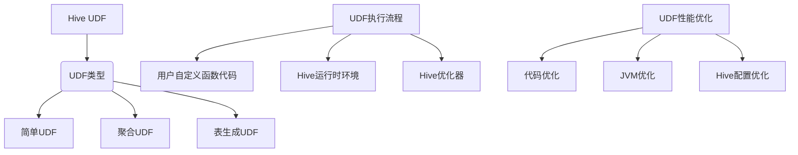

# Hive UDF自定义函数原理与代码实例讲解

## 1. 背景介绍

### 1.1 问题的由来

在大数据时代,数据处理和分析是一个永恒的话题。Apache Hive作为构建在Hadoop之上的数据仓库工具,为海量数据的查询和分析提供了强有力的支持。然而,Hive内置的函数库虽然功能强大,但有时无法满足特定的业务需求。这就催生了Hive用户自定义函数(User Defined Function, UDF)的需求。

### 1.2 研究现状

Hive UDF允许用户使用Java、Python或其他语言编写自定义函数,扩展Hive的功能。目前,Hive UDF在数据清洗、数据转换、字符串处理、日期计算等场景中得到了广泛应用。但是,由于UDF开发的复杂性和性能问题,很多开发人员对其了解不足,难以高效利用。

### 1.3 研究意义

本文旨在深入探讨Hive UDF的原理和实现,帮助读者掌握UDF开发的核心知识,提高代码质量和性能。通过实例讲解,读者可以更好地理解UDF的应用场景,并学会自主开发满足特定需求的UDF。

### 1.4 本文结构

本文首先介绍Hive UDF的核心概念和原理,然后详细讲解UDF开发的具体步骤和算法实现。接下来,通过数学模型和公式,深入剖析UDF的内部机理。在项目实践部分,我们将提供完整的代码示例,并对关键代码进行逐行解释。最后,本文将探讨UDF在实际应用中的场景,并分享相关的学习资源和工具。

## 2. 核心概念与联系

Hive UDF是Hive的一个核心特性,允许用户使用Java、Python等语言编写自定义函数,扩展Hive的功能。根据功能不同,UDF可以分为三种类型:

1. **简单UDF**:接受一个或多个标量值作为输入,并返回一个标量值。常用于数据转换、字符串处理等场景。
2. **聚合UDF**:接受一组值作为输入,并返回一个聚合值。常用于数据聚合、统计等场景。
3. **表生成UDF**:接受一组值作为输入,并返回一个虚拟表。常用于数据扩展、规范化等场景。

UDF的执行流程包括以下几个关键步骤:

1. **用户自定义函数代码**:开发人员使用Java、Python等语言编写UDF代码,实现特定的功能逻辑。
2. **Hive运行时环境**:Hive在执行查询时,会加载并执行UDF代码。
3. **Hive优化器**:Hive优化器会对UDF进行优化,以提高查询性能。

为了确保UDF的高效运行,需要从以下几个方面进行性能优化:

1. **代码优化**:优化UDF代码,减少不必要的计算和内存占用。
2. **JVM优化**:调整JVM参数,优化内存管理和垃圾回收。
3. **Hive配置优化**:调整Hive配置参数,如并行度、内存大小等,以适应UDF的特点。

## 3. 核心算法原理 & 具体操作步骤

### 3.1 算法原理概述

Hive UDF的核心算法原理是基于Hive的执行流程和UDF接口规范。当Hive执行查询时,会根据UDF的类型和参数,调用相应的UDF接口方法。UDF开发人员需要实现这些接口方法,编写自定义的功能逻辑。

Hive会将UDF代码编译成字节码,并在查询执行时动态加载和执行。为了提高性能,Hive会对UDF进行一系列优化,如常量折叠、代码内联等。

### 3.2 算法步骤详解

1. **定义UDF类**:继承相应的UDF接口,如`UDF`(简单UDF)、`GenericUDFResolver`(聚合UDF)或`GenericUDTF`(表生成UDF)。
2. **实现核心方法**:根据UDF类型,实现相应的核心方法,如`evaluate`(简单UDF)、`getEvaluator`(聚合UDF)或`process`(表生成UDF)。
3. **注册UDF**:在Hive中使用`CREATE TEMPORARY FUNCTION`或`CREATE FUNCTION`语句注册UDF。
4. **调用UDF**:在Hive查询中使用自定义的UDF函数名调用UDF。
5. **Hive执行流程**:Hive解析查询,构建执行计划,加载UDF字节码,执行UDF逻辑。
6. **优化执行**:Hive优化器对UDF进行优化,如常量折叠、代码内联等。
7. **返回结果**:UDF执行完毕后,将结果返回给Hive,继续后续的查询处理。

### 3.3 算法优缺点

**优点**:

- **扩展性强**:UDF允许用户使用熟悉的编程语言编写自定义函数,扩展Hive的功能。
- **灵活性高**:UDF可以处理各种复杂的业务逻辑,满足特定的数据处理需求。
- **性能可控**:通过代码优化和配置调优,可以提高UDF的执行性能。

**缺点**:

- **开发复杂**:编写UDF需要熟悉Hive的执行原理和UDF接口规范,开发门槛较高。
- **性能瓶颈**:UDF的执行性能受到JVM、Hive配置等多方面因素的影响,需要进行全面的优化。
- **维护成本**:随着UDF数量的增加,维护和管理成本也会增加。

### 3.4 算法应用领域

Hive UDF可以应用于以下场景:

- **数据清洗**:使用UDF进行数据格式转换、异常值处理等数据清洗操作。
- **数据转换**:使用UDF实现复杂的数据转换逻辑,如地理编码转换、加密解密等。
- **字符串处理**:使用UDF进行字符串拆分、模式匹配、替换等操作。
- **日期计算**:使用UDF实现复杂的日期计算逻辑,如工作日计算、节假日判断等。
- **机器学习**:使用UDF集成机器学习模型,实现在线预测或特征工程。

## 4. 数学模型和公式 & 详细讲解 & 举例说明

### 4.1 数学模型构建

在讨论Hive UDF的数学模型之前,我们先介绍一些基本概念:

- **向量空间**:一个由有限个或无限个向量组成的集合,满足加法和数乘运算。
- **基向量**:在向量空间中线性无关的一组向量,可以用它们的线性组合表示该向量空间中的任何向量。
- **张量**:是一种广义的线性代数概念,可以看作是一个多维数组或多线性函数。

我们将Hive中的数据集看作一个向量空间$V$,其中每个元素(记录)是一个向量$\vec{v}$,向量的每个分量对应记录的一个字段值。我们定义一个函数$f$,将输入向量$\vec{v}$映射到输出向量$\vec{u}$:

$$\vec{u} = f(\vec{v})$$

对于简单UDF,函数$f$是一个标量函数,即输入和输出都是标量值。对于聚合UDF和表生成UDF,函数$f$是一个向量函数或张量函数。

我们可以将UDF看作是对向量空间$V$的一个线性变换,用矩阵$A$表示:

$$\vec{u} = A\vec{v}$$

其中,矩阵$A$的每个元素$a_{ij}$对应UDF的一个参数或计算步骤。通过优化矩阵$A$的结构和元素值,我们可以提高UDF的执行效率。

### 4.2 公式推导过程

我们以一个简单的字符串拆分UDF为例,推导其数学模型。假设输入是一个字符串$s$,我们需要将其拆分为一个字符数组$\vec{c}$。

首先,我们定义一个字符到数字的映射函数$g$:

$$g(c) = \begin{cases}
0, & \text{if }c\text{ is delimiter}\\
1, & \text{if }c\text{ is not delimiter}
\end{cases}$$

其中,delimiter是我们指定的分隔符。

接下来,我们定义一个累加函数$h$,将字符映射为数字后进行累加:

$$h(c_1, c_2, \ldots, c_n) = \sum_{i=1}^n g(c_i)$$

函数$h$的输出是一个数字序列,每个数字表示一个子字符串的长度。我们可以根据这个序列拆分原始字符串,得到最终的字符数组$\vec{c}$。

将上述过程用矩阵形式表示,我们有:

$$\vec{c} = B\vec{s}$$

其中,$\vec{s}$是输入字符串的向量表示,$B$是一个由函数$g$和$h$构成的变换矩阵。

通过分析和优化矩阵$B$的结构,我们可以提高字符串拆分UDF的执行效率。例如,我们可以预计算$g(c)$的值,减少运行时的条件判断;或者使用更高效的数据结构(如位向量)来表示和计算$h$函数。

### 4.3 案例分析与讲解

我们以一个实际的案例来说明Hive UDF的数学模型应用。假设我们有一个数据集,包含了用户的购买记录,其中每条记录包含用户ID、购买商品ID和购买数量。我们需要基于这个数据集,为每个用户生成一个"购买向量",其中每个分量对应一种商品,值为该用户购买该商品的数量。

我们可以将这个需求建模为一个表生成UDF。输入是原始的购买记录集合$R$,输出是一个虚拟表$T$,其中每行对应一个用户,每列对应一种商品。

首先,我们定义一个函数$f$,将购买记录映射为一个稀疏向量:

$$f(r) = \vec{v}_r = (0, \ldots, 0, q_r, 0, \ldots, 0)$$

其中,向量$\vec{v}_r$的第$i$个分量对应商品$i$,如果该记录$r$包含商品$i$,则该分量的值为购买数量$q_r$,否则为0。

接下来,我们定义一个累加函数$g$,将所有用户的稀疏向量相加,得到最终的"购买向量"矩阵$M$:

$$M = g(\vec{v}_{r_1}, \vec{v}_{r_2}, \ldots, \vec{v}_{r_n}) = \sum_{i=1}^n \vec{v}_{r_i}$$

其中,$r_1, r_2, \ldots, r_n$是原始购买记录集合$R$中的所有记录。

最后,我们将矩阵$M$转换为虚拟表$T$的形式输出。每一行对应一个用户,每一列对应一种商品,值为该用户购买该商品的数量。

通过这个案例,我们可以看到,将Hive UDF建模为线性代数运算,可以更清晰地理解其内部逻辑,并为优化性能提供理论基础。

### 4.4 常见问题解答

1. **如何处理大规模的数据集?**

对于大规模的数据集,我们可以采用分治策略,将数据集划分为多个子集,分别计算每个子集的结果,最后合并得到最终结果。这种方式可以充分利用Hive的并行计算能力,提高处理效率。

2. **如何优化UDF的内存使用?**

优化UDF的内存使用是提高性能的关键。我们可以采用以下策略:

- 使用更紧凑的数据结构,如位向量、压缩字符串等。
- 避免不必要的对象创建和垃圾回收。
- 尽量使用流式计算,减少中间结