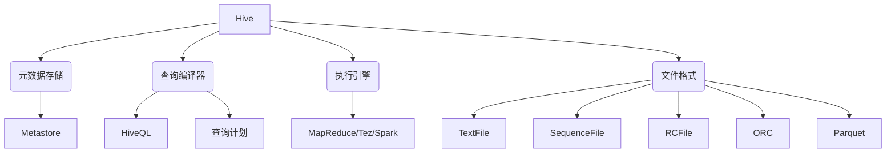
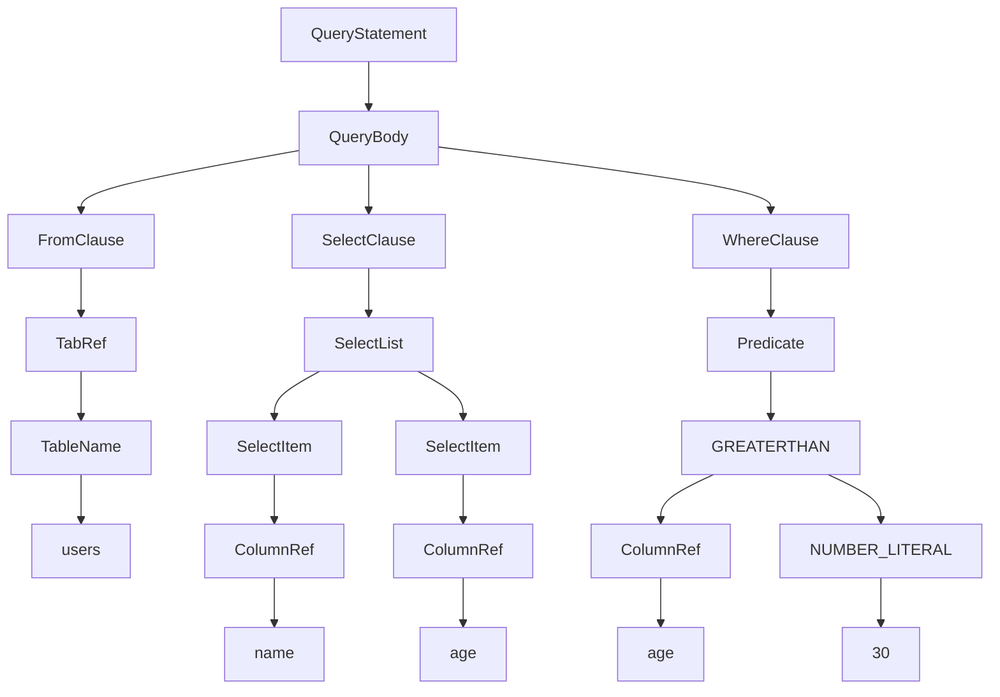

# Hive原理与代码实例讲解

## 1. 背景介绍

### 1.1 问题的由来

在大数据时代,海量的结构化和非结构化数据的存储和分析成为了一个巨大的挑战。传统的关系型数据库系统在处理大规模数据集时,往往会遇到性能瓶颈和可扩展性的限制。为了解决这一问题,Apache Hive应运而生。

Hive是一种建立在Apache Hadoop之上的数据仓库工具,旨在提供一种简单而熟悉的SQL查询接口,使得用户无需直接编写MapReduce程序,即可轻松地对存储在Hadoop分布式文件系统(HDFS)中的大规模数据集进行分析和处理。

### 1.2 研究现状

自2008年首次发布以来,Hive已经成为了Apache Hadoop生态系统中最广泛使用的数据分析工具之一。它为用户提供了一种类似SQL的查询语言HiveQL,使得数据分析人员和业务分析师可以使用熟悉的SQL语法来处理大数据,而无需学习复杂的MapReduce编程模型。

然而,Hive最初设计的目标是批处理分析,而非交互式查询。随着实时数据处理需求的不断增长,Hive的性能瓶颈也逐渐暴露出来。为了解决这一问题,Apache社区推出了一系列优化措施,如Hive on Tez、Hive on Spark等,旨在提高Hive的查询性能和响应速度。

### 1.3 研究意义

深入理解Hive的原理和实现机制,对于优化和扩展Hive系统具有重要意义。本文将从Hive的架构、查询执行流程、核心算法等多个角度进行全面剖析,旨在帮助读者掌握Hive的核心概念和关键技术,并通过代码实例加深对Hive的理解。

此外,本文还将探讨Hive在实际应用场景中的使用案例,以及未来的发展趋势和面临的挑战,为读者提供更加全面的视角。

### 1.4 本文结构

本文将按照以下结构展开:

1. 背景介绍
2. 核心概念与联系
3. 核心算法原理与具体操作步骤
4. 数学模型和公式详细讲解与举例说明
5. 项目实践:代码实例和详细解释说明
6. 实际应用场景
7. 工具和资源推荐
8. 总结:未来发展趋势与挑战
9. 附录:常见问题与解答

## 2. 核心概念与联系

在深入探讨Hive的核心算法和实现细节之前,我们需要先了解一些基本概念和它们之间的联系。



1. **Hive**:  Hive是一种建立在Hadoop之上的数据仓库工具,提供了一种SQL类似的查询语言HiveQL,用于对存储在HDFS中的大规模数据集进行分析和处理。

2. **元数据存储(Metastore)**:  Hive使用关系数据库(如MySQL、PostgreSQL等)存储元数据信息,包括表、视图、分区、列等信息。

3. **查询编译器**:  查询编译器负责将HiveQL查询语句转换为一系列MapReduce、Tez或Spark作业,生成查询计划。

4. **执行引擎**:  执行引擎负责在Hadoop集群上执行由查询编译器生成的查询计划,可以选择MapReduce、Tez或Spark作为底层执行引擎。

5. **文件格式**:  Hive支持多种文件格式,如TextFile、SequenceFile、RCFile、ORC和Parquet等,用于存储和读取数据。

这些核心概念相互关联,共同构成了Hive的整体架构和工作流程。下面我们将详细探讨Hive的核心算法原理和实现细节。

## 3. 核心算法原理与具体操作步骤

Hive的核心算法主要包括查询编译、查询优化和执行引擎,我们将逐一进行介绍。

### 3.1 算法原理概述

#### 3.1.1 查询编译

Hive的查询编译过程包括以下几个主要步骤:

1. **词法分析**:  将HiveQL查询语句转换为一系列标记(Token)。
2. **语法分析**:  根据Hive的语法规则,将标记序列构建成抽象语法树(AST)。
3. **语义分析**:  对AST进行类型检查、列投影、分区剪裁等优化,生成逻辑查询计划。
4. **查询重写**:  对逻辑查询计划进行一系列规则匹配和转换,生成优化后的逻辑查询计划。
5. **物理计划生成**:  根据优化后的逻辑查询计划,生成对应的物理执行计划。

#### 3.1.2 查询优化

Hive的查询优化主要包括以下几个方面:

1. **投影剪裁**:  只读取查询所需的列,减少I/O开销。
2. **分区剪裁**:  根据查询条件,只扫描所需的分区,避免全表扫描。
3. **常量折叠**:  将查询中的常量表达式预先计算,减少运行时开销。
4. **谓词下推**:  将查询条件下推到存储层,利用存储层的索引和过滤能力。
5. **关联重写**:  对连接查询进行重写,优化连接顺序和算法。
6. **向量化执行**:  利用CPU的SIMD指令集,提高查询执行效率。

#### 3.1.3 执行引擎

Hive支持三种执行引擎:  MapReduce、Tez和Spark。

1. **MapReduce**:  Hive最初的执行引擎,将查询转换为一系列MapReduce作业在Hadoop集群上执行。
2. **Tez**:  一种更加高效的执行引擎,采用有向无环图(DAG)模型,减少不必要的中间数据写入,提高执行效率。
3. **Spark**:  利用Spark的内存计算能力,可以显著提升Hive的查询性能,尤其是对于迭代式算法和机器学习工作负载。

### 3.2 算法步骤详解

下面我们将详细解释Hive查询编译和优化的具体步骤。

#### 3.2.1 词法分析

词法分析的主要任务是将HiveQL查询语句转换为一系列标记(Token)。Hive使用ANTLR (ANother Tool for Language Recognition)工具生成词法分析器。

以下是一个简单的HiveQL查询示例:

```sql
SELECT name, age FROM users WHERE age > 30;
```

经过词法分析后,将被转换为如下标记序列:

```
SELECT, NAME, COMMA, AGE, FROM, USERS, WHERE, AGE, GREATERTHAN, NUMBER_LITERAL
```

#### 3.2.2 语法分析

语法分析的目标是根据Hive的语法规则,将标记序列构建成抽象语法树(AST)。AST是一种树状数据结构,用于表示查询语句的层次结构。

以上面的查询为例,其对应的AST如下所示:



#### 3.2.3 语义分析

语义分析的主要任务包括:

1. **类型检查**:  验证表达式和列的类型是否匹配。
2. **列投影**:  确定查询所需的列,剔除不需要的列。
3. **分区剪裁**:  根据查询条件,确定需要扫描的分区。
4. **视图解析**:  解析查询中涉及的视图定义。
5. **表达式评估**:  评估查询中的常量表达式。

经过语义分析后,将生成逻辑查询计划,描述了查询的逻辑执行步骤。

#### 3.2.4 查询重写

查询重写的目标是对逻辑查询计划进行一系列规则匹配和转换,生成优化后的逻辑查询计划。常见的查询重写规则包括:

1. **投影剪裁**:  删除不需要的列投影。
2. **常量折叠**:  预先计算常量表达式。
3. **谓词下推**:  将谓词(过滤条件)下推到存储层。
4. **关联重写**:  优化连接顺序和算法。

#### 3.2.5 物理计划生成

根据优化后的逻辑查询计划,Hive将生成对应的物理执行计划。物理执行计划描述了查询在执行引擎(MapReduce、Tez或Spark)上的具体执行步骤。

物理执行计划通常由一系列算子(Operator)组成,每个算子负责执行特定的任务,如扫描表、过滤数据、聚合等。算子之间通过有向无环图(DAG)连接,描述了数据的流向和依赖关系。

### 3.3 算法优缺点

Hive的查询编译和优化算法具有以下优点:

1. **SQL友好**:  提供了类似SQL的查询语言HiveQL,降低了大数据分析的学习曲线。
2. **高度可扩展**:  建立在Hadoop之上,可以轻松扩展到数千节点的大规模集群。
3. **查询优化**:  通过一系列优化规则,提高了查询的执行效率。
4. **多种执行引擎**:  支持MapReduce、Tez和Spark三种执行引擎,可以根据工作负载选择合适的引擎。

同时,Hive也存在一些缺点和局限性:

1. **高延迟**:  Hive最初设计为批处理分析系统,对于交互式查询来说,延迟较高。
2. **资源消耗大**:  每个查询都需要启动新的作业,资源消耗较大。
3. **缺乏更新和事务支持**:  Hive主要面向分析型工作负载,对于更新和事务支持较弱。
4. **优化空间有限**:  由于Hive是建立在Hadoop之上的,优化空间受到Hadoop架构的限制。

### 3.4 算法应用领域

Hive主要应用于以下几个领域:

1. **数据仓库**:  Hive可以作为企业数据仓库的查询引擎,用于对存储在HDFS中的海量数据进行分析和报表生成。
2. **ETL (Extract, Transform, Load)**:  Hive可以用于数据抽取、转换和加载,为数据仓库构建数据管道。
3. **Ad-hoc分析**:  Hive提供了类似SQL的查询语言,方便数据分析人员进行临时性的数据探索和分析。
4. **机器学习和数据挖掘**:  Hive可以与Apache Spark、TensorFlow等框架集成,用于构建机器学习和数据挖掘管道。

## 4. 数学模型和公式详细讲解与举例说明

在Hive中,一些核心算法和优化技术涉及到数学模型和公式。本节将详细讲解这些模型和公式,并通过具体案例进行说明。

### 4.1 数学模型构建

#### 4.1.1 成本模型

Hive的查询优化器使用基于成本的优化策略,旨在找到执行成本最小的查询计划。成本模型用于估计每个查询计划的执行成本,包括CPU、I/O和网络开销等。

Hive的成本模型基于以下几个主要因素:

1. **数据统计信息**:  包括表和列的行数、数据大小、数据分布等统计信息。
2. **硬件资源**:  包括CPU、内存、磁盘和网