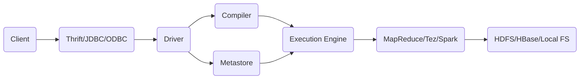

# Hive原理与代码实例讲解

## 1. 背景介绍
### 1.1 问题的由来
随着大数据时代的到来,企业每天产生的数据量呈爆炸式增长。如何高效地存储、处理和分析海量数据成为了企业面临的重大挑战。传统的关系型数据库已经无法满足大数据处理的需求。在此背景下,Hadoop生态系统应运而生,其中Hive作为构建在Hadoop之上的数据仓库工具,为海量结构化数据的分析提供了重要支撑。

### 1.2 研究现状
目前业界对Hive的研究主要集中在以下几个方面:

(1)Hive的查询优化。Hive作为一个基于MapReduce的数据仓库工具,其查询性能一直备受关注。研究者们提出了多种查询优化技术,如谓词下推、列裁剪、分区裁剪等,以提升Hive的查询效率。

(2)Hive与其他大数据工具的集成。Hive可以与Spark、Tez等计算引擎无缝集成,大大提升了数据处理的性能。同时,Hive还可以与Kylin、Druid等OLAP引擎集成,实现更加灵活高效的联机分析。

(3)Hive的SQL语义扩展。为了更好地支持数据分析,Hive在标准SQL的基础上做了大量扩展,引入了多维分析、窗口函数、数据倾斜优化等高级特性。这些特性极大地丰富了Hive的分析能力。

### 1.3 研究意义
深入研究Hive的原理和应用,有助于我们更好地利用这一重要的大数据工具,挖掘海量数据的价值。通过理解Hive的内部机制,我们可以编写出高效优雅的HiveQL代码,避免潜在的性能问题。此外,研究Hive与其他大数据工具的集成,可以帮助我们构建功能更强大、性能更卓越的大数据分析平台。

### 1.4 本文结构
本文将围绕Hive的原理和应用展开深入探讨。内容安排如下:第2部分介绍Hive的核心概念;第3部分剖析Hive的内部原理;第4部分讲解Hive的数学模型和公式;第5部分通过代码实例演示Hive的具体用法;第6部分总结Hive在实际场景中的应用;第7部分推荐Hive相关的学习资源;第8部分展望Hive的未来发展趋势和挑战;第9部分列举Hive使用中的常见问题。

## 2. 核心概念与联系
在深入探讨Hive原理之前,我们有必要先了解几个核心概念:

(1)Hive:构建在Hadoop之上的数据仓库基础架构,它提供了一系列工具,可以用来进行数据提取、转化、加载(ETL),这是一种可以存储、查询和分析存储在Hadoop中的大规模数据的机制。

(2)HiveQL:Hive提供的类SQL查询语言。熟悉SQL的用户可以很方便地使用它进行查询。

(3)MapReduce:Hive的查询会被转换为MapReduce任务进行运行。MapReduce是一个使用简单的软件框架,基于它写出来的应用程序能够运行在由上千个商用机器组成的大集群上,并以一种可靠的、容错的方式并行地处理上TB级别的数据集。

(4)HDFS:Hadoop分布式文件系统,为Hive提供了底层的数据存储。

(5)元数据:Hive将元数据存储在数据库中,用它来存储Hive表的模式。Hive中的元数据包括表的名字,表的列和分区及其属性,表的属性(是否为外部表等),表的数据所在目录等。

下图展示了Hive的架构,以及各个组件之间的关系:



从上图可以看出,用户通过Thrift/JDBC/ODBC等接口提交HiveQL查询,Driver负责接收查询并调度Compiler和Metastore。Compiler将HiveQL编译成MapReduce/Tez/Spark任务,Metastore负责存储Hive的元数据。编译后的任务由Execution Engine提交到Hadoop集群运行,并从HDFS/HBase等存储引擎读取数据。

## 3. 核心算法原理 & 具体操作步骤
### 3.1 算法原理概述
Hive最核心的算法是基于MapReduce的查询处理。Hive在运行时会将HiveQL转换为一系列的MapReduce任务,然后在Hadoop集群上执行。一个HiveQL查询通常包含多个子查询,每个子查询都会被转换为一个或多个MapReduce任务。

### 3.2 算法步骤详解
下面我们以一个简单的HiveQL查询为例,剖析Hive的查询处理步骤:

```sql
SELECT word, count(*) AS count 
FROM docs
WHERE word NOT IN ('a', 'the')
GROUP BY word
HAVING count > 100
ORDER BY count DESC
LIMIT 100;
```

这个查询的作用是统计文档中单词的出现频率,并返回出现次数大于100的前100个单词。查询处理的步骤如下:

(1)解析HiveQL,生成抽象语法树(AST)。

(2)语义分析,检查表和列是否存在,解析表达式等。

(3)生成逻辑执行计划。逻辑执行计划是一个DAG(有向无环图),由多个Operator组成,每个Operator代表一个操作,如TableScanOperator、FilterOperator、GroupByOperator等。

(4)优化逻辑执行计划。Hive会对逻辑执行计划进行一系列优化,如谓词下推、列裁剪、分区裁剪等。

(5)物理执行计划生成。将逻辑执行计划转换为MapReduce任务。

(6)提交MapReduce任务到Hadoop集群运行。

(7)获取结果。

### 3.3 算法优缺点
Hive基于MapReduce的查询处理有以下优点:

(1)易用性高。用户只需编写HiveQL,不必关心底层的MapReduce实现。

(2)可扩展性强。Hive可以非常方便地扩展到数千节点规模。

(3)容错性好。得益于MapReduce的容错机制,Hive具有很强的容错能力。

但Hive也存在一些缺点:

(1)实时性差。Hive基于批处理的MapReduce,不适合实时查询。

(2)小数据集上效率低。Hive为大数据而设计,在小数据集上的效率不高。

(3)迭代式算法实现困难。很多迭代式算法(如机器学习算法)在Hive中实现起来比较困难。

### 3.4 算法应用领域
Hive广泛应用于各种数据分析场景,如:

(1)日志分析。Hive可用于分析Web服务器日志、应用程序日志等。

(2)用户行为分析。电商网站、社交网络等使用Hive分析用户行为数据,如PV、UV、跳出率等。

(3)海量结构化数据处理。Hive可以高效处理企业数据仓库中的结构化数据。

## 4. 数学模型和公式 & 详细讲解 & 举例说明
### 4.1 数学模型构建
Hive的很多功能都依赖于数学模型,如:

(1)Hive的抽样查询依赖于统计学的抽样理论。

(2)Hive的数据倾斜优化依赖于负载均衡模型。

(3)Hive的数据分布依赖于哈希/范围分区模型。

下面我们重点介绍Hive的数据倾斜优化模型。

### 4.2 公式推导过程
在MapReduce中,如果某些Key对应的数据量远大于其他Key,就会产生数据倾斜,造成该Key对应的Reduce任务运行极慢。Hive提供了Skew Join优化来解决数据倾斜问题。

假设参与Join的两张表分别为A和B,其中A为大表,B为小表。我们把A划分成M个桶,把B复制N份。然后将A的每个桶与B的每一份分别Join,这样就得到M*N个MapReduce任务。最后将所有任务的结果合并即可。

假设A表有a行,B表有b行,则不进行Skew Join时,Reduce阶段的复杂度为:

$O(a+b)$

进行Skew Join后,Reduce阶段的复杂度为:

$O(\frac{a}{M}+\frac{b}{N})$

可见,Skew Join将任务进行细粒度划分,有效降低了Reduce阶段的复杂度,从而缓解了数据倾斜问题。

### 4.3 案例分析与讲解
下面我们以一个具体的例子来说明Skew Join的用法。假设有两张表:

```sql
CREATE TABLE sales(
    date STRING,
    shop STRING, 
    product STRING,
    amount INT
);

CREATE TABLE shops(
    shop STRING,
    location STRING
);
```

sales表记录了销售数据,shops表记录了商店信息。现在我们要统计每个地区的销售额:

```sql
SELECT s.location, SUM(a.amount) AS total_amount
FROM sales a 
JOIN shops s ON a.shop = s.shop
GROUP BY s.location;
```

假设某个地区的商店特别多,销售数据也特别多,直接Join会产生数据倾斜。我们可以使用Skew Join优化:

```sql
-- 设置Skew Join参数
SET hive.optimize.skewjoin=true;
SET hive.skewjoin.key=100000;
SET hive.skewjoin.mapjoin.map.tasks=10000;
SET hive.skewjoin.mapjoin.min.split=33554432;

SELECT s.location, SUM(a.amount) AS total_amount
FROM sales a 
JOIN shops s ON a.shop = s.shop
GROUP BY s.location;
```

Hive会自动检测Join的Key的数据分布,如果发现倾斜,就会触发Skew Join优化,将任务划分成多个小任务执行,从而避免了数据倾斜。

### 4.4 常见问题解答
(1)问:Skew Join的原理是什么?

答:Skew Join的核心思想是将参与Join的数据进行细粒度划分,将一个大任务拆分成多个小任务,每个小任务处理一部分数据,从而避免了数据倾斜。具体做法是将大表按照Join Key划分桶,将小表复制多份,然后将每个桶与每一份小表分别进行Join。

(2)问:什么情况下会触发Skew Join?

答:当Hive检测到Join的某个Key对应的数据量远大于其他Key时,就会触发Skew Join优化。具体触发条件由hive.skewjoin.key参数控制,该参数定义了一个Key对应的数据量的阈值,超过这个阈值就会触发Skew Join。

(3)问:Skew Join会带来什么开销?

答:Skew Join需要将小表复制多份,因此会增加数据复制的开销。同时,Skew Join会生成多个MapReduce任务,任务调度的开销也会增加。但在数据严重倾斜的情况下,Skew Join可以显著提升查询性能,因此这些开销是值得的。

## 5. 项目实践：代码实例和详细解释说明
### 5.1 开发环境搭建
首先我们需要搭建Hive的开发环境。Hive的安装非常简单,只需解压Hive安装包,并设置几个环境变量即可。下面是一个示例:

```bash
# 下载Hive安装包
wget https://mirrors.tuna.tsinghua.edu.cn/apache/hive/hive-3.1.2/apache-hive-3.1.2-bin.tar.gz

# 解压安装包  
tar -xzvf apache-hive-3.1.2-bin.tar.gz

# 设置环境变量
export HIVE_HOME=/path/to/hive 
export PATH=$HIVE_HOME/bin:$PATH
```

注意Hive需要依赖Hadoop,因此需要先安装Hadoop。

### 5.2 源代码详细实现
下面我们通过一个具体的例子来演示Hive的使用。假设我们有一个销售数据表sales:

```sql
CREATE TABLE sales(
    date STRING,
    shop STRING, 
    product STRING,
    amount INT
)
ROW FORMAT DELIMITED
FIELDS TERMINATED BY ',';
```

我们可以通过以下HiveQL查询销售数据