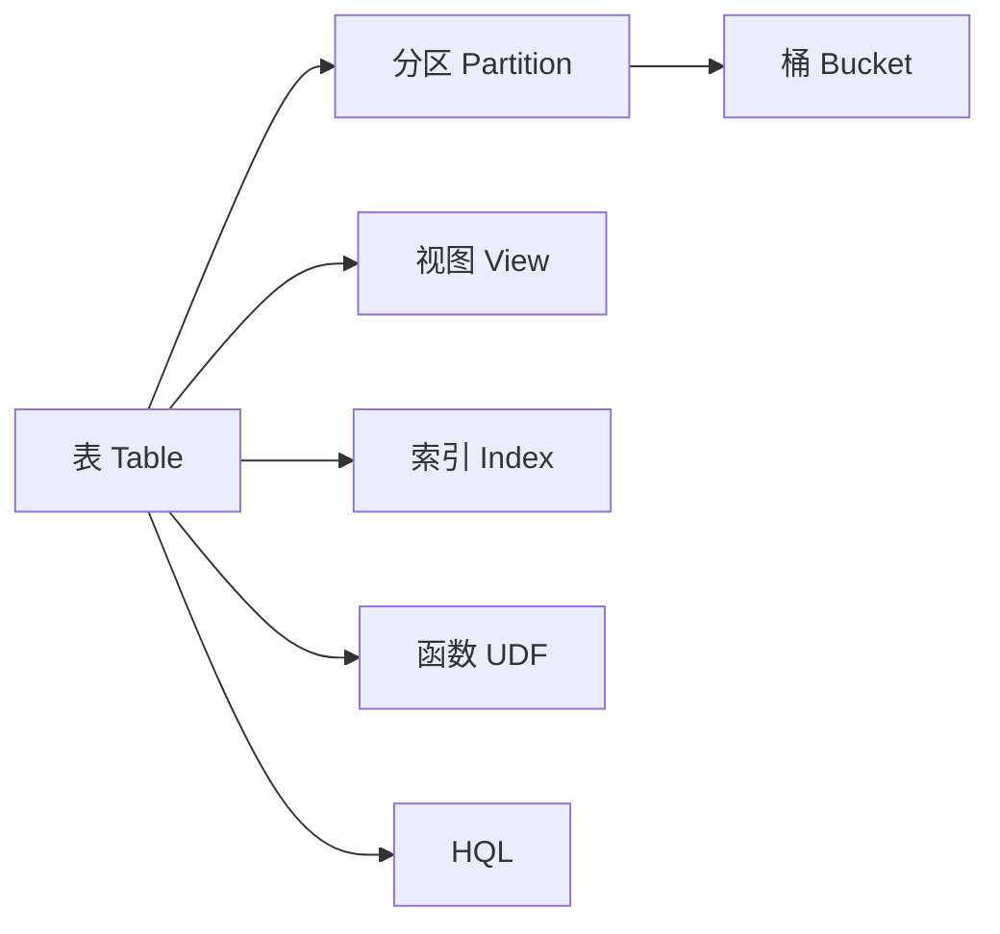
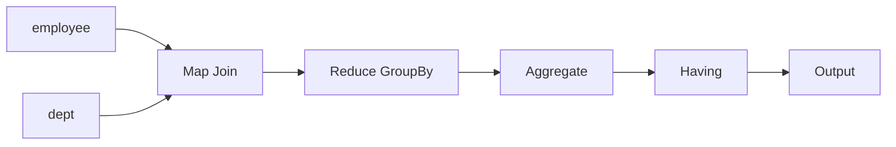

# Hive数据仓库概念与架构

作者：禅与计算机程序设计艺术 / Zen and the Art of Computer Programming

## 1. 背景介绍
### 1.1 问题的由来
随着大数据时代的到来,企业面临着海量数据的存储和处理挑战。传统的关系型数据库已经无法满足大数据处理的需求,因此急需一种高效、可扩展的大数据处理解决方案。Hive应运而生,它是基于Hadoop的数据仓库工具,提供了类SQL查询语言HQL,可以将结构化的数据文件映射为一张数据库表,并提供简单的SQL查询功能。
### 1.2 研究现状
目前业界主流的大数据处理平台包括Hadoop、Spark等,而Hive是构建在Hadoop之上的数据仓库工具。据调查,超过70%的大数据项目都在使用Hive进行数据处理和分析。Hive经过多年的发展已经日趋成熟,成为了大数据领域必备的工具之一。
### 1.3 研究意义
深入研究Hive的架构原理和使用方法,对于更好地利用大数据资源、提升数据分析和挖掘能力具有重要意义。通过学习Hive,可以掌握大数据处理的核心技术,为今后从事大数据相关工作奠定良好基础。同时Hive也是数据仓库和数据挖掘领域的研究热点,对其进行系统性总结和探讨很有必要。
### 1.4 本文结构
本文将分为9个章节,首先介绍Hive的背景和研究意义,然后重点讲解Hive的核心概念、架构原理、数学模型、代码实现、应用场景等,最后总结Hive的发展趋势和面临的挑战。希望通过本文的讲解,读者能够对Hive有一个全面深入的认识。

## 2. 核心概念与联系
Hive的核心概念包括以下几点:
1. 表(Table):Hive采用关系型数据库的概念,支持对结构化数据的映射。
2. 分区(Partition):类似于关系数据库的分区表概念,可以简单理解为分目录。
3. 桶(Bucket):对分区进一步细化,方便采样和join查询。
4. 视图(View):与关系数据库类似,是一个虚表,基于基本表创建。
5. 索引(Index):与关系数据库的索引基本一致,默认不支持,需要额外开启。
6. 函数(UDF):用户自定义函数,对Hive的内置函数进行扩展。
7. HQL:Hive提供的类SQL语言,用于查询和管理Hive中的数据。

这些概念相辅相成,构成了Hive的基本框架。表是Hive的核心,分区、桶、索引用于优化查询,视图用于简化查询,UDF增强了Hive的功能,HQL则是用户操作Hive的基本方式。



## 3. 核心算法原理 & 具体操作步骤
### 3.1 算法原理概述
Hive底层依赖于MapReduce进行数据处理,其基本工作原理如下:
1. Hive将HQL转换为MapReduce作业
2. 将MapReduce作业提交到Hadoop集群运行
3. 读取HDFS中的数据文件
4. 按照MapReduce编程模型进行数据处理
5. 将处理结果写回HDFS

整个过程对用户是透明的,用户只需使用HQL进行查询即可。
### 3.2 算法步骤详解
具体来说,Hive的查询过程分为以下几个步骤:
1. 语法解析:Antlr定义SQL的语法规则,完成SQL词法,语法解析,将SQL转化为抽象语法树AST Tree
2. 语义解析:遍历AST Tree,抽象出查询的基本组成单元QueryBlock
3. 生成逻辑执行计划:遍历QueryBlock,翻译为执行操作树OperatorTree
4. 优化逻辑执行计划:逻辑层优化器进行OperatorTree变换,合并不必要的ReduceSinkOperator,减少shuffle数据量
5. 生成物理执行计划:遍历OperatorTree,翻译为MapReduce任务
6. 优化物理执行计划:物理层优化器进行MapReduce任务的变换,生成最终的执行计划
7. 执行:将最终的执行计划提交到Hadoop集群运行,并返回结果

### 3.3 算法优缺点
Hive的优点主要有:
1. 简单易上手,提供类SQL支持,学习成本低
2. 避免了编写MapReduce,减少开发人员的学习成本
3. 统一的元数据管理,可与Presto、Impala、SparkSQL等共享数据
4. 执行延迟高,不适合实时数据处理
5. 调优困难,粒度较粗
6. 兼容性差,不同版本的Hive语法和数据类型可能不兼容

### 3.4 算法应用领域
Hive常用于海量结构化日志的数据统计分析、用户行为分析、特征工程等离线数据处理场景。比如:
1. 分析各种网站的访问日志,统计PV、UV等
2. 分析用户的购买、收藏、点赞等行为,进行用户画像和推荐
3. 针对爬虫数据,进行清洗、转换、统计、分析
4. 作为数据仓库,对各种数据进行ETL,供数据分析、挖掘使用

## 4. 数学模型和公式 & 详细讲解 & 举例说明
### 4.1 数学模型构建
Hive本质上是将HQL转换为MapReduce程序,因此Hive的数学模型可以用MapReduce的数学模型来表示。设输入数据集为$D=\{d_1,d_2,...,d_n\}$,Map函数为$f$,Reduce函数为$g$,则Hive的数学模型可表示为:

$$
\begin{aligned}
&map(k_1, v_1) \to list(k_2, v_2) \\
&reduce(k_2, list(v_2)) \to list(k_3, v_3)
\end{aligned}
$$

其中,$k_1$表示输入数据的键,$v_1$表示输入数据的值,$k_2$和$k_3$表示中间结果的键,$v_2$和$v_3$表示中间结果的值。Map函数$f$将$(k_1,v_1)$转换为一组中间结果$(k_2,v_2)$,Reduce函数$g$将相同$k_2$的所有$v_2$组合起来进一步处理,最终输出结果$(k_3,v_3)$。

### 4.2 公式推导过程
以WordCount为例,假设输入数据集$D$如下:
```
hello world
hello hadoop
hive world
```
Map阶段将每行数据按空格分割成单词,并将单词转换为$(word,1)$的形式,如:
```
(hello,1),(world,1)
(hello,1),(hadoop,1)
(hive,1),(world,1)
```
Reduce阶段将相同单词的计数值累加,最终输出单词的总频次,如:
```
(hello,2)
(world,2)
(hadoop,1)
(hive,1)
```
可见,Map阶段进行的转换可以表示为:
$$
f(k_1, v_1) \to list((w_1,1),(w_2,1),...,(w_m,1))
$$
其中,$w_1,w_2,...,w_m$为单词,$1$表示每个单词出现一次。

Reduce阶段的转换可以表示为:
$$
g(w_i, list(1,1,...,1)) \to (w_i, n_i)
$$
其中,$w_i$为单词,$n_i$为$w_i$出现的总次数。

### 4.3 案例分析与讲解
下面以一个具体的HQL查询为例,讲解Hive的工作原理。假设有如下两个表:
```sql
CREATE TABLE employee (
    name string,
    dept string,
    salary int
);

CREATE TABLE dept (
    dept string,
    dept_name string
);
```
employee表存储员工信息,dept表存储部门信息。现在需要查询所有部门的总工资大于10000的部门名称,HQL查询如下:
```sql
SELECT d.dept_name, SUM(e.salary) AS total_salary
FROM employee e JOIN dept d ON e.dept = d.dept
GROUP BY d.dept_name
HAVING SUM(e.salary) > 10000;
```
Hive会将该查询转换为一系列MapReduce作业:
1. TableScan:扫描employee和dept表,读取数据
2. Join:将两个表按照dept字段进行join
3. GroupBy:按照dept_name分组
4. Aggregate:组内聚合,计算total_salary
5. Having:过滤total_salary>10000的分组

每个阶段都会启动一个MapReduce作业,最终将结果输出到HDFS。整个查询过程如下图所示:



### 4.4 常见问题解答
1. Hive适合什么样的数据处理场景?
答:Hive适合离线的海量结构化数据分析处理,如日志分析、用户行为分析等。
2. Hive与传统数据库相比有什么优势?
答:Hive基于Hadoop,具有良好的扩展性和容错性,可以处理PB级别的海量数据。
3. Hive查询为什么慢?
答:Hive是基于批处理的MapReduce引擎,而不是低延迟的交互式SQL引擎,一个查询可能会启动多个MapReduce job,所以会比较慢。
4. 怎样优化Hive查询?
答:可以通过设置合适的Map数、开启本地模式、使用分区表、大表join小表、避免笛卡尔积等方式优化。

## 5. 项目实践：代码实例和详细解释说明
### 5.1 开发环境搭建
Hive的安装部署相对简单,只需要以下几步:
1. 准备一个已经部署好HDFS和YARN的Hadoop集群
2. 下载Hive安装包,如apache-hive-3.1.2-bin.tar.gz
3. 解压安装包到指定目录,如/usr/local/hive
4. 配置环境变量HIVE_HOME和PATH
5. 在HDFS创建/tmp和/user/hive/warehouse目录,并赋予写权限
6. 初始化元数据库,如使用MySQL作为元数据库:
```sql
$ schematool -initSchema -dbType mysql
```
7. 启动Hive CLI:
```
$ hive
```

### 5.2 源代码详细实现
下面通过一个具体的HQL查询来讲解Hive的代码实现。假设有一个销售数据表sales,包含以下字段:
```
date: 销售日期
product: 产品名称
amount: 销售额
```
需要统计每个产品的总销售额,HQL查询如下:
```sql
SELECT product, SUM(amount) AS total_amount
FROM sales
GROUP BY product;
```
该查询会被转换为以下MapReduce程序:

Mapper:
```java
public class SalesMapper extends Mapper<LongWritable, Text, Text, DoubleWritable> {
    private Text product = new Text();
    private DoubleWritable amount = new DoubleWritable();
    
    public void map(LongWritable key, Text value, Context context) throws IOException, InterruptedException {
        String[] fields = value.toString().split(",");
        product.set(fields[1]);
        amount.set(Double.parseDouble(fields[2]));
        context.write(product, amount);
    }
}
```
Mapper的输入为销售表的每一行数据,输出为(product,amount)的键值对。

Reducer:
```java
public class SalesReducer extends Reducer<Text, DoubleWritable, Text, DoubleWritable> {
    private DoubleWritable total_amount = new DoubleWritable();
    
    public void reduce(Text key, Iterable<DoubleWritable> values, Context context) throws IOException, InterruptedException {
        double sum = 0;
        for (DoubleWritable value : values) {
            sum += value.get();
        }
        total_amount.set(sum);
        context.write(key, total_amount);
    }
}
```
Reducer的输入为Mapper的输出,按照product分组,对amount进行sum聚合,最终输出每个product的total_amount。

### 5.3 代码解读与分析
Mapper阶段主要进行以下工作:
1. 读取销售表的每一行数据
2. 解析每行数据的字段
3. 将product作为key,amount作为value输出

Reducer阶段主要进行以下工作:
1