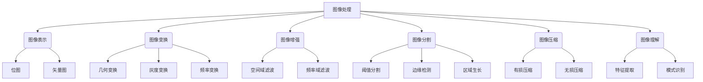

# Image Processing 原理与代码实战案例讲解

## 1. 背景介绍

### 1.1 问题的由来

在当今数字时代,图像处理技术已经无处不在,从智能手机拍照到医学影像诊断,从卫星遥感到自动驾驶汽车,图像处理在各个领域扮演着关键角色。随着图像数据的快速增长和应用场景的不断扩展,高效、准确的图像处理技术变得至关重要。

图像处理的挑战在于,图像数据往往存在噪声、失真、模糊等问题,需要通过算法进行预处理和增强,以提取有用信息。此外,不同应用场景对图像处理技术也提出了不同需求,如实时性、鲁棒性、精度等,需要针对性地设计和优化算法。

### 1.2 研究现状

图像处理是计算机视觉和模式识别领域的基础,经过数十年的发展,已经形成了较为完善的理论体系和算法框架。传统图像处理算法主要包括滤波、增强、分割、特征提取等,能够有效解决噪声去除、边缘检测、目标识别等常见问题。

近年来,随着深度学习技术的兴起,基于卷积神经网络(CNN)的图像处理方法取得了突破性进展。CNN能够自动学习图像的特征表示,在图像分类、目标检测、语义分割等任务上表现出色。此外,生成对抗网络(GAN)等新型深度模型也被应用于图像去噪、超分辨率重建等图像处理任务中。

### 1.3 研究意义

高质量的图像处理技术是实现计算机视觉和人工智能的关键。准确的图像处理不仅能提高图像质量,还能为后续的目标检测、识别、分类等高级任务提供可靠的输入数据,从而提升整个系统的性能。

图像处理技术在医疗影像、遥感探测、安防监控、自动驾驶等领域具有广泛的应用前景。通过图像处理,可以提高医疗诊断的准确性,优化农业生产,增强安全防护,实现自动驾驶等,为人类社会带来巨大的经济和社会价值。

### 1.4 本文结构

本文将全面介绍图像处理的核心原理和实战案例。第2章将阐述图像处理的基本概念和理论基础;第3章详细讲解常用图像处理算法的原理和实现步骤;第4章将构建数学模型,推导核心公式并结合案例进行分析;第5章将通过代码实例,展示图像处理算法的具体实现和运行效果;第6章将探讨图像处理在实际应用中的场景;第7章将推荐相关工具和学习资源;第8章将总结研究成果,展望未来发展趋势和面临的挑战。

## 2. 核心概念与联系

图像处理是一门综合性的学科,涉及多个核心概念和技术,如上图所示:

1. **图像表示**:图像可以用位图或矢量图两种方式表示,位图用像素阵列描述图像,矢量图用数学方程描述图像。
2. **图像变换**:包括几何变换(平移、旋转、缩放等)、灰度变换(对比度调整、直方图均衡化等)和频率变换(傅里叶变换等)。
3. **图像增强**:通过空间域滤波(均值滤波、中值滤波等)或频率域滤波(高通滤波、低通滤波等)来改善图像质量。
4. **图像分割**:将图像划分为多个独立区域,主要方法包括阈值分割、边缘检测和区域生长等。
5. **图像压缩**:减小图像数据量,分为有损压缩(JPEG等)和无损压缩(PNG等)。
6. **图像理解**:从图像中提取特征,并进行模式识别和理解,是计算机视觉的核心任务。

这些概念相互关联、环环相扣,构成了图像处理的完整理论体系和技术框架。

## 3. 核心算法原理 & 具体操作步骤

### 3.1 算法原理概述

图像处理算法可分为低级视觉任务和高级视觉任务两大类。低级视觉任务主要包括图像滤波、增强、分割等,目的是从原始图像数据中提取有用信息;高级视觉任务则包括特征提取、目标检测、模式识别等,旨在从处理后的图像中获取语义理解。

以下将介绍几种核心的图像处理算法原理:

1. **均值滤波**:使用滤波窗口内像素的平均值替代中心像素值,能有效消除高斯噪声。
2. **中值滤波**:用滤波窗口内像素的中值替代中心像素值,能有效消除椒盐噪声。
3. **直方图均衡化**:通过拉伸直方图来增强图像对比度,使像素值分布更加均匀。
4. **边缘检测**:利用一阶或二阶微分算子(如Sobel、Canny等)检测图像中的边缘。
5. **霍夫变换**:在参数空间检测符合特定形状(如直线、圆等)的点集,用于形状检测。
6. **K-Means聚类**:将图像像素按特征聚类,常用于图像分割。
7. **SIFT特征**:计算图像关键点的尺度不变特征向量,用于特征匹配。
8. **HOG特征**:计算图像局部区域的梯度直方图,常用于目标检测。

### 3.2 算法步骤详解

以**Canny边缘检测算法**为例,具体步骤如下:

1. **高斯滤波**:使用高斯核对图像进行平滑,减少噪声影响。
2. **计算梯度幅值和方向**:分别计算每个像素点的梯度幅值和梯度方向。
3. **非极大值抑制**:对梯度幅值进行细化,只保留沿梯度方向的局部最大值。
4. **双阈值处理**:设置高低两个阈值,低于低阈值的像素点被抛弃,高于高阈值的像素点被接受为边缘点,两阈值间的像素点根据与已接受边缘点的连接情况确定是否接受。
5. **边缘连接**:通过边缘连接消除孤立的边缘点,获得完整的边缘轮廓。

以上步骤能够有效检测出图像中的边缘,并抑制噪声的影响,是一种经典且高效的边缘检测算法。

### 3.3 算法优缺点

不同图像处理算法各有优缺点,需要根据具体场景选择合适的算法:

- **均值滤波**:简单高效,但会导致边缘模糊。
- **中值滤波**:能保留边缘细节,但对椒盐噪声以外的噪声效果一般。
- **直方图均衡化**:能显著增强图像对比度,但可能会过度增强噪声。
- **边缘检测**:能准确检测出图像边缘,但对噪声敏感,需要预处理。
- **霍夫变换**:能检测出特定形状,但计算量大,速度较慢。
- **K-Means聚类**:能有效分割图像,但需要预先设置聚类数目。
- **SIFT特征**:具有尺度和旋转不变性,但计算复杂,实时性较差。
- **HOG特征**:能较好捕捉目标的形状信息,但对噪声和遮挡敏感。

在实际应用中,通常需要将多种算法有机结合,发挥各自优势,以获得最佳的图像处理效果。

### 3.4 算法应用领域

图像处理算法在诸多领域得到广泛应用,主要包括:

1. **医学影像**:用于医学图像去噪、增强、分割等,提高诊断质量。
2. **遥感探测**:对卫星遥感图像进行预处理,用于气象监测、资源勘探等。
3. **安防监控**:实现运动目标检测、人脸识别等,提高安全防护水平。
4. **工业检测**:检测产品缺陷、自动化装配等,提高工业生产效率。
5. **机器视觉**:为智能机器人、自动驾驶汽车等提供视觉信息处理能力。
6. **图像编辑**:实现图像美化、修复、特效等,提高图像质量和艺术效果。

随着人工智能和大数据技术的发展,图像处理在更多新兴领域也将发挥重要作用。

## 4. 数学模型和公式 & 详细讲解 & 举例说明

### 4.1 数学模型构建

在图像处理中,通常将图像看作一个二维函数 $f(x,y)$,其中 $(x,y)$ 表示像素坐标, $f(x,y)$ 表示像素灰度值或颜色分量值。

对于灰度图像,可以用下式表示:

$$f(x,y) = I(x,y)$$

其中 $I(x,y)$ 为像素灰度值,取值范围为 $[0,L-1]$, $L$ 通常取 256。

对于彩色图像,可以用下式表示:

$$f(x,y) = \begin{bmatrix}
           R(x,y) \\
           G(x,y) \\
           B(x,y)
          \end{bmatrix}$$

其中 $R(x,y)$、$G(x,y)$、$B(x,y)$ 分别表示像素的红、绿、蓝三个颜色分量值。

基于这种数学模型,我们可以对图像进行各种数学运算和变换,从而实现不同的图像处理功能。

### 4.2 公式推导过程

**均值滤波**

均值滤波的目的是消除高斯噪声,其数学原理是利用邻域像素的平均值来代替中心像素值。

设图像函数为 $f(x,y)$,滤波窗口大小为 $(2m+1) \times (2n+1)$,中心像素坐标为 $(s,t)$,则均值滤波后的像素值 $g(s,t)$ 可表示为:

$$g(s,t) = \frac{1}{(2m+1)(2n+1)} \sum_{i=-m}^{m} \sum_{j=-n}^{n} f(s+i,t+j)$$

**sobel边缘检测**

Sobel算子是一种常用的边缘检测算子,它通过计算像素点的水平和垂直梯度近似值,得到该点的梯度幅值和梯度方向。

设图像函数为 $f(x,y)$,sobel算子的水平和垂直梯度算子分别为:

$$G_x = \begin{bmatrix}
-1 & 0 & 1\\
-2 & 0 & 2\\
-1 & 0 & 1
\end{bmatrix}, \quad
G_y = \begin{bmatrix}
1 & 2 & 1\\
0 & 0 & 0\\
-1 & -2 & -1  
\end{bmatrix}$$

则像素 $(x,y)$ 处的梯度近似值为:

$$\begin{align}
G_x(x,y) &= (f(x-1,y-1) + 2f(x-1,y) + f(x-1,y+1)) \\
         &- (f(x+1,y-1) + 2f(x+1,y) + f(x+1,y+1)) \\
G_y(x,y) &= (f(x-1,y-1) + 2f(x,y-1) + f(x+1,y-1)) \\
         &- (f(x-1,y+1) + 2f(x,y+1) + f(x+1,y+1))
\end{align}$$

像素