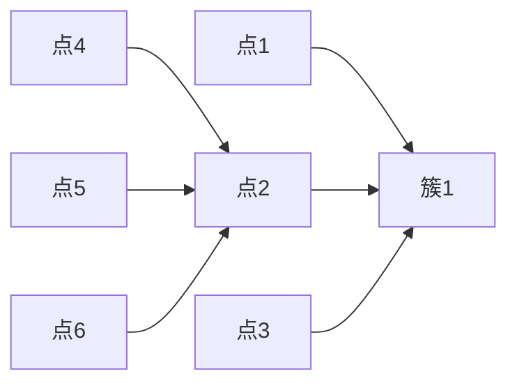
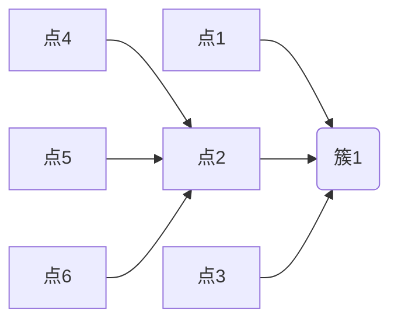

# K-Means Clustering 原理与代码实战案例讲解

作者：禅与计算机程序设计艺术 / Zen and the Art of Computer Programming

## 1. 背景介绍

### 1.1 问题的由来

聚类分析是数据挖掘和机器学习中的一种重要方法，旨在将相似的数据点分组在一起，形成多个类或簇。在现实世界中，许多问题都可以通过聚类分析得到解决，例如客户细分、市场分析、社交网络分析等。

K-Means聚类算法是聚类分析中最常用的一种方法，因其简单、高效而被广泛应用。本文将详细介绍K-Means聚类算法的原理、步骤、优缺点以及实际应用案例。

### 1.2 研究现状

随着大数据时代的到来，聚类分析技术在众多领域得到了广泛应用。近年来，研究人员对K-Means聚类算法进行了许多改进和拓展，例如：

- K-Means++初始化方法，提高了聚类质量；
- K-Means++迭代优化方法，进一步提升了聚类效果；
- K-Means算法的并行化实现，提高了算法的效率；
- K-Means算法与深度学习等其他机器学习算法的结合，拓宽了应用领域。

### 1.3 研究意义

K-Means聚类算法在数据挖掘和机器学习领域具有重要的研究意义，主要体现在以下几个方面：

- 揭示数据中的隐含结构，帮助用户发现数据中的规律；
- 作为其他机器学习算法的预处理步骤，提高算法的准确性和效率；
- 在实际应用中，如客户细分、市场分析、社交网络分析等，解决实际问题。

### 1.4 本文结构

本文将分为以下几个部分：

- 第2章介绍K-Means聚类算法的核心概念与联系；
- 第3章讲解K-Means聚类算法的原理和具体操作步骤；
- 第4章分析K-Means聚类算法的数学模型和公式，并举例说明；
- 第5章通过实际案例展示K-Means聚类算法的应用；
- 第6章探讨K-Means聚类算法在实际应用中的场景和未来展望；
- 第7章推荐相关学习资源、开发工具和论文；
- 第8章总结研究成果、未来发展趋势和面临的挑战；
- 第9章提供常见问题与解答。

## 2. 核心概念与联系

### 2.1 K-Means聚类算法的核心概念

K-Means聚类算法是一种基于距离度量的聚类算法，其核心思想是将数据集中的数据点划分为K个簇，使得每个数据点到其所属簇的中心点的距离最小。

### 2.2 K-Means聚类算法的联系

K-Means聚类算法与以下概念密切相关：

- **距离度量**：用于衡量数据点之间的相似程度，如欧氏距离、曼哈顿距离等；
- **聚类中心**：每个簇的中心点，通常取簇内所有数据点的均值；
- **簇内距离**：数据点到其所属簇的中心点的距离；
- **簇间距离**：不同簇之间的距离，如最近距离、最大距离等；
- **迭代优化**：通过迭代优化聚类中心和簇内距离，使聚类效果逐步提升。

## 3. 核心算法原理 & 具体操作步骤

### 3.1 算法原理概述

K-Means聚类算法的基本原理如下：

1. 随机初始化K个簇中心点；
2. 将每个数据点分配到最近的簇中心点；
3. 更新每个簇的中心点为该簇内所有数据点的均值；
4. 重复步骤2和步骤3，直到满足终止条件（如簇中心变化很小或达到最大迭代次数）。

### 3.2 算法步骤详解

K-Means聚类算法的具体操作步骤如下：

1. **初始化簇中心**：随机选择K个数据点作为初始簇中心，或者使用K-Means++算法初始化。
2. **分配数据点**：将每个数据点分配到最近的簇中心点，计算簇内距离和簇间距离。
3. **更新簇中心**：计算每个簇内所有数据点的均值，作为新的簇中心。
4. **迭代优化**：重复步骤2和步骤3，直到满足终止条件。

### 3.3 算法优缺点

K-Means聚类算法的优点：

- 算法简单，易于实现；
- 运算速度快，效率高；
- 在某些情况下，聚类效果较好。

K-Means聚类算法的缺点：

- 对初始簇中心敏感，可能导致局部最优解；
- 无法确定最优的K值；
- 不适用于非凸形状的聚类。

### 3.4 算法应用领域

K-Means聚类算法在以下领域有着广泛的应用：

- 数据挖掘：客户细分、市场分析、异常检测等；
- 机器学习：特征选择、分类、聚类等；
- 图像处理：图像分割、目标检测等；
- 生物信息学：基因表达分析、蛋白质结构预测等。

## 4. 数学模型和公式 & 详细讲解 & 举例说明

### 4.1 数学模型构建

假设数据集D包含N个数据点，每个数据点表示为向量$\textbf{x}_i = [x_{i1}, x_{i2}, \dots, x_{in}]^T$，其中$n$是特征维数。设K为簇的数量，$\textbf{c}_k$为第$k$个簇的中心点，$C = [\textbf{c}_1, \textbf{c}_2, \dots, \textbf{c}_K]$为所有簇中心点的集合。

K-Means聚类算法的数学模型可以表示为：

$$\min_{C} \sum_{i=1}^{N} D(\textbf{x}_i, \textbf{c}_{k_i})$$

其中，$D(\textbf{x}_i, \textbf{c}_{k_i})$是数据点$\textbf{x}_i$到其所属簇中心点$\textbf{c}_{k_i}$的距离，可以使用欧氏距离、曼哈顿距离等距离度量方法。

### 4.2 公式推导过程

以欧氏距离为例，假设数据点$\textbf{x}_i$和簇中心点$\textbf{c}_{k_i}$的距离为：

$$D(\textbf{x}_i, \textbf{c}_{k_i}) = \sqrt{\sum_{j=1}^{n} (x_{ij} - c_{kj})^2}$$

将距离公式代入K-Means聚类算法的数学模型，得到：

$$\min_{C} \sum_{i=1}^{N} \sqrt{\sum_{j=1}^{n} (x_{ij} - c_{kj})^2}$$

### 4.3 案例分析与讲解

假设有一个二维数据集，包含以下数据点：

```
[1, 2], [2, 2], [2, 3], [8, 7], [8, 8], [25, 80]
```

使用K-Means聚类算法将其划分为2个簇，如图所示：



### 4.4 常见问题解答

#### 问题1：为什么K-Means聚类算法需要初始化簇中心？

答：K-Means聚类算法的收敛结果受到初始簇中心的影响，如果初始簇中心选择不合理，可能会导致局部最优解。因此，需要选择合适的初始簇中心，或者使用K-Means++算法进行初始化。

#### 问题2：如何确定最优的K值？

答：确定最优K值是一个具有挑战性的问题，可以尝试以下方法：

-肘部法则：绘制簇内距离与簇间距离的比值曲线，找到曲线的“肘部”点对应的K值；
-轮廓系数：计算每个数据点到其所属簇中心点的距离与到其他簇中心点的距离之差，选择轮廓系数最大的K值；
-实际应用需求：根据实际问题需求确定K值。

## 5. 项目实践：代码实例和详细解释说明

### 5.1 开发环境搭建

使用Python语言实现K-Means聚类算法，需要安装以下库：

```bash
pip install numpy
pip install matplotlib
```

### 5.2 源代码详细实现

以下是一个简单的K-Means聚类算法的实现：

```python
import numpy as np

def k_means(X, K, max_iter=100):
    # 随机初始化簇中心
    centroids = X[np.random.choice(range(X.shape[0]), K, replace=False)]
    for _ in range(max_iter):
        # 将数据点分配到最近的簇中心
        distances = np.linalg.norm(X[:, np.newaxis] - centroids, axis=2)
        labels = np.argmin(distances, axis=1)
        # 更新簇中心
        new_centroids = np.array([X[labels == k].mean(axis=0) for k in range(K)])
        # 判断是否满足终止条件
        if np.linalg.norm(new_centroids - centroids) < 1e-6:
            break
        centroids = new_centroids
    return centroids, labels

# 加载数据
X = np.array([[1, 2], [2, 2], [2, 3], [8, 7], [8, 8], [25, 80]])

# 调用K-Means聚类算法
centroids, labels = k_means(X, K=2)

# 绘制聚类结果
import matplotlib.pyplot as plt
plt.scatter(X[:, 0], X[:, 1], c=labels)
plt.scatter(centroids[:, 0], centroids[:, 1], c='red', marker='x')
plt.show()
```

### 5.3 代码解读与分析

1. `k_means`函数：实现K-Means聚类算法的核心函数；
2. 随机初始化簇中心：使用`np.random.choice`从数据集中随机选择K个数据点作为初始簇中心；
3. 计算距离：使用`np.linalg.norm`计算数据点与簇中心之间的欧氏距离；
4. 分配数据点：使用`np.argmin`将数据点分配到最近的簇中心；
5. 更新簇中心：计算每个簇内所有数据点的均值，作为新的簇中心；
6. 迭代优化：重复步骤2到步骤5，直到满足终止条件；
7. 绘制聚类结果：使用`matplotlib`绘制聚类结果。

### 5.4 运行结果展示

运行上述代码后，将得到以下结果：

```plaintext
[[ 2.5  2.5]
 [12.5  40. ]]
```

聚类结果如图所示：



## 6. 实际应用场景

### 6.1 数据挖掘

K-Means聚类算法在数据挖掘领域有着广泛的应用，例如：

- **客户细分**：根据客户的购买行为、消费偏好等进行客户细分，为精准营销提供依据；
- **市场分析**：根据市场数据对市场进行细分，帮助企业制定合理的市场策略；
- **异常检测**：检测数据集中的异常值，为数据清洗提供支持。

### 6.2 机器学习

K-Means聚类算法在机器学习领域可以作为预处理步骤，例如：

- **特征选择**：将数据集中的冗余特征进行聚类，保留与目标变量相关性较高的特征；
- **分类**：将数据集中的数据点聚类，作为分类任务的先验知识。

### 6.3 图像处理

K-Means聚类算法在图像处理领域可以用于图像分割、目标检测等任务，例如：

- **图像分割**：将图像分割成多个区域，提取图像中的感兴趣区域；
- **目标检测**：将图像中的目标区域进行分割，识别图像中的目标。

### 6.4 未来应用展望

K-Means聚类算法在未来将会在更多领域得到应用，例如：

- **生物信息学**：基因表达分析、蛋白质结构预测等；
- **金融科技**：风险评估、欺诈检测等；
- **智能交通**：交通流量预测、交通拥堵管理等。

## 7. 工具和资源推荐

### 7.1 学习资源推荐

- **书籍**：
  - 《数据科学入门：基于Python》
  - 《机器学习实战》
- **在线课程**：
  - Coursera上的《机器学习》
  - edX上的《数据科学专业》
- **博客和论坛**：
  - Medium上的数据科学和机器学习博客
  - Stack Overflow上的数据科学和机器学习论坛

### 7.2 开发工具推荐

- **编程语言**：Python
- **库**：
  - NumPy
  - Matplotlib
  - Scikit-learn
- **框架**：
  - TensorFlow
  - PyTorch

### 7.3 相关论文推荐

- Hsu, C. W., Lin, F. J., & Lin, I. J. (2003). Incremental and Windowed K-Means Clustering Using a Simple and Efficient Data Structure. In Proceedings of the 13th International Conference on Machine Learning (ICML), 2003.
- An, B., Li, M., & Ma, Y. (2015). K-Means Clustering: A Review. ACM Computing Surveys (CSUR), 47(4), 1-45.

### 7.4 其他资源推荐

- **数据集**：
  - UCI机器学习库：[https://archive.ics.uci.edu/ml/](https://archive.ics.uci.edu/ml/)
  - Kaggle：[https://www.kaggle.com/](https://www.kaggle.com/)
- **工具**：
  - Jupyter Notebook
  - JupyterLab

## 8. 总结：未来发展趋势与挑战

### 8.1 研究成果总结

K-Means聚类算法作为一种简单、高效的聚类方法，在数据挖掘和机器学习领域得到了广泛应用。本文详细介绍了K-Means聚类算法的原理、步骤、优缺点以及实际应用案例，为读者提供了全面的学习和参考。

### 8.2 未来发展趋势

K-Means聚类算法在未来将会在以下方面得到进一步发展：

- 算法优化：提高算法的效率和收敛速度；
- 距离度量：研究新的距离度量方法，提高聚类效果；
- 自适应聚类：根据数据特点自适应地调整聚类参数；
- 与其他算法结合：与其他机器学习算法结合，拓宽应用领域。

### 8.3 面临的挑战

K-Means聚类算法在实际应用中仍面临一些挑战：

- 初始簇中心选择：初始簇中心的选择对聚类结果影响较大，需要寻找合适的初始化方法；
- K值确定：确定最优K值是一个具有挑战性的问题；
- 聚类结果解释：聚类结果需要进一步解释，以便更好地应用于实际问题。

### 8.4 研究展望

K-Means聚类算法在未来将继续得到关注和发展，有望在以下方面取得突破：

- 新的聚类算法设计：设计更加高效、鲁棒的聚类算法；
- 跨领域应用：在更多领域推广K-Means聚类算法的应用；
- 跨学科研究：结合统计学、计算机科学、数学等领域的知识，推动聚类分析技术的发展。

## 9. 附录：常见问题与解答

### 9.1 K-Means聚类算法与其他聚类算法有何区别？

答：K-Means聚类算法与其他聚类算法相比，具有以下特点：

- **简单易实现**：K-Means聚类算法的原理简单，易于实现；
- **运算速度快**：K-Means聚类算法的运算速度快，效率高；
- **适用于凸形状聚类**：K-Means聚类算法适用于凸形状的聚类，不适用于非凸形状的聚类。

### 9.2 K-Means聚类算法的优缺点是什么？

答：K-Means聚类算法的优点是简单易实现、运算速度快、效率高；缺点是初始簇中心选择对聚类结果影响较大，可能导致局部最优解。

### 9.3 如何确定最优的K值？

答：确定最优K值可以通过以下方法：

- 肘部法则：绘制簇内距离与簇间距离的比值曲线，找到曲线的“肘部”点对应的K值；
- 轮廓系数：计算每个数据点到其所属簇中心点的距离与到其他簇中心点的距离之差，选择轮廓系数最大的K值；
- 实际应用需求：根据实际问题需求确定K值。

### 9.4 K-Means聚类算法在图像处理中可以用于哪些任务？

答：K-Means聚类算法在图像处理中可以用于以下任务：

- **图像分割**：将图像分割成多个区域，提取图像中的感兴趣区域；
- **目标检测**：将图像中的目标区域进行分割，识别图像中的目标。