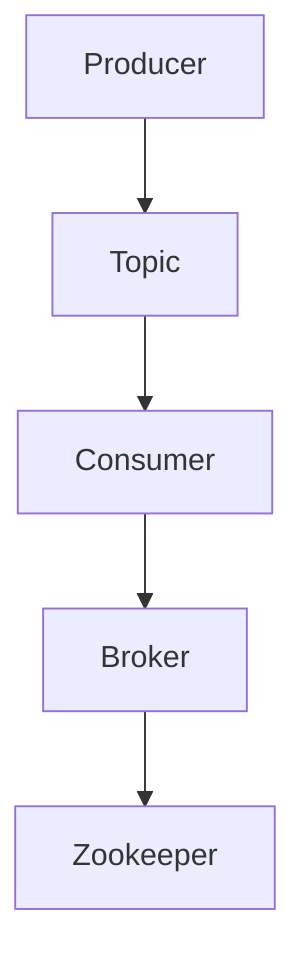

# Kafka原理与代码实例讲解

作者：禅与计算机程序设计艺术 / Zen and the Art of Computer Programming

## 1. 背景介绍

### 1.1 问题的由来

随着大数据时代的到来，数据量呈爆炸式增长。如何高效地处理这些海量数据，成为学术界和工业界共同关注的焦点。Kafka作为一种高性能的分布式流处理平台，应运而生。它具备高吞吐量、可扩展性、持久化等特性，能够满足大规模数据处理的需求。

### 1.2 研究现状

Kafka自2008年由LinkedIn开源以来，经过多年的发展，已经成为大数据生态中不可或缺的一部分。目前，Kafka已经在多个领域得到了广泛应用，如实时数据处理、消息队列、流式计算等。

### 1.3 研究意义

深入了解Kafka的原理和实现，有助于我们更好地理解和应用它，从而在数据处理和架构设计中发挥其优势。

### 1.4 本文结构

本文将首先介绍Kafka的核心概念和原理，然后通过代码实例讲解Kafka的实践应用，最后探讨Kafka的未来发展趋势。

## 2. 核心概念与联系

Kafka的核心概念主要包括：

- **Topic**：主题，是Kafka消息的载体，类似于数据库中的表。每个Topic可以存储大量消息，且消息之间没有顺序关系。
- **Producer**：生产者，负责将消息发送到Kafka集群。
- **Consumer**：消费者，负责从Kafka集群读取消息。
- **Broker**：代理，Kafka集群中的服务器，负责存储消息、处理客户端请求等。
- **Zookeeper**：协调服务，负责集群的元数据管理、协调节点状态等。

这些概念之间的联系如下：



## 3. 核心算法原理 & 具体操作步骤

### 3.1 算法原理概述

Kafka的核心算法主要涉及以下几个方面：

- **消息存储**：采用日志结构化存储（Log-Structured Storage）技术，将消息存储在顺序磁盘文件中。
- **消息序列化**：将消息序列化为字节流，便于存储和传输。
- **消息复制**：采用副本机制，确保消息的可靠性和持久性。
- **消息消费**：消费者从Kafka集群中读取消息，并进行后续处理。

### 3.2 算法步骤详解

1. **消息生产**：生产者将消息序列化后，发送到指定的Topic。
2. **消息存储**：Broker接收消息后，将其写入到日志文件中。
3. **消息复制**：Broker将消息同步到其他副本节点，确保数据的可靠性。
4. **消息消费**：消费者从Broker中拉取消息，并进行后续处理。

### 3.3 算法优缺点

**优点**：

- 高吞吐量：采用日志结构化存储和消息复制机制，实现高吞吐量处理。
- 可靠性：副本机制确保数据的可靠性。
- 可扩展性：集群可水平扩展，满足大规模数据处理需求。

**缺点**：

- 数据顺序性：Kafka保证同一Topic内的消息顺序性，但不同Topic之间的消息顺序无法保证。
- 数据一致性：在分布式环境下，数据一致性难以保证。

### 3.4 算法应用领域

Kafka广泛应用于以下领域：

- 实时数据处理：例如，日志收集、实时监控、实时分析等。
- 消息队列：例如，消息中间件、异步处理、消息传递等。
- 流式计算：例如，实时计算、复杂事件处理等。

## 4. 数学模型和公式 & 详细讲解 & 举例说明

### 4.1 数学模型构建

Kafka的数学模型主要涉及以下公式：

- **消息吞吐量**：$TP = \frac{W}{L} \times B$
- **副本因子**：$F = \frac{N-1}{N} \times 100\%$
- **消息延迟**：$DL = \frac{T_{write} + T_{replication} + T_{read}}{N}$

其中，

- $TP$：消息吞吐量
- $W$：写入数据量
- $L$：日志文件大小
- $B$：单条消息大小
- $F$：副本因子
- $N$：副本数量
- $T_{write}$：写入时间
- $T_{replication}$：复制时间
- $T_{read}$：读取时间

### 4.2 公式推导过程

- **消息吞吐量**：吞吐量与写入数据和日志文件大小、单条消息大小相关。
- **副本因子**：副本因子反映了数据的冗余程度。
- **消息延迟**：消息延迟与写入时间、复制时间和读取时间相关。

### 4.3 案例分析与讲解

假设Kafka集群中有3个副本，日志文件大小为10GB，单条消息大小为1KB，写入时间为0.1秒，复制时间为0.5秒，读取时间为0.2秒。

- **消息吞吐量**：$TP = \frac{10GB}{10GB} \times \frac{1KB}{1KB} = 1000条/秒$
- **副本因子**：$F = \frac{2}{3} \times 100\% = 66.67\%$
- **消息延迟**：$DL = \frac{0.1 + 0.5 + 0.2}{3} = 0.233秒$

### 4.4 常见问题解答

**问题1**：Kafka是如何保证消息顺序性的？

**回答**：Kafka保证同一Topic内的消息顺序性，但不同Topic之间的消息顺序无法保证。这是因为在分布式环境下，消息可能会被多个Broker处理，导致消息顺序被打乱。

**问题2**：Kafka的副本机制如何实现数据可靠性？

**回答**：Kafka采用副本机制，将消息同步到多个副本节点。即使某个节点出现故障，其他副本节点可以接管其工作，确保数据的可靠性。

## 5. 项目实践：代码实例和详细解释说明

### 5.1 开发环境搭建

1. 安装Java环境
2. 下载Kafka源码：[https://github.com/apache/kafka](https://github.com/apache/kafka)
3. 编译Kafka源码

### 5.2 源代码详细实现

以下是一个简单的Kafka生产者和消费者示例：

```java
public class KafkaExample {
    public static void main(String[] args) {
        Properties props = new Properties();
        props.put("bootstrap.servers", "localhost:9092");
        props.put("key.serializer", "org.apache.kafka.common.serialization.StringSerializer");
        props.put("value.serializer", "org.apache.kafka.common.serialization.StringSerializer");

        KafkaProducer<String, String> producer = new KafkaProducer<>(props);
        KafkaConsumer<String, String> consumer = new KafkaConsumer<>(props);

        producer.send(new ProducerRecord<>("test", "key", "value"));
        consumer.subscribe(Arrays.asList("test"));

        while (true) {
            ConsumerRecords<String, String> records = consumer.poll(Duration.ofMillis(100));
            for (ConsumerRecord<String, String> record : records) {
                System.out.printf("offset = %d, key = %s, value = %s%n", record.offset(), record.key(), record.value());
            }
        }
    }
}
```

### 5.3 代码解读与分析

- **KafkaProducer**：生产者客户端，负责将消息发送到Kafka集群。
- **KafkaConsumer**：消费者客户端，负责从Kafka集群读取消息。
- **ProducerRecord**：消息记录，包含消息的主题、键和值。
- **bootstrap.servers**：Kafka集群的连接地址。
- **key.serializer**和**value.serializer**：消息序列化器，将消息序列化为字节流。

### 5.4 运行结果展示

运行程序后，生产者将消息发送到Kafka集群，消费者从Kafka集群读取消息并打印到控制台。

## 6. 实际应用场景

### 6.1 实时数据处理

Kafka可以用于实时数据处理，例如：

- 日志收集：收集系统日志、应用程序日志等，并进行实时分析。
- 实时监控：实时监控系统运行状态，及时发现异常。
- 实时分析：实时分析用户行为、市场数据等，辅助决策。

### 6.2 消息队列

Kafka可以用于消息队列，例如：

- 消息中间件：实现系统之间的解耦，提高系统的可扩展性。
- 异步处理：异步处理业务请求，提高系统响应速度。
- 消息传递：实现系统之间的通信，降低系统耦合度。

### 6.3 流式计算

Kafka可以用于流式计算，例如：

- 实时计算：实时计算用户行为、市场数据等，辅助决策。
- 复杂事件处理：处理复杂事件，发现事件之间的关联关系。
- 数据整合：整合多个数据源，实现数据统一视图。

## 7. 工具和资源推荐

### 7.1 学习资源推荐

1. **Apache Kafka官方文档**：[https://kafka.apache.org/documentation/](https://kafka.apache.org/documentation/)
2. **《Kafka权威指南》**：作者：刘江涛
3. **《Apache Kafka实战》**：作者：刘江涛、张宴

### 7.2 开发工具推荐

1. **IntelliJ IDEA**：一款优秀的Java开发IDE，支持Kafka插件。
2. **Eclipse**：一款功能强大的Java开发IDE，支持Kafka插件。

### 7.3 相关论文推荐

1. **“Kafka: A Distributed Streaming Platform”**：作者：Nathan Marz、Joseph Woodhouse
2. **“The Design of the Event-Driven Data Pipeline”**：作者：Nathan Marz

### 7.4 其他资源推荐

1. **Kafka社区**：[https://cwiki.apache.org/confluence/display/KAFKA/Kafka+Community](https://cwiki.apache.org/confluence/display/KAFKA/Kafka+Community)
2. **Apache Kafka GitHub仓库**：[https://github.com/apache/kafka](https://github.com/apache/kafka)

## 8. 总结：未来发展趋势与挑战

### 8.1 研究成果总结

Kafka作为一款高性能的分布式流处理平台，在实时数据处理、消息队列、流式计算等领域取得了显著成果。其核心算法原理、具体操作步骤、优缺点和应用领域等方面得到了广泛研究和应用。

### 8.2 未来发展趋势

- **多语言支持**：Kafka将支持更多编程语言，提高其可移植性和可扩展性。
- **可观测性**：增强Kafka的可观测性，提高故障诊断和性能优化能力。
- **流式计算集成**：与流式计算框架（如Apache Flink、Spark Streaming）更好地集成，提供更加丰富的流式计算功能。

### 8.3 面临的挑战

- **数据一致性和可靠性**：在分布式环境下，如何保证数据的一致性和可靠性，是一个重要的挑战。
- **可扩展性和性能优化**：随着数据量的不断增长，如何提高Kafka的可扩展性和性能，是一个重要的课题。
- **跨语言支持**：Kafka需要支持更多编程语言，以适应不同开发者的需求。

### 8.4 研究展望

Kafka将继续发展和完善，为大数据处理和实时应用提供更加高效、可靠、可扩展的解决方案。未来，Kafka将在以下方面取得更多突破：

- **多语言支持**：支持更多编程语言，提高Kafka的可移植性和可扩展性。
- **流式计算集成**：与流式计算框架深度集成，提供更加丰富的流式计算功能。
- **可观测性和监控**：增强Kafka的可观测性，提高故障诊断和性能优化能力。
- **安全性**：提高Kafka的安全性，保护数据安全。

## 9. 附录：常见问题与解答

### 9.1 Kafka与消息队列的区别是什么？

**回答**：Kafka和消息队列都是用于消息传递和处理的系统。Kafka更适合于大规模数据流处理和实时应用，而消息队列则更适合于异步处理和系统解耦。

### 9.2 Kafka如何保证消息顺序性？

**回答**：Kafka保证同一Topic内的消息顺序性，但不同Topic之间的消息顺序无法保证。这是因为在分布式环境下，消息可能会被多个Broker处理，导致消息顺序被打乱。

### 9.3 Kafka的副本机制如何实现数据可靠性？

**回答**：Kafka采用副本机制，将消息同步到多个副本节点。即使某个节点出现故障，其他副本节点可以接管其工作，确保数据的可靠性。

### 9.4 Kafka如何处理大量数据？

**回答**：Kafka采用日志结构化存储和消息复制机制，能够实现高吞吐量处理。同时，Kafka集群可水平扩展，满足大规模数据处理需求。

### 9.5 Kafka有哪些优缺点？

**回答**：

**优点**：

- 高吞吐量
- 可靠性
- 可扩展性

**缺点**：

- 数据顺序性无法保证
- 数据一致性难以保证

### 9.6 如何在Java中实现Kafka生产者和消费者？

**回答**：

1. 导入Kafka客户端库。
2. 创建生产者和消费者实例。
3. 配置生产者和消费者参数。
4. 发送和接收消息。

希望本文能帮助您更好地理解Kafka的原理和实现，为您的数据处理和架构设计提供参考。