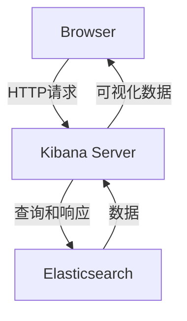

# Kibana原理与代码实例讲解

## 1. 背景介绍

### 1.1 问题的由来

在当今大数据时代，海量的数据被不断产生和积累。如何高效地存储、查询和分析这些数据,成为了一个迫切的需求。传统的关系型数据库在处理非结构化数据时存在诸多限制,因此出现了一种新型的数据存储和检索方式——Elasticsearch。

Elasticsearch是一个分布式、RESTful风格的搜索和数据分析引擎,基于Apache Lucene构建。它能够快速存储、搜索和分析大量的数据,并提供了一个简单且一致的RESTful API,使得数据的存储和检索变得更加高效和便捷。

然而,Elasticsearch本身只提供了基本的数据存储和检索功能,缺乏直观的数据可视化和分析工具。为了更好地利用Elasticsearch的强大功能,我们需要一个可视化工具来探索和分析存储在其中的数据。这就是Kibana的用武之地。

### 1.2 研究现状

Kibana是一个开源的数据可视化和探索平台,它是Elastic Stack(前身为ELK Stack)的一部分,与Elasticsearch、Logstash和Beats等其他组件紧密集成。Kibana提供了一个友好的Web界面,使用户能够轻松地探索和可视化存储在Elasticsearch中的数据。

Kibana具有以下主要功能:

- **数据可视化**:通过各种图表和图形(如柱状图、折线图、饼图等)直观地展示数据。
- **数据探索**:支持对数据进行搜索、过滤和排序等操作,帮助用户发现数据中的模式和趋势。
- **仪表板**:允许用户创建自定义的仪表板,将多个可视化组件组合在一起,提供全面的数据概览。
- **机器学习**:利用Elasticsearch的机器学习功能,Kibana可以检测异常数据并生成相关报告。

随着大数据技术的不断发展,Kibana也在持续更新和完善,以满足用户日益增长的数据分析需求。

### 1.3 研究意义

Kibana作为Elasticsearch的官方数据可视化工具,其重要性不言而喻。掌握Kibana的原理和使用方法,对于以下几个方面具有重要意义:

1. **数据洞察力**:通过Kibana,用户可以更直观地探索和理解存储在Elasticsearch中的数据,发现隐藏的模式和趋势,从而获得更深入的数据洞察力。

2. **决策支持**:可视化和分析数据有助于企业和组织做出更明智的决策。Kibana为数据驱动的决策提供了有力支持。

3. **运维监控**:Kibana可以用于监控Elasticsearch集群的健康状况和性能,帮助运维人员及时发现和解决潜在问题。

4. **开发效率**:对于开发人员而言,掌握Kibana的使用可以提高与Elasticsearch的集成和交互效率,加快应用程序的开发和调试过程。

5. **技能提升**:学习Kibana的原理和实践,有助于提升个人在大数据分析和可视化领域的技能和竞争力。

综上所述,深入研究Kibana的原理和实践,对于提高数据分析能力、支持决策、优化运维,以及个人技能发展都具有重要意义。

### 1.4 本文结构

本文将全面介绍Kibana的原理和实践,内容包括以下几个方面:

1. **核心概念与联系**:阐述Kibana与Elasticsearch、Logstash等其他组件的关系,以及Kibana的核心概念和架构。

2. **核心算法原理与具体操作步骤**:深入探讨Kibana背后的算法原理,并详细讲解其具体的操作步骤和流程。

3. **数学模型和公式详细讲解与举例说明**:对Kibana中涉及的数学模型和公式进行推导和解释,并通过实例进行说明。

4. **项目实践:代码实例和详细解释说明**:提供Kibana的实际代码实例,并对关键代码进行详细解读和分析。

5. **实际应用场景**:介绍Kibana在不同领域的实际应用场景,如日志分析、网络监控、业务智能等。

6. **工具和资源推荐**:推荐一些有用的学习资源、开发工具和相关论文,以供读者进一步学习和研究。

7. **总结:未来发展趋势与挑战**:总结Kibana的研究成果,并展望其未来的发展趋势和面临的挑战。

8. **附录:常见问题与解答**:列出一些常见的问题并给出解答,帮助读者更好地理解和使用Kibana。

通过全面的理论和实践介绍,读者将能够深入了解Kibana的原理,掌握其使用技巧,并将这些知识应用到实际的数据分析和可视化场景中。

## 2. 核心概念与联系

在深入探讨Kibana的原理之前,我们需要先了解一些核心概念以及Kibana与Elastic Stack其他组件之间的关系。

### 2.1 Elastic Stack

Elastic Stack(前身为ELK Stack)是一个由Elastic公司开发的开源数据分析和可视化平台,主要由以下四个核心组件组成:

1. **Elasticsearch**:一个分布式、RESTful风格的搜索和数据分析引擎,用于存储、搜索和分析大量数据。

2. **Logstash**:一个数据收集管道,用于从各种来源收集数据,对数据进行转换和规范化,最终将数据存储到Elasticsearch中。

3. **Kibana**:一个开源的数据可视化和探索平台,提供友好的Web界面,用于可视化和分析存储在Elasticsearch中的数据。

4. **Beats**:一组轻量级的数据发送器,用于从不同的源(如服务器、容器或虚拟机)收集数据,并将数据发送到Logstash或Elasticsearch。

这四个组件紧密协作,形成了一个完整的数据处理和分析解决方案。数据首先被Beats或Logstash收集,经过处理后存储到Elasticsearch中。然后,用户可以通过Kibana与Elasticsearch进行交互,对数据进行可视化、探索和分析。

### 2.2 Kibana架构

Kibana采用了客户端-服务器架构,其核心组件包括:

1. **Kibana Server**:一个Node.js应用程序,负责处理HTTP请求,并与Elasticsearch进行通信。

2. **Browser**:Kibana的Web界面,用户通过浏览器与Kibana Server进行交互。

3. **Elasticsearch**:Kibana的数据源,存储着需要进行可视化和分析的数据。

下面是Kibana的基本架构图:



用户通过浏览器与Kibana Server进行交互,发送HTTP请求。Kibana Server接收请求后,将相应的查询发送给Elasticsearch。Elasticsearch执行查询并返回结果数据。Kibana Server对数据进行处理和可视化,然后将可视化结果响应给浏览器,供用户查看和操作。

### 2.3 Kibana核心概念

在使用Kibana进行数据可视化和探索时,需要了解以下几个核心概念:

1. **Index Pattern**:定义了Kibana如何从Elasticsearch中读取数据。它指定了要查询的索引名称模式、时间过滤字段和字段映射。

2. **Discover**:Kibana的数据探索功能,允许用户搜索、过滤和排序Elasticsearch中的数据。

3. **Visualize**:Kibana的数据可视化功能,支持多种图表类型,如柱状图、折线图、饼图等。

4. **Dashboard**:一个可视化面板,用于组合多个可视化组件,提供全面的数据概览。

5. **Timelion**:一个功能强大的时间序列数据可视化和探索工具,允许用户使用简单的表达式来操作时间序列数据。

6. **Canvas**:一个用于创建动态数据驱动的演示文稿和报告的工具,支持丰富的可视化效果和布局。

7. **Dev Tools**:一个内置的开发工具,允许用户直接与Elasticsearch进行交互,执行各种操作和查询。

掌握了这些核心概念,我们就可以更好地理解和使用Kibana的各项功能。

## 3. 核心算法原理与具体操作步骤

在上一节中,我们介绍了Kibana的核心概念和架构。接下来,我们将深入探讨Kibana背后的核心算法原理,以及具体的操作步骤和流程。

### 3.1 算法原理概述

Kibana的核心算法主要包括以下几个方面:

1. **数据查询和聚合**:Kibana通过Elasticsearch的查询DSL(Domain Specific Language)来查询和聚合数据。查询DSL提供了一种灵活和强大的方式来构建复杂的查询,支持全文搜索、过滤、排序和聚合等操作。

2. **数据可视化**:Kibana使用了多种数据可视化算法,如柱状图、折线图、饼图、地理信息可视化等,将查询结果转换为直观的图形表示。

3. **机器学习**:Kibana利用Elasticsearch的机器学习功能,可以对数据进行异常检测、预测建模等操作。这些算法包括聚类、回归、分类等机器学习算法。

4. **数据探索**:Kibana提供了一种交互式的数据探索方式,允许用户通过搜索、过滤和排序等操作来发现数据中的模式和趋势。

5. **数据管道**:Kibana支持构建数据管道,将来自不同源的数据进行转换、丰富和规范化,最终存储到Elasticsearch中,为后续的可视化和分析做准备。

下面,我们将重点介绍数据查询和聚合以及数据可视化这两个核心算法原理。

### 3.2 算法步骤详解

#### 3.2.1 数据查询和聚合

Kibana通过Elasticsearch的查询DSL来查询和聚合数据。查询DSL是一种JSON风格的查询语言,它提供了丰富的查询和聚合功能。下面是一个简单的查询示例:

```json
{
  "query": {
    "match": {
      "title": "elasticsearch"
    }
  },
  "aggs": {
    "by_category": {
      "terms": {
        "field": "category"
      }
    }
  }
}
```

这个查询将搜索标题中包含"elasticsearch"的文档,并按照"category"字段对结果进行聚合。

查询和聚合的步骤如下:

1. **构建查询对象**:根据用户的搜索条件和过滤器,构建一个查询对象,包括查询语句和聚合语句。

2. **发送查询请求**:将查询对象通过HTTP请求发送给Elasticsearch。

3. **Elasticsearch执行查询**:Elasticsearch接收查询请求,并在索引中执行查询和聚合操作。

4. **返回查询结果**:Elasticsearch将查询结果以JSON格式返回给Kibana。

5. **处理查询结果**:Kibana接收查询结果,并根据需要进行进一步的处理和转换。

6. **数据可视化**:将处理后的数据传递给相应的可视化组件,生成图表或其他可视化效果。

通过这一系列步骤,Kibana可以高效地从Elasticsearch中查询和聚合数据,为后续的数据可视化和探索奠定基础。

#### 3.2.2 数据可视化

Kibana支持多种数据可视化算法,如柱状图、折线图、饼图、地理信息可视化等。这些算法将查询结果转换为直观的图形表示,帮助用户更好地理解和分析数据。

以柱状图为例,其算法步骤如下:

1. **数据转换**:将查询结果中的数据转换为适合柱状图展示的格式,通常是一个包含类别和值的二维数组。

2. **确定坐标系**:根据数据的范围和分布,确定柱状图的坐标系,包括x轴和y轴的范围和刻度。

3. **绘制柱形**:遍历数据,对于每个数据点,在相应的x坐标位置绘制一个高度对应于y值的矩形柱形。

4. **添加标签和图例**:在坐标轴上添加标签,并根据需要添加图例,以帮助用户理解图表的含义。

5. **交