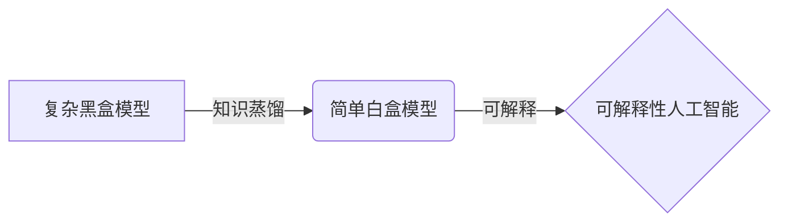

# KnowledgeDistillationforAIExplainability

作者：禅与计算机程序设计艺术 / Zen and the Art of Computer Programming

关键词：知识蒸馏、人工智能、可解释性、模型压缩、教师-学生网络

## 1. 背景介绍
### 1.1 问题的由来
随着人工智能技术的飞速发展,深度学习模型在各个领域取得了令人瞩目的成就。然而,这些高性能模型通常规模庞大、计算复杂,难以在资源受限的场景下部署应用。同时,复杂的黑盒模型也缺乏可解释性,难以让人们理解其决策依据。如何在保证性能的同时,压缩模型体积、提高推理速度并增强模型可解释性,成为了亟待解决的难题。

### 1.2 研究现状 
知识蒸馏(Knowledge Distillation)作为一种将大型复杂模型的知识迁移到小型简单模型的技术,为解决上述问题提供了新的思路。Hinton等人在2015年提出了知识蒸馏的概念,通过让小模型(学生)模仿大模型(教师)的软目标输出,使其学到教师模型的泛化能力。此后,知识蒸馏在模型压缩、迁移学习、领域自适应等方面得到了广泛应用。但如何利用知识蒸馏来提高模型可解释性的研究还相对较少。

### 1.3 研究意义
将知识蒸馏应用于可解释性人工智能具有重要意义:

1. 模型压缩:知识蒸馏可以将大型黑盒模型的知识提炼到规模更小的白盒模型中,在保持较高性能的同时,显著降低模型复杂度,便于实际部署应用。

2. 可解释性:通过蒸馏得到的简单模型结构清晰、决策过程透明,更容易被人类理解和信任,有助于实现可解释性人工智能。

3. 鲁棒性:知识蒸馏使学生模型学到教师模型的泛化能力,提高了应对噪声、对抗攻击等干扰的鲁棒性。

4. 灵活性:将不同的教师模型知识融合到一个学生模型中,可实现知识的灵活组合与迁移。

### 1.4 本文结构
本文将重点探讨将知识蒸馏应用于可解释性人工智能的研究。第2部分介绍知识蒸馏与可解释性的核心概念;第3部分详细阐述知识蒸馏的算法原理与操作步骤;第4部分建立知识蒸馏的数学模型,并以案例讲解说明;第5部分通过代码实例演示知识蒸馏的技术实现;第6部分分析其在可解释性人工智能中的应用场景;第7部分推荐相关工具与资源;第8部分总结全文,展望未来发展方向与挑战;第9部分附录常见问题解答。

## 2. 核心概念与联系
### 2.1 知识蒸馏
知识蒸馏是一种将复杂模型的知识迁移到简单模型的技术。它通过训练小模型(学生)来模仿大模型(教师)的行为,使学生模型获得与教师模型相近的性能。知识蒸馏的核心是软目标(Soft Target)的思想,即利用教师模型输出的类别概率分布(软目标)来指导学生模型的学习,而不是简单地模仿硬目标(Hard Target)。软目标蕴含了更丰富的类别相关信息,有助于学生模型学习教师模型的泛化能力。

### 2.2 可解释性
可解释性是指让人工智能系统的决策过程对人类来说是透明、可理解的。传统的深度学习模型虽然性能卓越,但却是一个黑盒子,人们无法理解其内部工作机制,这限制了它们在一些对可解释性要求较高的领域(如医疗、金融、自动驾驶等)的应用。如何在保证性能的同时,提高模型的可解释性,让人工智能系统的决策可被人类理解和信任,是实现可解释性人工智能的关键。

### 2.3 二者的关系
知识蒸馏与可解释性人工智能有着天然的联系。传统的深度学习模型之所以难以解释,很大程度上是由于模型结构复杂、参数众多。而知识蒸馏可以将复杂模型的知识提炼到结构简单的模型中,在保持较高性能的同时,大幅降低模型复杂度。简单的模型结构更易于分析和理解,有助于实现模型可解释性。同时,知识蒸馏还可以将不同模型的知识融合到一个模型中,有利于知识的迁移和泛化。因此,将知识蒸馏应用于可解释性人工智能,有望实现模型性能与可解释性的兼得。

## 3. 核心算法原理 & 具体操作步骤
### 3.1 算法原理概述
知识蒸馏的核心思想是让学生模型去模仿教师模型的软目标输出。具体来说,首先用硬目标(即真实标签)训练得到教师模型,然后利用教师模型对训练样本进行推理,得到软目标(即教师模型输出的类别概率分布)。接着,用软目标作为学生模型的训练目标,使其学习教师模型的知识。由于软目标包含了类别之间的相关性信息,因此学生模型不仅学到了如何进行正确分类,还学习到了不同类别之间的相似性和区别性。这种泛化能力使学生模型能在新样本上做出更好的判断。

### 3.2 算法步骤详解
知识蒸馏的具体步骤如下:

1. 训练教师模型:使用硬目标(真实标签)训练得到一个性能优异的大型复杂模型,作为教师模型。

2. 生成软目标:利用训练好的教师模型对训练集进行推理,得到每个样本的软目标,即教师模型输出的类别概率分布。

3. 蒸馏到学生模型:构建一个小型简单的学生模型,并使用软目标作为训练目标对其进行训练。学生模型的训练损失函数由两部分组成:
$$
L = \alpha L_{CE}(y_{true}, y_{pred}) + (1-\alpha) L_{KL}(y_{teacher}, y_{pred})
$$
其中,$L_{CE}$是学生模型输出$y_{pred}$与真实标签$y_{true}$的交叉熵损失,$L_{KL}$是学生模型输出$y_{pred}$与教师模型软目标输出$y_{teacher}$的KL散度损失,$\alpha$为两种损失的权重系数。

4. 对学生模型进行微调:使用硬目标对训练好的学生模型进行微调,以进一步提高其性能。

### 3.3 算法优缺点
知识蒸馏的优点包括:
- 模型压缩:可将大型复杂模型的知识提炼到小型简单模型中,显著降低模型体积和推理时间。
- 性能提升:学生模型不仅可以达到与教师模型相近的性能,有时甚至可以超越教师模型。
- 泛化能力:学生模型学到了教师模型的泛化能力,在新样本上往往有更好的表现。
- 灵活性:可以将不同模型的知识融合到一个学生模型中,实现知识的迁移和复用。

知识蒸馏的缺点包括:  
- 需要预训练教师模型:知识蒸馏需要先训练出一个性能优异的教师模型,增加了训练成本。
- 软目标的生成:生成软目标需要在整个训练集上运行教师模型进行推理,比较耗时。
- 蒸馏效果不稳定:知识蒸馏的效果受学生模型结构、蒸馏温度等超参数影响较大,需要进行反复调试。

### 3.4 算法应用领域
知识蒸馏在以下领域有广泛应用:
- 模型压缩:将大型模型(如BERT、GPT等)压缩为小型模型,以便在移动设备、嵌入式设备等资源受限环境下部署。
- 准教师模型:使用知识蒸馏训练出一个性能接近但推理速度更快的准教师模型,用于辅助教师模型训练。
- 模型集成:将多个模型集成为一个学生模型,汲取不同模型的知识,提高性能。
- 跨模态蒸馏:将不同模态(如视觉、语音)的知识蒸馏到同一个模型中,实现跨模态的知识融合。
- 领域自适应:将源领域模型的知识蒸馏到目标领域模型中,减少领域差异的影响。

## 4. 数学模型和公式 & 详细讲解 & 举例说明
### 4.1 数学模型构建
设教师模型为$T$,学生模型为$S$,训练样本为$(x_i,y_i)$,其中$x_i$为输入,$y_i$为真实标签。教师模型$T$对样本$x_i$的软目标输出为$P_T(y_i|x_i)$,学生模型$S$对样本$x_i$的输出为$P_S(y_i|x_i)$。知识蒸馏的目标是最小化学生模型的预测输出与教师模型软目标输出的差异,同时也要使学生模型的预测输出与真实标签尽可能接近。因此,学生模型的损失函数可以定义为:
$$
\mathcal{L}_{KD} = \alpha \mathcal{L}_{CE}(y_i, P_S(y_i|x_i)) + (1-\alpha) \mathcal{L}_{KL}(P_T(y_i|x_i), P_S(y_i|x_i))
$$
其中,$\mathcal{L}_{CE}$为交叉熵损失:
$$
\mathcal{L}_{CE}(y_i, P_S(y_i|x_i)) = -\sum_{j=1}^C y_{ij} \log P_S(y_{ij}|x_i)
$$
$\mathcal{L}_{KL}$为KL散度损失:
$$
\mathcal{L}_{KL}(P_T(y_i|x_i), P_S(y_i|x_i)) = \sum_{j=1}^C P_T(y_{ij}|x_i) \log \frac{P_T(y_{ij}|x_i)}{P_S(y_{ij}|x_i)}
$$
$C$为类别数,$y_{ij}$为样本$x_i$真实标签的one-hot向量表示。$\alpha$为交叉熵损失和KL散度损失的权重系数,控制二者的相对重要性。

### 4.2 公式推导过程
交叉熵损失$\mathcal{L}_{CE}$衡量了学生模型预测输出与真实标签的差异。对于样本$x_i$,其交叉熵损失为:
$$
\begin{aligned}
\mathcal{L}_{CE}(y_i, P_S(y_i|x_i)) &= -\sum_{j=1}^C y_{ij} \log P_S(y_{ij}|x_i) \\
&= -y_{i1} \log P_S(y_{i1}|x_i) - y_{i2} \log P_S(y_{i2}|x_i) - \cdots - y_{iC} \log P_S(y_{iC}|x_i)
\end{aligned}
$$
其中,$y_{ij}$为样本$x_i$真实标签的one-hot向量表示,即如果样本$x_i$的真实标签为第$j$类,则$y_{ij}=1$,否则$y_{ij}=0$。$P_S(y_{ij}|x_i)$为学生模型预测样本$x_i$属于第$j$类的概率。

KL散度损失$\mathcal{L}_{KL}$衡量了学生模型预测输出与教师模型软目标输出的差异。对于样本$x_i$,其KL散度损失为:
$$
\begin{aligned}
\mathcal{L}_{KL}(P_T(y_i|x_i), P_S(y_i|x_i)) &= \sum_{j=1}^C P_T(y_{ij}|x_i) \log \frac{P_T(y_{ij}|x_i)}{P_S(y_{