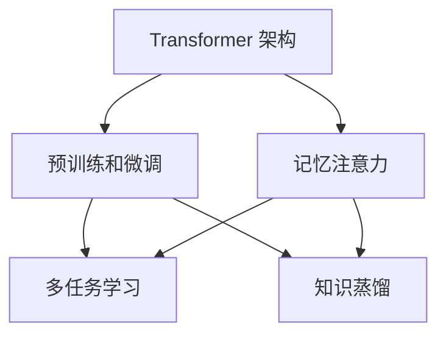

# LLaMA原理与代码实例讲解

## 1. 背景介绍
### 1.1 问题的由来
随着人工智能的快速发展,大语言模型(Large Language Model, LLM)在自然语言处理领域取得了巨大的成功。LLaMA(Large Language Model Meta AI)作为Meta AI最新推出的大语言模型,以其强大的性能和开源特性引起了业界的广泛关注。然而,对于许多研究者和开发者来说,理解LLaMA的原理和实现细节仍然是一个挑战。

### 1.2 研究现状 
目前,关于LLaMA的研究主要集中在模型性能评估、应用场景探索以及训练优化等方面。一些研究者对LLaMA在不同任务上的表现进行了测试和分析,证明了其在自然语言理解、问答、摘要等任务上的优异性能。同时,也有研究探索了LLaMA在对话、知识图谱等领域的应用潜力。在模型训练方面,研究者提出了一些优化方法来提高LLaMA的训练效率和性能表现。

### 1.3 研究意义
深入研究LLaMA的原理和实现细节,对于理解大语言模型的工作机制、改进模型性能以及拓展应用场景都具有重要意义。通过剖析LLaMA的核心算法、数学模型和代码实现,可以帮助研究者和开发者更好地掌握大语言模型的关键技术,为后续的研究和应用奠定基础。同时,对LLaMA的研究也有助于推动自然语言处理领域的发展,为人机交互、知识挖掘等应用带来新的突破。

### 1.4 本文结构
本文将从以下几个方面对LLaMA进行深入讲解:
- 第2部分介绍LLaMA的核心概念与内在联系
- 第3部分详细阐述LLaMA的核心算法原理和具体操作步骤
- 第4部分建立LLaMA的数学模型,并通过公式推导和案例分析加以说明
- 第5部分给出LLaMA的代码实例,并对关键代码进行解读
- 第6部分探讨LLaMA在实际场景中的应用
- 第7部分推荐LLaMA相关的学习资源和开发工具
- 第8部分总结LLaMA的研究成果,展望未来发展趋势和挑战
- 第9部分列出LLaMA的常见问题解答

## 2. 核心概念与联系
LLaMA的核心概念包括:

- Transformer 架构:LLaMA采用了基于自注意力机制的 Transformer 架构,通过自注意力和前馈神经网络实现了强大的上下文建模能力。

- 预训练和微调:LLaMA 在大规模无标注语料上进行了预训练,学习了丰富的语言知识。在特定任务上,通过微调(fine-tuning)的方式快速适应新的任务。

- 记忆注意力(Memory Attention):LLaMA 在 Transformer 的基础上引入了记忆注意力机制,通过外部存储增强了模型的记忆能力,使其能够处理更长的上下文信息。

- 多任务学习:LLaMA 支持多任务学习,可以同时训练多个不同类型的任务,提高了模型的泛化能力和鲁棒性。

- 知识蒸馏:LLaMA 采用了知识蒸馏技术,从更大的教师模型中学习知识,在保持模型性能的同时降低了计算开销。

这些核心概念之间紧密相关,共同构建了 LLaMA 的整体框架。Transformer 架构奠定了 LLaMA 的基础,记忆注意力增强了其长文本处理能力,预训练和微调使其能够快速适应新任务,多任务学习提高了模型的通用性,知识蒸馏则优化了模型的效率。

下图展示了 LLaMA 的核心概念之间的联系:

## 3. 核心算法原理 & 具体操作步骤
### 3.1 算法原理概述
LLaMA 的核心算法基于 Transformer 架构和自注意力机制。Transformer 通过自注意力层和前馈神经网络层的堆叠,实现了对输入序列的并行化处理和上下文建模。LLaMA 在此基础上引入了记忆注意力机制,通过外部存储增强了模型处理长文本的能力。

### 3.2 算法步骤详解
LLaMA 的具体算法步骤如下:

1. 输入编码:将输入文本转换为向量表示,通过词嵌入(word embedding)和位置编码(positional encoding)捕获词语的语义信息和位置信息。

2. 自注意力计算:对输入向量进行自注意力计算,通过查询(query)、键(key)、值(value)的计算,得到每个位置与其他位置之间的注意力权重,实现上下文信息的捕获。

3. 记忆注意力计算:引入外部存储,将输入向量与存储中的向量进行注意力计算,增强模型对长文本的记忆能力。

4. 前馈神经网络:通过前馈神经网络对自注意力的输出进行非线性变换,提取高层特征。

5. 残差连接和层归一化:在每个子层之间添加残差连接和层归一化,缓解梯度消失问题,加速训练收敛。

6. 多头注意力:使用多头注意力机制,将自注意力计算拆分为多个独立的注意力头,捕获不同的语义信息。

7. 解码器:使用类似编码器的结构,通过自注意力和编码器-解码器注意力实现序列生成。

8. 微调:在下游任务上对预训练的 LLaMA 进行微调,快速适应特定任务。

### 3.3 算法优缺点
LLaMA 算法的优点包括:
- 并行化处理:Transformer 架构实现了输入序列的并行化处理,大大提高了训练和推理效率。
- 上下文建模:通过自注意力机制,LLaMA 可以捕获长距离的上下文信息,增强了语义理解能力。
- 记忆能力:引入外部存储和记忆注意力,使 LLaMA 能够处理更长的文本序列。
- 多任务学习:支持多任务学习,提高了模型的通用性和泛化能力。

LLaMA 算法的缺点包括:  
- 计算开销大:自注意力机制的计算复杂度随着序列长度的平方增长,对计算资源要求较高。
- 数据依赖:LLaMA 需要大规模的无标注语料进行预训练,对数据质量和数量有较高要求。
- 解释性差:Transformer 架构的内部工作机制较为复杂,模型的决策过程缺乏可解释性。

### 3.4 算法应用领域
LLaMA 算法可以应用于各种自然语言处理任务,包括:
- 语言理解:文本分类、情感分析、命名实体识别等
- 语言生成:文本摘要、对话生成、机器翻译等  
- 问答系统:基于知识的问答、阅读理解等
- 信息检索:文本匹配、相关性排序等

## 4. 数学模型和公式 & 详细讲解 & 举例说明
### 4.1 数学模型构建
LLaMA 的数学模型建立在 Transformer 架构之上。Transformer 的核心是自注意力机制和位置前馈网络。

给定一个输入序列 $X=(x_1,x_2,…,x_n)$,其中 $x_i \in \mathbb{R}^d$ 表示第 $i$ 个位置的 $d$ 维输入向量。Transformer 的自注意力机制通过以下步骤计算:

1. 计算查询(query)、键(key)、值(value):

$$
Q=XW^Q, K=XW^K, V=XW^V
$$

其中 $W^Q, W^K, W^V \in \mathbb{R}^{d \times d_k}$ 是可学习的权重矩阵,$d_k$ 是注意力头的维度。

2. 计算注意力权重:

$$
A=\text{softmax}(\frac{QK^T}{\sqrt{d_k}})
$$

其中 $A \in \mathbb{R}^{n \times n}$ 表示注意力权重矩阵。

3. 计算注意力输出:

$$
\text{Attention}(Q,K,V)=AV
$$

4. 多头注意力:

$$
\text{MultiHead}(X)=\text{Concat}(\text{head}_1,…,\text{head}_h)W^O
$$

其中 $\text{head}_i=\text{Attention}(XW_i^Q,XW_i^K,XW_i^V)$,$W^O \in \mathbb{R}^{hd_k \times d}$ 是输出的线性变换矩阵。

5. 位置前馈网络:

$$
\text{FFN}(X)=\text{max}(0,XW_1+b_1)W_2+b_2
$$

其中 $W_1 \in \mathbb{R}^{d \times d_{ff}}, b_1 \in \mathbb{R}^{d_{ff}}, W_2 \in \mathbb{R}^{d_{ff} \times d}, b_2 \in \mathbb{R}^d$ 是前馈网络的参数。

### 4.2 公式推导过程
以下是 Transformer 中自注意力机制的公式推导过程:

1. 查询、键、值的计算:

$$
\begin{aligned}
Q &= XW^Q \\
K &= XW^K \\
V &= XW^V
\end{aligned}
$$

2. 注意力权重的计算:

$$
\begin{aligned}
A &= \text{softmax}(\frac{QK^T}{\sqrt{d_k}}) \\
&= \text{softmax}(\frac{(XW^Q)(XW^K)^T}{\sqrt{d_k}}) \\
&= \text{softmax}(\frac{XW^Q(W^K)^TX^T}{\sqrt{d_k}})
\end{aligned}
$$

3. 注意力输出的计算:

$$
\begin{aligned}
\text{Attention}(Q,K,V) &= AV \\
&= \text{softmax}(\frac{QK^T}{\sqrt{d_k}})V \\
&= \text{softmax}(\frac{XW^Q(W^K)^TX^T}{\sqrt{d_k}})(XW^V)
\end{aligned}
$$

4. 多头注意力的计算:

$$
\begin{aligned}
\text{MultiHead}(X) &= \text{Concat}(\text{head}_1,…,\text{head}_h)W^O \\
&= \text{Concat}(\text{Attention}(XW_1^Q,XW_1^K,XW_1^V),…,\text{Attention}(XW_h^Q,XW_h^K,XW_h^V))W^O
\end{aligned}
$$

### 4.3 案例分析与讲解
下面以一个简单的例子来说明 Transformer 的自注意力机制:

假设有一个输入序列 $X=\begin{bmatrix} 1 & 2 \\ 3 & 4 \end{bmatrix}$,维度 $d=2$,注意力头数 $h=2$,注意力头维度 $d_k=1$。

1. 计算查询、键、值:

$$
\begin{aligned}
W^Q &= \begin{bmatrix} 1 \\ 2 \end{bmatrix}, W^K = \begin{bmatrix} 3 \\ 4 \end{bmatrix}, W^V = \begin{bmatrix} 5 \\ 6 \end{bmatrix} \\
Q &= XW^Q = \begin{bmatrix} 5 \\ 11 \end{bmatrix}, K = XW^K = \begin{bmatrix} 11 \\ 25 \end{bmatrix}, V = XW^V = \begin{bmatrix} 17 \\ 39 \end{bmatrix}
\end{aligned}
$$

2. 计算注意力权重:

$$
A = \text{softmax}(\frac{QK^T}{\sqrt{d_k}}) = \text{softmax}(\begin{bmatrix} 55 & 125 \\ 121 & 275 \end{bmatrix}) = \begin{bmatrix} 0.45 & 0.55 \\ 0.45 & 0.55 \end{bmatrix}
$$

3. 计算注意力输出:

$$
\text{Attention}(Q,K,V) = AV = \begin{bmatrix} 0.45 & 0.55 \\ 0.45 & 0.55 \end{bmatrix} \begin{b