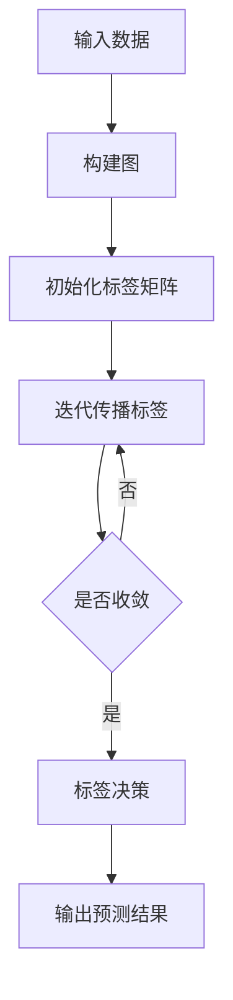

# Label Propagation标签传播算法原理与代码实例讲解

关键词：半监督学习, 标签传播, 图算法, 聚类, 社区发现 

## 1. 背景介绍
### 1.1 问题的由来
在机器学习领域,我们经常会遇到标注数据缺乏的问题。有监督学习需要大量的标注数据,而人工标注数据非常耗时耗力。如何利用少量的标注数据和大量的未标注数据来进行学习,是一个亟待解决的问题。而半监督学习正是解决这一问题的有效方法之一。
### 1.2 研究现状
半监督学习近年来受到了广泛关注。其中,基于图的半监督学习方法由于其高效性和可解释性而备受青睐。标签传播算法(Label Propagation)就是一种经典的基于图的半监督学习算法。
### 1.3 研究意义 
标签传播算法可以充分利用已标注和未标注数据,通过标签在数据点之间的传播来预测未标注数据的标签。这对于解决标注数据缺乏问题具有重要意义。同时,标签传播算法还可以用于聚类、社区发现等任务。深入理解该算法,对于推动半监督学习和图学习的发展具有重要价值。
### 1.4 本文结构
本文将全面介绍标签传播算法。第2部分介绍相关概念。第3部分详细讲解算法原理和步骤。第4部分给出数学模型和推导过程。第5部分通过代码实例演示算法的实现。第6部分讨论算法的应用场景。第7部分推荐相关工具和资源。第8部分总结全文并展望未来。第9部分附录了常见问题解答。

## 2. 核心概念与联系
在介绍标签传播算法之前,我们先来了解几个核心概念:

- 半监督学习:利用少量的标注数据和大量的未标注数据进行学习的机器学习范式。
- 图学习:利用图结构来表示数据间的关系,并在图上进行机器学习的一类方法。
- 标签传播:通过节点间的相似性将已知标签传播到未标注节点,从而实现标签预测的过程。

标签传播算法是半监督学习和图学习的经典结合。它利用数据的图结构,通过标签在图中的传播来预测未知标签。

## 3. 核心算法原理 & 具体操作步骤
### 3.1 算法原理概述
标签传播算法的基本思想是:相似的数据点应该具有相同的标签。我们构建一个图,其中节点表示数据点,边表示数据点间的相似性。已标注节点的标签信息会通过边传播到相邻的未标注节点,经过迭代,直到所有节点的标签趋于稳定。
### 3.2 算法步骤详解
标签传播算法的具体步骤如下:
1. 构建图。根据数据点间的相似性构建一个无向带权图。常见的相似性度量包括欧氏距离、cos距离等。
2. 初始化标签矩阵。将已知标签初始化到标签矩阵Y中,未知标签初始化为0。
3. 迭代传播标签。根据转移概率矩阵P和标签矩阵Y,迭代更新标签矩阵,直到收敛。
4. 标签决策。根据收敛后的标签矩阵,为每个数据点选择概率最大的标签作为预测标签。

算法流程可以用下面的 Mermaid 图表示:



### 3.3 算法优缺点
标签传播算法的优点包括:
- 原理简单直观,易于实现。
- 充分利用了未标注数据的信息。  
- 可解释性强,便于分析和调试。

其缺点包括:
- 计算复杂度较高,不适合大规模数据。
- 对参数敏感,需要调参。
- 假设数据是同质的,对异质数据效果不佳。

### 3.4 算法应用领域
标签传播算法在以下领域有广泛应用:
- 半监督分类:利用少量标注数据和大量未标注数据训练分类器。
- 聚类:通过标签传播将数据点聚合成簇。 
- 社区发现:在社交网络、引文网络等图数据中发现紧密联系的社区。
- 图像分割:将图像划分为不同语义区域。

## 4. 数学模型和公式 & 详细讲解 & 举例说明
### 4.1 数学模型构建
我们定义数据集 $X=\{x_1,\cdots,x_l,x_{l+1},\cdots,x_n\}$,其中前$l$个数据有标签$\{y_1,\cdots,y_l\}$。
定义转移概率矩阵$P$,其中$P_{ij}$表示标签从节点$i$转移到$j$的概率。通常基于节点间的相似度$W_{ij}$计算:

$$
P_{ij} = \frac{W_{ij}}{\sum_{k=1}^nW_{ik}}
$$

定义标签矩阵$Y^{(t)}\in \mathbb{R}^{n \times c}$,其中$Y^{(t)}_{ij}$表示在第$t$次迭代中节点$i$具有标签$j$的概率。$c$为标签类别数。

### 4.2 公式推导过程
标签传播的迭代公式为:

$$
Y^{(t+1)} = \alpha PY^{(t)} + (1-\alpha)Y^{(0)}
$$

其中$\alpha \in (0,1)$为超参数,控制标签传播的速度。$Y^{(0)}$为初始标签矩阵。

迭代求解上述方程,直到$Y$收敛或达到最大迭代次数。收敛后,对于节点$i$,其标签为:

$$
\hat{y}_i = \arg\max_j Y_{ij}
$$

### 4.3 案例分析与讲解
下面以一个简单例子说明标签传播算法。假设有5个数据点,其中2个有标签(1和2),3个无标签(0)。相似度矩阵为:

$$
W = 
\begin{bmatrix}
0 & 0.4 & 0.5 & 0 & 0 \\
0.4 & 0 & 0.5 & 0 & 0 \\
0.5 & 0.5 & 0 & 0.3 & 0.3 \\
0 & 0 & 0.3 & 0 & 0.6 \\
0 & 0 & 0.3 & 0.6 & 0
\end{bmatrix}
$$

初始标签为:
$$
Y^{(0)} = 
\begin{bmatrix}
1 & 0 \\
0 & 1 \\
0 & 0 \\
0 & 0 \\
0 & 0
\end{bmatrix}
$$

取$\alpha=0.5$,迭代求解可得:
$$
Y^{(\infty)} \approx
\begin{bmatrix}
0.73 & 0.27 \\
0.27 & 0.73 \\
0.43 & 0.57 \\
0.20 & 0.80 \\
0.20 & 0.80
\end{bmatrix}
$$

预测结果为:$\hat{y}_3=2,\hat{y}_4=2,\hat{y}_5=2$。可以看出,标签通过边传播,使得相似的节点获得相同的标签。

### 4.4 常见问题解答
- 问:标签传播和标签传递(Label Propagation)的区别是什么?
- 答:两者本质相同,只是迭代公式略有不同。标签传递的公式为$Y^{(t+1)} = PY^{(t)}$,即完全根据转移矩阵更新,而标签传播加入了原始标签信息。

- 问:标签传播能否处理多分类问题?
- 答:可以,标签矩阵扩展为$n \times c$维即可,其中$c$为类别数。预测时选择概率最大的类别作为标签。

- 问:相似度矩阵是否必须归一化?
- 答:理论上不要求,但归一化后收敛更快,效果也会更好。归一化相当于将权重转化为转移概率。

## 5. 项目实践：代码实例和详细解释说明
### 5.1 开发环境搭建
本项目使用Python语言和以下库:
- numpy: 数值计算库
- matplotlib: 绘图库
- scikit-learn: 机器学习库,用于生成示例数据

安装命令:
```bash
pip install numpy matplotlib scikit-learn
```

### 5.2 源代码详细实现
标签传播算法的Python实现如下:

```python
import numpy as np

class LabelPropagation:
    def __init__(self, alpha=0.5, max_iter=100, tol=1e-3):
        self.alpha = alpha
        self.max_iter = max_iter
        self.tol = tol
    
    def fit(self, X, y):
        # 构建相似度矩阵
        W = self._build_graph(X)
        # 初始化标签矩阵
        Y = np.zeros((X.shape[0], y.max()+1))
        Y[np.arange(X.shape[0]), y] = 1
        self.Y_ = Y.copy()
        # 迭代传播标签
        for _ in range(self.max_iter):
            Y_prev = Y.copy()
            Y = self.alpha * W @ Y + (1 - self.alpha) * self.Y_
            if np.abs(Y - Y_prev).mean() < self.tol:
                break
        
        self.labels_ = Y.argmax(axis=1)
        return self

    def _build_graph(self, X):
        # 计算欧氏距离
        dist = np.linalg.norm(X[:, np.newaxis] - X, axis=2)
        # 使用高斯核计算相似度
        sigma = dist.mean()
        W = np.exp(-dist**2 / (2 * sigma**2))
        # 归一化
        W /= W.sum(axis=1, keepdims=True)
        return W

    def predict(self, X):
        W = self._build_graph(X)
        Y = W @ self.Y_
        return Y.argmax(axis=1)
```

### 5.3 代码解读与分析
- `__init__`方法初始化模型参数,包括标签传播速率`alpha`,最大迭代次数`max_iter`和收敛阈值`tol`。
- `fit`方法训练模型,包括构建图、初始化标签矩阵、迭代传播标签三个步骤。
- `_build_graph`方法构建图,使用欧氏距离计算节点间距离,然后用高斯核将距离转化为相似度,最后对相似度矩阵进行行归一化。
- 标签矩阵`Y`初始化为one-hot编码,已知标签为1,未知标签为0。
- 迭代传播标签,根据公式$Y^{(t+1)} = \alpha PY^{(t)} + (1-\alpha)Y^{(0)}$更新标签矩阵,直到满足收敛条件。
- `predict`方法用于预测新节点的标签,将其与训练节点构建图,然后计算标签概率。

### 5.4 运行结果展示
我们用scikit-learn生成一个二分类数据集,并随机选取20%的数据作为有标签数据,其余为无标签数据。然后用标签传播算法进行预测。

```python
from sklearn.datasets import make_classification
from sklearn.model_selection import train_test_split

X, y = make_classification(n_samples=200, n_features=2, n_redundant=0, 
                           n_informative=2, random_state=1, n_clusters_per_class=2)

X_train, X_test, y_train, y_test = train_test_split(X, y, test_size=0.2, random_state=1)

# 随机选取20%的训练数据作为有标签数据
labeled_indices = np.random.choice(X_train.shape[0], size=int(0.2*X_train.shape[0]), replace=False)
y_train_labeled = np.full(X_train.shape[0], fill_value=-1, dtype=int) 
y_train_labeled[labeled_indices] = y_train[labeled_indices]

model = LabelPropagation(max_iter=1000)
model.fit(X_train, y_train_labeled)

print(f"Accuracy: {(model.labels_[y_train_labeled != -1] == y_train[y_train_labeled != -1]).mean():.2f}")
print(f"Accuracy: {(model.predict(X_test) == y_test).mean():.2f}")
```

运行结果:
```
Accuracy: 1.