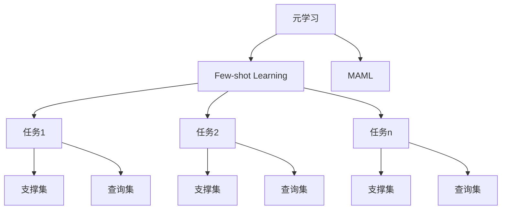

# MAML原理与代码实例讲解

## 1. 背景介绍
### 1.1 问题的由来
在机器学习领域,如何让模型能够快速适应新的任务一直是一个挑战。传统的机器学习方法通常需要大量的训练数据和计算资源,而且训练好的模型很难迁移到新的任务上。为了解决这个问题,Few-shot Learning(少样本学习)应运而生。其目标是让模型在只给定少量训练样本的情况下,也能很好地适应新任务。而MAML(Model-Agnostic Meta-Learning,模型无关的元学习)算法则是Few-shot Learning领域的代表性工作之一。

### 1.2 研究现状
目前,Few-shot Learning主要有三类方法:

1. 基于度量的方法:通过学习一个度量函数来度量样本之间的相似性,从而对新样本进行分类。代表工作有Matching Networks, Prototypical Networks等。

2. 基于优化的方法:通过学习一个优化器来快速适应新任务。MAML就是这一类的代表。 

3. 基于参数的方法:学习一个参数生成器,来根据新任务的少量样本生成分类器参数。代表工作有Meta Networks等。

其中,由于MAML方法的有效性和通用性,受到了广泛关注,并衍生出了许多后续工作。

### 1.3 研究意义
MAML的提出具有重要意义:

1. 在Few-shot Learning领域提供了一种新的思路,通过学习如何快速适应而非学习一个具体的分类器,使得模型可以更好地泛化到新任务。

2. MAML是一种通用的元学习框架,可以适用于各种基于梯度的模型,包括神经网络、决策树等。

3. MAML启发了元学习领域的众多后续工作,推动了Few-shot Learning的发展。

4. MAML在诸多领域都有应用,如计算机视觉、自然语言处理、强化学习等,具有广阔的应用前景。

### 1.4 本文结构
本文将全面介绍MAML算法的原理和实现。第2部分介绍MAML中的一些核心概念。第3部分详细讲解MAML算法的原理和步骤。第4部分给出MAML的数学模型和公式推导。第5部分提供MAML的代码实例和讲解。第6部分讨论MAML的一些应用场景。第7部分推荐一些相关的学习资源。第8部分对全文进行总结,并展望MAML的未来发展方向。

## 2. 核心概念与联系
在介绍MAML之前,我们先来了解几个核心概念:

- Few-shot Learning:只使用很少的训练样本就能让模型很好地适应新任务的一种学习范式。通常新任务的训练集只有k个样本,因此也称为k-shot learning。

- 元学习(Meta-Learning):又称为"学会学习"(Learning to learn),指设计一种学习器,使其能够从一系列不同但相关的任务中学习,从而能在新任务上快速适应的学习范式。Few-shot learning是元学习的一个子问题。

- 任务(Task):元学习中通常将不同的问题定义为不同的任务。例如对于图像分类,不同的数据集(如mini-ImageNet和CUB)被视为不同任务。

- 元训练集(Meta-training set):由一系列训练任务组成,用于元学习阶段学习如何从少量样本中学习。

- 元测试集(Meta-testing set):由一些新的测试任务组成,用于评估模型在元学习后的泛化能力。元训练集和元测试集没有交集。

- 支撑集(Support set):元训练或元测试时,每个任务所给定的训练样本构成的集合。

- 查询集(Query set):元训练或元测试时,用于评估模型在特定任务上性能的测试样本集合。

下图展示了这些概念之间的关系:

MAML是一种通过元学习来解决Few-shot Learning问题的方法。它的目标是学习一个模型初始参数,使得该模型能够通过在支撑集上进行少量梯度下降步骤,就能很好地适应新任务。

## 3. 核心算法原理 & 具体操作步骤
### 3.1 算法原理概述
MAML的核心思想是学习一个好的初始化参数,使模型能够在新任务上通过少量步梯度下降快速适应。具体而言,MAML在元训练阶段进行如下优化:

$$
\theta = \arg \min_{\theta} \sum_{\mathcal{T}_{i} \sim p(\mathcal{T})} \mathcal{L}_{\mathcal{T}_{i}}(f_{\theta_{i}^{\prime}}) \\
\text{where } \theta_{i}^{\prime} = \theta - \alpha \nabla_{\theta} \mathcal{L}_{\mathcal{T}_{i}}(f_{\theta})
$$

其中$\mathcal{T}_{i}$表示从任务分布$p(\mathcal{T})$中采样的任务,$f_{\theta}$表示参数为$\theta$的模型,$\mathcal{L}_{\mathcal{T}_{i}}$表示任务$\mathcal{T}_{i}$的损失函数。$\theta_{i}^{\prime}$表示模型参数在任务$\mathcal{T}_{i}$的支撑集上进行了一步梯度下降后得到的参数。

直观地说,MAML的目标是找到一个初始化参数$\theta$,使得对于新任务,模型从这个初始化开始,经过少量步梯度下降后,能够得到很好的性能。

### 3.2 算法步骤详解
下面我们详细介绍MAML的训练步骤:

1. 输入:学习率$\alpha$和$\beta$,元训练任务集$\mathcal{D}^{meta-train}$
2. 随机初始化模型参数$\theta$
3. while not done do:
   1. 从$\mathcal{D}^{meta-train}$中采样一个批次的任务$\{ \mathcal{T}_{i} \}$
   2. for all $\mathcal{T}_{i}$ do:
      1. 计算任务$\mathcal{T}_{i}$在参数$\theta$下的损失$\mathcal{L}_{\mathcal{T}_{i}}(f_{\theta})$
      2. 计算梯度$\nabla_{\theta} \mathcal{L}_{\mathcal{T}_{i}}(f_{\theta})$
      3. 更新参数$\theta_{i}^{\prime} = \theta - \alpha \nabla_{\theta} \mathcal{L}_{\mathcal{T}_{i}}(f_{\theta})$
   3. 更新$\theta \leftarrow \theta - \beta \nabla_{\theta} \sum_{\mathcal{T}_{i}} \mathcal{L}_{\mathcal{T}_{i}}(f_{\theta_{i}^{\prime}})$
4. return $\theta$

这里的关键是第3.iii步,模型参数$\theta$是根据每个任务经过一步梯度下降后的损失来更新的。这使得$\theta$能够成为一个好的初始化点,使模型能够在新任务上快速收敛到最优解。

在测试阶段,对于一个新任务$\mathcal{T}_{new}$,我们使用学习到的$\theta$作为初始参数,在支撑集$\mathcal{D}_{new}^{support}$上进行几步梯度下降:

$$
\theta_{new}^{\prime} = \theta - \alpha \nabla_{\theta} \mathcal{L}_{\mathcal{T}_{new}}(f_{\theta}, \mathcal{D}_{new}^{support})
$$

然后用更新后的参数$\theta_{new}^{\prime}$在查询集$\mathcal{D}_{new}^{query}$上进行评估。

### 3.3 算法优缺点
MAML的优点包括:

1. 通用性强,适用于各种基于梯度的模型。
2. 不引入额外的学习参数,模型复杂度不增加。  
3. 实现简单,易于理解。
4. 可以与其他方法结合,如基于度量的方法。

MAML的缺点包括:

1. 计算量大,需要在每个任务上进行二阶梯度计算。一些后续工作如First-order MAML, Reptile等提出了一阶近似的改进方法。
2. 对初始化敏感,不同的初始化可能导致性能差异较大。
3. 适应能力有限,对于差异较大的任务,可能难以找到一个很好的初始化。

### 3.4 算法应用领域
MAML在以下领域都有广泛应用:

- 计算机视觉:如Few-shot图像分类,Few-shot目标检测等。
- 自然语言处理:如Few-shot文本分类,Few-shot命名实体识别等。  
- 强化学习:如Few-shot策略适应,Few-shot环境适应等。
- 机器人控制:如Few-shot运动技能学习,Few-shot操纵任务适应等。

## 4. 数学模型和公式 & 详细讲解 & 举例说明
### 4.1 数学模型构建
我们定义一个K-shot N-way的Few-shot分类任务如下:

- 一个任务$\mathcal{T}_{i}$包含一个支撑集$\mathcal{D}_{i}^{support} = \{ (x_{i}^{(j)}, y_{i}^{(j)}) \}_{j=1}^{K \times N}$和一个查询集$\mathcal{D}_{i}^{query} = \{ (\tilde{x}_{i}^{(j)}, \tilde{y}_{i}^{(j)}) \}_{j=1}^{Q}$。
- 支撑集包含N个类别,每个类别有K个样本。查询集有Q个样本。
- 任务的目标是学习一个分类器$f_{\theta}$,使其在查询集上的损失最小。

MAML的目标是学习一个初始参数$\theta$,使得对于一个新任务$\mathcal{T}_{new}$,经过以下步骤得到的分类器$f_{\theta_{new}^{\prime}}$在查询集上的损失最小:

$$
\theta_{new}^{\prime} = \theta - \alpha \nabla_{\theta} \mathcal{L}_{\mathcal{T}_{new}}(f_{\theta}, \mathcal{D}_{new}^{support})
$$

其中$\mathcal{L}_{\mathcal{T}_{new}}(f_{\theta}, \mathcal{D}_{new}^{support})$是分类器$f_{\theta}$在任务$\mathcal{T}_{new}$的支撑集上的损失,例如交叉熵损失:

$$
\mathcal{L}_{\mathcal{T}_{new}}(f_{\theta}, \mathcal{D}_{new}^{support}) = - \sum_{(x,y) \in \mathcal{D}_{new}^{support}} \log f_{\theta}(y|x)
$$

### 4.2 公式推导过程
MAML的目标函数可以写为:

$$
\min_{\theta} \mathbb{E}_{\mathcal{T}_{i} \sim p(\mathcal{T})} [ \mathcal{L}_{\mathcal{T}_{i}}(f_{\theta_{i}^{\prime}}, \mathcal{D}_{i}^{query}) ] \\
\text{where } \theta_{i}^{\prime} = \theta - \alpha \nabla_{\theta} \mathcal{L}_{\mathcal{T}_{i}}(f_{\theta}, \mathcal{D}_{i}^{support})
$$

使用梯度下降法对$\theta$进行优化:

$$
\theta \leftarrow \theta - \beta \nabla_{\theta} \mathbb{E}_{\mathcal{T}_{i} \sim p(\mathcal{T})} [ \mathcal{L}_{\mathcal{T}_{i}}(f_{\theta_{i}^{\prime}}, \mathcal{D}_{i}^{query}) ]
$$

根据链式法则,上式可以写为:

$$
\theta \leftarrow \theta - \beta \mathbb{E}_{\mathcal{T}_{i} \sim p(\mathcal{T})} [ \nabla_{\theta_{i}^{\prime}} \mathcal{L}_{\mathcal{T}_{i}}(f_{\theta_{i}^{\prime}}, \mathcal{D}_{i}^{query}) \cdot \nabla_{\theta} \theta_{i}^{\prime} ]
$$

其中$\nabla_{\theta} \theta_{i}^{\prime}$是一个二阶梯度项:

$$
\nabla_{\theta} \theta_{i}^{\prime} = I - \alpha \nabla_{\theta}^{2} \mathcal{L}_{\mathcal{T