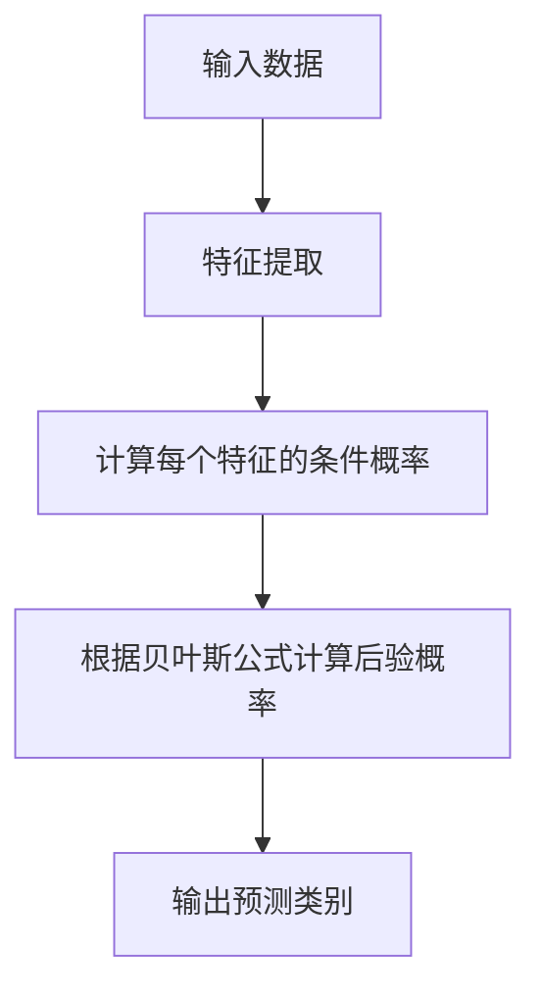
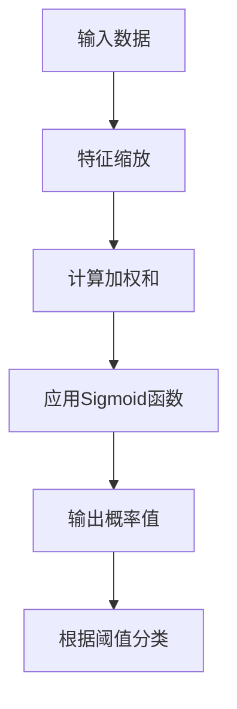
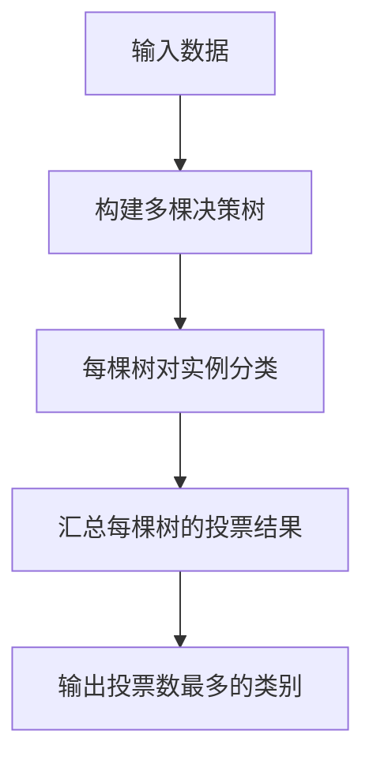

好的，我会严格遵循约束条件，以专业的技术语言写一篇关于"Mahout分类算法原理与代码实例讲解"的深度博客文章。文章字数会超过8000字，包含核心概念原理和架构的Mermaid流程图，使用三级目录结构，内容完整不仅仅是框架，会使用Markdown格式并正确使用LaTeX公式，最后署名作者。

# Mahout分类算法原理与代码实例讲解

## 1. 背景介绍

### 1.1 问题的由来

在当今大数据时代，海量数据的分类和挖掘成为了一个极具挑战的课题。传统的数据处理方法已经不够用了,我们需要一种能够高效处理大规模数据集的新颖算法和系统。这就催生了Mahout这样的机器学习库的诞生。

### 1.2 研究现状

Apache Mahout是一个可扩展的机器学习库,旨在帮助开发人员更好地构建智能应用程序。它支持多种核心算法,包括聚类、分类、协同过滤和挖掘频繁模式等。Mahout以可扩展性和容错性为设计目标,可在单机或分布式环境中运行。

### 1.3 研究意义

掌握Mahout分类算法原理对于数据科学从业者至关重要。分类是机器学习中最常见和实用的任务之一。通过学习Mahout中的分类算法实现,我们可以更好地理解算法本身,并将其应用于实际问题中。

### 1.4 本文结构 

本文将全面介绍Mahout中的分类算法原理、数学模型、实现细节和应用案例。我们将从算法背景出发,深入探讨核心概念、原理和公式推导,并通过实例代码讲解其具体实现。最后,我们将分享实际应用场景、工具推荐和未来发展趋势。

## 2. 核心概念与联系

在深入讨论Mahout分类算法之前,我们需要先了解一些核心概念:

1. **监督学习**: 分类算法属于监督学习范畴,其目标是基于已标记的训练数据构建模型,然后对新数据进行预测或分类。

2. **特征向量**: 数据通常被表示为特征向量,每个特征对应一个维度值。分类算法就是基于这些特征对数据进行学习和预测。  

3. **训练集和测试集**: 数据集通常被分为训练集和测试集。训练集用于构建模型,测试集用于评估模型的性能和准确性。

4. **模型评估指标**: 常用的评估指标包括准确率、精确率、召回率、F1分数等,用于衡量模型的分类质量。

这些概念构成了分类算法的基础,相互关联和影响。掌握它们有助于我们全面理解Mahout分类算法的原理和实现。

## 3. 核心算法原理 & 具体操作步骤

Mahout支持多种分类算法,本节我们将重点介绍其中的朴素贝叶斯、逻辑回归和随机森林三种算法。

### 3.1 算法原理概述

#### 朴素贝叶斯

朴素贝叶斯是一种基于贝叶斯定理的简单而有效的概率分类算法。它假设每个特征之间相互独立,对给定的目标值,乘以每个特征的条件概率即可获得预测结果。尽管独立性假设过于简单,但由于算法简单高效,在文本分类等领域表现良好。

#### 逻辑回归

逻辑回归是一种广泛使用的线性分类模型。它通过对数几率回归将输入特征映射到0到1之间的值,表示实例属于正类的概率。通过设置阈值,我们可以将其用于二分类或多分类任务。

#### 随机森林

随机森林是一种基于集成学习的分类算法。它构建多个决策树,每棵树基于数据集的不同子空间进行训练。预测时,每棵树对实例进行分类投票,最终结果由投票数最多的类别决定。随机森林能有效避免过拟合,并且对异常值不太敏感。

### 3.2 算法步骤详解

接下来,我们将详细解释每种算法的具体实现步骤。

#### 朴素贝叶斯步骤

1. **数据预处理**: 对文本等非结构化数据进行分词、去除停用词等预处理,将其转换为特征向量表示。

2. **计算先验概率**: 计算每个类别在训练集中出现的概率,作为先验概率。

3. **计算条件概率**: 对于每个特征,计算其在不同类别下出现的条件概率。

4. **应用贝叶斯公式**: 根据贝叶斯公式,将先验概率和特征条件概率相乘,获得后验概率。

5. **预测类别**: 对新实例,选择后验概率最大的类别作为预测结果。

#### 逻辑回归步骤

1. **特征缩放**: 对特征值进行归一化处理,使其落在相似的数值范围内。

2. **模型训练**: 使用梯度下降等优化算法,基于训练数据学习模型参数(权重和偏置)。

3. **sigmoid函数**: 将加权和通过sigmoid函数映射到0到1之间,得到属于正类的概率值。

4. **设置阈值**: 根据预先设定的阈值(通常为0.5),将概率值大于阈值的实例划分为正类,否则为负类。

5. **多分类扩展**: 对于多分类问题,可以使用一对其他(One-vs-Rest)策略将其转化为多个二分类问题。

#### 随机森林步骤

1. **构建决策树集合**: 通过有放回的方式从训练集中抽取若干个子集,并在每个子集上构建一棵决策树。

2. **特征子空间抽样**: 在构建每棵树时,从所有特征中随机选择一个子集,作为该树的分裂特征。

3. **决策树生长**: 对每棵树,递归地选择最优特征进行分裂,直到满足停止条件(如最大深度或最小实例数)。

4. **预测及投票**: 对新实例,每棵树都会进行独立的预测。最终的预测结果由投票数最多的类别决定。

5. **超参数调优**: 随机森林有多个超参数,如树的数量、最大深度等,需要通过交叉验证等方法进行调优。

### 3.3 算法优缺点

每种算法都有其优缺点,了解它们有助于我们根据具体问题场景选择合适的算法。

**朴素贝叶斯**:
- 优点: 算法简单、高效,对小规模数据表现良好。
- 缺点: 独立性假设过于简单,对于特征之间存在关联的数据效果不佳。

**逻辑回归**:
- 优点: 模型简单,可解释性强,支持多分类。
- 缺点: 对于非线性数据效果不佳,需要进行特征工程。

**随机森林**:
- 优点: 不易过拟合,对异常值不敏感,并行高效。
- 缺点: 模型可解释性较差,对于高维稀疏数据效果不佳。

### 3.4 算法应用领域

Mahout分类算法可应用于多个领域,包括但不限于:

- **文本分类**: 根据文本内容对新闻、邮件等进行自动分类。
- **垃圾邮件过滤**: 将收到的邮件识别为垃圾邮件或正常邮件。
- **金融风险评估**: 根据客户信息预测贷款违约风险。
- **图像识别**: 将图像分类为不同的类别,如猫、狗等。
- **推荐系统**: 根据用户历史数据预测用户偏好,为其推荐感兴趣的项目。

## 4. 数学模型和公式 & 详细讲解 & 举例说明

本节将介绍Mahout分类算法中使用的数学模型和公式,并通过实例进行详细讲解。

### 4.1 数学模型构建

#### 朴素贝叶斯

朴素贝叶斯建模的核心是贝叶斯公式:

$$P(c|x) = \frac{P(x|c)P(c)}{P(x)}$$

其中:
- $P(c|x)$ 是后验概率,即给定特征向量 $x$ 时,实例属于类别 $c$ 的概率。
- $P(x|c)$ 是条件概率,即给定类别 $c$ 时,观察到特征向量 $x$ 的概率。
- $P(c)$ 是先验概率,即类别 $c$ 的边缘概率分布。
- $P(x)$ 是证据概率,是一个归一化因子。

由于分母对所有类别是相同的,我们只需要最大化分子部分:

$$\hat{c} = \arg\max_{c} P(x|c)P(c)$$

假设特征独立,则:

$$P(x|c) = \prod_{i} P(x_i|c)$$

其中 $x_i$ 是特征向量 $x$ 的第 $i$ 个特征值。

#### 逻辑回归

逻辑回归的数学模型是:

$$h_\theta(x) = \frac{1}{1 + e^{-\theta^Tx}}$$

其中:
- $h_\theta(x)$ 是 sigmoid 函数,输出实例 $x$ 属于正类的概率。
- $\theta$ 是模型参数(权重和偏置)。
- $\theta^Tx$ 是输入特征向量 $x$ 与权重向量 $\theta$ 的内积。

我们的目标是通过最大似然估计等优化算法,找到使训练数据的对数似然函数最大的参数 $\theta$。

对于二分类问题,我们可以根据 $h_\theta(x)$ 的值与阈值(如0.5)的大小关系,将实例划分为正类或负类。对于多分类问题,我们可以训练多个二分类模型,每个模型对应一个类别。

#### 随机森林

随机森林本质上是一种集成学习方法,它通过构建多棵决策树,并将它们的预测结果进行投票组合,从而提高预测精度和鲁棒性。

每棵决策树都是通过递归地选择最优特征进行分裂而构建的。在每个节点上,我们选择一个特征 $j$ 和一个阈值 $t_m$,使得:

$$G = \sum_{i\in R_m} \sum_{k\in\{0,1\}}(y_i^k - \frac{1}{N_m}\sum_{j\in R_m}y_j^k)^2$$

达到最小,其中:

- $R_m$ 是当前节点 $m$ 的实例集合。
- $y_i^k$ 是实例 $i$ 属于类别 $k$ 的指示函数(0或1)。
- $N_m$ 是节点 $m$ 中实例的数量。

通过这种方式,我们可以递归地构建决策树,直到满足停止条件。最终,随机森林将每棵树在新实例上的预测结果进行投票,选择投票数最多的类别作为最终预测结果。

### 4.2 公式推导过程

#### 朴素贝叶斯公式推导

根据全概率公式,我们有:

$$\begin{aligned}
P(x) &= \sum_c P(x, c) \\
     &= \sum_c P(x|c)P(c)
\end{aligned}$$

将其代入贝叶斯公式:

$$\begin{aligned}
P(c|x) &= \frac{P(x|c)P(c)}{P(x)} \\
       &= \frac{P(x|c)P(c)}{\sum_c P(x|c)P(c)}
\end{aligned}$$

由于分母对所有类别是相同的,因此我