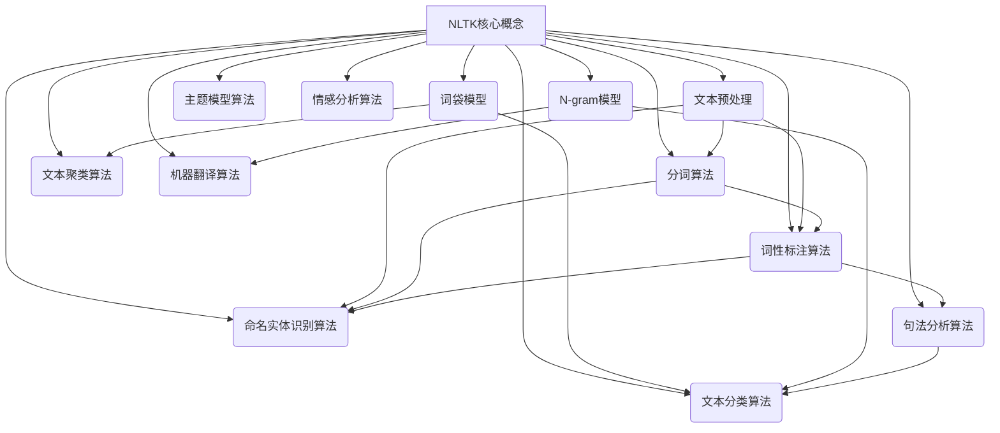

# NLTK 原理与代码实战案例讲解

## 1. 背景介绍

### 1.1 问题的由来

在当今的信息时代，自然语言处理(Natural Language Processing, NLP)已经成为人工智能领域中最重要和最具挑战性的研究方向之一。随着大数据和深度学习技术的快速发展,NLP技术在文本挖掘、机器翻译、语音识别、问答系统等领域得到了广泛的应用。然而,NLP任务的复杂性和多样性使得开发高性能的NLP系统仍然是一个巨大的挑战。

### 1.2 研究现状

目前,已经有许多优秀的NLP工具包和框架,如 NLTK(Natural Language Toolkit)、 spaCy、Stanford CoreNLP等。其中,NLTK是一个用Python编写的开源NLP库,提供了丰富的文本处理功能,涵盖了分词、词性标注、命名实体识别、句法分析等多个NLP任务。NLTK拥有活跃的社区和详细的文档,被广泛应用于教学、研究和产品开发等多个领域。

### 1.3 研究意义

尽管NLTK提供了强大的功能,但对于初学者和开发人员来说,掌握NLTK的核心原理和高级用法仍然是一个挑战。本文旨在深入探讨NLTK的核心概念、算法原理和实现细节,并通过实战案例讲解NLTK在各种NLP任务中的应用,帮助读者全面掌握NLTK,提高NLP开发能力。

### 1.4 本文结构

本文首先介绍NLTK的核心概念和基本用法,然后详细阐述NLTK中常用的算法原理,包括分词、词性标注、命名实体识别等。接下来,通过数学模型和公式推导,深入解释这些算法的理论基础。在此基础上,我们将通过实战案例,展示如何使用NLTK进行文本预处理、特征提取、模型训练和评估等实际应用。最后,我们将总结NLTK的发展趋势和面临的挑战,并推荐相关的学习资源和工具。

## 2. 核心概念与联系

NLTK提供了广泛的NLP功能,涵盖了文本预处理、特征提取、模型训练和评估等多个方面。其核心概念包括:

1. **文本预处理**: 包括分词、词性标注、命名实体识别等,用于将原始文本转换为结构化数据。
2. **词袋模型(Bag-of-Words)**: 将文本表示为词频向量,常用于文本分类和聚类任务。
3. **N-gram模型**: 基于N个连续词的序列,用于捕捉词与词之间的关系,广泛应用于语言模型和机器翻译等任务。
4. **分词算法**: 将文本切分为词序列,是NLP任务的基础步骤。
5. **词性标注算法**: 为每个词赋予相应的词性标记,如名词、动词等。
6. **命名实体识别算法**: 识别文本中的实体名称,如人名、地名、组织机构名等。
7. **句法分析算法**: 构建句子的语法树,分析句子的句法结构。
8. **文本分类算法**: 将文本划分到预定义的类别中,如垃圾邮件过滤、新闻分类等。
9. **文本聚类算法**: 根据文本的相似性,将其自动划分为若干簇。
10. **主题模型算法**: 从文本集合中自动发现隐含的主题,如LDA算法。
11. **情感分析算法**: 判断文本的情感倾向,如正面、负面或中性。
12. **机器翻译算法**: 将一种自然语言的文本翻译成另一种语言。

这些核心概念相互关联,构成了NLTK的整体框架。例如,分词和词性标注是许多高级NLP任务的基础;N-gram模型和词袋模型常用于特征提取;各种算法则用于实现具体的NLP任务,如分类、聚类、主题建模等。

## 3. 核心算法原理 & 具体操作步骤

### 3.1 算法原理概述

NLTK中包含了多种NLP算法,本节将介绍其中几种核心算法的原理,包括分词、词性标注和命名实体识别算法。

#### 3.1.1 分词算法

分词是NLP任务的基础步骤,目的是将连续的文本序列切分为词序列。常见的分词算法包括:

- **基于规则的分词算法**: 根据预定义的规则(如标点符号、空格等)对文本进行切分。
- **基于统计的分词算法**: 利用大规模语料库,学习词与词之间的概率分布,从而确定切分位置。
- **基于机器学习的分词算法**: 将分词问题建模为序列标注问题,使用机器学习模型(如HMM、CRF等)进行训练和预测。

#### 3.1.2 词性标注算法

词性标注是为每个词赋予相应的词性标记(如名词、动词等)。常见的词性标注算法包括:

- **基于规则的词性标注算法**: 根据预定义的语法规则进行词性标注。
- **基于统计的词性标注算法**: 利用大规模标注语料,学习词与词性之间的概率分布,从而预测未知词的词性。
- **基于机器学习的词性标注算法**: 将词性标注问题建模为序列标注问题,使用机器学习模型(如HMM、MEMM、CRF等)进行训练和预测。

#### 3.1.3 命名实体识别算法

命名实体识别(Named Entity Recognition, NER)是指从文本中识别出实体名称,如人名、地名、组织机构名等。常见的NER算法包括:

- **基于规则的NER算法**: 根据预定义的模式和规则进行实体识别。
- **基于统计的NER算法**: 利用大规模标注语料,学习实体名称的统计特征,从而识别未知文本中的实体。
- **基于机器学习的NER算法**: 将NER问题建模为序列标注问题,使用机器学习模型(如HMM、MEMM、CRF等)进行训练和预测。

### 3.2 算法步骤详解

接下来,我们将详细介绍基于机器学习的分词、词性标注和命名实体识别算法的具体步骤。

#### 3.2.1 分词算法步骤

1. **数据预处理**: 将原始文本数据进行清洗和规范化处理。
2. **特征提取**: 为每个字符或字符序列提取相关特征,如当前字符、上下文字符、是否为数字或标点等。
3. **模型训练**: 使用标注好的语料库,训练机器学习模型(如CRF)进行分词。
4. **模型评估**: 在测试集上评估模型的分词性能,如精确率、召回率等指标。
5. **模型调优**: 根据评估结果,调整模型参数和特征,提高分词性能。
6. **模型部署**: 将训练好的模型应用于实际的分词任务。

#### 3.2.2 词性标注算法步骤

1. **数据预处理**: 将原始文本数据进行分词、清洗和规范化处理。
2. **特征提取**: 为每个词提取相关特征,如当前词、上下文词、词形、词缀等。
3. **模型训练**: 使用标注好的语料库,训练机器学习模型(如HMM、MEMM或CRF)进行词性标注。
4. **模型评估**: 在测试集上评估模型的词性标注性能,如准确率等指标。
5. **模型调优**: 根据评估结果,调整模型参数和特征,提高词性标注性能。
6. **模型部署**: 将训练好的模型应用于实际的词性标注任务。

#### 3.2.3 命名实体识别算法步骤

1. **数据预处理**: 将原始文本数据进行分词、词性标注、清洗和规范化处理。
2. **特征提取**: 为每个词提取相关特征,如当前词、上下文词、词性、大小写、是否包含数字等。
3. **模型训练**: 使用标注好的语料库,训练机器学习模型(如HMM、MEMM或CRF)进行命名实体识别。
4. **模型评估**: 在测试集上评估模型的NER性能,如精确率、召回率等指标。
5. **模型调优**: 根据评估结果,调整模型参数和特征,提高NER性能。
6. **模型部署**: 将训练好的模型应用于实际的命名实体识别任务。

### 3.3 算法优缺点

上述算法具有以下优缺点:

**优点**:

- 基于机器学习的方法具有较强的泛化能力,可以适应不同领域和语言的数据。
- 通过特征工程和模型调优,可以不断提高算法的性能。
- 算法步骤清晰,易于理解和实现。

**缺点**:

- 需要大量的标注数据用于模型训练,标注工作耗时耗力。
- 算法性能heavily依赖于特征的质量,特征工程是一个挑战。
- 对于低资源语言或特殊领域,可能缺乏足够的训练数据。

### 3.4 算法应用领域

上述算法在多个NLP任务中发挥着重要作用:

- **分词算法**: 是大多数NLP任务的基础步骤,如文本挖掘、信息检索、机器翻译等。
- **词性标注算法**: 在句法分析、关系抽取、问答系统等任务中具有重要应用。
- **命名实体识别算法**: 广泛应用于信息抽取、知识图谱构建、问答系统等领域。

除了上述算法,NLTK还包含了其他多种算法,如句法分析、文本分类、聚类、主题模型等,这些算法在相应的NLP任务中也有着广泛的应用。

## 4. 数学模型和公式 & 详细讲解 & 举例说明

### 4.1 数学模型构建

在介绍具体算法之前,我们先来了解一下NLP任务中常用的数学模型。

#### 4.1.1 概率图模型

概率图模型是一种基于图论的概率模型,可以有效地表示随机变量之间的条件独立性质。在NLP中,常用的概率图模型包括:

- **朴素贝叶斯模型**: 假设特征之间相互独立,用于文本分类等任务。
- **隐马尔可夫模型(HMM)**: 用于建模隐藏状态序列,适用于分词、词性标注等序列标注任务。
- **最大熵马尔可夫模型(MEMM)**: 在HMM的基础上,引入了特征函数,用于词性标注和命名实体识别等任务。
- **条件随机场(CRF)**: 是一种判别式模型,直接对条件概率进行建模,在序列标注任务中表现优异。

#### 4.1.2 向量空间模型

向量空间模型将文本表示为向量,是文本挖掘和信息检索中的基础模型。常见的向量空间模型包括:

- **词袋模型(Bag-of-Words)**: 将文本表示为词频向量,忽略词与词之间的顺序关系。
- **N-gram模型**: 将文本表示为N个连续词的序列,捕捉词与词之间的关系。
- **主题模型(Topic Model)**: 通过隐含的主题变量,将文本映射到低维的主题空间,如LDA模型。

#### 4.1.3 神经网络模型

随着深度学习技术的发展,神经网络模型在NLP领域得到了广泛应用,常见的模型包括:

- **词嵌入(Word Embedding)**: 将词映射到低维的连续向量空间