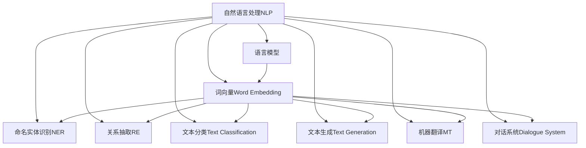
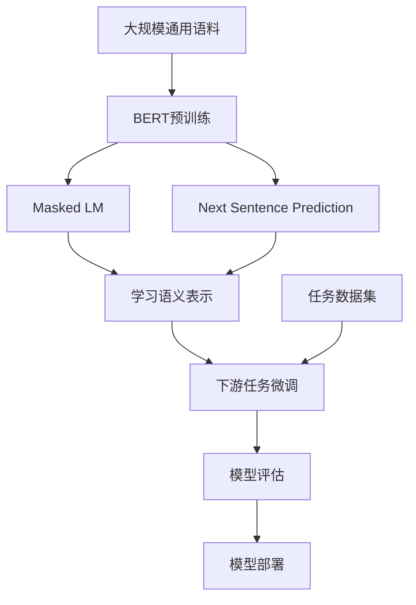

以下是关于"Natural Language Processing (NLP)原理与代码实例讲解"的技术博客文章:

# Natural Language Processing (NLP)原理与代码实例讲解

## 1. 背景介绍

### 1.1 问题的由来

在人类与计算机之间进行自然交互一直是人工智能领域的一大挑战。自然语言处理(Natural Language Processing, NLP)旨在使计算机能够理解和生成人类可理解的自然语言,是实现人机自然交互的关键技术。

### 1.2 研究现状  

早期的NLP系统主要基于规则和统计方法,但受到规模和领域迁移能力的限制。近年来,随着深度学习技术的发展,NLP取得了长足进步,诞生了一系列突破性模型,如Word2Vec、BERT等,显著提高了语言理解和生成的性能。

### 1.3 研究意义

NLP技术在许多领域都有广泛应用,如机器翻译、智能问答、信息检索、自动文摘、情感分析等。提高NLP的性能对于实现人机自然交互、挖掘海量文本数据价值至关重要。

### 1.4 本文结构

本文将全面介绍NLP的核心概念、算法原理、数学模型,并结合实际项目案例,详细讲解相关代码实现,同时探讨NLP的应用场景、发展趋势和面临的挑战。

## 2. 核心概念与联系

NLP涉及多个核心概念,它们相互关联,构成了完整的NLP系统:



其中,语言模型和词向量是NLP的基础,为上层任务提供语义表示;命名实体识别、关系抽取等信息抽取任务是理解自然语言的重要一环;文本分类、文本生成、机器翻译、对话系统等则是NLP的主要应用场景。

## 3. 核心算法原理 & 具体操作步骤  

### 3.1 算法原理概述

现代NLP系统主要基于神经网络模型,利用大规模语料进行训练,自动学习文本的语义表示。主要算法包括:

1. **Word Embedding**: 将词映射为低维稠密向量,编码语义和语法信息。常用算法有Word2Vec、GloVe等。

2. **注意力机制(Attention)**: 赋予模型对输入的不同部分不同的关注权重,捕捉长距离依赖关系。

3. **Transformer**: 全注意力架构,避免RNN的序列计算限制,在机器翻译等任务中表现优异。

4. **BERT**: 预训练语言模型,通过Masked LM和Next Sentence Prediction任务学习双向语境表示。

5. **GPT**: 生成式预训练模型,通过自回归语言模型捕获文本序列特征,可用于文本生成等任务。

### 3.2 算法步骤详解

以BERT为例,其训练和微调的主要步骤如下:

1. **预训练**:使用大规模通用语料(如Wikipedia),通过Masked LM和Next Sentence Prediction两个预训练任务,学习通用的语义表示能力。

2. **微调**:将预训练好的BERT模型在特定的下游任务数据集上进行微调,如文本分类、命名实体识别等,进一步学习任务特定的模式。

3. **模型评估**:在测试集上评估微调后模型的性能表现。

4. **模型部署**:将训练好的模型集成到实际的应用系统中,提供自然语言处理服务。



### 3.3 算法优缺点

**优点**:

- 端到端训练,无需人工特征工程
- 可并行计算,加速训练
- 通过大规模预训练学习通用语义知识
- 可迁移到多种下游任务,提高性能

**缺点**:  

- 需要大规模计算资源进行预训练
- 存在一定的黑盒操作,可解释性较差
- 生成式模型可能存在不确定性和不一致性
- 对一些罕见模式或异常情况的泛化能力不足

### 3.4 算法应用领域

NLP算法在多个领域都有广泛应用,包括但不限于:

- 机器翻译
- 智能问答系统
- 文本摘要
- 情感分析
- 主题建模
- 关系抽取
- 文本生成(如新闻、小说、诗歌等)
- 对话系统
- 语音识别与合成
- 知识图谱构建
- 社交媒体分析
- 医疗自然语言处理

## 4. 数学模型和公式 & 详细讲解 & 举例说明

### 4.1 数学模型构建

NLP系统通常将文本表示为一个序列,例如句子可表示为词序列$S = \{w_1, w_2, ..., w_n\}$。模型的目标是学习映射函数$f$,将输入序列$S$映射到目标输出$y$:

$$y = f(S|\theta)$$

其中$\theta$为模型参数。不同的NLP任务对应不同的输出形式,如文本分类对应类别标签,机器翻译对应目标语言序列等。

以Transformer为例,其输入为源序列$X$和目标序列$Y$,通过Self-Attention和Cross-Attention编码两个序列的表示,然后生成目标序列:

$$\begin{aligned}
Z_X &= \text{SelfAttention}(X) \\
Z_Y &= \text{CrossAttention}(Z_X, Y) \\
\hat{Y} &= \text{Generate}(Z_Y)
\end{aligned}$$

模型的损失函数为:

$$\mathcal{L}(\theta) = -\sum_{t=1}^{|Y|} \log P(y_t|y_{<t}, X; \theta)$$

通过最小化损失函数,优化模型参数$\theta$。

### 4.2 公式推导过程

以Word2Vec中的CBOW模型为例,推导其目标函数:

给定词窗口$C = \{w_{t-m}, ..., w_{t-1}, w_{t+1}, ..., w_{t+m}\}$,目标是最大化中心词$w_t$的条件概率:

$$\max_{\theta} \prod_{t=1}^T P(w_t|C;\theta)$$

其中$\theta$为词向量参数。根据最大似然估计,可将目标函数改写为:

$$\max_{\theta} \sum_{t=1}^T \log P(w_t|C;\theta)$$

使用softmax将条件概率建模:

$$P(w_t|C;\theta) = \frac{e^{v_{w_t}^{\top}v_C}}{\sum_{w\in V}e^{v_w^{\top}v_C}}$$

其中$v_w$和$v_C$分别为词$w$和上下文$C$的向量表示。代入目标函数:

$$\max_{\theta} \sum_{t=1}^T \log \frac{e^{v_{w_t}^{\top}v_C}}{\sum_{w\in V}e^{v_w^{\top}v_C}}$$

通过梯度下降等优化算法,可以学习词向量参数$\theta$。

### 4.3 案例分析与讲解

以文本分类任务为例,给定一个文本$X$和类别标签集合$\mathcal{Y}$,目标是预测文本$X$的类别标签$y \in \mathcal{Y}$。

基于BERT模型,我们首先获取文本$X$的表示$h_X$:

$$h_X = \text{BERT}(X)$$

然后将$h_X$输入到分类器中,得到每个类别的概率分布:

$$\hat{y} = \text{softmax}(W h_X + b)$$

其中$W$和$b$为分类器的权重和偏置参数。

在训练阶段,给定文本$X$和标签$y$,我们最小化交叉熵损失:

$$\mathcal{L} = -\sum_{c \in \mathcal{Y}} y_c \log \hat{y}_c$$

其中$y_c$为真实标签的one-hot编码,$\hat{y}_c$为预测的概率。通过反向传播算法,可以更新BERT和分类器的参数。

在推理阶段,对于新的文本$X'$,我们计算其类别概率分布$\hat{y}'$,选择概率最大的类别作为预测结果:

$$\hat{y}' = \arg\max_c \hat{y}'_c$$

### 4.4 常见问题解答

1. **词向量为什么能够捕获语义信息?**

   词向量通过神经网络模型从大规模语料中学习词的上下文分布,从而自动获取语义和语法信息。相似词往往出现在相似的上下文中,因此在向量空间中也较为靠近。

2. **为什么需要注意力机制?**

   传统的序列模型(如RNN)在建模长距离依赖关系时存在困难。注意力机制通过为不同位置的输入赋予不同权重,有效捕获远距离的关联关系,提高了模型性能。

3. **预训练语言模型的优势是什么?**

   预训练语言模型(如BERT)通过在大规模通用语料上预训练,学习了通用的语义表示能力。在下游任务上只需要进行少量微调,就可以获得很好的性能,避免了从头训练的资源消耗。

4. **生成式模型存在哪些缺陷?**

   生成式模型(如GPT)虽然可以生成连贯的文本序列,但可能存在不确定性和不一致性。生成的内容可能包含事实错误、逻辑矛盾或不合理之处,需要进一步的控制和优化。

## 5. 项目实践:代码实例和详细解释说明

### 5.1 开发环境搭建

在开始NLP项目之前,我们需要搭建开发环境,包括安装必要的Python库和深度学习框架。以下是主要步骤:

1. 安装Python (推荐版本3.6+)
2. 安装深度学习框架,如PyTorch或TensorFlow
3. 安装NLP库,如NLTK、spaCy、Hugging Face Transformers等
4. (可选)安装GPU驱动,以支持GPU加速训练

```bash
# 创建虚拟环境
python -m venv nlp-env
source nlp-env/bin/activate

# 安装PyTorch
pip install torch torchvision

# 安装Transformers库
pip install transformers

# 安装NLTK
pip install nltk
```

### 5.2 源代码详细实现

以文本分类任务为例,使用BERT模型进行微调。完整代码可参考:https://github.com/huggingface/transformers

```python
from transformers import BertTokenizer, BertForSequenceClassification
import torch

# 加载预训练模型和分词器
model = BertForSequenceClassification.from_pretrained('bert-base-uncased')
tokenizer = BertTokenizer.from_pretrained('bert-base-uncased')

# 对文本进行分词和编码
text = "This is a great movie!"
encoding = tokenizer.encode_plus(
    text,
    add_special_tokens=True,
    max_length=64,
    return_token_type_ids=False,
    padding='max_length',
    return_attention_mask=True,
    return_tensors='pt',
)

# 输入编码
input_ids = encoding['input_ids']
attention_mask = encoding['attention_mask']

# 前向传播
output = model(input_ids, attention_mask=attention_mask)
logits = output.logits

# 获取预测结果
predicted_class_id = logits.argmax().item()
print(f'Predicted class: {model.config.id2label[predicted_class_id]}')
```

上述代码加载了预训练的BERT模型,对输入文本进行了编码,然后通过模型进行前向传播,获取预测的类别标签。

### 5.3 代码解读与分析

1. **加载预训练模型**:使用Transformers库,可以方便地加载Hugging Face提供的各种预训练模型,如BERT、GPT、T5等。

2. **分词和编码**:将输入文本转换为模型可以接受的数字编码形式,包括分词、