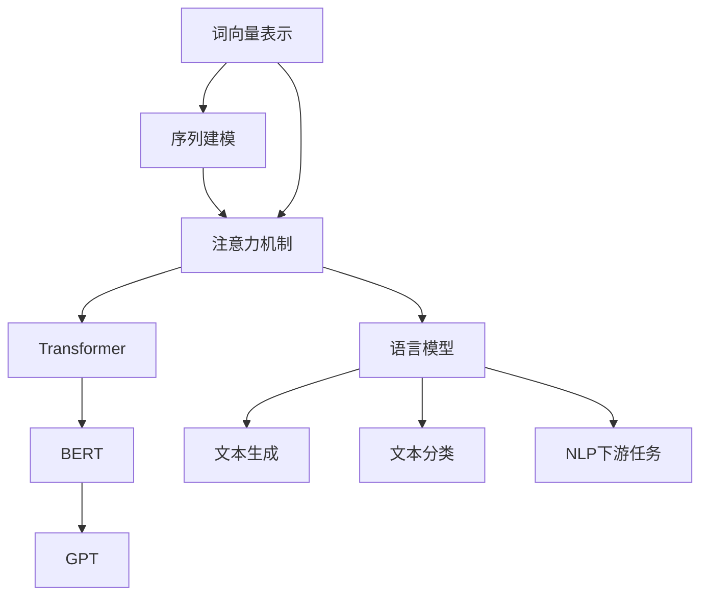

# Natural Language Processing 原理与代码实战案例讲解

## 1. 背景介绍

### 1.1 问题的由来

在当今信息时代,人类与机器之间的交互日益频繁。然而,人类使用自然语言进行交流,而机器只能理解机器语言,这就产生了一个鸿沟。自然语言处理(Natural Language Processing,NLP)应运而生,旨在弥合这一鸿沟,使机器能够理解和生成人类可以理解的自然语言。

NLP技术的发展可以追溯到20世纪50年代,当时的研究主要集中在机器翻译和问答系统等领域。随着计算机硬件性能的不断提升和大数据时代的到来,NLP技术得到了长足发展。如今,NLP技术已广泛应用于机器翻译、智能问答、信息检索、情感分析、自动摘要等诸多领域。

### 1.2 研究现状

近年来,NLP领域取得了令人瞩目的进展,主要归功于深度学习技术的兴起。传统的NLP方法主要基于规则和统计模型,需要大量的人工特征工程。而深度学习模型能够自动从大量数据中学习特征表示,极大地提高了NLP系统的性能。

目前,基于transformer的预训练语言模型(如BERT、GPT等)成为NLP领域的主流技术,在各种下游任务中表现出色。此外,生成式预训练模型(如GPT-3)也展现出了强大的自然语言生成能力,可用于文本创作、问答、代码生成等多种应用场景。

### 1.3 研究意义

自然语言处理技术的发展对于推动人机交互、促进信息获取和知识传播具有重要意义。高效准确的NLP系统可以极大地提高人类获取信息的效率,降低信息过载带来的负担。同时,NLP技术在智能助手、客服机器人、内容创作等领域的应用,也将深刻影响人类的生活和工作方式。

此外,NLP技术还可以助力其他领域的发展,如医疗健康、法律、教育等。通过处理大量非结构化数据,NLP技术可以帮助提取有价值的信息,为相关领域的决策提供支持。

### 1.4 本文结构

本文将全面介绍自然语言处理的核心原理和实战案例。首先阐述NLP的核心概念和算法原理,包括词向量表示、序列建模、注意力机制等;其次详细讲解NLP中常用的数学模型和公式推导过程;再者提供实战代码示例,并进行详细解读和分析;最后探讨NLP在实际应用场景中的运用,并对未来发展趋势和挑战进行展望。

## 2. 核心概念与联系

自然语言处理是一个复杂的过程,涉及多个核心概念和技术,它们相互关联、环环相扣。本节将介绍NLP中的几个核心概念,并阐明它们之间的联系。

1. **词向量表示(Word Embeddings)**: 将词语映射到连续的向量空间中,是NLP中的基础技术。常用的词向量表示方法包括Word2Vec、GloVe等。

2. **序列建模(Sequence Modeling)**: 自然语言是一个序列数据,需要对整个序列进行建模。常用的序列建模方法有循环神经网络(RNN)、长短期记忆网络(LSTM)等。

3. **注意力机制(Attention Mechanism)**: 注意力机制能够自适应地捕捉序列中不同位置的关键信息,是序列建模的重要技术。

4. **Transformer**: 全注意力机制的序列建模架构,是NLP领域的里程碑式进展,为后续的BERT、GPT等模型奠定了基础。

5. **BERT(Bidirectional Encoder Representations from Transformers)**: 基于Transformer的双向编码器,通过预训练学习上下文表示,在多个NLP任务上取得了出色表现。

6. **GPT(Generative Pre-trained Transformer)**: 基于Transformer的生成式预训练模型,具有强大的自然语言生成能力。

7. **语言模型(Language Model)**: 通过学习大量语料,捕捉语言的统计规律,是NLP的核心技术。BERT、GPT等都是语言模型的一种形式。

8. **NLP下游任务**: 语言模型可以应用于多种NLP下游任务,如文本分类、机器翻译、问答系统、信息抽取等。

上述核心概念相互关联、环环相扣。词向量表示是NLP的基础;序列建模和注意力机制是对序列数据进行建模的关键技术;Transformer架构集成了注意力机制,为BERT、GPT等语言模型奠定了基础;语言模型则是NLP的核心,可广泛应用于各种下游任务。

## 3. 核心算法原理 & 具体操作步骤

### 3.1 算法原理概述

自然语言处理中有许多核心算法,本节将重点介绍两种广为人知的算法:Word2Vec和BERT。

**Word2Vec**是一种高效的词向量表示方法,主要思想是通过神经网络模型学习词语的语义表示。Word2Vec包含两个主要模型:连续词袋模型(CBOW)和Skip-Gram模型。

- CBOW模型根据上下文词语来预测目标词语。
- Skip-Gram模型则是根据目标词语来预测上下文词语。

这两种模型都是基于词语的共现信息,利用浅层神经网络对词语进行有监督训练,得到词向量表示。

**BERT**是一种基于Transformer的预训练语言模型,能够有效地捕捉词语的上下文信息。BERT的核心思想是通过掩码语言模型(Masked Language Model)和下一句预测(Next Sentence Prediction)两个任务进行预训练,学习通用的语义表示。预训练后的BERT模型可以在下游任务上进行微调(Fine-tuning),取得出色的表现。

### 3.2 算法步骤详解

#### Word2Vec算法步骤

1. **构建训练语料库**:从大量文本语料中构建训练数据集。

2. **建立神经网络模型**:根据CBOW或Skip-Gram模型架构,构建浅层神经网络。

3. **模型训练**:使用训练语料,对神经网络模型进行有监督训练,目标是最大化目标词语的概率。

4. **词向量提取**:训练完成后,从神经网络的隐藏层获取词语的词向量表示。

5. **向量计算**:通过词向量之间的距离或相似度计算,可以发现词语之间的语义关系。

#### BERT算法步骤

1. **构建训练语料库**:从大量文本语料中构建训练数据集。

2. **输入表示**:将文本序列切分为词元(Token),并添加特殊符号[CLS]和[SEP]。

3. **掩码语言模型**:随机遮掩部分词元,并使用Transformer模型预测被遮掩的词元。

4. **下一句预测**:判断两个句子是否相邻,以捕捉句子之间的关系。

5. **预训练**:使用掩码语言模型和下一句预测两个任务对BERT模型进行预训练。

6. **微调**:在下游任务上,对预训练的BERT模型进行微调,获得针对特定任务的模型。

7. **预测**:使用微调后的模型对新的输入数据进行预测。

### 3.3 算法优缺点

**Word2Vec优缺点**:

- 优点:
  - 训练速度快,计算效率高。
  - 词向量表示质量较好,能够捕捉词语的语义关系。
  - 可解释性较强,词向量具有一定的语义解释。

- 缺点:
  - 只能获取静态的词向量表示,无法捕捉动态的上下文信息。
  - 对于低频词和新词,向量表示质量较差。
  - 无法直接应用于下游NLP任务,需要额外的特征工程。

**BERT优缺点**:

- 优点:
  - 能够有效捕捉词语的上下文信息,提高了语义表示能力。
  - 在多个NLP下游任务上表现出色,可直接应用于这些任务。
  - 具有很强的迁移能力,可以轻松迁移到新的领域和任务。

- 缺点:
  - 训练数据量需求大,需要大量的计算资源进行预训练。
  - 推理速度较慢,无法满足一些对低延迟有严格要求的应用场景。
  - 缺乏可解释性,模型内部的运作机制较为黑箱。

### 3.4 算法应用领域

**Word2Vec应用领域**:

- 信息检索:通过词向量相似度计算,可以实现更准确的文本相似性匹配。
- 词语关系挖掘:利用词向量之间的线性关系,可以发现词语之间的类比关系等语义模式。
- 情感分析:将词向量作为输入特征,可以提高情感分析的准确性。
- 个性化推荐:基于用户的词向量表示,可以实现个性化的内容推荐。

**BERT应用领域**:

- 文本分类:BERT可直接应用于文本分类任务,如新闻分类、垃圾邮件过滤等。
- 机器阅读理解:BERT在阅读理解任务上表现出色,可用于问答系统的构建。
- 序列标注:BERT可用于命名实体识别、关系抽取等序列标注任务。
- 文本生成:通过微调,BERT可用于文本摘要、机器翻译等生成任务。
- 其他领域:BERT也可应用于计算机视觉、蛋白质预测等其他领域的任务。

## 4. 数学模型和公式 & 详细讲解 & 举例说明

### 4.1 数学模型构建

在自然语言处理中,数学模型是描述和解释语言现象的重要工具。本节将介绍两种常用的NLP数学模型:N-gram语言模型和注意力机制模型。

#### N-gram语言模型

N-gram语言模型是统计语言模型的一种,它基于马尔可夫假设,即一个词的出现只与前面的 N-1 个词相关。N-gram模型的数学表达式如下:

$$P(w_1, w_2, \ldots, w_n) = \prod_{i=1}^n P(w_i|w_{i-N+1}, \ldots, w_{i-1})$$

其中,$ P(w_1, w_2, \ldots, w_n) $表示整个句子的概率,$ P(w_i|w_{i-N+1}, \ldots, w_{i-1}) $表示第i个词在给定前N-1个词的情况下出现的条件概率。

通过计数和平滑技术,我们可以从大量语料中估计N-gram概率。N-gram模型广泛应用于统计机器翻译、语音识别等领域。

#### 注意力机制模型

注意力机制是序列建模中的一种关键技术,它允许模型自适应地关注输入序列中的不同部分。注意力机制的数学表达式如下:

$$\text{Attention}(Q, K, V) = \text{softmax}(\frac{QK^T}{\sqrt{d_k}})V$$

其中,Q (Query) 表示查询向量,K (Key) 表示键向量,V (Value) 表示值向量,$ d_k $是缩放因子。

注意力机制首先计算查询向量和所有键向量之间的相似性得分,然后通过 softmax 函数将其转换为注意力权重。最后,注意力权重与值向量进行加权求和,得到注意力输出。

注意力机制广泛应用于机器翻译、阅读理解等序列建模任务中,能够有效捕捉长距离依赖关系。

### 4.2 公式推导过程

#### N-gram语言模型公式推导

根据链式法则,我们可以将句子的联合概率分解为条件概率的乘积:

$$\begin{aligned}
P(w_1, w_2, \ldots, w_n) &= P(w_1)P(w_2|w_1)P(w_3|w_1, w_2) \ldots P(w_n|w_1, w_2, \l