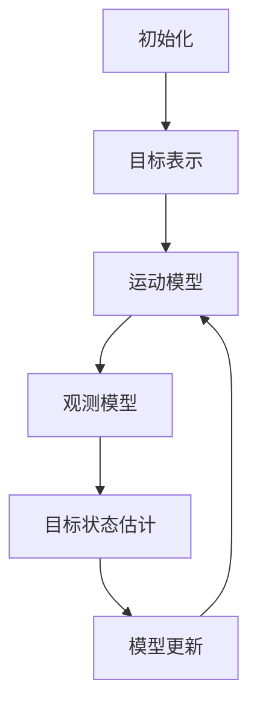

# Object Tracking 原理与代码实战案例讲解

## 1. 背景介绍

### 1.1 问题的由来

在计算机视觉和图像处理领域中,Object Tracking(目标跟踪)是一个非常重要和具有挑战性的任务。它的目标是在一系列连续图像或视频帧中自动检测、识别和跟踪感兴趣的目标对象。目标跟踪技术广泛应用于许多领域,如视频监控、人机交互、机器人导航、交通监控、无人机跟踪等。

随着视频监控系统的普及和智能视觉技术的发展,对于准确、鲁棒和高效的目标跟踪算法的需求越来越迫切。然而,由于目标外观的变化、遮挡、光照变化、背景clutters、目标形状变形等因素,实现高性能的目标跟踪系统仍然是一个巨大的挑战。

### 1.2 研究现状  

目标跟踪算法可以大致分为两大类:基于生成模型(Generative)和基于discriminative模型(Discriminative)。

基于生成模型的算法通常利用目标的外观模型来搜索与之最相似的图像区域作为跟踪结果,常见的有均值漂移(Mean-Shift)、核相关滤波(Kernel Correlation Filters)等。这类算法对光照变化、噪声等具有较好的鲁棒性,但对目标形变、遮挡等情况表现较差。

基于discriminative模型的算法则是将目标跟踪问题转化为一个在线学习的分类问题,通过训练一个分类器来区分目标和背景。这类算法包括多实例学习(MIL)、结构化输出支持向量机(Struck)、相关滤波器(Correlation Filter)、核相关滤波器(KCF)等。这些算法对目标形变、遮挡等有较好的处理能力,但对光照变化、背景clutters等情况较为敏感。

近年来,受深度学习技术的发展推动,基于深度神经网络的目标跟踪算法取得了长足的进步,如SiamFC、MDNet、GOTURN等,这些算法能够端到端的学习目标的高级语义特征表示,在处理目标形变、遮挡等复杂情况时表现出色。

### 1.3 研究意义

准确、鲁棒和高效的目标跟踪技术在诸多领域都有广泛的应用前景:

1. **视频监控系统**: 能够实时跟踪感兴趣目标的移动轨迹,用于安防、交通监控等。
2. **人机交互**: 通过跟踪人体关键点的运动,实现自然的人机交互。 
3. **机器人导航**: 机器人能够自主跟踪和导航目标物体的移动。
4. **增强现实(AR)**: 实时跟踪目标,为目标添加虚拟的增强信息。
5. **无人机/自动驾驶**: 对移动目标进行实时检测和跟踪,规避障碍物。
6. **运动分析**: 分析运动目标(如运动员)的运动轨迹,用于运动训练等。

因此,研究高性能的目标跟踪算法不仅具有重要的理论意义,也有广阔的应用前景。

### 1.4 本文结构

本文将全面介绍目标跟踪的核心原理、经典算法、数学模型以及实战代码案例。内容安排如下:

- 第2部分阐述目标跟踪的核心概念及其与其他计算机视觉任务的联系。
- 第3部分详细讲解经典的目标跟踪算法原理和具体操作步骤。
- 第4部分推导目标跟踪中常用的数学模型和公式,并结合案例进行讲解。
- 第5部分提供实战代码案例,包括开发环境、源代码、运行结果等。
- 第6部分介绍目标跟踪在实际应用中的场景。
- 第7部分推荐相关的学习资源、开发工具和论文。
- 第8部分总结目标跟踪的研究成果、发展趋势和面临的挑战。
- 第9部分列举常见的问题并给出解答。

## 2. 核心概念与联系

目标跟踪(Object Tracking)是计算机视觉中的一个核心任务,它与其他任务密切相关:

1. **目标检测(Object Detection)**: 在单一图像或视频帧中定位感兴趣的目标对象。目标跟踪可以利用目标检测的结果作为初始化。

2. **图像分割(Image Segmentation)**: 将图像分割为不同的语义区域。分割结果可以为目标跟踪提供目标的形状和位置先验。

3. **运动估计(Motion Estimation)**: 估计图像序列中像素或特征点的运动矢量。运动信息对于目标跟踪至关重要。

4. **目标识别(Object Recognition)**: 识别图像或视频中的目标对象类别。目标识别可以为跟踪提供高层次的语义信息。

5. **视频理解(Video Understanding)**: 对视频序列进行全面的理解和分析,包括目标检测、跟踪、识别、行为分析等。目标跟踪是视频理解的重要组成部分。

目标跟踪算法通常包含以下几个核心步骤:

1. **初始化**: 获取目标在第一帧的位置,通常由检测或人工标注提供。
2. **目标表示**: 使用合适的特征(如颜色、纹理、形状等)来表示目标的外观。
3. **运动模型**: 根据目标在前一帧的状态,预测目标在当前帧的可能位置。
4. **观测模型**: 在当前帧搜索与目标表示最匹配的图像区域。
5. **目标状态估计**: 根据运动模型的预测和观测模型的匹配结果,估计目标在当前帧的确切状态。
6. **模型更新**: 根据新的观测,更新目标表示模型和运动模型的参数。

## 3. 核心算法原理 & 具体操作步骤

### 3.1 算法原理概述

目标跟踪算法可以分为基于生成模型(Generative)和基于discriminative模型(Discriminative)两大类。

**基于生成模型**的算法通常利用目标的外观模型来搜索与之最相似的图像区域作为跟踪结果。这类算法的优点是对光照变化、噪声等具有较好的鲁棒性,缺点是对目标形变、遮挡等情况表现较差。典型的算法有:

1. **均值漂移(Mean-Shift)**
2. **核相关滤波(Kernel Correlation Filters)**

**基于discriminative模型**的算法则是将目标跟踪问题转化为一个在线学习的分类问题,通过训练一个分类器来区分目标和背景。这类算法对目标形变、遮挡等有较好的处理能力,但对光照变化、背景clutters等情况较为敏感。典型的算法有:

1. **多实例学习(MIL)** 
2. **结构化输出支持向量机(Struck)**
3. **相关滤波器(Correlation Filter)**
4. **核相关滤波器(KCF)**

近年来,**基于深度神经网络**的目标跟踪算法取得了长足的进步,如SiamFC、MDNet、GOTURN等。这些算法能够端到端地学习目标的高级语义特征表示,在处理目标形变、遮挡等复杂情况时表现出色。

### 3.2 算法步骤详解

以下将详细介绍两种经典的目标跟踪算法:均值漂移(Mean-Shift)和核相关滤波器(KCF)。

#### 3.2.1 均值漂移(Mean-Shift)

均值漂移算法属于基于生成模型的经典算法,其核心思想是将目标表示为一个统计模型(如颜色直方图),并在当前帧搜索与目标模型最相似的区域作为跟踪结果。算法步骤如下:

1. **目标表示**: 通常使用目标区域的颜色直方图作为目标模型$q$。
2. **相似度计算**: 对于图像中的每个候选区域,计算其颜色直方图$p(y)$与目标模型$q$之间的相似度,通常使用Bhattacharyya系数:

   $$\rho[p,q]=\sum\limits_{u=1}^{m}\sqrt{p_u(y)q_u}$$

3. **均值漂移迭代**:
    - 计算候选区域的质心$\mu=\sum_{x_i}w_i(x_i-x_0)$, 其中$w_i=\frac{q(x_i)}{\sum_jq(x_j)}$为归一化权重。
    - 将搜索窗口中心移动到质心位置,重复上述过程,直到收敛。
4. **模型更新**: 可选择使用新的目标区域颜色直方图更新目标模型。

均值漂移算法简单高效,但对目标形变、背景clutters等情况表现不佳。

#### 3.2.2 核相关滤波器(KCF)

核相关滤波器(KCF)是一种基于discriminative模型的目标跟踪算法,其基本思路是将目标跟踪问题转化为一个回归问题,通过训练一个核相关滤波器(Kernel Correlation Filter)来区分目标和背景。算法步骤如下:

1. **特征提取**: 对输入图像提取特征通道,如HOG、颜色命名等。
2. **目标表示**: 在第一帧利用目标的矩形框标注目标区域,并从特征通道上提取目标特征$x$。
3. **滤波器训练**:
    - 将目标区域内的特征$x$标记为正样本(标签为高斯分布),其余背景区域标记为负样本(标签为0)。
    - 基于正负样本训练一个最小化损失函数的核相关滤波器$w$:
        $$\min_w \|w \circledast x - y\|^2 + \lambda\|w\|^2$$
        其中$y$为理想的高斯响应。
4. **目标检测**: 在当前帧对滑动窗口的特征$z$进行过滤$f=w \circledast z$,得到响应图$f$。
5. **目标位置估计**: 在响应图$f$上找到最大响应值对应的位置,作为目标的新位置。
6. **模型更新**: 将新目标区域的特征作为正样本,更新滤波器$w$。

KCF算法的优点是计算高效,能够较好地处理目标形变、遮挡等情况。缺点是对光照变化、背景clutters等情况较为敏感。

### 3.3 算法优缺点

**均值漂移算法**:
- 优点:简单高效,对光照变化和噪声具有较好的鲁棒性。
- 缺点:对目标形变、遮挡等情况表现较差,容易发生漂移。

**核相关滤波器(KCF)算法**:
- 优点:计算高效,能够较好地处理目标形变、遮挡等情况。
- 缺点:对光照变化、背景clutters等情况较为敏感。

### 3.4 算法应用领域

目标跟踪算法在以下领域有着广泛的应用:

1. **视频监控系统**: 实时跟踪感兴趣目标的移动轨迹,用于安防、交通监控等。
2. **人机交互**: 通过跟踪人体关键点的运动,实现自然的人机交互。
3. **机器人导航**: 机器人能够自主跟踪和导航目标物体的移动。
4. **增强现实(AR)**: 实时跟踪目标,为目标添加虚拟的增强信息。
5. **无人机/自动驾驶**: 对移动目标进行实时检测和跟踪,规避障碍物。
6. **运动分析**: 分析运动目标(如运动员)的运动轨迹,用于运动训练等。

## 4. 数学模型和公式 & 详细讲解 & 举例说明

### 4.1 数学模型构建

在目标跟踪问题中,常常将目标的状态用一个状态向量$\mathbf{x}_t$来表示,它可以包括目标的位置、尺度、旋转角度等信息。目标跟踪的目标就是估计在每个时