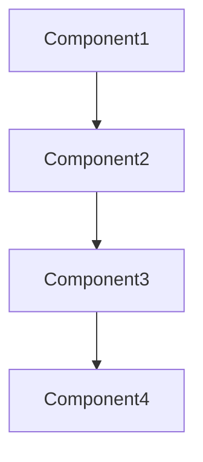

# Oozie Bundle原理与代码实例讲解

作者：禅与计算机程序设计艺术 / Zen and the Art of Computer Programming

## 1. 背景介绍

### 1.1 问题的由来

随着大数据技术的发展，数据处理的复杂性日益增加。在Hadoop生态系统下，有许多工具和框架可以用于数据处理，如Hive、Pig、Spark等。然而，这些工具通常需要独立运行，且缺乏统一的调度和管理机制。为了解决这一问题，Apache Oozie应运而生。

Oozie是一个开源的工作流管理系统，用于协调和管理Hadoop生态系统中的各种数据处理任务。它可以将多个任务组合成一个工作流，并以可重用的组件形式进行调度和执行。其中，Bundle是Oozie的核心概念之一，它允许用户将多个工作流组合成一个单元，从而实现更复杂的任务管理。

### 1.2 研究现状

目前，Oozie已经发展成为Hadoop生态系统中的一个重要工具，被广泛应用于数据处理、数据集成和数据分析等领域。随着大数据技术的不断发展，Oozie也在不断进行优化和改进，以适应不断变化的需求。

### 1.3 研究意义

深入了解Oozie Bundle的原理和实现，对于用户来说具有重要的意义：

1. 提高数据处理效率：通过合理地使用Bundle，可以优化工作流的执行顺序，减少冗余计算，从而提高整体效率。
2. 简化任务管理：将多个工作流组合成一个Bundle，可以方便地进行版本控制和维护。
3. 提高可复用性：Bundle中的组件可以复用于其他工作流，提高资源利用率。

### 1.4 本文结构

本文将首先介绍Oozie Bundle的核心概念和原理，然后通过一个实例讲解如何使用代码实现Bundle，最后分析Bundle在实际应用中的优势和局限性。

## 2. 核心概念与联系

### 2.1 Oozie Bundle概述

Bundle是Oozie中的核心概念之一，它允许用户将多个工作流组合成一个单元。在Bundle中，每个工作流称为一个组件（Component），这些组件可以按照特定的顺序执行，形成一个完整的工作流。

### 2.2 Bundle与工作流的关系

Bundle和工作流之间的关系可以类比于程序和函数：工作流是Bundle中的基本执行单元，而Bundle则是将多个工作流组织在一起，形成可重用的组件。

### 2.3 Bundle的优势

使用Bundle的优势主要体现在以下几个方面：

1. 简化任务管理：将多个工作流组合成一个Bundle，便于管理和维护。
2. 优化执行顺序：可以根据需求调整工作流之间的执行顺序，提高效率。
3. 提高可复用性：Bundle中的组件可以复用于其他工作流，提高资源利用率。

## 3. 核心算法原理 & 具体操作步骤

### 3.1 算法原理概述

Oozie Bundle的核心算法原理是利用XML描述Bundle的结构，并通过Oozie调度引擎进行执行。在Bundle中，用户可以通过配置组件间的依赖关系，实现工作流的有序执行。

### 3.2 算法步骤详解

1. **定义Bundle结构**：使用XML描述Bundle的结构，包括组件类型、执行顺序和依赖关系等。
2. **配置组件参数**：为每个组件配置所需的参数，如工作流路径、输入输出路径等。
3. **提交Bundle**：通过Oozie Web界面或命令行工具提交Bundle进行执行。
4. **调度执行**：Oozie调度引擎根据配置的执行顺序和依赖关系，依次执行Bundle中的组件。
5. **监控与日志**：Oozie提供了丰富的监控和日志功能，便于用户跟踪Bundle的执行状态和调试问题。

### 3.3 算法优缺点

**优点**：

1. 灵活性：用户可以根据需求灵活地定义Bundle的结构和组件。
2. 可复用性：组件可以复用于其他Bundle或工作流。
3. 高效性：Oozie调度引擎优化了工作流的执行顺序，提高了效率。

**缺点**：

1. 学习成本：用户需要熟悉Oozie和XML配置。
2. 复杂性：对于复杂的Bundle，配置和调试可能较为困难。

### 3.4 算法应用领域

Oozie Bundle在以下领域具有广泛的应用：

1. 大数据处理：利用Bundle管理Hadoop生态系统中的数据处理任务。
2. 数据集成：将多个数据源的数据进行整合，形成统一的数据视图。
3. 数据分析：将分析任务组合成工作流，实现数据挖掘和预测。

## 4. 数学模型和公式 & 详细讲解 & 举例说明

### 4.1 数学模型构建

Oozie Bundle的数学模型可以抽象为一个有向图，其中节点代表组件，边代表组件间的依赖关系。以下是Bundle的数学模型：



在这个模型中，组件1在组件2之前执行，组件2在组件3之前执行，组件3在组件4之前执行。

### 4.2 公式推导过程

在Oozie中，组件的执行顺序可以通过以下公式进行推导：

$$
\text{执行顺序} = \text{拓扑排序}(\text{Bundle结构图})
$$

其中，拓扑排序是一种对有向无环图进行排序的方法，能够确保所有有向边都从低编号的节点指向高编号的节点。

### 4.3 案例分析与讲解

假设我们要实现一个Bundle，其中包括以下四个组件：

1. 组件1：读取HDFS上的数据文件。
2. 组件2：对数据文件进行预处理。
3. 组件3：将预处理后的数据写入Hive表。
4. 组件4：从Hive表中查询数据，并生成报告。

以下是Bundle的XML配置：

```xml
< Bundle id="example_bundle" name="Example Bundle" xmlns="uri:oozie:bundle:0.2">
    < parameters>
        < parameter name="data_file" value="/input/data.txt" />
        < parameter name="preprocessed_file" value="/input/preprocessed.txt" />
        < parameter name="output_table" value="output_table" />
        < parameter name="report_file" value="/output/report.txt" />
    </ parameters>
    < components>
        < component id="read_data" type="shell">
            < action>
                < shell>
                    < command>hadoop fs -cat ${data_file}</command>
                </ shell>
            </ action>
        </ component>
        < component id="preprocess_data" type="shell">
            < action>
                < shell>
                    < command>python preprocess.py ${data_file} ${preprocessed_file}</command>
                </ shell>
            </ action>
        </ component>
        < component id="write_to_hive" type="hive">
            < action>
                < hive>
                    < script><![CDATA[
insert into table ${output_table} select * from ${preprocessed_file};
]]></script></hive>
            </ action>
        </ component>
        < component id="generate_report" type="shell">
            < action>
                < shell>
                    < command>python report.py ${output_table} ${report_file}</command>
                </ shell>
            </ action>
        </ component>
    </ components>
    < controls>
        < control-flow start-to-end="true">
            < start to="read_data" />
            < path start="read_data" end="preprocess_data" />
            < path start="preprocess_data" end="write_to_hive" />
            < path start="write_to_hive" end="generate_report" />
            < end from="generate_report" />
        </ control-flow>
    </ controls>
</ Bundle>
```

在这个例子中，组件1（读取数据）是Bundle的起始节点，执行完成后，控制流程跳转到组件2（预处理数据）。组件2执行完成后，控制流程跳转到组件3（写入Hive表）。组件3执行完成后，控制流程跳转到组件4（生成报告）。最后，执行完毕后返回到结束节点。

### 4.4 常见问题解答

**Q：Bundle中的组件是否可以并行执行？**

A：Oozie Bundle默认是串行执行组件的，但可以通过配置<or>标签实现并行执行。例如：

```xml
< or>
    < path start="component1" end="component2" />
    < path start="component3" end="component4" />
</ or>
```

在这个例子中，组件1和组件3将并行执行。

**Q：如何设置组件的执行顺序？**

A：可以通过配置<control-flow>标签中的<path>标签来设置组件的执行顺序。例如：

```xml
< control-flow start-to-end="true">
    < path start="component1" end="component2" />
    < path start="component2" end="component3" />
</ control-flow>
```

在这个例子中，组件1执行完成后，控制流程跳转到组件2，组件2执行完成后，控制流程跳转到组件3。

## 5. 项目实践：代码实例和详细解释说明

### 5.1 开发环境搭建

首先，我们需要安装Oozie和Hadoop环境。以下是Oozie的安装步骤：

1. 下载Oozie安装包。
2. 解压安装包并配置Oozie环境变量。
3. 修改Oozie配置文件，包括数据库配置、Hadoop配置等。
4. 启动Oozie服务。

### 5.2 源代码详细实现

以下是一个简单的Oozie Bundle示例，其中包含四个组件：

```xml
< Bundle id="example_bundle" name="Example Bundle" xmlns="uri:oozie:bundle:0.2">
    < parameters>
        < parameter name="input_file" value="/input/data.txt" />
        < parameter name="output_file" value="/output/output.txt" />
    </ parameters>
    < components>
        < component id="read_data" type="shell">
            < action>
                < shell>
                    < command>hadoop fs -cat ${input_file}</command>
                </ shell>
            </ action>
        </ component>
        < component id="process_data" type="python">
            < action>
                < python>
                    < script>data = [1, 2, 3, 4, 5]
                    result = [i ** 2 for i in data]
                    output_file = '${output_file}'
                    with open(output_file, 'w') as f:
                        for item in result:
                            f.write(str(item) + '\
')</script></python>
            </ action>
        </ component>
        < component id="write_data" type="shell">
            < action>
                < shell>
                    < command>hadoop fs -put ${output_file} ${output_file}</command>
                </ shell>
            </ action>
        </ component>
        < component id="cleanup" type="shell">
            < action>
                < shell>
                    < command>hadoop fs -rm -r ${output_file}</command>
                </ shell>
            </ action>
        </ component>
    </ components>
    < controls>
        < control-flow start-to-end="true">
            < start to="read_data" />
            < path start="read_data" end="process_data" />
            < path start="process_data" end="write_data" />
            < path start="write_data" end="cleanup" />
            < end from="cleanup" />
        </ control-flow>
    </ controls>
</ Bundle>
```

在这个例子中，组件1（读取数据）从HDFS读取数据文件，组件2（处理数据）使用Python脚本计算数据平方，并将结果写入输出文件，组件3（写入数据）将输出文件上传到HDFS，组件4（清理）删除临时文件。

### 5.3 代码解读与分析

1. **组件定义**：在<components>标签下定义了四个组件：读取数据、处理数据、写入数据和清理。
2. **参数配置**：在<parameters>标签下定义了输入文件和输出文件的路径。
3. **组件实现**：各个组件通过<action>标签下的子标签实现，如shell、python、hive等。
4. **控制流程**：在<control-flow>标签下定义了组件之间的执行顺序，通过<path>标签指定组件之间的依赖关系。

### 5.4 运行结果展示

在Oozie Web界面或命令行工具中提交Bundle，Oozie调度引擎将按照组件的执行顺序和依赖关系执行Bundle。执行完成后，可以在HDFS上查看输出文件。

## 6. 实际应用场景

### 6.1 大数据处理

在Hadoop生态系统中，Bundle可以用于管理大规模数据处理任务，如数据采集、清洗、转换和加载等。

### 6.2 数据集成

Bundle可以将来自不同数据源的数据整合成统一的数据视图，便于分析和管理。

### 6.3 数据分析

Bundle可以将多个分析任务组合成一个工作流，实现数据挖掘和预测。

### 6.4 未来应用展望

随着大数据技术的不断发展，Bundle在以下几个方面具有广阔的应用前景：

1. 云计算环境下的Bundle管理：随着云计算的普及，如何在云环境中高效地管理Bundle成为了一个重要研究方向。
2. Bundle与其他大数据工具的集成：将Bundle与其他大数据工具（如Spark、Flink等）进行集成，实现更复杂的数据处理任务。
3. Bundle的可视化设计：开发可视化工具，降低用户使用Bundle的门槛。

## 7. 工具和资源推荐

### 7.1 学习资源推荐

1. **Apache Oozie官方文档**：[https://oozie.apache.org/docs/latest/](https://oozie.apache.org/docs/latest/)
2. **《Hadoop权威指南》**: 作者：Tom White
3. **《大数据技术原理与应用》**: 作者：刘超

### 7.2 开发工具推荐

1. **Oozie Web界面**：用于提交、监控和管理Bundle。
2. **Oozie CLI**：用于提交、监控和管理Bundle的命令行工具。
3. **Eclipse Oozie Editor**：用于编辑Oozie Bundle的Eclipse插件。

### 7.3 相关论文推荐

1. **"Oozie: An extensible and scalable workflow management system for Hadoop"**: 作者：D. Borthakur等
2. **"A study of workflow management systems for scientific workflows"**: 作者：R. B. Griffith等

### 7.4 其他资源推荐

1. **Apache Oozie邮件列表**：[https://mail-archives.apache.org/group/oozie-user/](https://mail-archives.apache.org/group/oozie-user/)
2. **Stack Overflow**：[https://stackoverflow.com/questions/tagged/oozie](https://stackoverflow.com/questions/tagged/oozie)

## 8. 总结：未来发展趋势与挑战

Oozie Bundle作为Hadoop生态系统中的一个重要工具，在数据处理、数据集成和数据分析等领域具有广泛的应用前景。然而，随着大数据技术的不断发展，Bundle也面临着一些挑战：

1. **集成复杂性**：将Bundle与其他大数据工具进行集成，实现更复杂的数据处理任务。
2. **性能优化**：在云计算环境中，如何优化Bundle的性能。
3. **用户友好性**：提高Bundle的可视化设计和用户体验。

## 9. 附录：常见问题与解答

### 9.1 什么是Oozie Bundle？

Oozie Bundle是Apache Oozie中的一种组件，用于将多个工作流组合成一个可重用的单元，实现更复杂的任务管理。

### 9.2 Oozie Bundle与工作流有什么区别？

Oozie Bundle和工作流都是Oozie中的基本执行单元，但Bundle可以将多个工作流组合在一起，形成可重用的组件。

### 9.3 如何创建一个Oozie Bundle？

创建Oozie Bundle需要编写XML配置文件，定义Bundle的结构、组件、依赖关系等。

### 9.4 Oozie Bundle有哪些优点？

Oozie Bundle具有以下优点：

1. 简化任务管理：将多个工作流组合成一个Bundle，便于管理和维护。
2. 优化执行顺序：可以根据需求调整工作流之间的执行顺序，提高效率。
3. 提高可复用性：Bundle中的组件可以复用于其他工作流，提高资源利用率。

### 9.5 Oozie Bundle有哪些局限性？

Oozie Bundle的局限性主要体现在以下几个方面：

1. 学习成本：用户需要熟悉Oozie和XML配置。
2. 复杂性：对于复杂的Bundle，配置和调试可能较为困难。