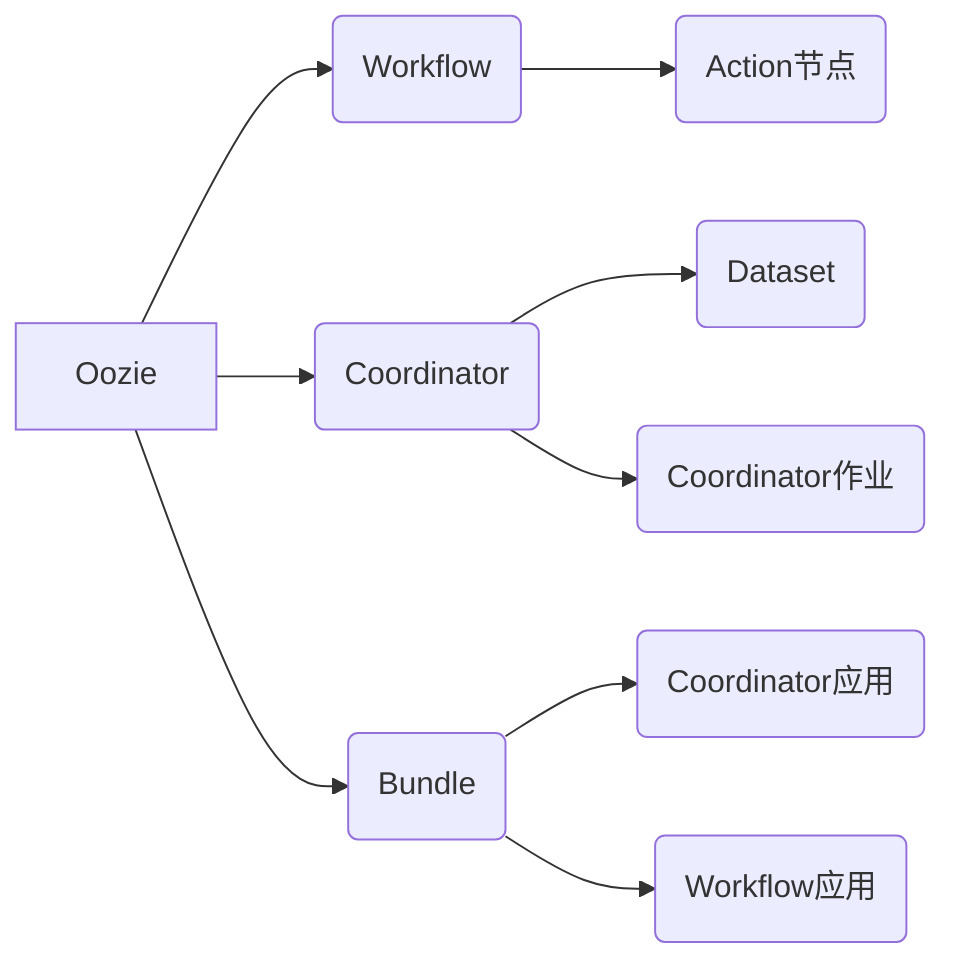
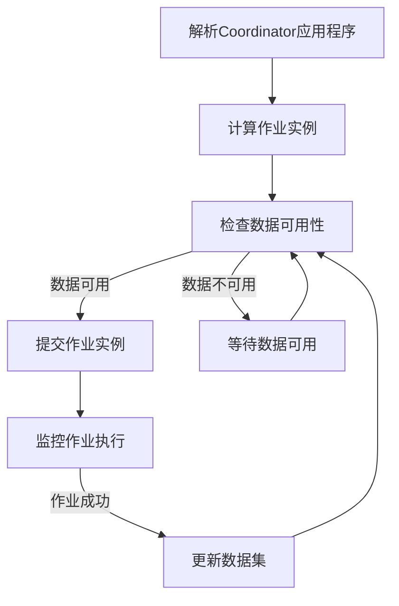

# Oozie Coordinator原理与代码实例讲解

## 1. 背景介绍

### 1.1 问题的由来

在大数据时代,数据处理任务通常需要协调多个作业的执行,这些作业可能存在复杂的依赖关系和时间约束。手动管理和调度这些任务是一项艰巨的挑战,容易出错且效率低下。因此,需要一种自动化的工作流调度系统来协调和管理这些复杂的数据处理流程。

### 1.2 研究现状

Apache Oozie是一个流行的开源工作流调度系统,被广泛用于管理Hadoop生态系统中的作业。它提供了一种声明式的方式来定义工作流,并支持多种类型的作业,如MapReduce、Spark、Hive等。Oozie还提供了一个称为Coordinator的功能,用于管理基于时间和数据可用性触发的重复作业。

### 1.3 研究意义

理解Oozie Coordinator的原理和实现细节对于有效管理和优化大数据处理流程至关重要。本文旨在深入探讨Oozie Coordinator的核心概念、算法原理、数学模型,并提供代码实例和详细解释,帮助读者掌握Oozie Coordinator的使用和开发技能。

### 1.4 本文结构

本文将从以下几个方面全面介绍Oozie Coordinator:

1. 核心概念与联系
2. 核心算法原理和具体操作步骤
3. 数学模型和公式详细讲解及案例分析
4. 项目实践:代码实例和详细解释说明
5. 实际应用场景
6. 工具和资源推荐
7. 总结:未来发展趋势与挑战
8. 附录:常见问题与解答

## 2. 核心概念与联系

### 2.1 Oozie概述

Apache Oozie是一个用于管理Hadoop作业的工作流调度系统。它支持多种类型的Hadoop作业,如MapReduce、Pig、Hive和Sqoop。Oozie使用XML定义工作流,并提供了一个Web控制台来监控和管理作业的执行。



### 2.2 Oozie Coordinator

Oozie Coordinator是Oozie的一个重要组件,用于管理基于时间和数据可用性触发的重复作业。它允许用户定义一个Coordinator应用程序,该应用程序包含一个或多个Coordinator作业。每个Coordinator作业都定义了一个数据集和一个工作流应用程序。

Coordinator作业的执行由以下三个主要概念驱动:

1. **Dataset**: 定义输入和输出数据的路径和模式。
2. **Coordinator作业**: 定义作业的执行计划,包括开始时间、结束时间、频率等。
3. **工作流应用程序**: 定义要执行的实际作业,如MapReduce、Hive或Pig作业。

### 2.3 Coordinator应用程序

Coordinator应用程序是一个XML文件,它定义了一个或多个Coordinator作业以及它们的依赖关系。每个Coordinator作业都与一个数据集和一个工作流应用程序相关联。Coordinator应用程序还可以包含一些全局配置,如超时、并发和重试策略等。

```xml
<coordinator-app>
  <start>2023-01-01T00:00Z</start>
  <end>2023-01-31T23:59Z</end>
  <action>
    <workflow>
      <app-path>hdfs://path/to/workflow.xml</app-path>
    </workflow>
  </action>
  <dataset>
    <dataset-name>myDataset</dataset-name>
    <frequency>${ coord:days(1) }</frequency>
    <uri-template>hdfs://path/to/data/${YEAR}/${MONTH}/${DAY}</uri-template>
  </dataset>
</coordinator-app>
```

在上面的示例中,Coordinator应用程序定义了一个Coordinator作业,该作业每天执行一次工作流应用程序,并处理指定路径下的数据。

## 3. 核心算法原理与具体操作步骤

### 3.1 算法原理概述

Oozie Coordinator的核心算法原理是基于时间和数据可用性来触发和执行作业。它包括以下主要步骤:

1. **解析Coordinator应用程序**: Oozie解析Coordinator应用程序的XML定义,提取出Coordinator作业、数据集和工作流应用程序的信息。

2. **计算作业实例**: 根据Coordinator作业的开始时间、结束时间和频率,Oozie计算出一系列作业实例的时间点。

3. **检查数据可用性**: 对于每个作业实例,Oozie检查相应的数据集是否可用。如果数据集可用,则将作业实例标记为"READY"状态。

4. **提交作业实例**: 对于处于"READY"状态的作业实例,Oozie将相应的工作流应用程序提交给Hadoop集群执行。

5. **监控作业执行**: Oozie监控作业实例的执行状态,并根据需要执行重试或错误处理策略。

6. **更新数据集**: 一旦作业实例成功执行,Oozie会更新相应的输出数据集,以便后续的作业实例可以使用这些数据。



### 3.2 算法步骤详解

1. **解析Coordinator应用程序**

Oozie使用XML解析器解析Coordinator应用程序的XML定义。它提取出以下关键信息:

- Coordinator作业的开始时间、结束时间和频率
- 数据集的路径模式和频率
- 工作流应用程序的路径

2. **计算作业实例**

根据Coordinator作业的开始时间、结束时间和频率,Oozie计算出一系列作业实例的时间点。例如,如果Coordinator作业设置为每天执行一次,并且开始时间是2023-01-01,结束时间是2023-01-31,那么Oozie将计算出31个作业实例,分别对应1月1日到1月31日的每一天。

3. **检查数据可用性**

对于每个作业实例,Oozie检查相应的数据集是否可用。它根据数据集的路径模式和频率计算出预期的数据路径,然后检查该路径下是否存在数据文件。如果数据文件存在,则将作业实例标记为"READY"状态,表示可以执行该作业实例。

4. **提交作业实例**

对于处于"READY"状态的作业实例,Oozie将相应的工作流应用程序提交给Hadoop集群执行。它会将必要的配置信息(如输入/输出路径)传递给工作流应用程序。

5. **监控作业执行**

Oozie监控作业实例的执行状态。如果作业实例执行失败,Oozie可以根据配置的重试策略重新提交该作业实例。如果达到最大重试次数仍然失败,Oozie将标记该作业实例为"FAILED"状态。

6. **更新数据集**

一旦作业实例成功执行,Oozie会更新相应的输出数据集。它将输出数据的路径添加到数据集的可用路径列表中,以便后续的作业实例可以使用这些数据。

### 3.3 算法优缺点

**优点**:

- **自动化**: Oozie Coordinator自动化了复杂的数据处理流程,减少了手动操作的需求。
- **可靠性**: Oozie确保作业按照预定的时间和数据可用性执行,提高了数据处理的可靠性。
- **灵活性**: Oozie支持多种类型的Hadoop作业,并允许用户定义复杂的依赖关系和执行策略。
- **可扩展性**: Oozie可以轻松地管理大量的作业实例,适用于大规模数据处理场景。

**缺点**:

- **复杂性**: Oozie的配置和管理可能比较复杂,需要一定的学习成本。
- **性能开销**: Oozie需要定期检查数据可用性和作业状态,这可能会带来一定的性能开销。
- **依赖Hadoop**: Oozie主要设计用于管理Hadoop作业,对于非Hadoop环境的应用场景可能存在限制。

### 3.4 算法应用领域

Oozie Coordinator广泛应用于以下领域:

- **大数据处理**: Oozie是管理Hadoop生态系统中复杂数据处理流程的理想选择。
- **ETL (提取、转换、加载)**: Oozie可以用于协调ETL流程中的多个步骤,如数据提取、转换和加载。
- **数据仓库**: Oozie可以自动化数据仓库中的数据加载和刷新过程。
- **机器学习**: Oozie可以用于管理机器学习流程中的数据预处理、模型训练和评估步骤。
- **日志处理**: Oozie可以协调日志数据的收集、处理和分析流程。

## 4. 数学模型和公式详细讲解及举例说明

### 4.1 数学模型构建

在Oozie Coordinator中,计算作业实例的时间点是一个关键步骤。我们可以构建一个数学模型来描述这个过程。

假设Coordinator作业的开始时间为$t_0$,结束时间为$t_n$,频率为$f$。我们需要计算出一系列时间点$t_1, t_2, \ldots, t_n$,其中每个时间点都满足以下条件:

$$
t_i = t_0 + i \times f, \quad i = 1, 2, \ldots, n
$$

其中$n$是作业实例的总数,可以通过以下公式计算:

$$
n = \left\lfloor \frac{t_n - t_0}{f} \right\rfloor + 1
$$

在上述模型中,我们假设频率$f$是一个固定的时间间隔,如每天、每周或每月。但在实际情况下,频率可能会更加复杂,例如基于日历或者基于数据可用性的触发条件。在这种情况下,我们需要构建更加复杂的数学模型来描述时间点的计算过程。

### 4.2 公式推导过程

现在,我们来推导一下如何计算作业实例的时间点。

假设Coordinator作业的开始时间为$t_0$,结束时间为$t_n$,频率为$f$。我们需要计算出一系列时间点$t_1, t_2, \ldots, t_n$,其中每个时间点都满足以下条件:

$$
t_i = t_0 + i \times f, \quad i = 1, 2, \ldots, n \tag{1}
$$

我们可以将式子(1)改写为:

$$
i = \frac{t_i - t_0}{f}, \quad i = 1, 2, \ldots, n \tag{2}
$$

由于$i$必须是一个整数,我们可以对式子(2)进行取整操作:

$$
i = \left\lfloor \frac{t_i - t_0}{f} \right\rfloor + 1, \quad i = 1, 2, \ldots, n \tag{3}
$$

式子(3)给出了如何计算作业实例的索引$i$。但是,我们还需要确定作业实例的总数$n$。

我们可以将式子(3)代入式子(1),得到:

$$
t_n = t_0 + n \times f \tag{4}
$$

由式子(4),我们可以解出$n$:

$$
n = \frac{t_n - t_0}{f} \tag{5}
$$

由于$n$必须是一个整数,我们需要对式子(5)进行取整操作:

$$
n = \left\lfloor \frac{t_n - t_0}{f} \right\rfloor + 1 \tag{6}
$$

式子(6)给出了如何计算作业实例的总数$n$。

综上所述,我们可以通过以下步骤计算出作业实例的时间点:

1. 计算作业实例的总数$n$,使用式子(6)。
2. 对于每个$i$从1到$n$,计算相应的时间点$t_i$,使用式子(3)。

### 4.3 案例分析与讲解

现在,让我们通过一个具体的案例来演示如何应用上述数学模型和公