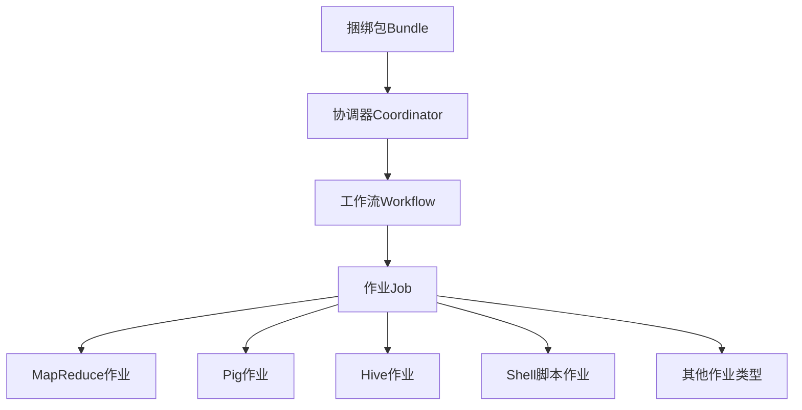

# Oozie原理与代码实例讲解

## 1. 背景介绍

### 1.1 问题的由来

在大数据时代,海量数据的处理和分析已经成为企业和组织面临的一大挑战。Apache Hadoop作为一个分布式计算框架,为大数据处理提供了可靠、高效的解决方案。然而,随着数据量和计算任务的增加,仅依赖Hadoop的MapReduce框架已经无法满足日益复杂的工作流调度需求。

传统的批处理作业通常由多个步骤组成,每个步骤之间存在依赖关系。手动调度和监控这些作业是一项艰巨的任务,容易出错且效率低下。因此,需要一个强大的工作流调度系统来自动化和协调这些复杂的数据处理流程。

### 1.2 研究现状

Apache Oozie应运而生,旨在解决Hadoop环境下工作流调度的问题。作为Hadoop的一个子项目,Oozie提供了一种强大的工作流调度服务,能够有效管理Hadoop作业(如MapReduce、Pig、Hive和Shell脚本等)的依赖关系和执行顺序。

Oozie采用了基于XML的工作流定义语言,允许用户通过编写XML文件来描述复杂的数据处理流程。它支持多种类型的作业,包括MapReduce、Pig、Hive、Sqoop和Shell等,并且可以灵活地组合这些作业,实现复杂的数据处理逻辑。

除了工作流调度功能外,Oozie还提供了协调器(Coordinator)和捆绑包(Bundle)等功能,用于管理基于时间或数据可用性触发的重复作业。这使得Oozie不仅适用于一次性的批处理作业,也可以处理需要周期性执行的长期运行作业。

### 1.3 研究意义

掌握Oozie的原理和使用方法,对于企业和组织高效利用大数据资源具有重要意义。通过Oozie,可以实现以下目标:

1. **自动化数据处理流程**:Oozie可以自动化复杂的数据处理流程,减少人工干预,提高效率和可靠性。
2. **优化资源利用**:通过合理安排作业的执行顺序和依赖关系,Oozie可以优化集群资源的利用,避免资源浪费。
3. **简化作业管理**:Oozie提供了统一的界面和API,简化了作业的创建、监控和管理过程。
4. **提高可维护性**:将复杂的数据处理流程定义在XML文件中,提高了代码的可维护性和可重用性。
5. **支持多种作业类型**:Oozie支持多种类型的作业,如MapReduce、Pig、Hive和Shell脚本等,满足了不同场景的需求。

通过深入理解Oozie的原理和实践,可以更好地利用Hadoop生态系统的强大功能,提高大数据处理的效率和质量。

### 1.4 本文结构

本文将全面介绍Oozie的原理和实践,内容安排如下:

1. 背景介绍:阐述Oozie的由来、研究现状和意义。
2. 核心概念与联系:介绍Oozie的核心概念,如工作流、协调器和捆绑包等,并说明它们之间的关系。
3. 核心算法原理与具体操作步骤:深入探讨Oozie的工作原理和算法,并详细讲解其具体操作步骤。
4. 数学模型和公式详细讲解举例说明:对Oozie中涉及的数学模型和公式进行详细推导和案例分析。
5. 项目实践:代码实例和详细解释说明:提供Oozie的实际代码示例,并进行详细的解读和分析。
6. 实际应用场景:介绍Oozie在不同领域的实际应用场景,并探讨其未来发展前景。
7. 工具和资源推荐:推荐Oozie相关的学习资源、开发工具和论文等。
8. 总结:未来发展趋势与挑战:总结Oozie的研究成果,并展望其未来发展趋势和面临的挑战。
9. 附录:常见问题与解答:列出使用Oozie过程中的常见问题及解答。

## 2. 核心概念与联系

在深入探讨Oozie的原理和实践之前,我们需要先了解一些核心概念。Oozie的核心概念包括工作流(Workflow)、协调器(Coordinator)、捆绑包(Bundle)和作业(Job)等。

### 2.1 工作流(Workflow)

工作流是Oozie中最基本的概念,它定义了一系列有依赖关系的作业。在工作流中,作业按照指定的顺序执行,前一个作业的输出可以作为后一个作业的输入。工作流通常用于描述复杂的数据处理流程,如ETL(提取、转换、加载)过程。

工作流由多个动作(Action)组成,每个动作可以是MapReduce作业、Pig作业、Hive作业、Shell脚本等。动作之间的依赖关系通过控制节点(Control Node)来定义,如`fork`(并行执行)、`join`(等待并行分支完成)、`decision`(根据条件执行不同分支)等。

工作流的定义使用XML文件描述,XML文件中包含了作业的详细信息、执行顺序和依赖关系等。Oozie根据这个XML文件来调度和执行工作流中的各个作业。

### 2.2 协调器(Coordinator)

协调器用于管理需要周期性执行的工作流。它可以根据时间触发器(如cron表达式)或数据可用性触发器(如HDFS目录或HCatalog表的变化)来启动工作流的执行。

协调器由多个动作组成,每个动作对应一次工作流的执行。协调器动作的执行顺序由开始时间、结束时间和执行频率等参数控制。协调器还支持各种超时和恢复策略,以确保作业的可靠性和容错性。

协调器的定义也使用XML文件描述,XML文件中包含了触发器、执行频率、超时设置等信息。Oozie根据这个XML文件来调度和执行协调器中的各个动作。

### 2.3 捆绑包(Bundle)

捆绑包用于管理多个协调器,它可以将多个相关的协调器组合在一起,统一调度和管理。捆绑包通常用于处理复杂的数据处理流程,其中涉及多个周期性执行的工作流。

捆绑包的定义也使用XML文件描述,XML文件中包含了所包含的协调器列表及其执行顺序等信息。Oozie根据这个XML文件来调度和执行捆绑包中的各个协调器。

### 2.4 作业(Job)

作业是Oozie中最小的执行单元,它可以是MapReduce作业、Pig作业、Hive作业、Shell脚本等。作业是工作流、协调器和捆绑包的基本组成部分,它们都是由一系列作业组成的。

Oozie支持多种类型的作业,包括:

- MapReduce作业
- Pig作业
- Hive作业
- Sqoop作业
- Shell脚本作业
- DistCp作业
- SSH作业
- Email作业
- ...

每种作业类型都有自己的配置参数和执行方式,Oozie根据作业类型和配置信息来调度和执行相应的作业。

### 2.5 核心概念关系

上述核心概念之间存在着紧密的关系,它们共同构成了Oozie的调度和执行框架。

1. 工作流由一系列有依赖关系的作业组成,是Oozie的基本执行单元。
2. 协调器用于管理需要周期性执行的工作流,它根据时间或数据触发器来启动工作流的执行。
3. 捆绑包用于管理多个协调器,它将相关的协调器组合在一起,统一调度和管理。
4. 作业是工作流、协调器和捆绑包的基本组成部分,它们都是由一系列作业组成的。

这些概念之间的关系如下图所示:

通过这些核心概念及其关系,Oozie提供了一种灵活、可扩展的方式来定义和管理复杂的数据处理流程,满足了企业和组织对大数据处理的需求。

## 3. 核心算法原理与具体操作步骤

### 3.1 算法原理概述

Oozie的核心算法原理是基于有向无环图(DAG)的拓扑排序算法。在工作流定义中,每个动作(Action)表示为一个节点,动作之间的依赖关系表示为有向边。Oozie通过对这个有向无环图进行拓扑排序,确定作业的执行顺序。

拓扑排序算法的基本思想是:对于一个有向无环图,如果存在一个节点入度为0(即没有其他节点指向它),那么这个节点就可以作为第一个执行的节点。删除这个节点及其出边后,重复上述过程,直到所有节点都被删除,即可得到一个拓扑序列。

在Oozie中,工作流定义XML文件描述了作业之间的依赖关系,Oozie将这些信息构建成一个有向无环图。然后,Oozie使用拓扑排序算法确定作业的执行顺序,并按照这个顺序依次执行每个作业。

除了基本的拓扑排序算法外,Oozie还支持一些控制节点,如`fork`(并行执行)、`join`(等待并行分支完成)、`decision`(根据条件执行不同分支)等。这些控制节点使得Oozie能够处理更加复杂的工作流逻辑。

### 3.2 算法步骤详解

Oozie的核心算法步骤可以概括为以下几个步骤:

1. **解析工作流定义XML文件**

   Oozie首先解析工作流定义XML文件,获取作业信息和依赖关系等数据。

2. **构建有向无环图**

   根据作业信息和依赖关系,Oozie构建一个有向无环图,其中每个节点表示一个作业,边表示作业之间的依赖关系。

3. **执行拓扑排序算法**

   Oozie对构建的有向无环图执行拓扑排序算法,确定作业的执行顺序。

4. **处理控制节点**

   在拓扑排序过程中,Oozie会遇到控制节点(如`fork`、`join`、`decision`等)。对于这些节点,Oozie会根据特定的规则进行处理,以确保工作流的正确执行。

5. **提交和执行作业**

   根据拓扑排序得到的顺序,Oozie依次提交和执行每个作业。

6. **监控作业状态**

   Oozie会持续监控作业的执行状态,一旦发现作业失败或超时,会根据配置的策略进行重试或终止操作。

7. **更新工作流状态**

   随着作业的执行,Oozie会实时更新工作流的状态,以反映当前的执行进度。

8. **处理工作流完成**

   当所有作业都执行完毕后,Oozie会将工作流标记为成功或失败状态,并执行相应的后续操作(如发送通知等)。

这些步骤保证了Oozie能够高效、可靠地执行复杂的工作流,满足企业和组织对大数据处理的需求。

### 3.3 算法优缺点

Oozie采用基于拓扑排序的算法具有以下优点:

1. **高效**:拓扑排序算法的时间复杂度为O(V+E),其中V是节点数,E是边数。对于大多数工作流,这个复杂度是可以接受的。
2. **可扩展性强**:算法可以处理任意规模的工作流,只要工作流定义合法(即不存在环路)。
3. **支持复杂逻辑**:通过控制节点(如`fork`、`join`、`decision`等),算法可以处理复杂的工作流逻辑。
4. **容错性好**:算法可以很好地处理作业失败或超时的情况,通过重试或终