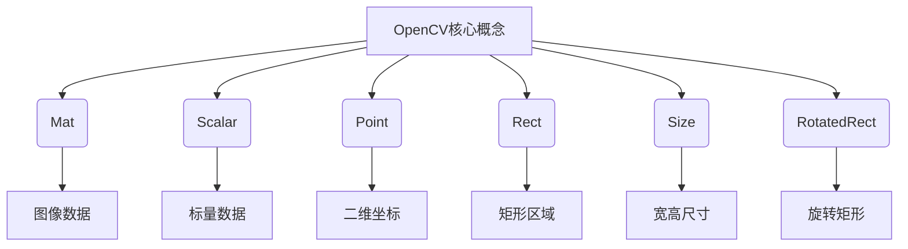

# OpenCV 原理与代码实战案例讲解

## 1. 背景介绍

### 1.1 问题的由来

在当今数字时代,图像和视频处理已经成为各个领域不可或缺的一部分。从安防监控、医疗影像诊断到自动驾驶汽车,图像处理技术无处不在。然而,开发高效、准确的图像处理算法并非易事,需要深入理解图像数据的本质特征,掌握各种图像处理技术的原理和实现方法。

### 1.2 研究现状 

OpenCV(Open Source Computer Vision Library)是一个跨平台的开源计算机视觉库,它提供了丰富的图像处理和计算机视觉算法。自2000年首次发布以来,OpenCV已成为学术界和工业界广泛使用的图像处理工具。它支持C++、Python、Java等多种编程语言,可以在Windows、Linux、macOS等操作系统上运行。

### 1.3 研究意义

深入学习OpenCV不仅可以帮助开发者掌握图像处理的核心理论和算法,还能通过大量实践案例加深对算法实现细节的理解。本文将系统地介绍OpenCV的核心概念、数学模型、关键算法,并结合大量代码示例,旨在为读者提供一个全面、实用的OpenCV学习资源。

### 1.4 本文结构

本文首先介绍OpenCV的核心概念和数据结构,然后详细阐述几种核心图像处理算法的原理和实现步骤。接下来,我们将构建数学模型,推导相关公式,并通过案例分析加深理解。在实践部分,我们将搭建开发环境,编写并解读OpenCV代码,展示运行结果。最后,本文将探讨OpenCV在各个领域的应用场景,分享学习资源和工具,总结未来发展趋势和面临的挑战。

## 2. 核心概念与联系

OpenCV库的核心概念包括:

1. **Mat**:OpenCV中最重要的数据结构,用于存储图像数据。Mat对象可以看作一个具有两个维度的数组,每个元素可以是标量(如灰度值)或向量(如BGR颜色值)。

2. **Scalar**:标量数据类型,可以表示灰度值、颜色值等。

3. **Point**:表示二维坐标的数据结构。

4. **Rect**:表示矩形区域的数据结构。

5. **Size**:表示宽度和高度的数据结构。

6. **RotatedRect**:表示旋转矩形的数据结构。

这些核心概念相互关联,共同构建了OpenCV图像处理的基础框架。例如,Mat对象存储了图像数据,而Point、Rect等结构描述了图像中感兴趣的区域或特征。算法通常以Mat对象作为输入,并产生新的Mat对象或其他结构作为输出。



## 3. 核心算法原理 & 具体操作步骤

OpenCV提供了大量图像处理算法,本节将重点介绍几种核心算法的原理和实现步骤。

### 3.1 算法原理概述

1. **图像滤波**:图像滤波是去除图像噪声、增强图像细节的基本操作。常用的线性滤波器包括均值滤波器、高斯滤波器等。

2. **边缘检测**:边缘检测旨在识别图像中物体的轮廓和边界。常用的边缘检测算法有Canny、Sobel等。

3. **图像阈值分割**:阈值分割是将图像分为前景和背景的简单而有效的方法。OpenCV提供了多种阈值分割算法,如二值化、自适应阈值等。

4. **形状分析**:形状分析包括查找轮廓、计算面积、周长等,是图像处理的重要环节。

5. **特征检测与描述**:特征检测与描述用于识别图像中的关键点和描述这些关键点的特征向量,在目标跟踪、图像拼接等任务中非常有用。常用算法包括SIFT、SURF等。

### 3.2 算法步骤详解

以图像滤波为例,我们将详细介绍算法的实现步骤:

1. **加载图像**:使用`cv::imread()`函数加载图像文件,得到Mat对象。

2. **创建滤波器内核**:根据需求创建滤波器内核,如均值滤波器内核`cv::getStructuringElement()`。

3. **执行滤波操作**:使用`cv::filter2D()`函数对图像进行滤波,指定输入图像、输出图像和滤波器内核。

4. **显示结果**:使用`cv::imshow()`函数显示原始图像和滤波后的结果。

以下是一段简单的均值滤波代码示例:

```cpp
#include <opencv2/opencv.hpp>

int main()
{
    // 加载图像
    cv::Mat image = cv::imread("image.jpg");
    
    // 创建均值滤波器内核
    cv::Mat kernel = cv::getStructuringElement(cv::MORPH_RECT, cv::Size(5, 5));
    
    // 执行均值滤波
    cv::Mat filtered;
    cv::filter2D(image, filtered, -1, kernel);
    
    // 显示结果
    cv::imshow("Original", image);
    cv::imshow("Filtered", filtered);
    cv::waitKey(0);
    
    return 0;
}
```

### 3.3 算法优缺点

每种算法都有其优缺点和适用场景:

- **图像滤波**:线性滤波器计算简单,但可能导致边缘模糊。非线性滤波器(如中值滤波)能更好地保留边缘,但计算开销较大。

- **边缘检测**:Canny算法能较好地检测边缘,但对噪声敏感。Sobel算法简单高效,但容易受噪声影响。

- **阈值分割**:简单、高效,但对噪声和光照变化敏感,难以处理复杂场景。

- **形状分析**:能够提取图像中物体的形状特征,但对背景和噪声敏感。

- **特征检测与描述**:能够鲁棒地检测和描述图像特征,在目标跟踪、图像拼接等任务中表现良好,但计算量较大。

### 3.4 算法应用领域

OpenCV的算法在诸多领域有广泛应用:

- **图像增强**:通过滤波、锐化等操作提高图像质量。
- **目标检测与跟踪**:利用边缘检测、形状分析等算法实现目标检测和跟踪。
- **运动分析**:通过背景建模、光流估计等技术分析运动目标。
- **图像拼接**:利用特征检测与描述算法实现全景图像拼接。
- **机器视觉**:在工业自动化、无人驾驶等领域应用图像处理算法。

## 4. 数学模型和公式 & 详细讲解 & 举例说明

许多图像处理算法都基于数学模型和公式,本节将介绍几种常见算法的数学原理。

### 4.1 数学模型构建

1. **图像卷积模型**:图像滤波、边缘检测等操作可以用卷积模型描述。设输入图像为$f(x,y)$,滤波器内核为$h(x,y)$,则输出图像$g(x,y)$可表示为:

$$g(x,y) = f(x,y) * h(x,y) = \sum_{i=-\infty}^{\infty}\sum_{j=-\infty}^{\infty}f(i,j)h(x-i,y-j)$$

2. **图像阈值分割模型**:对于灰度图像$f(x,y)$,设定阈值$T$,则二值化图像$g(x,y)$可表示为:

$$g(x,y) = \begin{cases}
1, & \text{if } f(x,y) \geq T\\
0, & \text{if } f(x,y) < T
\end{cases}$$

3. **形状分析模型**:设图像中某个物体的轮廓由$n$个点$(x_i,y_i)$构成,则该物体的面积$A$和周长$P$可分别表示为:

$$A = \frac{1}{2}\left|\sum_{i=0}^{n-1}(x_iy_{i+1} - x_{i+1}y_i)\right|$$
$$P = \sum_{i=0}^{n-1}\sqrt{(x_{i+1} - x_i)^2 + (y_{i+1} - y_i)^2}$$

### 4.2 公式推导过程

以图像卷积为例,我们将推导卷积公式:

设输入信号为$f(x,y)$,卷积核为$h(x,y)$,则卷积输出$g(x,y)$定义为:

$$g(x,y) = f(x,y) * h(x,y) = \iint_{-\infty}^{\infty}f(u,v)h(x-u,y-v)dudv$$

对离散信号,上式可改写为双重求和形式:

$$g(x,y) = \sum_{u=-\infty}^{\infty}\sum_{v=-\infty}^{\infty}f(u,v)h(x-u,y-v)$$

令$i=u,j=v$,则有:

$$g(x,y) = \sum_{i=-\infty}^{\infty}\sum_{j=-\infty}^{\infty}f(i,j)h(x-i,y-j)$$

这就是离散卷积公式的最终形式。

### 4.3 案例分析与讲解

**案例1:边缘检测**

Canny边缘检测算法包括以下几个步骤:

1. 使用高斯滤波器去除噪声
2. 计算图像梯度的幅值和方向
3. 对梯度幅值进行非极大值抑制
4. 使用双阈值算法检测并连接边缘

设图像为$f(x,y)$,高斯滤波器为$G(x,y)$,则去噪后的图像$f_s(x,y)$可表示为:

$$f_s(x,y) = f(x,y) * G(x,y)$$

对于去噪后的图像$f_s(x,y)$,其梯度幅值$M(x,y)$和方向$\theta(x,y)$可由下式计算:

$$\begin{aligned}
M(x,y) &= \sqrt{G_x^2(x,y) + G_y^2(x,y)}\\
\theta(x,y) &= \tan^{-1}\left(\frac{G_y(x,y)}{G_x(x,y)}\right)
\end{aligned}$$

其中$G_x$和$G_y$分别为$x$和$y$方向的梯度。

在非极大值抑制步骤中,对于每个像素点$(x,y)$,沿着梯度方向$\theta(x,y)$检查其邻域像素点,只保留梯度locally最大的点。

最后,使用双阈值算法连接边缘。设高阈值为$T_H$,低阈值为$T_L$,对于每个像素点$(x,y)$:

- 若$M(x,y) > T_H$,则为确定边缘点
- 若$M(x,y) < T_L$,则为非边缘点
- 若$T_L \leq M(x,y) \leq T_H$,则根据与确定边缘点的连接情况判断是否为边缘点

通过上述步骤,可以获得图像的精确边缘。

**案例2:图像拼接**

图像拼接的关键步骤是特征检测与描述。以SIFT算法为例:

1. 构建高斯金字塔,检测尺度空间极值点作为候选特征点
2. 对候选特征点进行精确定位,去除不稳定的边缘响应点
3. 为每个特征点确定主方向,使其具有旋转不变性
4. 根据主方向构建特征向量,描述特征点的邻域信息

设图像为$I(x,y)$,在尺度空间$\sigma$处的高斯卷积图像为:

$$L(x,y,\sigma) = G(x,y,\sigma) * I(x,y)$$

其中$G(x,y,\sigma)$为高斯核。尺度空间极值点$(x,y,\sigma)$满足:

$$\frac{\partial^2 L}{\partial x^2} = \frac{\partial^2 L}{\partial y^2} = \frac{\partial^2 L}{\partial \sigma^2} = 0$$