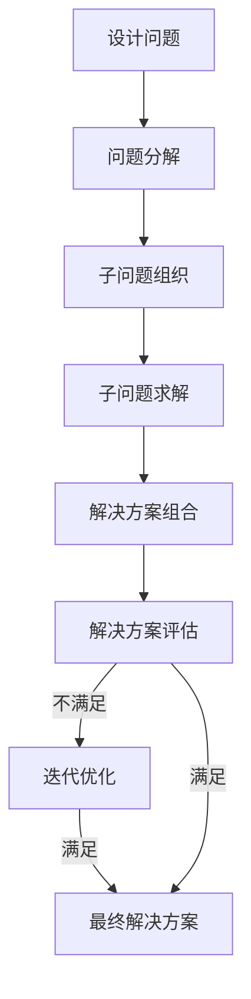

# Parti在设计领域的应用

## 1. 背景介绍

### 1.1 问题的由来

在当今快节奏的设计领域中,设计师们面临着越来越多的挑战。随着技术的不断进步和用户需求的日益多样化,传统的设计方法已经无法满足现代设计的复杂性和创新性要求。因此,设计师们需要一种新的方法来应对这些挑战,提高设计效率和质量。

Parti(Parti Tutti Frutti)作为一种新兴的设计方法,近年来在设计界引起了广泛关注。它源于建筑设计领域,旨在通过将复杂的设计问题分解为更小、更易管理的部分,从而简化设计过程,提高设计质量。

### 1.2 研究现状  

尽管Parti在建筑设计领域已经得到了广泛应用,但在其他设计领域的应用还处于初级阶段。一些先驱设计师和研究人员已经开始探索将Parti应用于产品设计、交互设计、服务设计等领域的可能性,并取得了一定成果。然而,由于缺乏系统的理论指导和实践案例,Parti在这些领域的应用仍然面临着诸多挑战。

### 1.3 研究意义

将Parti应用于设计领域具有重要意义:

1. **提高设计效率**:通过将复杂问题分解为更小的部分,设计师可以更好地管理设计过程,减少出错的可能性,从而提高设计效率。

2. **促进创新思维**:Parti鼓励设计师从不同角度思考问题,探索新的解决方案,有助于激发创新思维。

3. **提升设计质量**:通过系统化的分解和组合过程,Parti可以帮助设计师更好地理解和解决设计问题,从而提升设计质量。

4. **跨领域协作**:Parti为不同设计领域之间的协作提供了一种共同语言和方法,有助于促进跨领域交流和合作。

### 1.4 本文结构

本文将全面探讨Parti在设计领域的应用。首先介绍Parti的核心概念和原理,然后详细阐述其在不同设计领域的应用方法和案例。此外,还将讨论Parti的数学模型和公式,以及相关的编程实现。最后,本文将总结Parti在设计领域的发展趋势和挑战,并提供相关资源推荐。

## 2. 核心概念与联系

Parti的核心概念是将复杂的设计问题分解为更小、更易管理的部分,然后通过组合这些部分形成整体解决方案。这个过程涉及以下几个关键步骤:

1. **分解(Decomposition)**: 将设计问题分解为更小、更具体的子问题。

2. **组织(Organization)**: 对分解后的子问题进行逻辑上的组织和排序。

3. **组合(Composition)**: 将组织好的子问题组合成一个整体解决方案。

4. **评估(Evaluation)**: 对组合后的解决方案进行评估,并根据需要进行迭代和优化。

Parti的核心思想源于系统思维和模块化设计的理念,强调通过分解和组合的方式来管理复杂性。它与其他一些设计方法和理论存在密切联系,例如:

- **设计模式(Design Patterns)**: Parti可以被视为一种高层次的设计模式,用于指导设计过程的整体流程。

- **面向对象设计(Object-Oriented Design)**: Parti的分解和组合过程与面向对象设计中的封装和继承概念有一定相似之处。

- **模块化设计(Modular Design)**: Parti强调将系统分解为独立的模块,与模块化设计的理念一致。

- **系统思维(Systems Thinking)**: Parti要求设计师从整体出发,考虑系统的各个部分之间的相互关系和影响,与系统思维的理念相符。

通过将Parti与其他设计理论和方法相结合,设计师可以更好地管理设计过程的复杂性,提高设计质量和效率。

## 3. 核心算法原理 & 具体操作步骤

### 3.1 算法原理概述

Parti算法的核心原理是通过分解、组织、组合和评估的循环过程,逐步构建出设计解决方案。具体来说,算法包括以下几个主要步骤:

1. **问题分解(Problem Decomposition)**: 将原始设计问题分解为更小、更具体的子问题。这个过程可以根据不同的分解策略(如功能分解、结构分解等)进行。

2. **子问题组织(Subproblem Organization)**: 对分解后的子问题进行逻辑上的组织和排序,确定它们之间的依赖关系和优先级。

3. **子问题求解(Subproblem Solving)**: 针对每个子问题,采用适当的方法和技术进行求解,得到子解决方案。

4. **解决方案组合(Solution Composition)**: 将子解决方案按照一定的组合策略(如层次组合、平行组合等)进行组合,形成整体解决方案。

5. **解决方案评估(Solution Evaluation)**: 对组合后的解决方案进行评估,检查是否满足设计约束和需求。如果不满足,则需要进行迭代优化。

6. **迭代优化(Iterative Optimization)**: 根据评估结果,对分解、组织、求解或组合的过程进行调整和优化,重复上述步骤,直到得到满意的解决方案。

该算法的核心思想是将复杂问题分解为更小的子问题,分别求解后再进行组合,从而降低了问题的复杂度,提高了解决效率。同时,通过迭代优化的过程,可以不断改进和完善解决方案,确保其满足设计需求。

### 3.2 算法步骤详解

1. **问题分解(Problem Decomposition)**

   在这一步骤中,设计师需要将原始的设计问题分解为更小、更具体的子问题。分解的策略可以根据不同的设计领域和问题类型而有所不同,常见的分解策略包括:

   - **功能分解(Functional Decomposition)**: 根据系统的功能将问题分解为不同的功能模块。
   - **结构分解(Structural Decomposition)**: 根据系统的物理结构或逻辑结构将问题分解为不同的组件或子系统。
   - **过程分解(Process Decomposition)**: 根据设计过程的不同阶段将问题分解为不同的任务或活动。

   分解的过程可以是自顶向下(Top-Down)的,也可以是自底向上(Bottom-Up)的,甚至可以是两者结合的方式。分解的深度和粒度需要根据具体问题的复杂程度和设计需求进行调整。

2. **子问题组织(Subproblem Organization)**

   在对问题进行分解之后,需要对分解后的子问题进行逻辑上的组织和排序。这一步骤的目的是确定子问题之间的依赖关系和优先级,为后续的求解和组合奠定基础。常见的组织策略包括:

   - **层次组织(Hierarchical Organization)**: 根据子问题之间的包含关系,构建一个层次结构。
   - **网状组织(Network Organization)**: 根据子问题之间的相互依赖关系,构建一个网状结构。
   - **时序组织(Sequential Organization)**: 根据子问题需要被解决的先后顺序,构建一个时序结构。

   组织策略的选择需要考虑设计问题的性质、子问题之间的关系,以及设计师的偏好和经验。良好的组织能够提高后续求解和组合的效率,减少不必要的重复工作。

3. **子问题求解(Subproblem Solving)**

   在组织好子问题之后,设计师需要针对每个子问题采用适当的方法和技术进行求解,得到子解决方案。求解的方法可以是分析性的、试验性的或者两者结合的方式。常见的求解方法包括:

   - **分析法(Analytical Methods)**: 利用数学模型、公式推导等分析方法求解子问题。
   - **试验法(Experimental Methods)**: 通过实验、原型制作等试验方法求解子问题。
   - **启发式方法(Heuristic Methods)**: 利用经验法则、最佳实践等启发式方法求解子问题。

   求解过程中,设计师可能需要进行多次迭代和优化,直到得到满意的子解决方案。同时,也需要注意子解决方案之间的一致性和兼容性,为后续的组合奠定基础。

4. **解决方案组合(Solution Composition)**

   在得到各个子解决方案之后,设计师需要将它们按照一定的组合策略进行组合,形成整体解决方案。常见的组合策略包括:

   - **层次组合(Hierarchical Composition)**: 根据子解决方案之间的包含关系,按照层次结构进行组合。
   - **平行组合(Parallel Composition)**: 将独立的子解决方案并行组合在一起。
   - **序列组合(Sequential Composition)**: 根据子解决方案的时序关系,按照一定顺序进行组合。

   组合过程中,设计师需要注意子解决方案之间的接口和交互,确保它们能够无缝地集成在一起。同时,也需要考虑整体解决方案的一致性、可维护性和可扩展性等因素。

5. **解决方案评估(Solution Evaluation)**

   在组合出整体解决方案之后,设计师需要对其进行评估,检查是否满足设计约束和需求。评估的标准可以包括:

   - **功能性(Functionality)**: 解决方案是否满足预期的功能需求。
   - **可用性(Usability)**: 解决方案是否易于使用和理解。
   - **可维护性(Maintainability)**: 解决方案是否易于维护和升级。
   - **可扩展性(Scalability)**: 解决方案是否能够适应未来的扩展需求。
   - **成本(Cost)**: 解决方案的实现和运营成本是否在可接受范围内。

   如果评估结果不满意,设计师需要对分解、组织、求解或组合的过程进行调整和优化,重复上述步骤,直到得到满意的解决方案。

6. **迭代优化(Iterative Optimization)**

   迭代优化是Parti算法的核心环节之一。在评估解决方案的过程中,设计师可能会发现一些问题或改进的空间,需要对之前的步骤进行调整和优化。常见的优化策略包括:

   - **重新分解(Redecomposition)**: 对原始问题进行重新分解,采用不同的分解策略或粒度。
   - **重新组织(Reorganization)**: 对子问题进行重新组织,调整它们之间的依赖关系和优先级。
   - **替代求解(Alternative Solving)**: 对某些子问题采用不同的求解方法和技术。
   - **重新组合(Recomposition)**: 对子解决方案采用不同的组合策略进行组合。

   通过不断地迭代优化,设计师可以逐步改进和完善解决方案,直到满足设计需求和约束条件。迭代优化的次数和深度需要根据具体问题的复杂程度和设计目标进行调整。

### 3.3 算法优缺点

Parti算法具有以下优点:

1. **降低复杂性**: 通过将复杂问题分解为更小的子问题,降低了问题的整体复杂度,使得设计过程更加可控和高效。

2. **模块化设计**: 算法鼓励模块化设计,每个子问题可以被视为一个独立的模块,有利于代码重用和维护。

3. **提高可扩展性**: 由于解决方案是通过组合子解决方案构建的,因此具有良好的可扩展性,可以方便地添加或修改功能模块。

4. **促进协作**: 算法将设计过程分解为多个子任务,有利于团队协作和分工,提高了设计效率。

5. **迭代优化**: 算法支持迭代优化,可以不断改进和完善解决方案,确保满足设计需求。

然而,Parti算法也存在一些缺点:

1. **子问题依赖