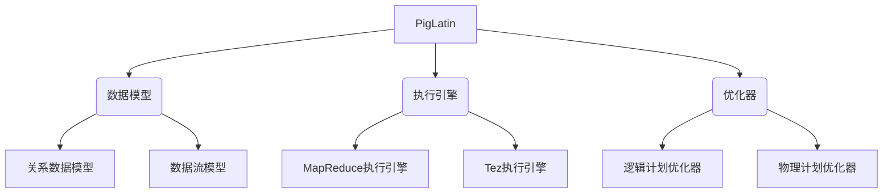

# PigLatin 的数据存储与访问方法

## 1. 背景介绍

### 1.1 问题的由来

在大数据时代,数据的存储和高效访问成为了一个越来越受关注的问题。传统的关系型数据库在处理海量数据时,性能和扩展性方面都存在一定的瓶颈。为了解决这一问题,一种新型的数据存储和访问方案应运而生 —— PigLatin。

PigLatin 是一种用于大数据处理的高级语言,它建立在 Hadoop 之上,为分析家和研究人员提供了一种简单、高效的方式来处理大规模数据集。PigLatin 的出现,旨在简化 MapReduce 的编程模型,使开发人员能够更加轻松地编写和维护大数据应用程序。

### 1.2 研究现状

目前,PigLatin 已经成为 Hadoop 生态系统中一个非常重要的组件,被广泛应用于各个领域的大数据处理任务中。许多知名公司和组织,如 Yahoo、Twitter、LinkedIn 等,都在生产环境中使用 PigLatin 进行数据分析和处理。

然而,尽管 PigLatin 提供了强大的数据处理能力,但在数据存储和访问方面,它还存在一些需要改进的地方。例如,PigLatin 默认将中间数据存储在 HDFS 中,这可能会导致性能瓶颈和数据热点问题。此外,PigLatin 的查询优化机制也有待进一步完善,以提高查询执行效率。

### 1.3 研究意义

优化 PigLatin 的数据存储和访问方式,对于提高大数据处理的效率和可扩展性至关重要。通过研究新的存储方案和访问策略,我们可以更好地利用现有硬件资源,缓解数据热点问题,并提高查询执行速度。

此外,对 PigLatin 的数据存储和访问方法进行深入研究,也有助于我们更好地理解大数据处理的本质,为未来的系统优化和新技术的发展提供理论基础。

### 1.4 本文结构

本文将详细探讨 PigLatin 的数据存储和访问方法,内容安排如下:

1. 背景介绍
2. PigLatin 核心概念与架构
3. PigLatin 数据存储方案
4. PigLatin 数据访问策略
5. 性能优化技术
6. 实际应用案例
7. 未来发展趋势与挑战
8. 总结

## 2. 核心概念与联系

在深入探讨 PigLatin 的数据存储和访问方法之前,我们先来了解一下 PigLatin 的核心概念和架构,为后续内容做好铺垫。

如上图所示,PigLatin 主要由以下几个核心组件组成:

1. **数据模型**:PigLatin 采用了两种数据模型,分别是关系数据模型和数据流模型。关系数据模型用于描述数据集的结构,而数据流模型则描述了对数据集进行转换的一系列操作。

2. **执行引擎**:PigLatin 可以选择使用 MapReduce 或 Tez 作为底层执行引擎,将数据流模型转换为实际的任务执行计划。

3. **优化器**:PigLatin 优化器分为逻辑计划优化器和物理计划优化器两个部分。逻辑计划优化器负责优化逻辑执行计划,而物理计划优化器则针对物理执行计划进行优化,以提高执行效率。

这些核心概念和组件的有机结合,赋予了 PigLatin 强大的数据处理能力。在后续章节中,我们将重点探讨 PigLatin 在数据存储和访问方面的实现细节。

## 3. 核心算法原理 & 具体操作步骤

### 3.1 算法原理概述

PigLatin 的数据存储和访问方案,主要基于以下几个核心算法原理:

1. **列式存储**:与传统的行式存储不同,PigLatin 采用了列式存储的方式,将数据按列进行组织和存储。这种存储方式有利于减少 I/O 开销,提高查询效率。

2. **数据分区**:为了提高数据访问的并行度,PigLatin 会根据某些列的值对数据进行分区存储,使相关数据位于同一个分区中。

3. **数据编码**:为了节省存储空间和提高传输效率,PigLatin 会对数据进行编码压缩,常见的编码方式包括字典编码、运行长度编码等。

4. **数据缓存**:PigLatin 会根据访问模式,将热点数据缓存在内存中,以加快数据访问速度。

5. **查询优化**:PigLatin 的优化器会根据查询语句和数据统计信息,生成最优的执行计划,以提高查询性能。

这些算法原理相互配合,共同构建了 PigLatin 高效的数据存储和访问架构。

### 3.2 算法步骤详解

接下来,我们将详细介绍 PigLatin 数据存储和访问的具体算法步骤。

#### 3.2.1 数据加载

在加载数据到 PigLatin 之前,需要先对原始数据进行预处理,包括数据清洗、格式转换等操作。然后,PigLatin 会根据指定的存储格式(如 ORCFile、Parquet 等)将数据加载到 HDFS 或其他分布式文件系统中。

在加载过程中,PigLatin 会对数据进行分区,以提高后续查询的并行度。分区策略可以由用户自定义,也可以由 PigLatin 根据数据统计信息自动确定。

#### 3.2.2 数据编码

为了节省存储空间和提高传输效率,PigLatin 会对加载的数据进行编码压缩。常见的编码方式包括:

1. **字典编码**:将重复出现的值映射为一个短的编码,以减小存储空间。
2. **运行长度编码**:对于连续重复的值,使用一个值和重复次数的组合来表示,从而达到压缩的目的。
3. **比特向量编码**:对于布尔类型或取值范围有限的列,使用比特向量来表示,可以大幅减小存储空间。

编码方式的选择取决于数据的特征和分布情况,PigLatin 会根据数据统计信息自动选择合适的编码策略。

#### 3.2.3 数据存储

经过编码压缩后,PigLatin 会将数据按列式的方式存储在分布式文件系统中。每一列的数据都会被分割成多个数据块,并分布存储在不同的节点上,以实现数据的并行访问。

在存储过程中,PigLatin 还会维护一些元数据信息,如列的编码方式、数据块的位置等,以便后续的查询和优化。

#### 3.2.4 数据缓存

为了加快热点数据的访问速度,PigLatin 会将常用的数据缓存在内存中。缓存策略可以由用户自定义,也可以由 PigLatin 根据访问模式自动确定。

常见的缓存策略包括:

1. **LRU 缓存**:根据最近最少使用原则,淘汰最久未访问的数据块。
2. **优先级缓存**:根据数据的重要性和访问频率,为不同的数据块分配不同的缓存优先级。
3. **预取缓存**:根据查询模式,预取可能会被访问的数据块,以提高缓存命中率。

缓存策略的选择需要权衡内存占用和查询性能之间的平衡。

#### 3.2.5 查询执行

当用户提交一个 PigLatin 查询语句时,PigLatin 优化器会根据数据统计信息和查询语句,生成一个最优的执行计划。

执行计划包括多个阶段,每个阶段都会对数据进行一系列转换操作,如过滤、聚合、连接等。这些操作会被转换为一个或多个 MapReduce 任务,并由底层的执行引擎(如 MapReduce 或 Tez)并行执行。

在执行过程中,PigLatin 会根据需要从分布式文件系统读取相应的数据块,并对数据进行解码。如果数据已被缓存在内存中,则可以直接从缓存中读取,以提高访问速度。

执行完成后,PigLatin 会将结果数据存储回分布式文件系统,或者直接返回给用户。

### 3.3 算法优缺点

PigLatin 的数据存储和访问方案具有以下优点:

1. **高效的数据压缩**:通过编码压缩,可以大幅减小数据的存储空间,从而降低存储成本。
2. **并行访问能力**:列式存储和数据分区策略,使得 PigLatin 能够高效地并行访问数据,提高查询性能。
3. **灵活的缓存策略**:PigLatin 提供了多种缓存策略,用户可以根据实际需求进行调整,以获得最佳的查询性能。
4. **自动查询优化**:PigLatin 优化器可以根据数据统计信息和查询语句,自动生成最优的执行计划,提高查询效率。

同时,PigLatin 的数据存储和访问方案也存在一些缺点:

1. **编码解码开销**:数据的编码和解码过程会带来一定的计算开销,对于计算密集型的查询,这可能会成为性能瓶颈。
2. **更新效率较低**:由于列式存储的特性,PigLatin 对于数据的更新操作效率较低,更适合于批量数据处理场景。
3. **元数据维护成本**:PigLatin 需要维护大量的元数据信息,如编码方式、数据块位置等,这会增加系统的复杂性和维护成本。

总的来说,PigLatin 的数据存储和访问方案更加适合于大规模数据的批量分析场景,在这种场景下,它可以发挥出较高的查询性能。但对于需要频繁更新的场景,PigLatin 可能就不太适用了。

### 3.4 算法应用领域

PigLatin 的数据存储和访问方案广泛应用于以下领域:

1. **网络日志分析**:对于互联网公司而言,分析海量的网络日志数据是一项非常重要的任务。PigLatin 可以高效地存储和查询这些数据,为网络优化和用户行为分析提供支持。

2. **电商用户行为分析**:在电商领域,分析用户的购买行为和浏览习惯对于个性化推荐和营销策略非常关键。PigLatin 可以帮助电商企业高效地处理和挖掘海量的用户行为数据。

3. **金融风险分析**:金融机构需要对大量的交易数据进行实时监控和分析,以发现潜在的风险和欺诈行为。PigLatin 可以提供高效的数据存储和查询能力,支持这一分析过程。

4. **生物信息学分析**:在生物信息学领域,研究人员需要处理和分析大量的基因组数据。PigLatin 可以帮助他们高效地存储和查询这些数据,加快研究进程。

5. **社交网络分析**:社交网络平台每天都会产生大量的用户互动数据,PigLatin 可以帮助分析这些数据,了解用户行为模式和社交关系网络。

总的来说,PigLatin 的数据存储和访问方案适用于任何需要处理海量数据的领域,它可以为数据分析和挖掘提供高效的支持。

## 4. 数学模型和公式 & 详细讲解 & 举例说明

在探讨 PigLatin 的数据存储和访问方法时,我们需要借助一些数学模型和公式来量化和优化相关的指标,如存储空间、查询延迟等。在这一章节中,我们将详细介绍这些数学模型和公式,并通过具体案例进行讲解和说明。

### 4.1 数学模型构建

#### 4.