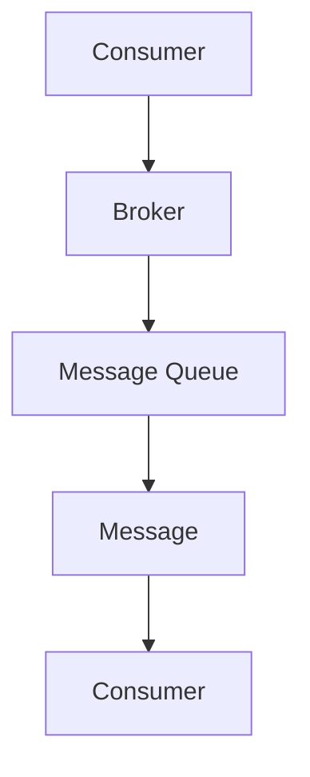

# Pulsar Consumer原理与代码实例讲解

作者：禅与计算机程序设计艺术 / Zen and the Art of Computer Programming

## 1. 背景介绍

### 1.1 问题的由来

随着分布式系统的普及，对实时数据处理的需求日益增长。Apache Pulsar 是一个高性能、可扩展、具有高可靠性的分布式发布/订阅消息系统，广泛应用于微服务架构、实时计算和流处理等领域。Pulsar Consumer 作为 Pulsar 的核心组件之一，负责从消息流中读取数据。深入理解 Pulsar Consumer 的原理和实现，对于构建高效、稳定的分布式系统具有重要意义。

### 1.2 研究现状

Pulsar Consumer 目前已广泛应用于多种场景，包括但不限于：

* **金融风控**：实时监控交易数据，及时发现异常交易。
* **物联网**：处理来自物联网设备的海量实时数据。
* **日志收集**：收集和分析日志数据，实现实时监控和报警。
* **流处理**：实时处理和分析流数据，实现实时决策。

### 1.3 研究意义

深入理解 Pulsar Consumer 的原理和实现，有助于：

* **提高分布式系统的性能和可靠性**。
* **优化数据处理的效率和实时性**。
* **更好地设计和实现基于 Pulsar 的应用**。

### 1.4 本文结构

本文将从以下几个方面对 Pulsar Consumer 进行讲解：

* 核心概念与联系
* 核心算法原理与具体操作步骤
* 数学模型和公式
* 项目实践：代码实例
* 实际应用场景
* 工具和资源推荐
* 总结：未来发展趋势与挑战

## 2. 核心概念与联系

### 2.1 Pulsar 简介

Apache Pulsar 是一个高性能、可扩展、具有高可靠性的分布式发布/订阅消息系统，由 Yahoo! 公司开发并开源。Pulsar 旨在提供一种高效、稳定、可伸缩的解决方案，以应对实时数据处理的挑战。

### 2.2 Pulsar 的架构

Pulsar 架构主要由以下组件构成：

* **Bookkeeper**: 负责存储 Pulsar 消息的元数据，如消息偏移量、分区信息等。
* **Broker**: 负责处理客户端的请求，如发布、订阅、读取消息等。
* **Pulsar Admin**: 提供了 Pulsar 的管理界面，用于创建、删除主题、分区等操作。
* **Pulsar Functions**: 用于在 Pulsar 之上构建实时计算和流处理应用。

### 2.3 Pulsar Consumer 的角色

Pulsar Consumer 是 Pulsar 的核心组件之一，负责从消息流中读取数据。Pulsar Consumer 可以订阅多个主题，并按照指定的消费模式（如独占模式、共享模式）读取消息。

## 3. 核心算法原理 & 具体操作步骤

### 3.1 算法原理概述

Pulsar Consumer 的核心算法原理可以概括为以下步骤：

1. **连接到 Broker**：Consumer 连接到指定的 Broker，并建立连接。
2. **订阅主题**：Consumer 向 Broker 发送订阅请求，指定订阅的主题和消费模式。
3. **读取消息**：Consumer 从 Broker 读取消息，并按照指定的消费模式进行处理。
4. **处理消息**：Consumer 对读取到的消息进行相应的处理，如存储、分析、处理等。
5. **提交偏移量**：Consumer 将已处理消息的偏移量提交给 Broker，以便 Broker 知道哪些消息已被处理。

### 3.2 算法步骤详解

#### 3.2.1 连接到 Broker

Consumer 通过 RESTful API 或 Netty 框架与 Broker 建立连接。连接过程包括以下几个步骤：

1. **握手**：Consumer 向 Broker 发送握手请求，包括版本信息、认证信息等。
2. **认证**：Broker 验证 Consumer 的身份。
3. **建立连接**：Consumer 与 Broker 建立稳定的连接。

#### 3.2.2 订阅主题

Consumer 向 Broker 发送订阅请求，包括以下信息：

* 主题名称
* 消费模式（独占模式、共享模式等）
* 负载均衡策略
* 消息偏移量

#### 3.2.3 读取消息

Consumer 按照指定的消费模式从 Broker 读取消息。以下是两种常见的消费模式：

* **独占模式**：Consumer 在一个时间点只能由一个 Consumer 读取消息。当 Consumer 读取到消息后，会将其偏移量提交给 Broker，其他 Consumer 无法读取该消息。
* **共享模式**：多个 Consumer 可以同时读取同一主题的消息。在共享模式下，每个 Consumer 读取到的消息偏移量可能不同。

#### 3.2.4 处理消息

Consumer 对读取到的消息进行相应的处理，如存储、分析、处理等。

#### 3.2.5 提交偏移量

Consumer 将已处理消息的偏移量提交给 Broker，以便 Broker 知道哪些消息已被处理。

### 3.3 算法优缺点

#### 3.3.1 优点

* **高可靠性**：Pulsar Consumer 具有高可靠性，即使在发生网络故障或 Broker 故障的情况下，也能保证消息的完整性和一致性。
* **可扩展性**：Pulsar Consumer 可以横向扩展，以满足不同场景下的性能需求。
* **灵活的消费模式**：支持多种消费模式，满足不同场景下的需求。

#### 3.3.2 缺点

* **资源消耗**：Pulsar Consumer 需要消耗一定的系统资源，如 CPU、内存等。
* **复杂性**：Pulsar Consumer 的实现相对复杂，需要一定的技术背景才能理解和应用。

### 3.4 算法应用领域

Pulsar Consumer 在以下领域具有广泛的应用：

* **实时数据处理**：如金融风控、物联网、日志收集等。
* **流处理**：如实时分析、实时决策等。
* **分布式系统**：如微服务架构、分布式计算等。

## 4. 数学模型和公式 & 详细讲解 & 举例说明

### 4.1 数学模型构建

Pulsar Consumer 的核心算法原理可以用以下数学模型来表示：



其中：

* A：Consumer
* B：Broker
* C：Message Queue
* D：Message
* E：Consumer

### 4.2 公式推导过程

该数学模型可以表示为以下公式：

```
Consumer -> Broker -> Message Queue -> Message -> Consumer
```

其中：

* Consumer：消费者，负责读取消息。
* Broker：消息代理，负责路由消息。
* Message Queue：消息队列，存储消息。
* Message：消息，包含数据。
* Consumer：消费者，负责处理消息。

### 4.3 案例分析与讲解

以下是一个使用 Pulsar Consumer 进行实时日志收集的案例：

1. **场景描述**：一家公司需要实时收集和分析来自多个服务器的日志数据，以便及时发现异常情况。
2. **解决方案**：使用 Pulsar 搭建实时日志收集系统，包括以下几个组件：
    * **数据源**：多个服务器。
    * **消息队列**：Pulsar。
    * **消费者**：Pulsar Consumer。
    * **分析引擎**：日志分析工具。
3. **实现步骤**：
    1. 服务器将日志数据发送到 Pulsar 主题。
    2. Pulsar Consumer 从主题中读取日志数据。
    3. Pulsar Consumer 将读取到的日志数据发送给分析引擎。
    4. 分析引擎对日志数据进行实时分析，发现异常情况。

### 4.4 常见问题解答

**Q1：为什么选择 Pulsar 作为实时日志收集系统？**

A1：Pulsar 具有以下优点：

* **高可靠性**：Pulsar 具有高可靠性，能够保证日志数据的完整性和一致性。
* **可扩展性**：Pulsar 可以横向扩展，以满足不同场景下的性能需求。
* **灵活的消费模式**：支持多种消费模式，满足不同场景下的需求。

**Q2：Pulsar Consumer 支持哪些消费模式？**

A2：Pulsar Consumer 支持以下消费模式：

* **独占模式**：Consumer 在一个时间点只能由一个 Consumer 读取消息。
* **共享模式**：多个 Consumer 可以同时读取同一主题的消息。
* **事务模式**：支持事务性的消息消费。

## 5. 项目实践：代码实例和详细解释说明

### 5.1 开发环境搭建

1. **安装 Pulsar**：从 Apache Pulsar 官网下载并安装 Pulsar。
2. **启动 Pulsar**：运行 Pulsar 的启动脚本。
3. **编写 Java 代码**：使用 Java 语言编写 Pulsar Consumer 的代码。

### 5.2 源代码详细实现

以下是一个简单的 Pulsar Consumer 示例代码：

```java
import org.apache.pulsar.client.api.Consumer;
import org.apache.pulsar.client.api.PulsarClient;

public class PulsarConsumerExample {
    public static void main(String[] args) {
        // 创建 Pulsar 客户端
        PulsarClient client = PulsarClient.builder()
                .serviceUrl("pulsar://localhost:6650")
                .build();

        // 创建 Consumer
        Consumer<String> consumer = client.newConsumer(String.class)
                .topic("my-topic")
                .subscribe();

        // 读取消息
        for (String msg : consumer) {
            System.out.println("Received message: " + msg);
        }

        // 关闭客户端
        consumer.close();
        client.close();
    }
}
```

### 5.3 代码解读与分析

上述代码演示了如何使用 Java 编写一个简单的 Pulsar Consumer。代码主要包含以下几个部分：

1. **创建 Pulsar 客户端**：使用 PulsarClient.builder() 方法创建一个 Pulsar 客户端实例。
2. **创建 Consumer**：使用 newConsumer(String.class) 方法创建一个 Pulsar Consumer 实例，并指定主题名称。
3. **订阅主题**：使用 subscribe() 方法订阅主题。
4. **读取消息**：使用 Consumer 的迭代器读取消息，并输出到控制台。
5. **关闭客户端**：关闭 Pulsar Consumer 和客户端。

### 5.4 运行结果展示

运行上述代码后，Pulsar Consumer 将订阅名为 "my-topic" 的主题，并从该主题中读取消息。当运行 Pulsar 的生产者程序时，生产者将发送消息到 "my-topic" 主题，Consumer 将从该主题中读取消息，并输出到控制台。

## 6. 实际应用场景

### 6.1 实时数据处理

Pulsar Consumer 在实时数据处理领域有着广泛的应用，如：

* **金融风控**：实时监控交易数据，及时发现异常交易。
* **物联网**：处理来自物联网设备的海量实时数据。
* **日志收集**：收集和分析日志数据，实现实时监控和报警。

### 6.2 流处理

Pulsar Consumer 可以与流处理框架（如 Apache Flink、Apache Spark Streaming 等）集成，实现流数据的实时处理和分析。

### 6.3 分布式系统

Pulsar Consumer 可以与微服务架构和分布式计算框架集成，实现分布式系统的消息传递和数据处理。

## 7. 工具和资源推荐

### 7.1 学习资源推荐

* **Apache Pulsar 官方文档**：[https://pulsar.apache.org/docs/](https://pulsar.apache.org/docs/)
* **Apache Pulsar GitHub 仓库**：[https://github.com/apache/pulsar](https://github.com/apache/pulsar)
* **Apache Pulsar 用户邮件列表**：[https://lists.apache.org/list.html?w=users@pulsar.apache.org](https://lists.apache.org/list.html?w=users@pulsar.apache.org)

### 7.2 开发工具推荐

* **IntelliJ IDEA**：支持 Pulsar 插件，方便开发 Pulsar 应用。
* **Visual Studio Code**：支持 Pulsar 插件，方便开发 Pulsar 应用。

### 7.3 相关论文推荐

* **Pulsar: A Distributed Messaging System for Microservices**：介绍 Pulsar 的架构和设计。
* **Apache Pulsar: A DistributedPub/Sub Messaging Platform Designed for the Internet of Things**：介绍 Pulsar 的应用场景和优势。

### 7.4 其他资源推荐

* **Apache Pulsar 社区**：[https://community.pulsar.apache.org/](https://community.pulsar.apache.org/)
* **Apache Pulsar 案例研究**：[https://pulsar.apache.org/usecases/](https://pulsar.apache.org/usecases/)

## 8. 总结：未来发展趋势与挑战

### 8.1 研究成果总结

本文详细介绍了 Pulsar Consumer 的原理、实现和应用。通过深入理解 Pulsar Consumer 的核心算法和架构，有助于构建高效、稳定的分布式系统。

### 8.2 未来发展趋势

* **多租户架构**：Pulsar 将继续优化多租户架构，以满足不同用户的需求。
* **服务质量（QoS）**：Pulsar 将提供更强大的服务质量保证，确保消息的可靠性和实时性。
* **跨云支持**：Pulsar 将支持跨云部署，以满足全球用户的需求。

### 8.3 面临的挑战

* **安全性和隐私性**：随着数据量的增长，Pulsar 需要提供更强大的安全性和隐私性保护。
* **资源优化**：如何更有效地利用资源，降低 Pulsar 的资源消耗，是未来研究的挑战之一。

### 8.4 研究展望

Pulsar Consumer 作为 Pulsar 的核心组件之一，在未来将持续发展，为构建高效、稳定的分布式系统提供有力支持。随着技术的不断进步，Pulsar 将在更多领域发挥重要作用。

## 9. 附录：常见问题与解答

### 9.1 什么是 Pulsar？

A1：Pulsar 是一个高性能、可扩展、具有高可靠性的分布式发布/订阅消息系统，由 Yahoo! 公司开发并开源。

### 9.2 Pulsar 与其他消息队列有哪些区别？

A2：Pulsar 与其他消息队列相比，具有以下特点：

* **高可靠性**：Pulsar 具有高可靠性，能够保证消息的完整性和一致性。
* **可扩展性**：Pulsar 可以横向扩展，以满足不同场景下的性能需求。
* **灵活的消费模式**：支持多种消费模式，满足不同场景下的需求。

### 9.3 如何在 Pulsar 中实现消息的持久化？

A3：Pulsar 使用 BookKeeper 存储消息的元数据，从而保证消息的持久化。在 Pulsar 中，消息的持久化由 BookKeeper 和 Pulsar 本身共同保证。

### 9.4 如何在 Pulsar 中实现消息的Exactly-once语义？

A4：Pulsar 支持消息的 Exactly-once 语义，通过以下方式实现：

* **有序消息**：Pulsar 支持有序消息，确保消息的顺序性。
* **事务性消息**：Pulsar 支持事务性消息，确保消息的可靠性和一致性。

### 9.5 如何在 Pulsar 中实现消息的分区？

A5：Pulsar 支持消息的分区，通过以下方式实现：

* **分区键**：Pulsar 支持设置分区键，将消息分配到不同的分区。
* **分区策略**：Pulsar 支持多种分区策略，如 hash、range、round-robin 等。