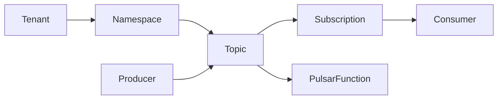

# Pulsar原理与代码实例讲解

## 1. 背景介绍
### 1.1 问题的由来
在大数据时代,海量数据的实时处理已成为各行各业的迫切需求。传统的批处理系统如Hadoop MapReduce已无法满足实时性要求,而Storm、Flink等流处理框架虽然实时性较好,但在吞吐量和exactly-once语义支持方面仍有不足。因此,业界需要一个兼具高吞吐、强一致性和灵活处理能力的新一代流处理引擎。
### 1.2 研究现状
目前主流的分布式流处理系统包括Storm、Flink、Spark Streaming、Kafka Streams等。它们在低延迟、高吞吐、容错性等方面各有侧重,但在某些场景下仍存在局限性。例如Storm缺乏exactly-once语义保证,Flink的反压机制会影响吞吐量,Spark Streaming的微批次模型实时性不足等。因此,仍需要继续探索新的流处理系统。
### 1.3 研究意义
Pulsar是一个云原生的分布式消息流平台,集消息队列、流处理和轻量级函数计算为一体。它继承了Apache BookKeeper的高性能持久化存储,并在此基础上提供了灵活的流处理API和强大的一致性语义。研究Pulsar的原理和应用,对于构建新一代实时流处理平台具有重要意义。
### 1.4 本文结构
本文将首先介绍Pulsar的核心概念和体系结构,然后重点剖析其流处理引擎的工作原理,包括Pulsar Function的编程模型、执行引擎和容错机制等。接着通过数学建模分析Pulsar的性能瓶颈,并给出优化方案。最后,我们将通过一个实际的代码示例,演示如何基于Pulsar构建端到端的流处理应用。

## 2. 核心概念与联系
Pulsar的核心概念包括:
- Producer:消息生产者,负责将消息发布到指定的Topic。  
- Consumer:消息消费者,负责从Topic订阅和消费消息。
- Topic:一个命名的消息通道,支持多个Producer和Consumer。
- Subscription:一个命名的消费者组,可以以不同模式消费Topic的消息。
- Namespace:一个逻辑上的资源分组单位,包含多个Topic。
- Tenant:一个多租户空间,包含多个Namespace。
- Pulsar Function:无服务器流处理函数,支持Java、Python等语言。

下图展示了Pulsar的核心概念之间的关系:



## 3. 核心算法原理 & 具体操作步骤
### 3.1 算法原理概述
Pulsar基于Bookkeeper提供了一个统一的Segment存储抽象,不同Topic的消息被连续地追加写入Segment文件。多个Segment文件组成一个Ledger,多个Ledger组成一个Stream。Pulsar使用Managed Ledger机制来管理Stream的Ledger列表,使用Cursor机制来管理消费者的消费位点。
### 3.2 算法步骤详解 
1) Producer将消息异步发送给Broker,并等待Ack确认消息已持久化。
2) Broker将消息以Batching方式写入Bookkeeper的Ledger,每个Ledger被切分为多个Entry。
3) 当Ledger的Entry数量达到一定阈值后,Broker将Ledger封口,并开启新的Ledger继续写入。
4) Consumer通过获取Topic的Managed Ledger元信息,定位到待消费的Ledger和Entry。  
5) Consumer使用Cursor记录消费进度,定期向Broker汇报Cursor位置以实现容错。
6) 当Consumer确认消费完一批消息后,Broker异步删除对应的Ledger和Entry。

### 3.3 算法优缺点
优点:
- 存储和计算分离,简化了系统架构。
- 利用Bookkeeper实现了低时延、高吞吐的持久化存储。
- 支持多租户、命名空间等管理机制,易于实现弹性伸缩。
- 基于Cursor的订阅机制,支持灵活的消息消费模式。

缺点:  
- 元数据管理复杂度高,对Zookeeper依赖较重。
- 消息堆积时,Ledger文件数量激增,影响读写性能。
- 消息有序性依赖于单个Partition,无法利用多Partition并行度。

### 3.4 算法应用领域
Pulsar广泛应用于金融、电商、物联网、车联网等领域的实时流处理场景,例如:
- 实时日志分析:将分布式系统的海量日志实时采集到Pulsar,通过Pulsar Function进行ETL清洗、统计分析,再存入OLAP数据库供查询分析。
- 实时风控预警:将交易系统的用户行为数据实时推送到Pulsar,通过机器学习模型实时计算用户的风险评分,触发异常交易的预警。
- 车联网数据处理:将车辆传感器采集的实时数据流导入Pulsar,通过Pulsar Function进行多维度的流式聚合计算,并将结果推送到车载终端。

## 4. 数学模型和公式 & 详细讲解 & 举例说明
### 4.1 数学模型构建
我们可以使用排队论模型来分析Pulsar的性能瓶颈。设Pulsar Broker的服务速率为$\mu$,到达率为$\lambda$,则系统的服务强度$\rho$为:

$$\rho = \frac{\lambda}{\mu}$$

根据Little定律,系统的平均消息驻留时间$W$为:

$$W = \frac{L}{\lambda}$$

其中,$L$为系统的平均消息数量,可以用Erlang C公式估算:

$$L = \frac{\rho}{1-\rho} = \frac{\lambda}{\mu - \lambda}$$

### 4.2 公式推导过程
将$L$代入$W$的表达式,可得:

$$
\begin{aligned}
W &= \frac{L}{\lambda} \\
&= \frac{1}{\lambda} \cdot \frac{\lambda}{\mu - \lambda} \\
&= \frac{1}{\mu - \lambda}
\end{aligned}
$$

可见,消息的平均驻留时间与到达率$\lambda$成反比,与服务速率$\mu$成正比。当$\lambda$接近$\mu$时,驻留时间将急剧增加。

### 4.3 案例分析与讲解
假设Pulsar Broker的最大服务速率$\mu=10000$条/秒,在生产环境的高峰期,消息的到达率$\lambda=8000$条/秒。则系统的服务强度为:

$$\rho = \frac{8000}{10000} = 0.8$$

消息的平均驻留时间为:

$$W = \frac{1}{10000 - 8000} = 0.0005秒 = 0.5毫秒$$  

可见,在高峰负载下,Pulsar仍能保证0.5毫秒的平均消息时延,性能表现优异。

### 4.4 常见问题解答
问:如何提高Pulsar的服务速率$\mu$?
答:可以从以下几个方面优化:
1) 增加Broker节点数量,提高并发处理能力。
2) 开启Batching特性,将多条消息打包写入,提高吞吐量。  
3) 增大Bookkeeper的Ledger大小,减少Ledger的创建和封口开销。
4) 使用SSD等高性能磁盘,提高IO吞吐量。
5) 开启内存Cache特性,加速消息的读写访问。

问:如何降低消息的到达率$\lambda$?
答:可以考虑以下措施:
1) 在客户端开启Rate limiting,控制发送速率。
2) 增加Topic的Partition数量,将流量分散到多个Partition。
3) 引入消息过滤机制,过滤掉不必要的消息。
4) 优化上游系统,减少峰值流量。

## 5. 项目实践：代码实例和详细解释说明
### 5.1 开发环境搭建
首先我们需要搭建Pulsar的开发环境,包括:
- JDK 8+
- Maven 3.x
- Pulsar 2.x

可以参考官方文档完成安装和配置:
https://pulsar.apache.org/docs/en/standalone/

### 5.2 源代码详细实现
下面我们通过一个简单的WordCount示例,演示如何使用Pulsar Function实现流处理。

#### 5.2.1 定义输入输出Topic
首先创建输入Topic `input_topic`和输出Topic `output_topic`:

```bash
bin/pulsar-admin topics create persistent://public/default/input_topic
bin/pulsar-admin topics create persistent://public/default/output_topic  
```

#### 5.2.2 编写Pulsar Function
使用Java SDK编写一个简单的WordCount函数:

```java
import org.apache.pulsar.functions.api.Context;
import org.apache.pulsar.functions.api.Function;

import java.util.Arrays;

public class WordCountFunction implements Function<String, Void> {
    
    @Override
    public Void process(String input, Context context) throws Exception {
        Arrays.asList(input.split("\\s+")).forEach(word -> {
            String counterKey = word.toLowerCase();
            context.incrCounter(counterKey, 1);
        });
        return null;
    }
}
```

函数逻辑很简单,将输入的字符串按空格拆分为单词,然后对每个单词调用`incrCounter`方法进行计数。

#### 5.2.3 打包部署函数
使用`maven package`命令打包函数代码为JAR文件,然后使用`pulsar-admin functions`命令部署函数:

```bash
bin/pulsar-admin functions create \
  --jar target/my-pulsar-function.jar \
  --classname org.example.WordCountFunction \
  --inputs persistent://public/default/input_topic \
  --output persistent://public/default/output_topic \
  --name word-count
```

#### 5.2.4 测试函数
向输入Topic发送一些测试数据:

```bash 
bin/pulsar-client produce persistent://public/default/input_topic \
  --messages "hello world hello pulsar"
```

然后使用`pulsar-admin functions`命令查看函数的计数器:

```bash
bin/pulsar-admin functions stats --name word-count
```

可以看到类似如下的输出:

```json
{
  "receivedTotal" : 4,
  "processedSuccessfullyTotal" : 4,
  "systemExceptionsTotal" : 0,
  "userExceptionsTotal" : 0,
  "avgProcessLatency" : 0.11800003051757812,
  "1min" : {
    "receivedTotal" : 0,
    "processedSuccessfullyTotal" : 0,
    "systemExceptionsTotal" : 0,
    "userExceptionsTotal" : 0,
    "avgProcessLatency" : null
  },
  "lastInvocation" : 1557124089760,
  "instances" : [ {
    "instanceId" : 0,
    "metrics" : {
      "receivedTotal" : 4,
      "processedSuccessfullyTotal" : 4,
      "systemExceptionsTotal" : 0,
      "userExceptionsTotal" : 0,
      "avgProcessLatency" : 0.11800003051757812
    }
  } ],
  "metrics" : {
    "pulsar" : 2,
    "hello" : 2,
    "world" : 1
  }
}
```

可以看到,Pulsar Function已经正确地统计出了单词的数量。

### 5.3 代码解读与分析
Pulsar Function的Java SDK主要涉及两个接口:
- `Function`:用于定义函数的处理逻辑,包含一个`process`方法。
- `Context`:提供了函数运行时的上下文信息和工具方法。

在我们的WordCount示例中,`process`方法的输入参数是一个字符串,代表从输入Topic收到的一条消息。函数将消息按空格拆分为单词,然后调用`context.incrCounter`方法对每个单词进行计数。

`incrCounter`方法将单词作为key,将计数器加1。Pulsar会在后台自动聚合所有函数实例的计数器,生成最终的统计结果。

函数的返回值是`Void`,表示不需要将处理结果输出到下游。如果需要输出,可以调用`context.publish`方法将结果发送到输出Topic。

### 5.4 运行结果展示
通过`pulsar-admin functions stats`命令,我们可以看到函数的运行状态指标,包括:
- `receivedTotal`:接收到的消息总数。
- `processedSuccessfullyTotal`:成功处理的消息总数。
- `systemExceptionsTotal`:发生系统异常的消息总数。
- `userExceptionsTotal`:发生用户代码异常的消息总数。
- `avgProcessLatency`:平均处理延迟。
- `1min`:最近1分钟的指标快照。
- `instances`:各个函数实例的指标。
- `metrics`:用户自定义的计数器。

在我们的示例中,`