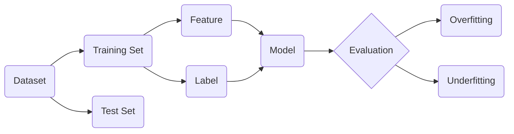

# Python机器学习实战：从零开始构建机器学习环境

## 1. 背景介绍

### 1.1 问题的由来

随着人工智能的快速发展,机器学习已经成为当前最热门的技术领域之一。越来越多的企业和研究机构开始重视机器学习的应用,希望通过机器学习技术来解决实际问题,提高生产效率。然而,对于很多初学者来说,入门机器学习存在一定门槛,尤其是在环境配置和开发过程中经常会遇到各种问题。

### 1.2 研究现状

目前市面上已经有很多关于机器学习的书籍和教程,但大部分都侧重于理论知识的讲解,对于如何动手实践和开发缺乏系统性的指导。一些网络上的教程质量参差不齐,没有经过充分测试和验证,导致初学者在学习过程中走了很多弯路。因此,有必要提供一份全面系统的实战指南,帮助初学者快速上手机器学习开发。

### 1.3 研究意义

本文旨在从零开始,手把手教大家如何搭建机器学习环境,介绍主流的机器学习库和工具,并通过实际的案例来演示如何使用Python进行机器学习开发。通过本文的学习,读者可以快速掌握机器学习的基本原理和开发流程,为进一步学习打下坚实基础。同时,本文也可以作为一份实用的工具手册,供有经验的开发者参考。

### 1.4 本文结构

本文主要分为以下几个部分：

- 第一部分介绍机器学习的基本概念和常见算法,帮助读者建立机器学习的整体认知。
- 第二部分详细讲解如何使用Python搭建机器学习开发环境,包括Anaconda、Jupyter Notebook等工具的安装和配置。
- 第三部分系统介绍几个主流的机器学习库,如Scikit-learn、TensorFlow、Keras等,并通过实例来演示它们的基本用法。 
- 第四部分通过几个实战案例,手把手带领大家进行机器学习项目的开发,涵盖数据预处理、特征工程、模型训练、评估优化等各个环节。
- 第五部分总结机器学习的最佳实践和开发技巧,并展望机器学习技术的未来发展方向。

## 2. 核心概念与联系

在开始实战之前,我们有必要先了解一下机器学习的一些核心概念：

- 数据集(Dataset):机器学习模型的训练材料,一般由多个样本(Sample)组成。每个样本通常包含特征(Feature)和标签(Label)两部分。
- 特征(Feature):样本的属性或描述信息,用于刻画样本的特点。特征可以是数值型、类别型、文本型等多种形式。
- 标签(Label):样本的目标值,即我们希望模型学习到的结果,可以是离散值(分类)或连续值(回归)。
- 训练集(Training Set):用于训练模型的数据集子集,模型通过学习训练集的特征和标签来优化参数。
- 测试集(Test Set):用于评估模型性能的数据集子集,通常不参与模型训练,以检验模型的泛化能力。
- 过拟合(Overfitting):模型过度拟合训练数据,在训练集上表现很好,但在新数据上却表现糟糕,泛化能力差。
- 欠拟合(Underfitting):模型拟合能力不足,无法很好地捕捉数据的内在规律,在训练集和测试集上表现都不理想。

这些概念之间的关系可以用下面的 Mermaid 图来表示:

从图中可以看出,数据集被划分为训练集和测试集两部分。训练集中的特征和标签被输入到模型中进行训练学习,然后用测试集评估模型的性能,根据模型是否过拟合或欠拟合来进行调优。

## 3. 核心算法原理 & 具体操作步骤

### 3.1 算法原理概述

机器学习的核心是让计算机系统从数据中自动分析获得规律,并利用规律对未知数据进行预测。根据学习方式和任务类型,机器学习主要可以分为以下几大类算法:

- 监督学习(Supervised Learning):训练数据有标签,算法通过学习特征和标签之间的关系来构建预测模型。常见的有分类和回归两大类任务。
- 无监督学习(Unsupervised Learning):训练数据没有标签,算法通过对数据进行聚类、降维等来发现数据内部的结构和关系。
- 半监督学习(Semi-supervised Learning):介于监督学习和无监督学习之间,训练数据有一部分有标签,一部分没有标签。
- 强化学习(Reinforcement Learning):通过与环境的交互获得反馈,不断调整和优化决策策略,实现特定目标。

### 3.2 算法步骤详解

下面我们以监督学习中的分类任务为例,来看看一个典型的机器学习算法的基本步骤:

1. 数据收集与标注:搜集和整理待训练的原始数据,并对数据进行必要的清洗和标注。
2. 特征工程:从原始数据中提取或构造能够刻画数据特点的特征,将非结构化数据转换为结构化特征。
3. 数据集划分:将数据集划分为互斥的训练集、验证集和测试集。其中训练集用于模型训练,验证集用于模型选择和调参,测试集用于评估模型的最终性能。
4. 模型选择:根据任务类型和数据特点选择合适的模型,如决策树、支持向量机、神经网络等。
5. 模型训练:利用训练集数据对模型进行训练,通过优化模型参数来拟合数据。
6. 模型评估:利用验证集数据对模型性能进行评估,并通过交叉验证等方法选择最优模型。
7. 模型测试:利用测试集数据对模型的泛化性能进行终极测试,得到模型的无偏估计。
8. 模型应用:将训练好的模型部署到实际的生产环境中,对新数据进行预测。

### 3.3 算法优缺点

以上是一个典型的机器学习算法流程,当然针对不同的算法和任务,具体步骤会有所差异。总的来说,机器学习算法具有以下优点:

- 可以从数据中自动学习和总结规律,不需要人工总结提炼知识
- 通过学习可以不断进化,适应新的数据和场景
- 对复杂问题有很好的建模能力,可以处理高维数据
- 预测性能很好,在很多任务上可以超越人类专家

同时,机器学习算法也存在一些局限性:

- 需要大量的训练数据,获取和标注数据的成本较高  
- 模型可解释性差,容易成为"黑盒"
- 对数据质量和特征表达较为敏感,需要很好的特征工程
- 算法选择和调参需要较多专业知识,门槛较高

### 3.4 算法应用领域

尽管有这些局限性,机器学习依然在很多领域取得了巨大成功,得到了广泛应用,主要包括:

- 计算机视觉:图像分类、目标检测、语义分割等
- 自然语言处理:文本分类、情感分析、机器翻译、智能问答等  
- 语音识别:语音转文本、说话人识别等
- 推荐系统:个性化推荐、协同过滤等
- 金融风控:贷款审批、反欺诈、信用评分等
- 无人驾驶:环境感知、路径规划、智能决策等
- 医疗健康:辅助诊断、药物发现、健康管理等
- 智能制造:工业质检、预测性维护、供应链优化等

未来,随着数据的进一步积累和算力的提升,机器学习还将在更多领域大显身手。

## 4. 数学模型和公式 & 详细讲解 & 举例说明

### 4.1 数学模型构建

很多机器学习算法背后都有严谨的数学模型作为支撑。以最简单的线性回归为例,它的数学模型可以表示为:

$$y = w^Tx + b$$

其中,$y$为模型的预测输出,$x$为输入特征向量,$w$为权重参数向量,$b$为偏置项。线性回归的目标是找到最优的$w$和$b$,使得预测值$y$和真实值$y$之间的误差最小。

### 4.2 公式推导过程

为了求解最优的$w$和$b$,需要定义一个损失函数来度量预测误差。均方误差是回归任务中常用的损失函数,其公式为:

$$J(w,b) = \frac{1}{2m}\sum_{i=1}^m(y^{(i)}-\hat{y}^{(i)})^2$$

其中,$m$为样本数量,$y^{(i)}$为第$i$个样本的真实值,$\hat{y}^{(i)}$为第$i$个样本的预测值。

接下来,利用梯度下降法对损失函数进行优化求解。梯度下降的核心思想是沿着损失函数下降最快的方向更新参数,直到找到全局最小值点。参数$w$和$b$的更新公式为:

$$
w_j := w_j - \alpha\frac{\partial J(w,b)}{\partial w_j} \\
b := b - \alpha\frac{\partial J(w,b)}{\partial b}
$$

其中,$\alpha$为学习率,控制每次参数更新的步长。$\frac{\partial J(w,b)}{\partial w_j}$和$\frac{\partial J(w,b)}{\partial b}$分别为损失函数对$w_j$和$b$的偏导数,可以通过求导公式得到:

$$
\frac{\partial J(w,b)}{\partial w_j} = \frac{1}{m}\sum_{i=1}^m(y^{(i)}-\hat{y}^{(i)})x_j^{(i)} \\
\frac{\partial J(w,b)}{\partial b} = \frac{1}{m}\sum_{i=1}^m(y^{(i)}-\hat{y}^{(i)})
$$

将偏导数的结果代入参数更新公式,即可得到完整的梯度下降算法。重复迭代多轮直到损失函数收敛,最终得到最优的模型参数。

### 4.3 案例分析与讲解

下面我们用一个简单的一元线性回归例子来演示模型的训练过程。假设我们采集到5个样本点,如下表所示:

| $x$ | 1   | 2   | 3   | 4   | 5   |
|-----|-----|-----|-----|-----|-----|
| $y$ | 3.2 | 4.9 | 6.7 | 8.4 | 10.1|

根据这5个样本点,我们希望训练出一个线性模型,可以对新的$x$值进行预测。首先初始化模型参数$w=0, b=0$,学习率$\alpha=0.01$。

在第1轮迭代中,利用当前参数计算出5个样本的预测值:

$$
\hat{y}^{(1)} = 0 \times 1 + 0 = 0 \\
\hat{y}^{(2)} = 0 \times 2 + 0 = 0 \\
\hat{y}^{(3)} = 0 \times 3 + 0 = 0 \\
\hat{y}^{(4)} = 0 \times 4 + 0 = 0 \\
\hat{y}^{(5)} = 0 \times 5 + 0 = 0
$$

代入均方误差公式,计算当前损失:

$$
J(w,b) = \frac{1}{2\times5}[(3.2-0)^2+(4.9-0)^2+(6.7-0)^2+(8.4-0)^2+(10.1-0)^2] \\
=\frac{1}{10}(3.2^2+4.9^2+6.7^2+8.4^2+10.1^2)=26.66
$$

然后计算损失函数对参数$w$和$b$的偏导数:

$$
\frac{\partial J(w,b)}{\partial w} = \frac{1}{5}[0\times(3.2-0)+0\times(4.9-0)+0\times(