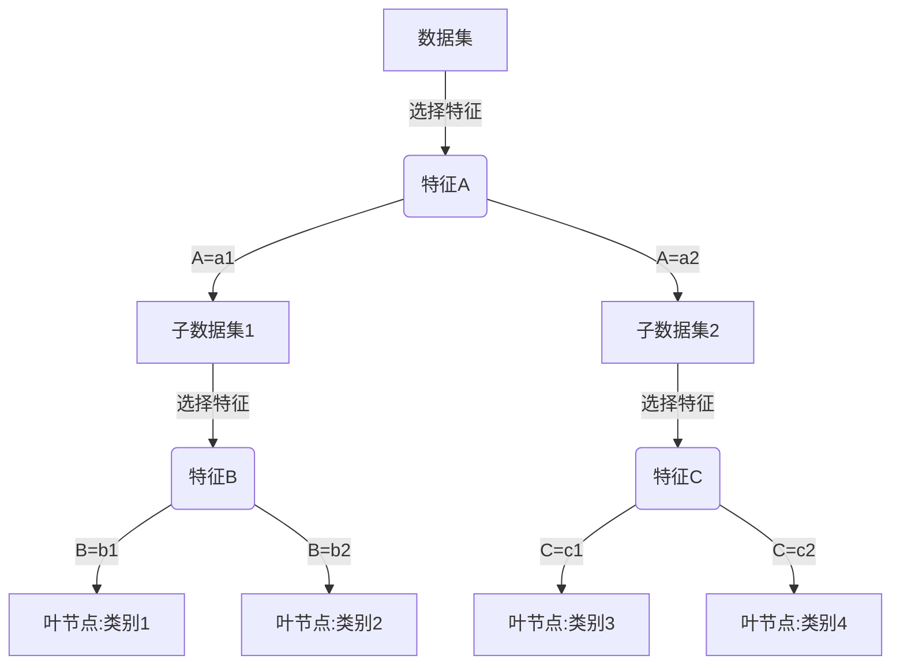

# Python机器学习实战：决策树算法原理及其在Python中的实现

## 1. 背景介绍

### 1.1 问题的由来

在现代数据密集型时代，机器学习已经成为一种强大的工具,可以从海量数据中发现隐藏的模式和规律。作为监督学习算法的一种,决策树因其易于理解和解释的特点而备受关注。决策树算法模拟人类决策过程,根据特征对实例进行分类,最终得到一个树形结构模型。

决策树广泛应用于多个领域,如金融风险评估、医疗诊断、客户关系管理等。然而,构建一个高质量的决策树模型并非易事,需要解决数据噪声、过拟合、特征选择等诸多挑战。因此,深入理解决策树算法的原理及其在Python中的实现,对于数据科学从业者来说是非常重要的。

### 1.2 研究现状

决策树算法经过数十年的发展,已经形成了多种流行的算法,如ID3、C4.5、CART等。研究人员不断优化决策树的构建过程,提出新的剪枝策略、特征选择方法等,以提高模型的准确性和可解释性。

与此同时,开源编程语言Python也成为数据科学领域的主流工具之一。由于Python简洁易学、生态系统丰富,它为机器学习算法的实现提供了极大便利。目前,Python中已有多个成熟的机器学习库(如scikit-learn、XGBoost等)支持决策树算法。

### 1.3 研究意义

全面掌握决策树算法原理及其Python实现,对于数据科学从业者具有重要意义:

1. 加深对机器学习算法的理解,提高建模能力
2. 能够根据实际需求,选择合适的决策树算法并调优参数
3. 利用Python强大的可视化能力,更好地解释决策树模型
4. 结合其他机器学习技术,构建更加强大的模型

### 1.4 本文结构

本文将全面介绍决策树算法的核心概念、原理、Python实现等内容,具体包括:

- 核心概念与联系
- 决策树算法原理及具体操作步骤
- 决策树数学模型及公式推导
- Python中的代码实现与案例分析
- 决策树的实际应用场景
- 相关工具和学习资源推荐
- 决策树发展趋势与面临的挑战

## 2. 核心概念与联系

在深入探讨决策树算法之前,我们先介绍几个核心概念:

1. **熵(Entropy)**: 表示随机变量的无序程度或不确定性,是信息论中的基本概念。在决策树中,熵被用于度量数据集的无序程度,从而评估特征的分类能力。

2. **信息增益(Information Gain)**: 表示由于知道特征而使得熵减少的程度。信息增

3. 增益越大,则该特征对训练数据集的分类能力越强。

4. **基尼系数(Gini Impurity)**: 另一种评估特征分类能力的指标,表示一个数据集的混乱程度。基尼系数越小,则数据集越纯。

5. **决策节点(Decision Node)**: 树中的内部节点,表示对特征进行测试。

6. **叶节点(Leaf Node)**: 树的终端节点,表示一个决策的结果。

7. **剪枝(Pruning)**: 一种避免过拟合的策略,通过移除树中的某些部分来简化模型。

以上概念相互关联,共同构建了决策树算法的理论基础。下面我们将详细介绍决策树算法的原理和实现细节。

## 3. 核心算法原理 & 具体操作步骤

### 3.1 算法原理概述

决策树算法的目标是创建一个模型,将输入实例映射到适当的目标值。算法通过递归地构建决策树,对实例进行分类。

构建过程可以概括为两个基本步骤:

1. **特征选择**: 在每个节点,根据特征对数据集进行分割,选择能够最好地减少无序程度(熵或基尼系数)的特征作为分裂特征。

2. **树生长控制**: 利用停止条件决定是否继续对当前节点进行分裂。条件可以是最大树深度、最小实例数等。

通过以上步骤,算法能自动学习数据集的内在模式,构建出一个能很好地对新实例进行分类的决策树模型。

下面我们将通过一个简单的例子,具体说明决策树算法的工作原理。

上图展示了一个简单决策树的构建过程:

1. 从整个数据集开始,选择最优特征A进行分裂
2. 根据A的取值,将数据集分割为两个子数据集
3. 对子数据集1,选择特征B继续分裂,直到满足停止条件为止
4. 对子数据集2,选择特征C继续分裂,直到满足停止条件为止
5. 生成的叶节点即为决策树对该子数据集的分类预测结果

可见,决策树算法通过不断分裂数据集,最终将实例划分到各个叶节点,得到分类预测结果。

### 3.2 算法步骤详解

构建决策树的具体步骤如下:

1. **收集数据**:可利用任何方法获取训练数据
2. **准备数据**:对数据进行预处理,填补缺失值、处理连续值等
3. **计算最优特征**:
   - 计算每个特征的信息增益或基尼系数
   - 选择增益最大或基尼系数最小的特征作为分裂特征
4. **构建决策树**:
   - 根据分裂特征,将数据集分割为若干子集
   - 对每个子集,递归调用步骤3和4,构建子树
   - 直到满足停止条件为止
5. **执行剪枝**:利用剪枝策略对已生成的树进行简化
6. **做出预测**:使用生成的决策树对新实例进行分类

其中,步骤3是决策树算法的核心,我们将在下一节详细介绍特征选择的数学模型和公式推导。

### 3.3 算法优缺点

**优点**:

- 简单易懂,模型具有很好的可解释性
- 无需数据预处理,可直接处理离散值和连续值特征
- 可以处理有缺失值的训练数据
- 训练速度快,可以并行化处理
- 防止过拟合的能力较强

**缺点**:

- 对于数据的质量要求较高,存在噪声会影响模型的准确性
- 可能会构建一棵过于复杂的决策树,增加计算开销
- 对于某些问题,其他算法(如支持向量机)可能有更好的预测性能
- 决策树可能对训练集中的小变化过于敏感,导致生成的树发生较大变化

总的来说,决策树算法简单高效,可解释性强,适合作为入门级机器学习算法学习。但在实际应用中,我们还需结合具体问题选择合适的算法。

### 3.4 算法应用领域

决策树算法由于其可解释性强、模型简单等特点,被广泛应用于以下领域:

- **金融风险评估**: 评估贷款申请人的违约风险
- **医疗诊断**: 根据症状对疾病进行诊断
- **图像识别**: 通过像素值将图像划分为不同类别
- **自然语言处理**: 对文本进行分类、情感分析等
- **推荐系统**: 根据用户特征推荐个性化内容
- **网络入侵检测**: 识别恶意网络流量
- **基因分析**: 根据基因特征对疾病风险进行预测
- ...

除了用于分类任务外,回归树也可用于连续值预测,如房价预测等。总之,决策树算法在各个领域都有广泛的应用前景。

## 4. 数学模型和公式 & 详细讲解 & 举例说明

### 4.1 数学模型构建

决策树算法的核心是选择最优特征进行数据集分割。为此,我们需要定义一个指标来评估特征的分类能力,常用的有信息增益和基尼系数。

**信息增益(Information Gain)**

给定随机变量$X$,其信息熵定义为:

$$Ent(X) = -\sum_{i=1}^{n}p_ilog_2p_i$$

其中,$p_i$是取值$x_i$的概率。

假设将数据集$D$根据特征$A$分割为$k$个子集$D_1, D_2, ..., D_k$,则信息增益为:

$$Gain(D, A) = Ent(D) - \sum_{j=1}^{k}\frac{|D_j|}{|D|}Ent(D_j)$$

其中,$Ent(D)$是数据集$D$的熵,$|D_j|$和$|D|$分别是$D_j$和$D$的实例数。

我们选择能使信息增益最大的特征作为分裂特征。

**基尼系数(Gini Impurity)**

给定数据集$D$,其基尼系数定义为:

$$Gini(D) = 1 - \sum_{i=1}^{m}p_i^2$$

其中,$p_i$是$D$中第$i$类实例的概率。

假设将数据集$D$根据特征$A$分割为$k$个子集$D_1, D_2, ..., D_k$,则基尼指数为:

$$Gini\_index(D, A) = \sum_{j=1}^{k}\frac{|D_j|}{|D|}Gini(D_j)$$

我们选择能使基尼指数最小的特征作为分裂特征。

通过上述公式,我们可以计算出每个特征的信息增益或基尼指数,从而选择最优特征进行数据集分割。

### 4.2 公式推导过程

现在让我们通过一个简单的例子,推导上述公式的具体过程。

假设有如下数据集:

| 实例 | 特征A | 特征B | 类别 |
| ---- | ----- | ----- | ---- |
| 1    | 1     | 1     | 是   |
| 2    | 1     | 1     | 是   |
| 3    | 1     | 0     | 否   |
| 4    | 0     | 1     | 否   |
| 5    | 0     | 0     | 否   |

首先计算数据集$D$的熵:

$$Ent(D) = -\frac{2}{5}log_2\frac{2}{5} - \frac{3}{5}log_2\frac{3}{5} = 0.971$$

接下来,我们计算根据特征A分割后的信息增益:

$$Gain(D, A) = Ent(D) - \sum_{j=1}^{2}\frac{|D_j|}{|D|}Ent(D_j)$$
$$= 0.971 - \frac{2}{5}(0) - \frac{3}{5}(0) = 0.971$$

同理,根据特征B分割后的信息增益为:

$$Gain(D, B) = 0.971 - \frac{3}{5}(0.918) - \frac{2}{5}(0) = 0.419$$

可见,特征A的信息增益更大,因此我们选择A作为分裂特征。

下面计算基尼指数:

$$Gini(D) = 1 - (\frac{2}{5})^2 - (\frac{3}{5})^2 = 0.48$$

根据特征A分割后:

$$Gini\_index(D, A) = \frac{2}{5}(0) + \frac{3}{5}(0) = 0$$

根据特征B分割后:

$$Gini\_index(D, B) = \frac{3}{5}(0.444) + \frac{2}{5}(0) = 0.266$$

同样,特征A的基尼指数更小,因此我们选择A作为分裂特征。

通过这个例子,我们清晰地看到了信息增益和基尼指数在特征选择中的计算过程。

### 4.3 案例分析与