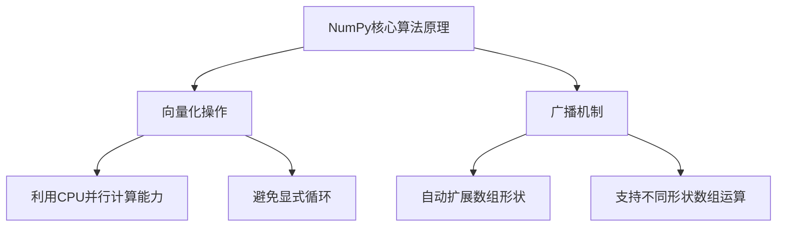

# Python机器学习实战：掌握NumPy的高效数据操作

## 1. 背景介绍

### 1.1 问题的由来

在当今数据时代，海量数据的产生和处理已经成为各行业面临的重大挑战。无论是金融、医疗、零售还是科学研究等领域，都需要高效地处理大规模数据集。Python作为一种流行的编程语言,凭借其简洁、易学且功能强大的特点,已成为数据科学和机器学习领域的首选。而在Python生态系统中,NumPy则是一个不可或缺的基础库,为数值计算和数据操作提供了高效的支持。

### 1.2 研究现状

NumPy(Numerical Python)是Python中最重要的科学计算库之一,它为Python提供了高性能的多维数组对象,以及对这种数组对象进行操作的函数库。NumPy不仅支持高级数学函数,还能与其他库(如SciPy和Matplotlib)无缝集成,从而为机器学习、科学计算和数据分析等领域提供了强大的支持。

然而,NumPy的强大功能并非一蹴而就,掌握其中的精髓需要系统的学习和实践。许多开发者虽然使用NumPy,但往往只是浅尝辄止,未能充分发挥其潜力。因此,深入探讨NumPy的高效数据操作技巧,对于提高数据处理效率和编程质量至关重要。

### 1.3 研究意义

掌握NumPy的高效数据操作技巧,对于数据科学家、机器学习工程师和科学计算从业者来说,具有重要的现实意义:

1. **提高数据处理效率**:NumPy的核心是基于高性能的C语言实现,能够极大地提升数据操作的速度,尤其是在处理大型数据集时,效率的提升将更加显著。

2. **简化代码复杂度**:NumPy提供了丰富的数据结构和函数库,可以用简洁的代码实现复杂的数据操作,从而降低代码复杂度,提高可读性和可维护性。

3. **增强算法性能**:NumPy的向量化操作能够充分利用现代CPU的并行计算能力,使得算法的执行速度大幅提升,这对于机器学习和科学计算领域尤为关键。

4. **促进协作和知识共享**:深入掌握NumPy,不仅能够提高个人的编程能力,还能够促进团队内部的知识共享和协作,提高整体的工作效率。

### 1.4 本文结构

本文将全面介绍NumPy的高效数据操作技巧,内容包括:

- NumPy的核心概念和数据结构
- NumPy的核心算法原理及操作步骤
- NumPy的数学模型和公式推导
- NumPy在机器学习中的实际应用案例
- NumPy的开发环境搭建和代码实现
- NumPy的未来发展趋势和面临的挑战

通过本文的学习,读者将能够全面掌握NumPy的高效数据操作技巧,为机器学习、科学计算和数据分析等领域的工作奠定坚实的基础。

## 2. 核心概念与联系

在深入探讨NumPy的高效数据操作技巧之前,我们需要先了解NumPy的核心概念和数据结构。NumPy的设计理念是提供一种高效的数值计算工具,使Python能够胜任科学计算和数据分析等任务。

NumPy的核心数据结构是`ndarray`(N-dimensional array),它是一个同质的多维数组对象,每个元素在内存中都是连续存储的,因此可以高效地执行各种数值计算操作。`ndarray`支持各种数值数据类型,如整数、浮点数、布尔值等,并且可以通过调用相应的函数来执行各种数学运算、逻辑运算、形状操作等。

除了`ndarray`之外,NumPy还提供了许多有用的函数和模块,如:

- `numpy.random`模块:用于生成随机数据
- `numpy.linalg`模块:用于线性代数计算
- `numpy.fft`模块:用于快速傅里叶变换
- `numpy.poly`模块:用于多项式计算
- 通用函数(`ufunc`):用于对数组执行元素级操作

NumPy的设计理念是"向量化"(Vectorization),即将标量操作推广到整个数组,从而充分利用现代CPU的并行计算能力。这种设计不仅提高了计算效率,而且使得代码更加简洁和易读。

NumPy与Python科学计算生态系统中的其他库(如SciPy、Pandas和Matplotlib)紧密集成,为数据分析、机器学习和科学计算等领域提供了强大的支持。因此,掌握NumPy的高效数据操作技巧,对于提高工作效率和编程质量至关重要。

## 3. 核心算法原理 & 具体操作步骤

### 3.1 算法原理概述

NumPy的核心算法原理是基于向量化操作和广播机制。向量化操作指的是将标量操作推广到整个数组,从而充分利用现代CPU的并行计算能力。广播机制则允许NumPy在执行算术运算时,自动对不同形状的数组进行适当的扩展,使它们的形状相容。

以下是NumPy向量化操作和广播机制的基本原理:

1. **向量化操作**

   NumPy的许多函数都是向量化的,即它们可以同时对数组中的每个元素执行操作,而无需使用显式循环。这种向量化操作通常比使用Python的标准循环快得多,因为它们是用优化的C代码实现的,并且可以充分利用现代CPU的并行计算能力。

2. **广播机制**

   NumPy的广播机制允许在算术运算中使用不同形状的数组。当操作数的形状不同时,NumPy会自动尝试将较小的数组扩展到较大数组的形状,以使它们的形状相容。这种机制使得NumPy可以方便地执行各种数组运算,而无需手动扩展数组。

广播机制遵循以下规则:

   - 如果两个数组的维数不同,则在较小的数组的形状前面加上长度为1的维度,使它们的维数相同。
   - 在任何一个维度上,如果两个数组的长度不同且其中一个长度为1,则将长度为1的维度扩展到另一个数组的长度。
   - 如果在任何一个维度上,两个数组的长度都不为1且不相等,则抛出`ValueError`异常。

通过向量化操作和广播机制,NumPy能够高效地执行各种数组运算,从而大大提高了数据处理的效率。



### 3.2 算法步骤详解

NumPy的高效数据操作主要依赖于向量化操作和广播机制。下面我们将详细介绍这两种机制的具体操作步骤。

#### 3.2.1 向量化操作步骤

NumPy的许多函数都是向量化的,即它们可以同时对数组中的每个元素执行操作,而无需使用显式循环。以下是向量化操作的基本步骤:

1. **创建NumPy数组**

   首先,我们需要创建一个NumPy数组作为操作对象。可以使用`numpy.array()`函数从Python列表或其他序列类型创建数组,也可以使用`numpy.arange()`、`numpy.linspace()`等函数直接创建数值序列。

2. **应用向量化函数**

   NumPy提供了许多向量化函数,如`numpy.sin()`、`numpy.exp()`、`numpy.sqrt()`等。这些函数可以直接作用于整个数组,而无需使用显式循环。

3. **获取结果数组**

   向量化函数的返回值是一个新的NumPy数组,其形状与输入数组相同,每个元素是对应输入元素执行函数操作的结果。

下面是一个简单的示例,演示了如何使用NumPy的向量化操作计算一个数组中每个元素的平方根:

```python
import numpy as np

# 创建一个NumPy数组
arr = np.array([1, 4, 9, 16, 25])

# 应用向量化函数
sqrt_arr = np.sqrt(arr)

# 获取结果数组
print(sqrt_arr)  # 输出: [ 1.  2.  3.  4.  5.]
```

在这个示例中,我们首先使用`numpy.array()`函数从Python列表创建了一个NumPy数组`arr`。然后,我们直接将`numpy.sqrt()`函数应用于整个数组,而无需使用任何循环。最后,我们获得了一个新的数组`sqrt_arr`,其中每个元素是对应`arr`元素的平方根。

通过向量化操作,我们可以用简洁的代码实现复杂的数据操作,从而提高代码的可读性和可维护性。同时,由于向量化操作是用优化的C代码实现的,并且可以充分利用现代CPU的并行计算能力,因此它们的执行速度通常比使用Python的标准循环快得多。

#### 3.2.2 广播机制步骤

NumPy的广播机制允许在算术运算中使用不同形状的数组。当操作数的形状不同时,NumPy会自动尝试将较小的数组扩展到较大数组的形状,以使它们的形状相容。广播机制遵循以下规则:

1. **维数不同时扩展**

   如果两个数组的维数不同,则在较小的数组的形状前面加上长度为1的维度,使它们的维数相同。

2. **长度为1的维度扩展**

   在任何一个维度上,如果两个数组的长度不同且其中一个长度为1,则将长度为1的维度扩展到另一个数组的长度。

3. **长度不相等时报错**

   如果在任何一个维度上,两个数组的长度都不为1且不相等,则抛出`ValueError`异常。

下面是一个示例,演示了如何使用NumPy的广播机制执行数组运算:

```python
import numpy as np

# 创建一个3x3的二维数组
arr1 = np.array([[1, 2, 3],
                 [4, 5, 6],
                 [7, 8, 9]])

# 创建一个一维数组
arr2 = np.array([10, 20, 30])

# 使用广播机制执行数组运算
result = arr1 + arr2

print(result)
# 输出:
# [[11 22 33]
#  [14 25 36]
#  [17 28 39]]
```

在这个示例中,我们首先创建了一个3x3的二维数组`arr1`和一个一维数组`arr2`。由于`arr2`的维数小于`arr1`,因此NumPy会自动在`arr2`的形状前面加上一个长度为1的维度,使其形状变为`(1, 3)`。然后,NumPy会将`arr2`在第一个维度上扩展到`arr1`的长度,使它们的形状相容。最后,NumPy执行元素级加法运算,得到结果数组`result`。

通过广播机制,NumPy可以方便地执行各种数组运算,而无需手动扩展数组。这不仅提高了代码的可读性和可维护性,而且还提高了计算效率,因为NumPy的广播机制是用优化的C代码实现的。

### 3.3 算法优缺点

NumPy的向量化操作和广播机制为高效数据操作提供了强大的支持,但它们也存在一些优缺点。

**优点:**

1. **高效计算**:NumPy的向量化操作和广播机制都是用优化的C代码实现的,可以充分利用现代CPU的并行计算能力,从而大大提高了计算效率。

2. **简洁代码**:通过向量化操作和广播机制,我们可以用简洁的代码实现复杂的数据操作,提高了代码的可读性和可维护性。

3. **内存效率**:NumPy的数组是连续存储在内存中的,因此可以避免频繁的内存分配和释放,提高了内存利用率。

4. **与其他库集成**:NumPy与Python科学计算生态系统中的其他库(如SciPy、Pandas和Matplotlib)紧密集成,为数据分析、机器学习和科学计算等领域提供了强大的支持。

**缺点