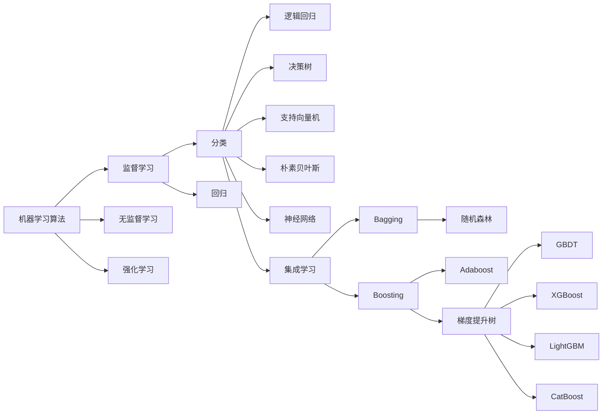

# Python机器学习实战：梯度提升树(Gradient Boosting)算法深入理解

关键词：Python, 机器学习, 梯度提升树, Gradient Boosting, XGBoost, LightGBM, CatBoost

## 1. 背景介绍
### 1.1  问题的由来
在当今大数据时代,机器学习已经成为各行各业中不可或缺的技术。作为机器学习的重要分支,集成学习(Ensemble Learning)通过将多个弱学习器组合成一个强学习器,在许多实际问题中取得了非常好的效果。而梯度提升树(Gradient Boosting)作为集成学习中的代表性算法之一,以其优异的性能和广泛的应用场景,受到了学术界和工业界的广泛关注。

### 1.2  研究现状
近年来,国内外学者对梯度提升树进行了大量的研究。Friedman[1]在2001年首次提出了梯度提升算法,并用于回归和分类问题。此后,Chen等人[2]提出了XGBoost算法,通过引入正则化项、近似分裂、加权分位数等技术,大大提高了梯度提升树的效率和精度。Ke等人[3]提出了LightGBM算法,使用基于直方图的决策树和互斥特征捆绑等技术,进一步降低了内存占用和计算时间。Prokhorenkova等人[4]提出了CatBoost算法,通过对称树、组合类别特征等创新,在保持高精度的同时支持类别特征。国内也有不少学者对梯度提升树进行了研究,如何等人[5]提出了一种基于梯度提升树的多标记学习方法。刘等人[6]研究了梯度提升树在时间序列预测中的应用。

### 1.3  研究意义
梯度提升树作为一种强大的机器学习算法,在许多领域都有着广泛的应用,如计算机视觉、自然语言处理、推荐系统等。深入理解和掌握梯度提升树算法,对于从事机器学习相关工作的研究人员和工程师来说至关重要。本文将从算法原理、数学模型、代码实现等多个角度对梯度提升树进行全面深入的讲解,帮助读者系统地学习这一算法。

### 1.4  本文结构
本文将分为以下几个部分:
- 第2部分介绍梯度提升树的核心概念及其与其他机器学习算法的联系
- 第3部分详细讲解梯度提升树的算法原理和具体操作步骤
- 第4部分给出梯度提升树的数学模型和公式推导过程,并举例说明
- 第5部分提供基于Python的梯度提升树代码实现,并对关键代码进行解释
- 第6部分讨论梯度提升树的实际应用场景
- 第7部分推荐梯度提升树的学习资源、开发工具和相关论文
- 第8部分总结全文,展望梯度提升树的未来发展趋势和面临的挑战
- 第9部分列出梯度提升树的常见问题解答

## 2. 核心概念与联系
梯度提升树(Gradient Boosting Tree)是一种基于决策树的集成学习算法。它的基本思想是:通过迭代地拟合残差,不断地生成新的决策树,每棵树都试图去拟合前面树的残差,然后将所有树的结果相加得到最终的预测值。

与其他机器学习算法相比,梯度提升树有以下特点:
- 与Bagging算法(如随机森林)不同,梯度提升树是一种Boosting算法,即每棵树都是在前面树的基础上进行训练,而不是独立训练。
- 与Adaboost算法类似,梯度提升树也是通过迭代地增加弱学习器来提高性能。但Adaboost使用指数损失函数,而梯度提升树可以使用任意可微的损失函数。
- 与支持向量机等算法相比,梯度提升树对异常值和缺失值不敏感,也不需要对数据进行归一化等预处理。
- 与深度神经网络相比,梯度提升树的可解释性更好,可以输出特征重要性等信息。但在处理高维稀疏数据时,深度神经网络往往更有优势。

下图展示了梯度提升树与其他几种常见机器学习算法之间的联系与区别:

可以看到,梯度提升树是集成学习中Boosting方法的一种,与Adaboost同属于Boosting家族。而梯度提升树又有多种变体,如GBDT、XGBoost、LightGBM和CatBoost等。

## 3. 核心算法原理 & 具体操作步骤
### 3.1  算法原理概述
梯度提升树的核心思想是:每一次迭代,在当前模型的基础上,拟合当前模型的残差,得到一个新的决策树,然后将新的决策树加入到当前模型中,不断重复这个过程,直到满足停止条件。

具体来说,假设我们要解决一个回归问题,目标是学习一个函数$F(x)$来拟合训练数据。梯度提升树的做法是,先初始化一个常数预测值$F_0(x)$,然后在每一轮迭代$m=1,2,...,M$中,基于前一轮迭代得到的模型$F_{m-1}(x)$,计算其在训练数据上的残差:

$$
r_{mi} = y_i - F_{m-1}(x_i), \quad i=1,2,...,N
$$

其中$y_i$是第$i$个训练样本的真实值,$x_i$是其特征向量,$N$是训练样本数。

然后,用残差$r_{mi}$作为新的目标值,拟合一棵CART回归树$h_m(x)$,得到第$m$轮迭代的决策树。这棵决策树要尽可能地拟合残差。

接着,将新的决策树$h_m(x)$加入到当前模型中,得到新的模型:

$$
F_m(x) = F_{m-1}(x) + \eta \cdot h_m(x)
$$

其中$\eta$是学习率,用来控制每棵树的权重,防止过拟合。

重复以上过程,直到满足预设的迭代次数,或者模型在验证集上的性能不再提升。最终得到的模型就是所有决策树的加权和:

$$
\hat{y} = F_M(x) = \sum_{m=1}^M \eta \cdot h_m(x)
$$

其中$\hat{y}$是模型的预测值。

对于分类问题,可以用对数几率函数将概率映射到实数空间,然后套用以上的回归框架。预测时,再将实数值映射回概率。多分类问题可以用One-vs-Rest或者One-vs-One的方式转化为二分类问题求解。

### 3.2  算法步骤详解
下面我们将梯度提升树的算法步骤总结如下:
1. 初始化模型$F_0(x)$为训练集上的平均值:
$$
F_0(x) = \arg\min_\gamma \sum_{i=1}^N L(y_i, \gamma)
$$
其中$L$是损失函数,对于平方损失,$F_0(x)$就是$y$的均值。

2. 对$m=1,2,...,M$:
   
   (a) 计算残差:
   $$
   r_{mi} = -\left[\frac{\partial L(y_i, F(x_i))}{\partial F(x_i)}\right]_{F(x)=F_{m-1}(x)}, \quad i=1,2,...,N
   $$
   对于平方损失,残差就是$y_i - F_{m-1}(x_i)$。
   
   (b) 拟合残差$r_{mi}$学习一个回归树$h_m(x)$。
   
   (c) 计算回归树$h_m(x)$的系数:
   $$
   \gamma_m = \arg\min_\gamma \sum_{i=1}^N L(y_i, F_{m-1}(x_i) + \gamma h_m(x_i))
   $$
   
   (d) 更新模型:
   $$
   F_m(x) = F_{m-1}(x) + \eta \gamma_m h_m(x)
   $$

3. 输出最终模型$\hat{y} = F_M(x)$。

### 3.3  算法优缺点
梯度提升树的主要优点有:
- 预测精度高:在结构化数据的很多任务上,梯度提升树的预测精度是最好的,尤其在中低维度和中小样本量的情况下。
- 鲁棒性好:对异常值和缺失值不敏感,也不需要对数据做归一化等预处理。
- 可解释性强:可以输出特征重要性,可以可视化每棵树的结构,易于理解模型的逻辑。
- 灵活性高:可以使用任意可微的损失函数,适用于回归、分类、排序等多种问题。

梯度提升树的主要缺点有:  
- 训练时间长:由于是串行训练,每一次迭代都需要先拟合残差,再生成新的树,计算复杂度高,训练时间长。
- 参数调优难:需要调的超参数较多,如树的数量、深度、学习率、子采样比例等,寻找最优参数组合比较困难。
- 内存消耗大:由于要存储所有树的结构,在树的数量较多时,内存消耗会比较大。

### 3.4  算法应用领域  
梯度提升树在许多领域都有着广泛的应用,例如:
- 点击率预估:预测用户对广告或推荐物品的点击概率,常用于在线广告和推荐系统。
- 金融风控:预测用户的违约概率、信用评分等,用于贷款审批、反欺诈等场景。  
- 销量预测:预测产品的未来销量,用于库存管理、生产计划等。
- 客户流失预警:预测客户流失的概率,用于挽留营销等。
- 疾病诊断:根据病人的症状、体征、检验结果等,预测患某种疾病的概率。
- 自然语言处理:用于文本分类、情感分析、语义匹配等任务。
- 计算机视觉:用于图像分类、目标检测、语义分割等任务。

## 4. 数学模型和公式 & 详细讲解 & 举例说明
### 4.1  数学模型构建
梯度提升树的数学模型可以表示为:

$$
F_m(x) = F_{m-1}(x) + \eta \cdot h_m(x), \quad m=1,2,...,M
$$

其中:
- $x$是输入特征向量
- $F_m(x)$是第$m$轮迭代后的模型
- $F_{m-1}(x)$是第$m-1$轮迭代后的模型
- $h_m(x)$是第$m$轮迭代拟合的决策树
- $\eta$是学习率,控制每棵树的权重

最终的预测值为所有树的加权和:

$$
\hat{y} = F_M(x) = \sum_{m=1}^M \eta \cdot h_m(x)
$$

每一轮迭代的目标是求解:

$$
h_m = \arg\min_{h} \sum_{i=1}^N L(y_i, F_{m-1}(x_i) + h(x_i))
$$

其中$L$是损失函数,常用的有:
- 平方损失:$L(y, \hat{y}) = \frac{1}{2}(y-\hat{y})^2$
- 对数损失:$L(y, \hat{y}) = -y\log(\hat{y}) - (1-y)\log(1-\hat{y})$
- 指数损失:$L(y, \hat{y}) = \exp(-y\hat{y})$

不同的损失函数会导致不同的残差计算公式。例如,对于平方损失,残差为:

$$
r_{mi} = y_i - F_{m-1}(x_i)