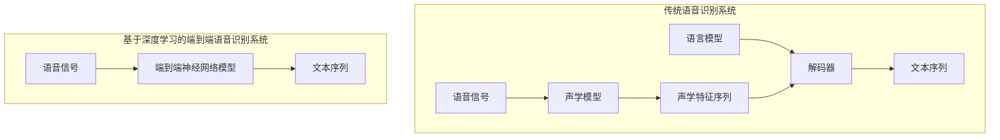

以下是根据您提供的要求和约束条件，撰写的技术博客文章正文：

# Python机器学习实战：深度学习在语音识别中的应用

作者：禅与计算机程序设计艺术 / Zen and the Art of Computer Programming

## 1. 背景介绍

### 1.1 问题的由来

语音识别是一项极具挑战性的任务,它需要将连续的语音信号转换为相应的文本序列。随着人工智能技术的不断发展,语音识别已经广泛应用于虚拟助手、语音输入法、会议记录等多个领域。然而,由于语音信号的复杂性和多变性,传统的基于统计模型和人工规则的方法在处理噪声、口音、重音等情况时存在明显的局限性。

### 1.2 研究现状

近年来,随着深度学习技术的兴起,基于神经网络的端到端语音识别模型取得了令人瞩目的成绩。这些模型能够直接从原始语音信号中学习特征表示,并对应生成文本序列,从而避免了传统方法中人工设计特征的复杂过程。目前,基于深度学习的语音识别模型主要分为三大类:混合模型(Hybrid Models)、连接主义时间分类模型(Connectionist Temporal Classification, CTC)和注意力模型(Attention-based Models)。

### 1.3 研究意义

语音识别技术的突破将为人机交互带来全新的体验,极大地提高生活和工作效率。此外,它还可以为残障人士提供更好的无障碍访问,促进社会的包容性发展。因此,探索深度学习在语音识别领域的应用,对于推动相关技术的发展和产业化具有重要意义。

### 1.4 本文结构

本文将首先介绍深度学习在语音识别中的核心概念和算法原理,包括声学模型、语言模型和解码器等组件。接下来,我们将详细讲解基于注意力机制的序列到序列(Sequence-to-Sequence, Seq2Seq)模型,以及其在语音识别任务中的应用。此外,还将介绍相关的数学模型和公式推导过程。最后,我们将通过实际案例和代码实现,展示如何使用Python构建一个端到端的语音识别系统。

## 2. 核心概念与联系

语音识别系统通常由三个核心组件组成:声学模型(Acoustic Model)、语言模型(Language Model)和解码器(Decoder)。

1. **声学模型**:将原始语音信号转换为对应的声学特征序列,例如MFCC(Mel Frequency Cepstral Coefficients)特征。在深度学习中,声学模型通常由递归神经网络(RNN)或卷积神经网络(CNN)构建。

2. **语言模型**:根据上下文信息,预测下一个单词或字符的概率分布。常见的语言模型包括N-gram模型、RNN语言模型等。

3. **解码器**:将声学模型和语言模型的输出结合起来,搜索最可能的文本序列作为识别结果。解码器常用的算法有:Viterbi算法、束搜索(Beam Search)算法等。

在传统的语音识别系统中,这三个组件是分开训练和使用的。而在基于深度学习的端到端模型中,声学模型、语言模型和解码器被统一到一个神经网络结构中进行联合训练和预测,从而简化了系统的复杂性。

## 3. 核心算法原理 & 具体操作步骤

### 3.1 算法原理概述

基于注意力机制的Seq2Seq模型是当前语音识别领域的主流方法之一。该模型由编码器(Encoder)和解码器(Decoder)两部分组成。

1. **编码器**:将变长的输入序列(如语音特征序列)编码为一个固定长度的向量表示(Context Vector)。

2. **解码器**:根据Context Vector和上一步生成的字符,预测下一个字符,从而生成变长的输出序列(如文本序列)。在每一步预测时,解码器会通过注意力机制关注输入序列中的不同位置,从而获取对应的语义信息。

该模型的核心在于注意力机制,它允许解码器在生成每个输出时,动态地关注输入序列的不同部分,从而捕获长距离依赖关系,有效地解决了传统序列模型中的梯度消失问题。

### 3.2 算法步骤详解

1. **数据预处理**:将原始语音信号转换为适当的特征表示,如MFCC特征。同时,将文本序列转换为字符或词的one-hot编码表示。

2. **编码器**:使用RNN(如LSTM或GRU)对输入的语音特征序列进行编码,得到Context Vector。

3. **解码器**:
   a. 初始化解码器的隐藏状态和单元状态,通常使用Context Vector或特殊的起始标记。
   b. 在每一步,根据上一步的预测结果、当前隐藏状态、单元状态和Context Vector,计算注意力权重向量。
   c. 使用注意力权重向量对编码器的隐藏状态进行加权求和,得到注意力向量。
   d. 将注意力向量与当前隐藏状态和单元状态相结合,预测当前步的输出(如字符或词的概率分布)。
   e. 将预测结果作为输入,更新隐藏状态和单元状态,进入下一步迭代。
   f. 重复b-e步骤,直到生成结束标记或达到最大长度。

4. **模型训练**:使用序列数据对模型进行端到端训练,优化目标通常是最大化生成的文本序列与真实标签序列的相似度。

5. **解码与后处理**:对于给定的语音输入,使用训练好的模型进行预测,得到文本序列。可以使用贪心搜索或束搜索等方法来生成输出。最后,可以对生成的文本进行规范化处理。

### 3.3 算法优缺点

**优点**:

1. 端到端训练,避免了传统方法中各个模块之间的误差传播和错误累积。
2. 注意力机制能够自适应地关注输入序列的不同部分,捕获长距离依赖关系。
3. 模型结构相对简单,易于训练和优化。

**缺点**:

1. 对训练数据的质量和数量要求较高,需要大量的高质量语音-文本对进行训练。
2. 解码过程是序列生成,计算开销较大,实时性能较差。
3. 对于较长的序列,注意力机制可能出现集中或遗忘的问题。

### 3.4 算法应用领域

基于注意力机制的Seq2Seq模型不仅可以应用于语音识别,还可以扩展到其他序列转换任务,如机器翻译、文本摘要、图像描述等。此外,注意力机制本身也被广泛应用于各种深度学习模型中,如Transformer、BERT等,用于捕获输入数据中的长距离依赖关系。

## 4. 数学模型和公式 & 详细讲解 & 举例说明

### 4.1 数学模型构建

我们将语音识别任务形式化为一个条件概率模型,目标是最大化给定语音特征序列$X$时,生成正确文本序列$Y$的条件概率$P(Y|X)$。根据贝叶斯公式,我们有:

$$P(Y|X) = \frac{P(X|Y)P(Y)}{P(X)}$$

其中:

- $P(X|Y)$是声学模型,表示给定文本序列$Y$时,生成语音特征序列$X$的概率。
- $P(Y)$是语言模型,表示文本序列$Y$的先验概率。
- $P(X)$是语音特征序列$X$的边缘概率,在给定$X$时是一个常数,可以忽略。

在基于注意力的Seq2Seq模型中,声学模型$P(X|Y)$和语言模型$P(Y)$被统一到一个神经网络结构中进行建模和优化。

### 4.2 公式推导过程

我们使用RNN对编码器和解码器进行建模。对于给定的语音特征序列$X=(x_1, x_2, ..., x_T)$和目标文本序列$Y=(y_1, y_2, ..., y_{T'})$,模型的目标是最大化生成$Y$的条件概率:

$$\begin{aligned}
\log P(Y|X) &= \sum_{t=1}^{T'} \log P(y_t|y_{<t}, X) \\
           &= \sum_{t=1}^{T'} \log P(y_t|h_t, c_t)
\end{aligned}$$

其中:

- $h_t$是解码器在时间步$t$的隐藏状态。
- $c_t$是注意力机制计算得到的Context Vector,用于捕获输入序列$X$中与当前输出$y_t$相关的信息。

Context Vector $c_t$的计算公式为:

$$c_t = \sum_{j=1}^T \alpha_{tj} h_j^{enc}$$

其中:

- $h_j^{enc}$是编码器在时间步$j$的隐藏状态。
- $\alpha_{tj}$是注意力权重,表示解码器在生成$y_t$时,关注输入序列$X$中第$j$个位置的程度。

注意力权重$\alpha_{tj}$通常使用类似于下面的公式计算:

$$\alpha_{tj} = \frac{\exp(e_{tj})}{\sum_{k=1}^T \exp(e_{tk})}$$
$$e_{tj} = \text{score}(h_t, h_j^{enc})$$

其中,score函数用于计算解码器隐藏状态$h_t$与编码器隐藏状态$h_j^{enc}$之间的相关性分数,可以使用多层感知机、点积或其他函数来实现。

通过上述公式,模型可以自适应地为每个输出字符$y_t$分配注意力权重,从而捕获输入序列$X$中与之相关的信息。

### 4.3 案例分析与讲解

让我们以一个简单的例子来说明注意力机制的工作原理。假设我们要将一个英文句子"The cat sat on the mat"翻译成法语。

1. 编码器读入英文句子,并将其编码为一个Context Vector。

2. 解码器开始生成第一个法语单词"Le"时,注意力权重主要集中在"The"和"cat"上,因为它们与法语中的"Le chat"(这只猫)相关。

3. 生成第二个单词"chat"时,注意力权重主要集中在"cat"上。

4. 生成第三个单词"était"(was)时,注意力权重主要集中在"sat"上。

5. 生成第四个单词"sur"(on)时,注意力权重主要集中在"on"上。

6. 生成最后一个单词"le"时,注意力权重主要集中在"the"和"mat"上,因为它们与法语中的"le tapis"(地毯)相关。

通过这个例子,我们可以看到注意力机制如何自适应地关注输入序列的不同部分,捕获与当前输出相关的信息,从而生成正确的翻译结果。

### 4.4 常见问题解答

**Q: 为什么需要注意力机制?**

A: 传统的序列模型(如RNN)在处理长序列时容易出现梯度消失或梯度爆炸问题,导致无法有效捕获长距离依赖关系。注意力机制通过动态地关注输入序列的不同部分,可以有效地解决这个问题,提高模型的表现能力。

**Q: 注意力机制是如何计算注意力权重的?**

A: 注意力权重通常由一个score函数计算得到,该函数用于衡量解码器当前隐藏状态与编码器各个隐藏状态之间的相关性。常见的score函数包括多层感知机、点积等。注意力权重通过对score值进行softmax归一化得到。

**Q: 注意力机制是否只适用于Seq2Seq模型?**

A: 不,注意力机制是一种通用的机制,可以应用于各种深度学习模型