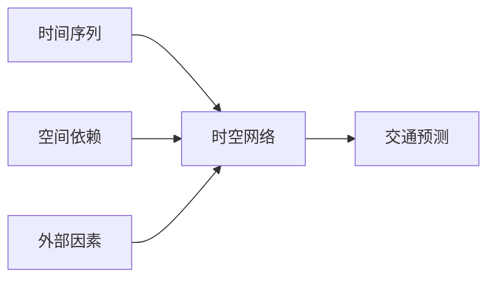

# Python深度学习实践：时空网络在交通预测中的应用

关键词：深度学习、时空网络、交通预测、Python、长短期记忆网络、图卷积网络

## 1. 背景介绍
### 1.1 问题的由来
随着城市化进程的不断加快,城市交通拥堵问题日益突出,给人们的日常出行带来了极大不便。准确预测未来一段时间内的交通状况,对于缓解交通压力、合理调配交通资源具有重要意义。传统的交通预测方法大多基于统计学模型,难以有效捕捉交通流数据中复杂的时空关联性。近年来,深度学习技术的兴起为解决这一难题提供了新的思路。
### 1.2 研究现状
目前,利用深度学习进行交通预测的研究主要集中在以下几个方面:

(1)基于循环神经网络(RNN)的方法。RNN善于处理序列数据,可以建模交通流的时间依赖性。如杨阳等人提出的 LSTM 交通流预测模型[1]。

(2)基于卷积神经网络(CNN)的方法。CNN 能够提取局部区域的空间特征,可用于刻画道路网络的拓扑结构。如 Yao 等人提出的 SRCN 模型[2]。

(3)将 RNN 和 CNN 相结合的方法。综合利用两种网络的优势,更好地捕捉时空依赖关系。如 Zhang 等人的 ST-ResNet[3]。 

(4)引入注意力机制的方法。通过注意力机制动态调整不同时空位置的权重,提升模型表达能力。如 Zheng 等人的 GMAN[4]。

尽管上述工作取得了可喜的进展,但如何更有效地融合时空特征,构建更加精准的预测模型仍有待进一步探索。
### 1.3 研究意义
交通预测研究具有重要的理论和实践意义:

(1)丰富交通流理论。时空网络能够从数据驱动的角度揭示交通流演化规律,为经典交通流理论注入新的活力。

(2)优化交通管控措施。准确预估未来交通状况,可为交通信号配时、诱导屏信息发布等提供科学依据,从而缓解拥堵。

(3)支撑出行服务。交通预测是路径规划、到达时间估计等服务的基础,对于提升出行体验至关重要。

(4)促进交通系统的可持续发展。预测分析一方面有助于提高道路通行效率,另一方面也为需求管理、公交优先等政策提供参考。
### 1.4 本文结构
本文以时空网络为切入点,系统阐述利用 Python 实现交通预测的整个过程。全文共分为九个部分:第一部分介绍研究背景;第二部分概述相关概念;第三部分讲解核心算法原理;第四部分建立数学模型并推导公式;第五部分通过代码实例演示具体实现;第六部分分析实际应用场景;第七部分推荐相关工具和资源;第八部分总结全文并展望未来;第九部分列举常见问题解答。

## 2. 核心概念与联系
时空网络是一类专门用于处理时空数据的深度学习模型,主要包括以下几个核心概念:

(1)时间序列:反映事物随时间变化的数据序列,例如每 5 分钟采集一次的路段车流量数据。

(2)空间依赖:位置邻近的路段之间交通状态往往存在相关性,即空间自相关性。

(3)时间依赖:当前交通状态不仅与当前输入有关,还依赖于过去一段时间的历史观测,即时间自相关性。

(4)外部因素:天气、节假日、事故等外部环境因素也会影响交通状况。

时空网络的核心是如何恰当地建模上述时空依赖关系和外部影响。一般采用 RNN 刻画时间依赖, CNN 或 GNN(图神经网络)刻画空间依赖,再辅以注意力机制增强模型的表达能力。

## 3. 核心算法原理 & 具体操作步骤
### 3.1 算法原理概述
本文采用的时空网络模型主要由三部分组成:长短期记忆网络(LSTM)、图卷积网络(GCN)和注意力机制(Attention)。

- LSTM 负责建模时间依赖关系,学习交通流的动态演化规律;
- GCN 负责建模空间依赖关系,学习路网中节点之间的复杂交互模式;
- Attention 负责自适应地调整不同时空位置的权重,提升关键信息的影响力。

三者相互配合,形成一个端到端的时空序列预测框架。
### 3.2 算法步骤详解
算法的主要步骤如下:

(1)时空图构建。将路网抽象为一个无向图 $G=(V,E,A)$,其中 $V$ 为路段集合, $E$ 为路段间连接关系集合, $A$ 为邻接矩阵。

(2)特征提取。对于每个路段 $v_i \in V$,提取其 $T$ 个时间步的历史车流量数据 $\mathbf{X}_i \in \mathbb{R}^{T \times d}$,其中 $d$ 为输入特征维度。

(3)LSTM 层。将 $\mathbf{X}_i$ 输入 LSTM 中顺序处理,得到最后一个时间步的隐状态 $\mathbf{h}_i \in \mathbb{R}^{d'}$:
$$
\mathbf{h}_i = \mathrm{LSTM}(\mathbf{X}_i)
$$

(4)GCN 层。利用 GCN 聚合节点 $v_i$ 的邻居信息,更新其特征表示:
$$
\mathbf{h}_i^{(l+1)} = \sigma(\sum_{j \in N(i)} \frac{1}{c_{ij}} \mathbf{h}_j^{(l)} \mathbf{W}^{(l)})
$$
其中 $\mathbf{h}_i^{(l)}$ 为第 $l$ 层的节点特征, $N(i)$ 为 $v_i$ 的邻居集合, $c_{ij}$ 为归一化常数, $\mathbf{W}^{(l)}$ 为权重矩阵, $\sigma$ 为激活函数。

(5)注意力层。引入注意力机制动态调整不同时空位置的权重。对于当前时间步 $t$ 的节点 $v_i$,其注意力权重为:
$$
\alpha_i^t = \frac{\exp(f(\mathbf{h}_i^t))}{\sum_{j=1}^N \exp(f(\mathbf{h}_j^t))}
$$
其中 $f$ 为注意力评分函数,可以是一个前馈神经网络。

(6)输出层。将加权后的节点特征通过全连接层映射到输出空间,得到预测值:
$$
\hat{\mathbf{y}}_i^t = \mathbf{W}_o \sum_{i=1}^N \alpha_i^t \mathbf{h}_i^t
$$

(7)损失函数。使用均方误差作为损失函数,对预测值和真实值之间的误差进行优化:
$$
L = \frac{1}{NT} \sum_{i=1}^N \sum_{t=1}^T (\hat{y}_i^t - y_i^t)^2
$$

(8)模型训练。使用反向传播算法和梯度下降法最小化损失函数,迭代更新模型参数直至收敛。
### 3.3 算法优缺点
优点:
- 能够同时建模时间和空间依赖关系,全面刻画交通流的动态演化过程;
- 引入注意力机制,可以自适应地调整不同区域、不同时间的影响权重;
- 端到端的模型结构,直接从原始交通数据中学习预测任务所需的特征表示。

缺点:
- 模型复杂度较高,训练时间较长,对计算资源要求较高;  
- 解释性不足,内部工作机制不够透明,有"黑箱"之嫌;
- 泛化能力有待验证,对于训练数据分布变化的适应性有待进一步研究。
### 3.4 算法应用领域
时空网络用于交通预测的典型应用场景包括:

(1)路段车流量预测。预测未来一段时间内特定路段的车流量变化趋势,为交通管控、诱导提供依据。

(2)通行时间预测。预测指定 OD 之间的行程时间,为出行路径规划、导航服务提供参考。

(3)拥堵指数预测。预测路网整体的通行状况,反映交通运行的宏观效率。

(4)停车位置占用预测。预测停车场未来的车位占用情况,为停车诱导、车位预约等服务奠定基础。

此外,时空网络还可应用于空气质量预测、人流量预测等领域,具有广阔的应用前景。

## 4. 数学模型和公式 & 详细讲解 & 举例说明
### 4.1 数学模型构建
考虑一个有 $N$ 个节点的交通网络,记为无向图 $G=(V,E,A)$。节点集合 $V=\{v_1,\cdots,v_N\}$ 表示路段,边集合 $E$ 表示路段间的连接关系。邻接矩阵 $A \in \mathbb{R}^{N \times N}$ 的元素 $a_{ij}$ 表示节点 $v_i$ 和 $v_j$ 之间的连通性,当 $exp(v_i,v_j) \in E$ 时取 1,否则取 0。

对于节点 $v_i$,记其在过去 $T$ 个时间步的观测值为 $\mathbf{X}_i \in \mathbb{R}^{T \times d}$,其中 $d$ 为输入特征的维度(如车流量、平均速度等)。目标是根据 $\{\mathbf{X}_i\}_{i=1}^N$ 预测未来 $\tau$ 个时间步的交通状态 $\{\mathbf{Y}_i\}_{i=1}^N, \mathbf{Y}_i \in \mathbb{R}^{\tau \times d'}$。
### 4.2 公式推导过程
时空网络模型的前向传播过程可分为以下几个步骤。

(1)时间依赖建模。使用 LSTM 处理每个节点的时间序列数据:
$$
\mathbf{h}_i = \mathrm{LSTM}(\mathbf{X}_i), \quad i=1,\cdots,N
$$

(2)空间依赖建模。使用 GCN 在节点之间传播信息,更新节点表示:
$$
\mathbf{H}^{(l+1)} = \sigma(\hat{A} \mathbf{H}^{(l)} \mathbf{W}^{(l)}), \quad l=1,\cdots,L
$$
其中 $\mathbf{H}^{(l)} \in \mathbb{R}^{N \times d_l}$ 为第 $l$ 层的节点特征矩阵, $\hat{A}=\tilde{D}^{-\frac{1}{2}} \tilde{A} \tilde{D}^{-\frac{1}{2}}$ 为归一化邻接矩阵, $\tilde{A}=A+I_N$ 为加入自环的邻接矩阵, $\tilde{D}_{ii}=\sum_j \tilde{A}_{ij}$ 为度矩阵。

(3)注意力加权。引入注意力机制调整不同节点的权重:
$$
\alpha_i^t = \frac{\exp(f(\mathbf{h}_i^t))}{\sum_{j=1}^N \exp(f(\mathbf{h}_j^t))}, \quad i=1,\cdots,N
$$

(4)输出映射。将加权后的节点特征通过全连接层映射到输出空间:
$$
\hat{\mathbf{y}}_i^t = \mathbf{W}_o \sum_{i=1}^N \alpha_i^t \mathbf{h}_i^t, \quad i=1,\cdots,N
$$

(5)损失函数。使用均方误差(MSE)作为损失函数:
$$
L = \frac{1}{NT} \sum_{i=1}^N \sum_{t=1}^T (\hat{y}_i^t - y_i^t)^2
$$

(6)参数学习。使用反向传播算法计算损失函数对各参数的梯度,并使用优