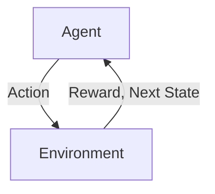

# Reinforcement Learning

## 1. 背景介绍

### 1.1 问题的由来

在传统的机器学习领域中,监督学习和无监督学习占据了主导地位。监督学习需要大量标记好的训练数据,而无监督学习则试图从未标记的数据中发现隐藏的模式和结构。然而,这两种方法都无法很好地解决一类重要的问题,即如何在一个复杂的、不确定的、动态的环境中学习采取最优行动序列以最大化某种累积回报。

强化学习(Reinforcement Learning)应运而生,旨在解决这一类问题。它借鉴了心理学中关于条件反射的理论,通过不断尝试和获得反馈来学习采取最优行动策略。与监督学习不同,强化学习没有给定的输入-输出样本对,代理(Agent)必须通过与环境的交互来学习,这种交互过程中所获得的反馈信号被称为奖励(Reward)。

### 1.2 研究现状

强化学习的理论基础可以追溯到20世纪50年代,当时的研究主要集中在有限状态的马尔可夫决策过程(Markov Decision Processes, MDPs)上。20世纪90年代,强化学习算法取得了一些突破性进展,如Q-Learning和策略梯度(Policy Gradient)方法的提出。进入21世纪后,结合深度学习技术,强化学习在许多领域取得了令人瞩目的成就,如AlphaGo战胜人类顶尖棋手、OpenAI的机器人学会行走等。

目前,强化学习已成为人工智能领域的一个重要分支,在游戏AI、机器人控制、自动驾驶、智能调度等领域都有广泛的应用前景。不过,强化学习也面临一些挑战,如样本效率低下、reward设计困难、算法收敛性差等,这些都是当前研究的热点问题。

### 1.3 研究意义

强化学习旨在解决智能体在复杂环境中学习采取最优行动序列的问题,这种问题在现实世界中无处不在,如机器人控制、流程调度、资源管理等。与监督学习和无监督学习相比,强化学习更加贴近真实场景,具有广阔的应用前景。

从理论层面上,强化学习融合了机器学习、控制论、运筹学、博弈论等多个学科的理论和方法,是一个极具挑战性的交叉研究领域。探索强化学习的理论基础和算法机制,不仅可以推动人工智能技术的发展,也有助于揭示生物智能的奥秘。

### 1.4 本文结构  

本文将全面介绍强化学习的核心概念、算法原理、数学模型、实践应用等内容。具体来说,第2部分阐述强化学习的基本概念和数学框架;第3部分重点讲解核心算法的工作原理和具体步骤;第4部分深入探讨强化学习的数学模型和公式推导;第5部分提供代码实例,并对实现细节进行解析;第6部分介绍强化学习在不同领域的应用场景;第7部分推荐相关的学习资源和开发工具;第8部分总结研究成果,展望未来发展趋势和面临的挑战;第9部分列举常见问题并给出解答。

## 2. 核心概念与联系

强化学习(Reinforcement Learning)是一种基于奖惩机制的机器学习范式,其核心思想是让智能体(Agent)通过与环境(Environment)的交互作用来学习采取最优策略(Policy),以最大化预期的长期累积奖励(Reward)。

在上图所示的强化学习框架中,智能体根据当前状态(State)选择一个行动(Action),将行动施加到环境中,环境会根据这个行动转移到下一个状态,同时返回一个奖励信号(Reward)给智能体。智能体的目标是学习一个策略,使长期累积的奖励最大化。

强化学习问题通常建模为**马尔可夫决策过程**(Markov Decision Process, MDP),可以用一个五元组(S, A, P, R, γ)来表示:

- S是状态空间(State Space)的集合
- A是行动空间(Action Space)的集合  
- P是状态转移概率(State Transition Probability),表示在当前状态s下执行行动a,转移到下一状态s'的概率P(s'|s,a)
- R是奖励函数(Reward Function),表示在状态s下执行行动a,获得的即时奖励R(s,a)
- γ是折现因子(Discount Factor),用于平衡即时奖励和长期奖励的权重

智能体的策略π(a|s)表示在状态s下选择行动a的概率分布。强化学习的目标是找到一个最优策略π*,使预期的长期累积奖励最大:

$$J(\pi) = \mathbb{E}_\pi\left[\sum_{t=0}^\infty \gamma^t R(s_t, a_t)\right]$$

其中,γ∈[0,1]是折现因子,用于平衡即时奖励和长期奖励的权重。

强化学习算法可以分为基于价值函数(Value Function)的算法和基于策略(Policy)的算法两大类。前者先估计状态(或状态-行动对)的价值函数,再根据价值函数导出最优策略;后者直接对策略进行参数化,通过策略梯度下降等方法优化策略参数。

### 2.1 价值函数

在强化学习中,价值函数(Value Function)用于估计当前状态(或状态-行动对)的长期累积奖励。状态价值函数V(s)定义为在状态s下执行策略π后的预期回报:

$$V^\pi(s) = \mathbb{E}_\pi\left[\sum_{t=0}^\infty \gamma^t R(s_t, a_t) | s_0 = s\right]$$

而状态-行动价值函数Q(s,a)定义为在状态s下执行行动a,之后按策略π执行后的预期回报:

$$Q^\pi(s, a) = \mathbb{E}_\pi\left[\sum_{t=0}^\infty \gamma^t R(s_t, a_t) | s_0 = s, a_0 = a\right]$$

价值函数满足以下递推方程(Bellman方程):

$$\begin{aligned}
V^\pi(s) &= \sum_a \pi(a|s) \left(R(s, a) + \gamma \sum_{s'} P(s'|s, a) V^\pi(s')\right)\\
Q^\pi(s, a) &= R(s, a) + \gamma \sum_{s'} P(s'|s, a) \sum_{a'} \pi(a'|s') Q^\pi(s', a')
\end{aligned}$$

基于价值函数的强化学习算法通常分为两个步骤:首先估计价值函数,然后根据价值函数导出最优策略。常见的算法有Q-Learning、Sarsa、Deep Q-Network(DQN)等。

### 2.2 策略函数

除了基于价值函数的方法,另一类强化学习算法直接对策略进行参数化,通过策略梯度下降等方法优化策略参数,使累积奖励最大化。

对于参数化策略π(a|s;θ),其目标是最大化预期的累积奖励:

$$J(\theta) = \mathbb{E}_{\pi_\theta}\left[\sum_{t=0}^\infty \gamma^t R(s_t, a_t)\right]$$

根据策略梯度定理,可以计算出累积奖励J(θ)相对于策略参数θ的梯度:

$$\nabla_\theta J(\theta) = \mathbb{E}_{\pi_\theta}\left[\sum_{t=0}^\infty \nabla_\theta \log \pi_\theta(a_t|s_t) Q^{\pi_\theta}(s_t, a_t)\right]$$

然后使用梯度上升法不断调整策略参数θ,使J(θ)最大化。常见的基于策略的算法有REINFORCE、Actor-Critic、Proximal Policy Optimization(PPO)、Soft Actor-Critic(SAC)等。

## 3. 核心算法原理与具体操作步骤

在上一节中,我们介绍了强化学习的核心概念和数学框架。本节将重点讲解几种核心算法的工作原理和具体实现步骤。

### 3.1 算法原理概述

#### 3.1.1 Q-Learning

Q-Learning是一种基于价值函数的经典强化学习算法,它直接估计最优的状态-行动价值函数Q*(s,a),而无需先获得策略π。算法的核心是通过不断更新Q值表格,使其逼近最优Q函数:

$$Q(s_t, a_t) \leftarrow Q(s_t, a_t) + \alpha \left(r_t + \gamma \max_{a'}Q(s_{t+1}, a') - Q(s_t, a_t)\right)$$

其中,α是学习率,γ是折现因子。这个更新规则被称为时序差分(Temporal Difference,TD)目标。

Q-Learning算法在离散、有限的状态-行动空间中收敛性可以保证,但在连续的或者高维的问题中,由于维数灾难而难以应用。Deep Q-Network(DQN)算法通过使用深度神经网络来拟合Q函数,成功将Q-Learning扩展到了高维连续的问题。

#### 3.1.2 Policy Gradient

Policy Gradient算法直接对策略π(a|s;θ)进行参数化,通过梯度上升法优化策略参数θ,使预期的累积奖励J(θ)最大化。根据策略梯度定理:

$$\nabla_\theta J(\theta) = \mathbb{E}_{\pi_\theta}\left[\sum_{t=0}^\infty \nabla_\theta \log \pi_\theta(a_t|s_t) Q^{\pi_\theta}(s_t, a_t)\right]$$

算法通过采样获得一批状态-行动轨迹,并估计Q值,然后计算策略梯度,并沿着梯度方向更新策略参数θ。

Policy Gradient算法可以直接应用于连续的行动空间,并且理论上可以收敛到局部最优解,但它的收敛性和样本效率都较差。Actor-Critic算法通过引入价值函数估计器(Critic)来减少方差,提高了算法的稳定性和样本效率。

#### 3.1.3 Actor-Critic

Actor-Critic算法将策略函数(Actor)和价值函数(Critic)分开,前者负责根据当前状态选择行动,后者负责评估当前状态(或状态-行动对)的价值。

Actor根据策略梯度公式更新策略参数:

$$\theta \leftarrow \theta + \alpha_\theta \nabla_\theta \log \pi_\theta(a_t|s_t)Q^w(s_t, a_t)$$

Critic根据TD误差更新价值网络参数w:

$$w \leftarrow w + \alpha_w \left(r_t + \gamma V^w(s_{t+1}) - V^w(s_t)\right)\nabla_w V^w(s_t)$$

其中,Q^w(s,a)可以用V^w(s)和优势函数A^w(s,a)的组合来表示:

$$Q^w(s, a) = V^w(s) + A^w(s, a)$$

Actor-Critic架构将策略评估和控制分开,价值函数的引入可以减小策略梯度的方差,从而提高算法的稳定性和样本效率。

### 3.2 算法步骤详解

以下我们将分别对Q-Learning、REINFORCE(蒙特卡洛策略梯度)和Actor-Critic三种核心算法的具体实现步骤进行详细讲解。

#### 3.2.1 Q-Learning算法步骤

1. 初始化Q表格,所有Q(s,a)值设为任意值(如0)
2. 对每个Episode(回合)循环:
    1. 重置环境,获取初始状态s
    2. 对每个时间步t循环:
        1. 根据当前Q值表,选择行动a(如ε-贪婪策略)
        2. 执行行动a,获得反馈(下一状态s'、奖励r)
        3. 计算TD目标:
            $$\text{target} = r + \gamma \max_{a'}Q(s', a')$$
        4. 更新Q(s,a)值:
            $$Q(s, a) \leftarrow Q(s, a) + \alpha(\text{target} - Q(s, a))$$
        5. 将s'作为新的当前状态s
3. 直到终止条件满足(如最大Episode数)

在实现时,可以使用查表法或者函数逼近(如DQN中使用神经网络)来表示和更新Q函数。

#### 3.2.2 REINFORCE算法步骤 

REINFORCE算法是一种基于蒙特