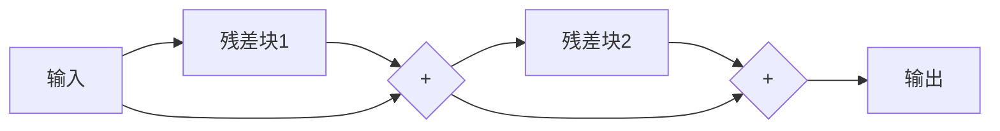

# ResNet原理与代码实例讲解

## 1. 背景介绍

### 1.1 问题的由来

在深度学习领域中,卷积神经网络(CNN)已经广泛应用于计算机视觉任务,如图像分类、物体检测和语义分割等。然而,随着网络深度的增加,训练深层次CNN变得越来越困难,主要原因是梯度消失或梯度爆炸问题。为了解决这个问题,ResNet(Residual Network)被提出,它引入了残差连接(Residual Connection),显著提高了训练深层网络的效率。

### 1.2 研究现状

自2015年ResNet在ImageNet大赛上取得巨大成功以来,残差网络在计算机视觉领域引起了广泛关注。研究人员不断探索和改进ResNet的结构,以提高其性能和泛化能力。例如,通过调整残差块的设计、增加多分支连接等方式,ResNet在多个视觉任务上取得了state-of-the-art的结果。

### 1.3 研究意义

ResNet的出现不仅解决了训练深层网络的梯度问题,更重要的是它为深度神经网络的设计提供了新的思路。残差连接的引入使网络能够更容易地学习残差映射,从而简化了优化过程。此外,ResNet的成功也促进了其他类型残差网络的发展,如DenseNet、ResNeXt等,进一步推动了深度学习领域的进步。

### 1.4 本文结构

本文将全面介绍ResNet的原理、结构和实现细节。首先,我们将探讨ResNet的核心概念和与其他网络的联系。接下来,详细阐述ResNet的算法原理和具体操作步骤。然后,我们将深入分析ResNet的数学模型和公式推导过程,并通过案例进行说明。此外,本文还将提供ResNet的代码实例及详细解释,并讨论其在实际应用中的场景。最后,我们将总结ResNet的发展趋势和面临的挑战,并推荐相关工具和资源。

## 2. 核心概念与联系

ResNet的核心思想是引入残差连接(Residual Connection),将输入直接传递到后面的层,使网络能够更容易地学习残差映射(Residual Mapping)。传统的卷积神经网络需要直接学习映射关系 $H(x)$,而ResNet则学习残差映射 $F(x) = H(x) - x$。通过这种方式,网络只需要学习输入和输出之间的残差,从而简化了优化过程。

```mermaid
graph LR
    A[输入 x] --> B[卷积层]
    B --> C{+}
    A --> C
    C --> D[输出 H(x)]
```

上图展示了ResNet的基本结构,其中残差连接将输入 $x$ 直接传递到后面的层,并与卷积层的输出相加,得到最终的输出 $H(x)$。这种设计使得网络能够更容易地学习恒等映射(Identity Mapping),从而缓解了深层网络的梯度消失或梯度爆炸问题。

ResNet与其他卷积神经网络的主要区别在于引入了残差连接。传统的卷积网络,如VGGNet和AlexNet,是通过堆叠多个卷积层和池化层来构建的。这些网络需要直接学习输入和输出之间的映射关系,随着网络深度的增加,优化过程变得越来越困难。而ResNet通过残差连接,将学习目标转化为残差映射,从而简化了优化过程。

此外,ResNet还与一些其他残差网络有着密切联系,如DenseNet和ResNeXt。DenseNet在ResNet的基础上进一步引入了密集连接(Dense Connection),将每一层的输出与后面所有层相连,以更好地解决了梯度vanishing问题。ResNeXt则在ResNet的基础上引入了分组卷积(Group Convolution)和分支卷积(Cardinality),提高了网络的表达能力和效率。

## 3. 核心算法原理 & 具体操作步骤

### 3.1 算法原理概述

ResNet的核心算法原理是通过引入残差连接,将网络需要学习的映射转化为残差映射,从而简化了优化过程。具体来说,ResNet将传统的卷积神经网络需要学习的映射 $H(x)$ 分解为 $F(x) + x$,其中 $F(x)$ 表示残差映射。

在ResNet中,每个残差块(Residual Block)由两到三层卷积层组成,输入 $x$ 经过这些卷积层后得到 $F(x)$,然后将 $F(x)$ 与输入 $x$ 相加,得到最终的输出 $H(x) = F(x) + x$。通过这种方式,网络只需要学习输入和输出之间的残差 $F(x)$,而不是直接学习映射 $H(x)$,从而简化了优化过程。

### 3.2 算法步骤详解

1. **输入层**:将输入图像 $x$ 传递到网络的第一层。

2. **卷积层**:对输入图像进行卷积操作,提取特征。

3. **残差块**:
   - 输入 $x$ 经过一系列卷积层,得到 $F(x)$。
   - 将 $F(x)$ 与输入 $x$ 相加,得到 $H(x) = F(x) + x$。
   - $H(x)$ 作为下一个残差块的输入。

4. **重复步骤3**:重复执行残差块,构建深层次网络。

5. **池化层**:在适当的位置插入池化层,降低特征图的分辨率。

6. **全连接层**:将最后一层的特征图展平,并通过全连接层进行分类或回归。

需要注意的是,在实际实现中,由于输入和输出的通道数可能不同,ResNet会在残差连接处添加一个线性投影,将输入 $x$ 的通道数调整为与 $F(x)$ 相同。此外,当输入和输出的分辨率不同时,ResNet还会对输入 $x$ 进行下采样,以匹配 $F(x)$ 的分辨率。

### 3.3 算法优缺点

**优点**:

1. **缓解梯度消失/爆炸问题**:残差连接使网络能够更容易地学习恒等映射,从而缓解了训练深层网络时的梯度消失或梯度爆炸问题。

2. **加速收敛**:由于网络只需要学习残差映射,优化过程变得更加简单,从而加快了收敛速度。

3. **提高泛化能力**:残差连接有助于减少过拟合,提高网络的泛化能力。

4. **模块化设计**:ResNet采用了模块化的设计,每个残差块都是一个独立的模块,便于网络的构建和修改。

**缺点**:

1. **参数增加**:由于引入了残差连接,ResNet的参数数量相比传统卷积网络会有一定增加。

2. **计算开销增加**:残差连接会引入额外的计算开销,尤其是在深层网络中。

3. **优化困难**:虽然残差连接简化了优化过程,但对于非常深的网络,仍然存在一定的优化困难。

4. **内存占用较高**:由于需要保存中间层的特征图用于残差连接,ResNet的内存占用相对较高。

### 3.4 算法应用领域

ResNet已经在多个计算机视觉任务中取得了state-of-the-art的性能,包括但不限于:

1. **图像分类**:ResNet在ImageNet等大型图像分类数据集上表现出色,是目前最流行的图像分类模型之一。

2. **物体检测**:ResNet被广泛用作基础骨干网络,集成到目标检测算法中,如Faster R-CNN、YOLO等。

3. **语义分割**:ResNet也被应用于像素级别的语义分割任务,如场景解析、医学图像分割等。

4. **人脸识别**:ResNet在人脸识别领域也有着广泛的应用,如FaceNet等。

5. **视频理解**:ResNet还被用于视频理解任务,如动作识别、视频描述等。

6. **自然语言处理**:除了计算机视觉领域,ResNet也被应用于自然语言处理任务,如机器翻译、文本分类等。

总的来说,ResNet的优秀性能和通用性使其在多个领域得到了广泛应用,成为深度学习模型设计的重要范例之一。

## 4. 数学模型和公式 & 详细讲解 & 举例说明

### 4.1 数学模型构建

为了更好地理解ResNet的原理,我们需要构建其数学模型。假设输入为 $x$,期望输出为 $H(x)$,传统的卷积神经网络需要直接学习映射 $H(x)$。而ResNet则将这个映射分解为 $F(x) + x$,其中 $F(x)$ 表示残差映射。

在ResNet中,每个残差块由两到三层卷积层组成,我们可以将其表示为:

$$
y_l = h(x_l) + \mathcal{F}(x_l, W_l)
$$

其中:

- $x_l$ 和 $y_l$ 分别表示第 $l$ 个残差块的输入和输出。
- $h(x_l)$ 是恒等映射(Identity Mapping),即 $h(x_l) = x_l$。
- $\mathcal{F}(\cdot)$ 表示残差映射,由卷积层和激活函数组成,参数为 $W_l$。

对于整个ResNet网络,我们可以将其表示为:

$$
y_L = x_0 + \sum_{l=1}^L \mathcal{F}(x_l, W_l)
$$

其中 $L$ 表示ResNet的深度,即残差块的数量。

### 4.2 公式推导过程

为了更好地理解ResNet的优化过程,我们来推导一下残差块的反向传播公式。

假设残差块的损失函数为 $\mathcal{L}(y_l)$,我们需要计算 $\frac{\partial \mathcal{L}}{\partial x_l}$ 和 $\frac{\partial \mathcal{L}}{\partial W_l}$。

根据链式法则,我们有:

$$
\frac{\partial \mathcal{L}}{\partial x_l} = \frac{\partial \mathcal{L}}{\partial y_l} \cdot \frac{\partial y_l}{\partial x_l}
$$

$$
\frac{\partial \mathcal{L}}{\partial W_l} = \frac{\partial \mathcal{L}}{\partial y_l} \cdot \frac{\partial y_l}{\partial W_l}
$$

由于 $y_l = h(x_l) + \mathcal{F}(x_l, W_l)$,我们可以得到:

$$
\frac{\partial y_l}{\partial x_l} = 1 + \frac{\partial \mathcal{F}(x_l, W_l)}{\partial x_l}
$$

$$
\frac{\partial y_l}{\partial W_l} = \frac{\partial \mathcal{F}(x_l, W_l)}{\partial W_l}
$$

将上式代入,我们可以得到:

$$
\frac{\partial \mathcal{L}}{\partial x_l} = \frac{\partial \mathcal{L}}{\partial y_l} \cdot \left( 1 + \frac{\partial \mathcal{F}(x_l, W_l)}{\partial x_l} \right)
$$

$$
\frac{\partial \mathcal{L}}{\partial W_l} = \frac{\partial \mathcal{L}}{\partial y_l} \cdot \frac{\partial \mathcal{F}(x_l, W_l)}{\partial W_l}
$$

从上式可以看出,由于残差连接的存在,梯度不会像传统网络那样直接传递,而是会被 $1 + \frac{\partial \mathcal{F}(x_l, W_l)}{\partial x_l}$ 这一项调节。这就是ResNet能够缓解梯度消失或梯度爆炸问题的原因之一。

### 4.3 案例分析与讲解

为了更好地理解ResNet的工作原理,我们来分析一个具体的案例。假设我们有一个简单的ResNet,包含两个残差块,每个残差块由两层卷积层组成。



在这个例子中,输入 $x$ 首先经过第一个残差块 $B$,得到 $F_1(x)$。然后,将 $F_1(x)$ 与输入 $x$ 相加,得到 $x + F_1(x)$。这个结