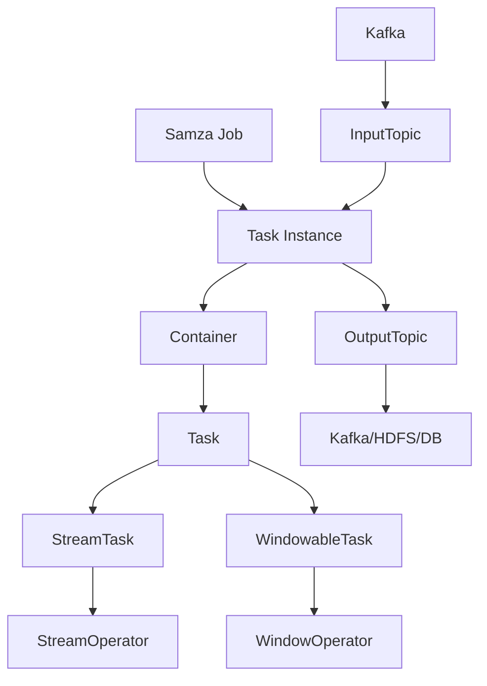

# Samza Task原理与代码实例讲解

## 1. 背景介绍

### 1.1 问题的由来

在当今大数据时代，实时处理海量数据流成为了一个迫切的需求。传统的批处理系统无法满足低延迟和高吞吐量的要求。Apache Samza作为一个分布式流处理系统应运而生,它能够实时处理来自Kafka等消息队列的数据流,并将处理结果输出到HDFS、数据库或者其他系统。

Samza的核心概念是Task,它是Samza作业中最小的处理单元。每个Task负责消费和处理一个或多个Kafka分区的消息流,并将处理结果输出到下游系统。Task的设计和实现直接影响了Samza的性能和可扩展性,因此深入理解Task的原理和实现方式对于高效利用Samza至关重要。

### 1.2 研究现状

目前,已有一些文献和资料对Samza Task的原理和实现进行了介绍和分析,但大多数都比较浅显,缺乏深入的剖析和代码级别的解读。同时,随着Samza版本的不断更新,Task的实现细节也在不断演进,一些较早的资料可能已经过时。

### 1.3 研究意义

深入理解Samza Task的原理和实现对于以下几个方面具有重要意义:

1. **性能优化**:了解Task的执行流程和内部机制,可以更好地优化Task的配置和代码,提高处理效率。

2. **故障排查**:当Task出现异常或性能问题时,掌握其原理有助于快速定位和解决问题。

3. **定制开发**:基于对Task的深入理解,可以根据特定需求定制和扩展Task的功能。

4. **架构设计**:在设计分布式流处理系统时,Task的原理和实现可以为架构设计提供借鉴和参考。

### 1.4 本文结构

本文将从以下几个方面深入剖析Samza Task:

1. 介绍Samza Task的核心概念及其在Samza架构中的地位和作用。

2. 详细解释Task的执行原理,包括启动、消费、处理和输出等各个阶段的流程。

3. 分析Task的实现代码,解读关键类和方法的功能和原理。

4. 通过代码示例演示如何定制和扩展Task的功能。

5. 探讨Task的优化策略和最佳实践。

6. 总结Task的发展趋势和面临的挑战。

## 2. 核心概念与联系

在深入探讨Samza Task的原理和实现之前,我们先介绍一些核心概念,以及它们在Samza架构中的关系。

- **Samza Job**: 一个Samza作业,由一个或多个Task Instance组成。

- **Task Instance**: Task的一个实例,消费并处理一个或多个Kafka分区的消息流。

- **Container**: 一个JVM进程,包含一个或多个Task Instance。

- **Task**: Task是Samza作业中最小的处理单元,负责消费、处理和输出消息流。Task有两种类型:StreamTask和WindowableTask。

- **StreamTask**: 实现了StreamOperator接口,用于处理无边界的数据流。

- **WindowableTask**: 实现了WindowOperator接口,用于处理有边界的窗口数据流。

- **StreamOperator**: 定义了处理数据流的操作,如map、filter、join等。

- **WindowOperator**: 定义了处理窗口数据流的操作,如window、join等。

- **Kafka**: Samza作业的输入源,通常是Kafka集群。

- **InputTopic**: Kafka主题,作为Task Instance的输入源。

- **OutputTopic**: Task Instance处理后的输出结果,可以输出到Kafka主题、HDFS或数据库等。

在Samza中,一个作业由多个Task Instance组成,每个Task Instance消费并处理一个或多个Kafka分区的消息流。Task Instance在Container中运行,一个Container可以包含多个Task Instance。

Task是Samza作业中最核心的处理单元,它负责实现具体的数据处理逻辑。StreamTask用于处理无边界的数据流,而WindowableTask则用于处理有边界的窗口数据流。两种Task类型分别实现了StreamOperator和WindowOperator接口,定义了不同的数据处理操作。

Task Instance从Kafka的InputTopic中消费消息,经过处理后将结果输出到OutputTopic,OutputTopic可以是Kafka主题、HDFS或数据库等。

## 3. 核心算法原理 & 具体操作步骤

### 3.1 算法原理概述

Samza Task的核心算法原理可以概括为以下几个步骤:

1. **启动**:Task在Container中启动时,会初始化一些配置和状态,并建立与Kafka的连接。

2. **消费消息**:Task从指定的Kafka分区中消费消息,并将消息缓存在内存中。

3. **窗口分配(WindowableTask)**:对于WindowableTask,需要将消息分配到不同的窗口中进行处理。

4. **处理消息**:Task根据实现的StreamOperator或WindowOperator接口,对消费的消息执行相应的处理操作,如map、filter、join等。

5. **检查点(Checkpoint)**:为了保证故障恢复时的exactly-once语义,Task会定期将其状态持久化到状态存储中,这个过程称为检查点(Checkpoint)。

6. **输出结果**:Task将处理后的结果输出到下游系统,如Kafka主题、HDFS或数据库等。

7. **提交偏移量**:Task消费完一批消息后,需要将已消费的偏移量提交到Kafka,以便下次重启时从上次提交的偏移量处继续消费。

8. **关闭**:当Task被停止时,它需要执行一些清理操作,如关闭与Kafka的连接、刷新状态等。

### 3.2 算法步骤详解

下面我们详细解释Samza Task算法的每个步骤。

#### 3.2.1 启动

当Samza作业启动时,每个Task Instance都会在一个Container中启动。Task启动的主要步骤如下:

1. 解析作业配置和Task配置。

2. 初始化TaskCoordinator,建立与Kafka的连接,并获取Task需要消费的分区信息。

3. 初始化StateBackingStore,用于存储Task的状态数据。

4. 初始化WindowedStore(WindowableTask),用于存储窗口数据。

5. 初始化Metrics,用于收集Task的指标数据。

6. 初始化TaskCallbackManager,用于管理Task的生命周期回调函数。

7. 执行用户定义的初始化逻辑(init方法)。

#### 3.2.2 消费消息

Task从Kafka消费消息的过程如下:

1. TaskCoordinator通过KafkaConsumer API从指定的Kafka分区中拉取消息。

2. 将拉取到的消息缓存在内存中的BlockingEnvelopeMap中。

3. 如果消息量超过了阈值,Task会将消息持久化到StateBackingStore中,以防止内存溢出。

4. Task通过WindowedStore(WindowableTask)或BlockingEnvelopeMap(StreamTask)获取待处理的消息。

#### 3.2.3 窗口分配(WindowableTask)

对于WindowableTask,需要将消息分配到不同的窗口中进行处理。窗口分配的过程如下:

1. 根据用户定义的窗口策略(如时间窗口、计数窗口等),将消息分配到对应的窗口中。

2. 将窗口数据存储在WindowedStore中。

3. 当一个窗口的数据准备好进行处理时,WindowedStore会触发相应的回调函数。

#### 3.2.4 处理消息

Task处理消息的过程如下:

1. 对于StreamTask,Task会调用processStream方法,执行StreamOperator定义的处理逻辑。

2. 对于WindowableTask,Task会调用processWindow方法,执行WindowOperator定义的处理逻辑。

3. 处理逻辑通常包括map、filter、join等操作,用户可以自定义这些操作。

4. 处理后的结果会被缓存在内存中,等待输出。

#### 3.2.5 检查点(Checkpoint)

为了保证exactly-once语义,Task需要定期将其状态持久化到StateBackingStore中,这个过程称为检查点(Checkpoint)。检查点的过程如下:

1. Task会定期触发检查点操作,间隔时间由作业配置中的task.checkpoint.system决定。

2. 将Task的状态数据(如窗口数据、聚合结果等)持久化到StateBackingStore中。

3. 将检查点元数据(如检查点ID、分区偏移量等)持久化到StateBackingStore中。

4. 如果检查点成功,Task会将已处理的消息偏移量提交到Kafka。

#### 3.2.6 输出结果

Task将处理后的结果输出到下游系统的过程如下:

1. 根据作业配置中指定的输出系统(如Kafka、HDFS或数据库等),选择相应的OutputSystemFactory。

2. 通过OutputSystemFactory创建OutputSystem实例。

3. Task将处理结果传递给OutputSystem,由OutputSystem将结果输出到下游系统。

4. 如果输出成功,Task会将已输出的消息偏移量提交到Kafka。

#### 3.2.7 提交偏移量

Task消费完一批消息后,需要将已消费的偏移量提交到Kafka,以便下次重启时从上次提交的偏移量处继续消费。提交偏移量的过程如下:

1. Task将已处理的消息偏移量存储在内存中的OffsetManager中。

2. 定期触发提交偏移量操作,间隔时间由作业配置中的task.commit.ms决定。

3. OffsetManager将偏移量提交到Kafka的__consumer_offsets主题中。

4. 如果提交成功,OffsetManager会清空内存中的偏移量缓存。

#### 3.2.8 关闭

当Task被停止时,它需要执行一些清理操作。关闭的主要步骤如下:

1. 执行用户定义的关闭逻辑(close方法)。

2. 关闭Metrics,停止指标数据的收集。

3. 关闭StateBackingStore,刷新并关闭状态存储。

4. 关闭TaskCoordinator,断开与Kafka的连接。

5. 关闭OutputSystem,确保所有结果都已输出。

### 3.3 算法优缺点

Samza Task算法的优点如下:

1. **exactly-once语义**:通过检查点机制和偏移量提交,Samza Task能够保证exactly-once语义,即每条消息只被处理一次。

2. **容错性**:由于状态和偏移量都持久化到StateBackingStore中,Task可以从上次检查点处恢复,实现容错。

3. **可扩展性**:Task是Samza作业的最小处理单元,可以根据需求动态调整Task的数量,实现横向扩展。

4. **灵活性**:Samza提供了StreamOperator和WindowOperator接口,用户可以自定义处理逻辑,满足不同的需求。

5. **可插拔性**:Samza支持多种输入输出系统,用户可以根据需求选择不同的系统。

算法的缺点和局限性如下:

1. **延迟**:由于需要定期执行检查点和提交偏移量操作,会引入一定的延迟。

2. **资源消耗**:检查点和状态存储会占用一定的磁盘空间和网络带宽。

3. **复杂性**:exactly-once语义的实现相对复杂,需要处理各种边界情况和异常场景。

4. **可用性**:如果StateBackingStore出现故障,Task将无法正常工作。

### 3.4 算法应用领域

Samza Task算法广泛应用于以下领域:

1. **实时数据处理**:Samza可以实时处理来自Kafka等消息队列的数据流,满足低延迟和高吞吐量的需求。

2. **日志处理**:Samza常被用于处理各种应用程序和系统的日志数据,进行实时分析和监控。

3. **物联网数据处理**:物联网设备产生的海量数据可以通过Samza进行实时处理和分析。

4. **在线广告系统**:Samza可以用于实时处理用户行为数据,进行个性化广告投放。

5. **金融风控**:Samza能够实时检测和防范金融交易中的风险和欺诈行为。

6. **推荐系统**: