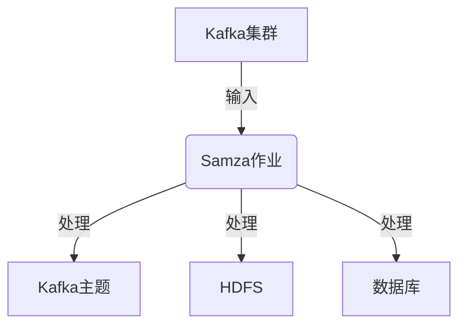
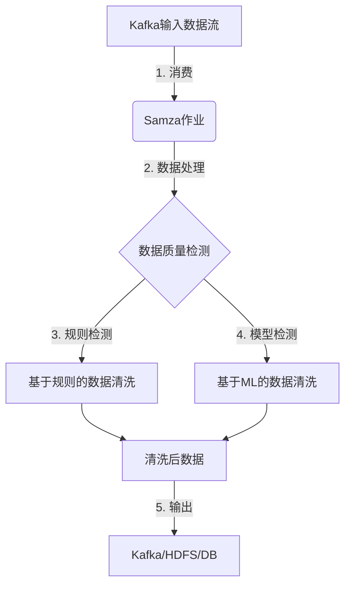

# Samza数据处理与数据质量创新

## 1. 背景介绍

### 1.1 问题的由来

在当今大数据时代，海量的数据不断被产生和传输。如何高效地处理这些数据流成为了一个巨大的挑战。传统的批处理系统由于其高延迟和低吞吐量,已经无法满足实时数据处理的需求。因此,需要一种新的数据处理范式来应对这一挑战。

Apache Samza作为一个分布式的流处理系统,被设计用于解决这一问题。它基于Apache Kafka构建,能够实时处理来自Kafka的数据流,并将处理后的结果输出到Kafka、HDFS、数据库等存储系统中。

然而,随着数据量的不断增长,数据质量问题也日益突出。低质量的数据不仅会影响分析结果的准确性,还可能导致系统效率低下甚至系统崩溃。因此,确保数据的高质量对于Samza这样的流处理系统来说至关重要。

### 1.2 研究现状

目前,已有一些研究致力于提高Samza的数据处理能力和数据质量。例如,Samza支持exactly-once语义,确保每条消息只被处理一次,避免了数据重复或丢失的问题。此外,Samza还提供了容错机制,可以在作业失败时自动重新启动,保证数据处理的可靠性。

在数据质量方面,一些研究提出了基于规则的数据清洗方法,通过预定义的规则来检测和修复数据中的异常值。另一些研究则采用了机器学习技术,利用历史数据训练模型,自动发现和处理数据中的异常。

### 1.3 研究意义

虽然已有一些研究探索了Samza的数据处理和数据质量问题,但仍然存在一些不足之处。例如,现有的数据清洗方法通常只关注单一类型的异常,而忽视了数据中可能存在的其他类型异常。此外,大多数研究都是独立进行的,缺乏一个统一的框架来综合考虑数据处理和数据质量两个方面。

本文旨在提出一种创新的方法,将数据处理和数据质量两个问题统一起来考虑。通过设计一个综合的框架,不仅可以提高Samza的数据处理效率,还能够显著提升数据质量,为下游的数据分析任务提供高质量的数据源。

### 1.4 本文结构  

本文的结构安排如下:

- 第2部分介绍了Samza数据处理的核心概念,以及它们之间的联系。
- 第3部分详细阐述了本文提出的数据处理和数据质量创新算法的原理和具体步骤。
- 第4部分构建了算法的数学模型,并推导出相关公式,通过案例分析加深读者的理解。
- 第5部分提供了一个实际项目的代码实例,并对关键代码进行了解释说明。
- 第6部分讨论了本算法在不同场景下的应用前景。
- 第7部分推荐了一些有用的学习资源、开发工具和相关论文。
- 第8部分总结了本文的研究成果,并对未来的发展趋势和面临的挑战进行了展望。
- 第9部分列出了一些常见问题并给出解答。

## 2. 核心概念与联系

在深入探讨本文提出的创新算法之前,我们先来回顾一下Samza数据处理的一些核心概念。

1. **Kafka集群**: Kafka是一个分布式的发布-订阅消息队列系统,常被用作数据源为Samza提供数据流输入。

2. **Samza作业**: 一个Samza作业由一个或多个Samza任务(Task)组成,每个任务从Kafka的一个或多个分区(Partition)中消费数据,并对其进行处理。

3. **Kafka主题**: Samza作业处理后的数据可以输出到一个或多个Kafka主题中,以供其他系统进一步使用。

4. **HDFS**: Samza还支持将处理后的数据持久化存储到HDFS分布式文件系统中。

5. **数据库**: 除了HDFS,Samza还可以将结果输出到关系型或NoSQL数据库中。

这些核心概念相互关联,共同构成了Samza的数据处理管道。其中,Kafka集群作为数据源,为Samza提供输入数据流;Samza作业对数据进行实时处理;处理后的结果可以输出到Kafka主题、HDFS或数据库等多种存储系统中,以供后续使用。

## 3. 核心算法原理与具体操作步骤

### 3.1 算法原理概述  

本文提出的创新算法同时关注数据处理和数据质量两个方面。在数据处理方面,该算法基于Samza的流处理框架,能够高效地处理来自Kafka的实时数据流。在数据质量方面,该算法采用了一种综合的数据清洗策略,包括基于规则的方法和基于机器学习的方法,能够有效地检测和处理各种类型的数据异常。

算法的总体流程如下所示:

1. Samza作业从Kafka集群消费输入数据流。
2. 对输入数据进行所需的处理操作。
3. 使用预定义的规则检测数据中的异常,并基于规则进行数据清洗。
4. 使用训练好的机器学习模型检测数据异常,并基于模型输出进行数据清洗。
5. 将清洗后的高质量数据输出到Kafka主题、HDFS或数据库等存储系统中,供后续使用。

该算法的创新之处在于,它将数据处理和数据质量两个环节有机结合,在保证数据处理高效的同时,还能够显著提升数据质量。下面将对算法的具体步骤进行详细阐述。

### 3.2 算法步骤详解

1. **数据消费**:  
   Samza作业从Kafka集群消费输入数据流。可以配置消费数据的主题、分区以及消费策略(如earliest、latest等)。

2. **数据处理**:  
   根据具体的业务需求,对消费的数据执行所需的处理操作,例如过滤、转换、聚合等。Samza提供了丰富的API,支持使用Java或Scala语言进行数据处理。

3. **数据质量检测**:
   - **基于规则的检测**: 使用预定义的规则检测数据中的异常,例如空值、异常值、重复数据等。规则可以根据具体的业务场景和数据特征进行定制。
   - **基于机器学习的检测**: 利用历史数据训练机器学习模型,自动发现数据中的异常模式。可以使用无监督学习算法(如聚类算法)或者监督学习算法(如分类算法)。

4. **数据清洗**:  
   - **基于规则的清洗**: 根据规则检测的结果,对异常数据执行相应的清洗操作,例如删除、替换或者补全等。
   - **基于机器学习的清洗**: 根据模型检测的结果,对异常数据执行清洗操作。清洗策略可以是删除异常数据,也可以是基于模型输出对异常数据进行修复。

5. **数据输出**:
   将清洗后的高质量数据输出到指定的存储系统中,例如Kafka主题、HDFS或者数据库等。这些存储系统可以作为下游数据分析任务的数据源。

需要注意的是,上述步骤并非严格的线性执行,数据处理和数据质量检测可以交替进行,形成一个闭环。此外,算法中的参数(如规则、模型等)可以根据实际需求进行动态调整,以获得最佳的数据质量。

### 3.3 算法优缺点

**优点**:

1. **高效处理**:  
   基于Samza的流处理框架,能够高效地处理实时数据流,满足低延迟和高吞吐量的需求。

2. **数据质量保证**:  
   综合采用基于规则和基于机器学习的数据清洗策略,能够全面检测和处理各种类型的数据异常,显著提升数据质量。

3. **可扩展性强**:  
   算法中的规则和模型可以根据实际需求进行动态调整,具有很强的可扩展性和灵活性。

4. **高可用性**:  
   Samza本身提供了容错机制和exactly-once语义,确保了算法的高可用性和数据处理的可靠性。

**缺点**:

1. **规则和模型依赖**:  
   算法对预定义的规则和训练好的机器学习模型有一定依赖,需要投入一定的人力和时间进行维护和优化。

2. **计算资源消耗**:  
   在数据量较大的情况下,数据质量检测和清洗可能会消耗较多的计算资源,对集群资源的需求较高。

3. **延迟增加**:  
   相比于单纯的数据处理,增加了数据质量检测和清洗的环节,可能会导致整体延迟略有增加。

### 3.4 算法应用领域

本文提出的创新算法可以应用于各种需要实时处理大数据流并保证数据质量的场景,例如:

1. **物联网数据处理**:  
   物联网设备产生的海量数据往往存在噪声、异常值等质量问题,本算法可以对这些数据进行实时清洗,为后续的数据分析提供高质量的数据源。

2. **金融风控**:  
   在金融交易场景中,能够实时发现异常交易行为至关重要。本算法不仅可以对交易数据进行实时处理,还能够及时发现异常交易并进行处理,提高风控能力。

3. **网络安全监控**:  
   网络流量数据中可能存在各种异常模式,如垃圾邮件、病毒木马等。本算法可以对这些数据进行实时分析,发现潜在的安全威胁,提高网络安全防护能力。

4. **电商用户行为分析**:  
   电商网站产生的用户行为数据量巨大,并且可能存在机器人、作弊等异常行为。本算法可以对这些数据进行实时清洗,为精准营销和个性化推荐提供可靠的数据基础。

5. **社交媒体数据分析**:  
   社交媒体上的用户数据往往包含大量的噪声和垃圾信息。本算法可以对这些数据进行实时清洗,为舆情分析、热点发现等任务提供高质量的数据支持。

总的来说,任何需要实时处理大数据流并保证数据质量的应用场景,都可以考虑使用本文提出的创新算法。

## 4. 数学模型和公式详细讲解举例说明  

### 4.1 数学模型构建

为了量化评估数据质量,我们构建了一个综合的数据质量评分模型。该模型考虑了数据的完整性、准确性、一致性、及时性和相关性等多个维度,并为每个维度分配了不同的权重。

设数据集 $D$ 包含 $n$ 个数据记录 $\{r_1, r_2, \dots, r_n\}$,每个数据记录 $r_i$ 包含 $m$ 个属性 $\{a_1, a_2, \dots, a_m\}$。我们定义数据质量评分函数 $Q(D)$ 如下:

$$Q(D) = \sum_{j=1}^{m}w_j \cdot q_j(D)$$

其中:
- $w_j$ 表示第 $j$ 个属性的权重,满足 $\sum_{j=1}^{m}w_j=1$
- $q_j(D)$ 表示第 $j$ 个属性在数据集 $D$ 上的质量评分,取值范围为 $[0