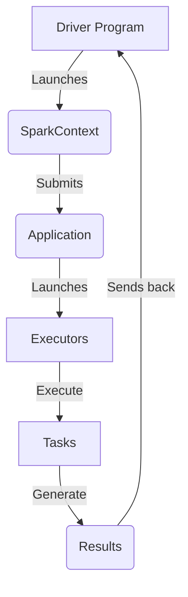

# Spark Executor原理与代码实例讲解

关键词：Spark、Executor、分布式计算、任务调度、内存管理、容错机制

## 1. 背景介绍
### 1.1 问题的由来
在大数据时代,海量数据的高效处理成为了企业和组织的迫切需求。传统的单机计算模式已经无法满足日益增长的计算需求,分布式计算框架应运而生。Spark作为当前最流行的分布式计算框架之一,凭借其快速、通用、易用等特点,在实时数据处理、机器学习等领域得到了广泛应用。而Spark Executor作为Spark分布式计算的基础,深入理解其原理和掌握其应用,对于开发高效的Spark应用程序至关重要。

### 1.2 研究现状 
目前,国内外学术界和工业界都在Spark Executor原理和应用方面做了大量研究。UC Berkeley AMP Lab的研究人员提出了Spark的基本架构和计算模型[1],奠定了Spark分布式计算的理论基础。此后,众多研究者在此基础上对Spark Executor的任务调度[2]、内存管理[3]、容错机制[4]等方面进行了深入研究,并提出了一系列改进方法,不断提升Spark Executor的性能和可靠性。同时,Spark社区也在积极推动Spark Executor在机器学习[5]、图计算[6]等领域的应用研究,拓展了Spark的应用场景。

### 1.3 研究意义
深入研究Spark Executor原理,对于优化Spark应用程序性能、提高集群资源利用率、保障应用可靠性等方面具有重要意义。通过理解Executor的任务执行流程、内存管理机制、容错恢复过程等,开发人员可以针对性地调优Spark应用,最大限度发挥集群性能。同时,Spark Executor的原理也为其他分布式计算框架的设计和实现提供了有益参考。此外,Spark Executor在诸多领域的应用研究,也为传统行业注入新的活力,推动了业务模式的创新。

### 1.4 本文结构
本文将围绕Spark Executor的原理和应用展开深入讨论。第2节介绍Spark Executor的基本概念和在Spark架构中的作用。第3节重点剖析Executor的工作原理,包括任务调度、执行过程、内存管理、容错机制等。第4节通过数学建模的方法,对Executor的关键指标进行量化分析。第5节给出Spark Executor的代码实例,并进行详细解读。第6节探讨Executor在实际场景中的应用案例。第7节推荐Spark Executor相关的学习资源和开发工具。第8节对全文进行总结,并展望Spark Executor的未来发展方向和挑战。

## 2. 核心概念与联系
在Spark分布式计算框架中,Executor是集群中工作节点(Worker Node)上的一个进程,负责执行任务(Task)。一个Spark应用可以在多个工作节点上启动多个Executor进程,协同完成作业(Job)的计算任务。下面是Spark Executor的一些核心概念:

- **Application:** Spark应用程序,包含Dirver程序和在集群上运行的Executors。
- **Driver:** Spark的主控程序,负责作业的调度、任务的分发和结果的收集。  
- **Executor:** 运行在工作节点上的进程,负责执行计算任务,并为任务提供运行环境。
- **Worker Node:** Spark集群的工作节点,可以在一个Worker Node上启动多个Executor。
- **Task:** Spark作业的基本执行单元,一个任务对应一个数据分区的处理。
- **Job:** 由多个Task组成的大型工作单元,对应一次Action操作触发的计算。
- **Stage:** Job的子集,包含一组没有Shuffle依赖关系的Task,代表了Job的一个计算阶段。

下图展示了Spark Executor在整个Spark架构中的位置和相互关系:

可以看出,Executor接受Driver的任务分配,执行计算任务,并将计算结果返回给Driver,是Spark分布式计算的执行者。同时,Executor内部通过线程池管理Task的并发执行,通过内存管理机制(如堆外内存)优化计算性能,并提供了Checkpoint等容错恢复手段。因此,理解Spark Executor的原理,对于开发高效可靠的Spark应用至关重要。

## 3. 核心算法原理 & 具体操作步骤
### 3.1 算法原理概述
Spark Executor的核心是以线程池的方式并发执行任务,同时利用内存缓存和Checkpoint等机制提升计算性能和容错能力。具体来说,Executor接收到Driver分配的任务后,会将任务放入线程池队列,由线程池中的工作线程从队列中取出任务并执行。在任务执行过程中,Executor会尽可能利用内存缓存数据,减少IO开销;同时,Executor还会定期将任务执行状态写入Checkpoint文件,以便在发生故障时能够从Checkpoint恢复任务。

### 3.2 算法步骤详解
下面详细介绍Spark Executor的工作流程和算法步骤:

1. **任务提交:** Driver将Task以序列化的形式提交给Executor。
2. **任务反序列化:** Executor接收到序列化的Task后,先进行反序列化,得到可执行的任务。 
3. **任务调度:** Executor将反序列化后的Task放入线程池的任务队列中,等待调度执行。
4. **任务执行:** 线程池中的工作线程从任务队列中取出Task,并执行计算逻辑。
   - 如果Task是Shuffle Map Task,则输出写入Shuffle文件。
   - 如果Task是Result Task,则输出写入HDFS或返回Driver。
5. **内存缓存:** 在任务执行过程中,Executor会尽量将中间结果缓存到内存中,加速后续的计算。
6. **容错恢复:** 在任务执行过程中,Executor会定期将任务执行状态写入Checkpoint文件。如果任务执行失败,可以从最近的Checkpoint恢复任务。
7. **结果返回:** 当所有Task执行完成后,Executor将结果返回给Driver。

### 3.3 算法优缺点
Spark Executor的算法设计有如下优点:

- 并发执行:通过线程池实现任务的并发执行,充分利用CPU资源。
- 内存缓存:利用内存缓存中间结果,减少IO开销,加速计算。 
- 容错恢复:通过Checkpoint机制,实现任务的容错恢复。
- 弹性伸缩:可以动态调整Executor的数量和资源,适应不同的负载需求。

同时,Spark Executor也存在一些局限性:

- 内存开销:大量使用内存缓存,可能导致内存资源紧张。
- GC压力:频繁的对象创建和销毁,可能导致GC压力增大。
- 反序列化开销:任务的序列化和反序列化会带来一定的计算开销。

### 3.4 算法应用领域
Spark Executor的并行计算和容错机制,使其适用于多种大数据处理场景,主要包括:

- 批处理:如ETL、数据分析等离线批处理作业。
- 流处理:如实时数据分析、异常检测等流式计算作业。
- 图计算:如PageRank、社交网络分析等图计算作业。
- 机器学习:如分类、聚类、推荐等机器学习算法的训练和预测。

## 4. 数学模型和公式 & 详细讲解 & 举例说明
### 4.1 数学模型构建
为了量化分析Spark Executor的关键性能指标,我们构建如下数学模型:

- 定义Executor数量为$N$,每个Executor的CPU核数为$C$,内存大小为$M$。
- 定义任务数量为$T$,每个任务的平均执行时间为$t$,平均Shuffle数据量为$S$。
- 定义Executor的CPU利用率为$U_c$,内存利用率为$U_m$,网络带宽利用率为$U_n$。

则我们可以得到如下关系:

- Executor的总CPU资源: $C_total = N * C$
- Executor的总内存资源: $M_total = N * M$
- 任务的总执行时间: $T_total = T * t$
- Shuffle的总数据量: $S_total = T * S$
- CPU利用率: $U_c = \frac{T_total}{C_total}$
- 内存利用率: $U_m = \frac{S_total}{M_total}$
- 网络带宽利用率: $U_n = \frac{S_total}{B_total}$,其中$B_total$为总网络带宽

### 4.2 公式推导过程
根据上述模型,我们可以推导出一些有用的公式:

1. 计算加速比 $S_p$:
$$S_p = \frac{T * t}{N * t} = \frac{T}{N}$$
可见,Executor数量越多,计算加速比越高。

2. 计算Executor的平均内存使用量$M_avg$:
$$M_avg = \frac{S_total}{N} = \frac{T * S}{N}$$
可见,任务数和Shuffle数据量越大,Executor的内存压力越大。

3. 推导最优Executor数量$N_{opt}$:
假设总CPU资源一定,则$N * C = C_total$,代入加速比公式:
$$S_p = \frac{T * C}{C_total}$$
要达到最高加速比,需要$S_p = T$,此时:
$$N_{opt} = \frac{C_total}{C}$$
可见,最优Executor数量取决于总CPU资源和单个Executor的CPU核数。

### 4.3 案例分析与讲解
下面我们以一个具体的案例来说明如何应用上述模型和公式。

假设我们有一个Spark集群,共有20台机器,每台机器16核CPU,64GB内存,网络带宽1Gb/s。现在要执行一个包含1000个任务的作业,每个任务平均执行时间为1分钟,Shuffle数据量为1GB。那么:

- 总CPU资源: $C_total = 20 * 16 = 320$
- 总内存资源: $M_total = 20 * 64 = 1280GB$
- 总网络带宽: $B_total = 20 * 1 = 20Gb/s$
- 任务总执行时间: $T_total = 1000 * 1 = 1000min$
- Shuffle总数据量: $S_total = 1000 * 1 = 1000GB$

假设我们设置每个Executor为4核8GB,则Executor数量为:
$$N = \frac{320}{4} = 80$$

则各项指标为:
- 加速比: $S_p = \frac{1000}{80} = 12.5$
- 平均内存使用量: $M_avg = \frac{1000}{80} = 12.5GB$
- CPU利用率: $U_c = \frac{1000}{320} = 3.125$
- 内存利用率: $U_m = \frac{1000}{1280} = 0.78$
- 网络带宽利用率: $U_n = \frac{1000}{20} = 50$

可以看出,该设置下,Executor的CPU利用率较低,而内存和网络带宽利用率较高,存在优化空间。根据最优Executor数量公式,我们可以设置Executor数量为:
$$N_{opt} = \frac{320}{1} = 320$$

即每个Executor为1核2GB,可以充分利用CPU资源,同时降低单个Executor的内存压力。当然,具体设置还需要根据实际情况进行调整和权衡。

### 4.4 常见问题解答
**Q:** 在设置Executor数量和资源时,需要考虑哪些因素?
**A:** 主要考虑因素包括:作业的计算密集度、Shuffle数据量、可用资源总量、任务并行度等。一般来说,计算密集型作业适合多核少内存的Executor,而Shuffle密集型作业适合少核多内存的Executor。同时,还要权衡Executor数量对于任务调度和启动开销的影响。

**Q:** 如何权衡Executor的CPU和内存资源?
**A:** 可以参考以下经验:每个Executor的CPU核数一般设置为2~4个,内存设置为4~8GB。对于内存充足的场景,可以适当增大每个Executor的内存。而对于CPU资源紧张的场景,可以适当增加Executor的数量。

**Q:** 如何设置Executor的并发任务数?
**A:**