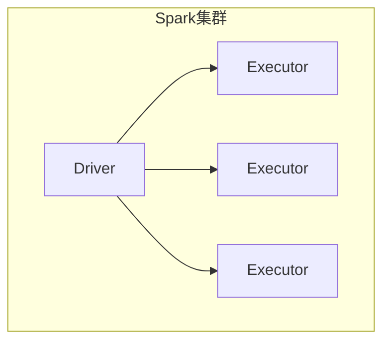
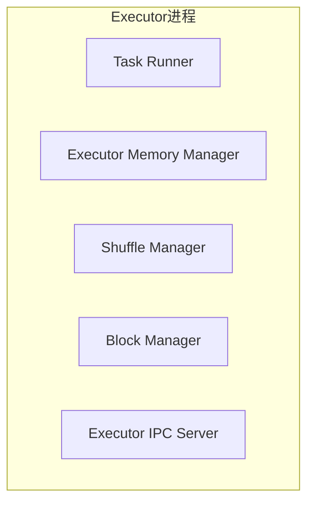
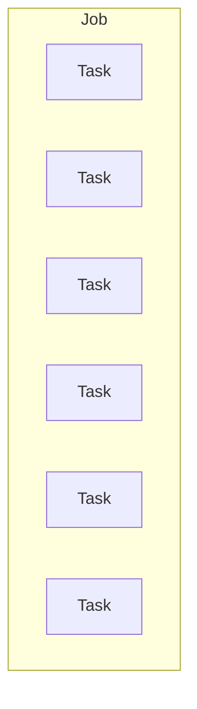
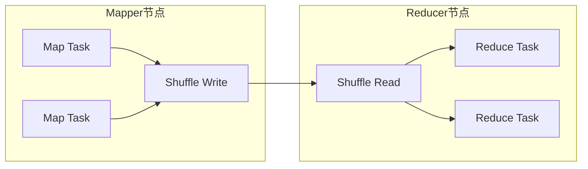
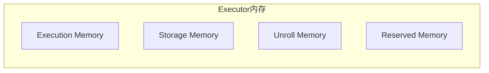
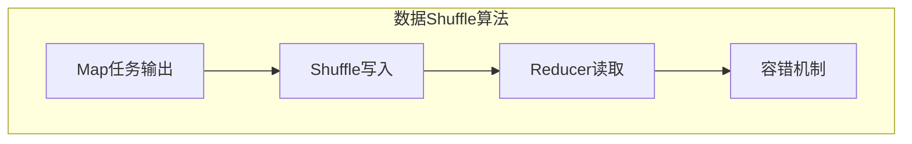

# Spark Executor 原理与代码实例讲解

## 1. 背景介绍

### 1.1 问题的由来

在大数据时代,数据量的快速增长对传统的数据处理系统带来了巨大的挑战。Apache Spark 作为一种快速、通用的大规模数据处理引擎,凭借其优秀的性能和易用性,在企业和学术界广受欢迎。Spark 的核心设计理念之一就是采用了基于内存计算的架构,从而大幅提高了数据处理效率。

在 Spark 集群中,Executor 进程扮演着至关重要的角色。它们负责实际执行任务,管理计算资源,并在内存或外部存储系统中缓存数据。然而,Executor 的工作原理并不简单,涉及到多个复杂的组件和算法,如任务调度、数据shuffle、内存管理等。深入理解 Executor 的原理对于优化 Spark 应用程序的性能、调试和故障排查都至关重要。

### 1.2 研究现状

目前,已有一些文献和资源探讨了 Spark Executor 的实现细节,但大多数资料都比较零散,缺乏系统性和全面性。一些官方文档虽然提供了概念性的介绍,但缺乏深入的原理解析和实例讲解。此外,随着 Spark 版本的不断更新,Executor 的实现也在不断演进,因此需要及时跟进最新的变化和优化。

### 1.3 研究意义

深入剖析 Spark Executor 的原理对于以下几个方面具有重要意义:

1. **性能优化**: 了解 Executor 的内部工作机制,可以帮助开发者更好地调整配置参数、优化数据局部性等,从而提高 Spark 应用程序的整体性能。

2. **故障排查**: 当 Spark 作业出现问题时,如内存溢出、数据丢失等,掌握 Executor 的实现细节可以更快地定位和解决问题。

3. **架构扩展**: 对 Executor 原理的深入理解,有助于开发者根据特定需求对 Spark 进行定制化扩展和优化。

4. **知识传播**: 系统性地讲解 Executor 原理,有利于推广 Spark 相关知识,促进大数据技术的发展。

### 1.4 本文结构

本文将从以下几个方面全面剖析 Spark Executor 的原理:

1. 介绍 Executor 在 Spark 架构中的地位和作用。
2. 详细解析 Executor 的核心组件,如任务调度器、内存管理器等。
3. 讲解 Executor 中的关键算法,如数据 shuffle、缓存策略等。
4. 通过数学模型和公式,深入探讨 Executor 的内存管理和资源调度机制。
5. 提供丰富的代码实例,结合详细的注释和解释,帮助读者彻底理解实现细节。
6. 分享 Executor 在实际应用场景中的使用经验和最佳实践。
7. 介绍相关的工具和学习资源,方便读者进一步扩展知识。
8. 总结 Executor 的发展趋势,并探讨其面临的挑战和未来的研究方向。

## 2. 核心概念与联系

在深入探讨 Spark Executor 的原理之前,我们先介绍一些核心概念,为后续内容的理解打下基础。

### 2.1 Spark 集群架构

Spark 采用了主从架构,由一个 Driver 进程和多个 Executor 进程组成。Driver 负责协调整个应用的执行过程,而 Executor 则在 Worker 节点上运行,执行具体的任务。



### 2.2 Executor 进程

每个 Executor 进程在启动时会申请一块内存区域,用于存储计算任务的中间结果和缓存数据。Executor 内部由多个组件组成,包括:

- **Task Runner**: 负责启动和管理任务线程,执行具体的计算任务。
- **Executor Memory Manager**: 管理 Executor 的内存使用情况,实现内存的申请、释放和数据落盘等功能。
- **Shuffle Manager**: 协调数据 shuffle 过程,包括写出 shuffle 文件、传输数据块等。
- **Block Manager**: 管理 Executor 上的数据块,包括内存块和磁盘块。
- **Executor IPC Server**: 处理来自 Driver 和其他 Executor 的远程请求。



### 2.3 Task 和 Job

在 Spark 中,应用程序被划分为多个 Job,每个 Job 又由多个 Task 组成。Task 是 Spark 中最小的工作单元,由 Executor 进程执行。根据类型的不同,Task 可以分为:

- **ShuffleMapTask**: 对数据进行 map 操作,并将结果写入 shuffle 文件。
- **ResultTask**: 对数据进行 reduce 操作,并将最终结果返回给 Driver。
- **SymmetricITTask**: 用于广播变量和 shuffle 文件的读取。



### 2.4 数据 Shuffle

在 Spark 中,Shuffle 过程是指将不同节点上的数据重新组合的过程。它通常发生在 map 和 reduce 阶段之间,用于对数据进行重新分区和聚合。Shuffle 过程涉及以下几个关键步骤:

1. **Map 任务输出文件**: 每个 Map 任务将其输出结果分区写入本地磁盘。
2. **Shuffle 写入远程节点**: Shuffle Manager 将 Map 任务输出的文件按分区 ID 传输到对应的 Reducer 节点。
3. **Reducer 读取数据**: Reducer 从本地和远程节点获取相应分区的数据,并进行聚合计算。



### 2.5 内存管理

在 Spark 中,内存管理是一个非常关键的组件,它直接影响着应用程序的性能和稳定性。Executor 内存被划分为多个区域,用于存储不同类型的数据:

- **Execution Memory**: 用于存储正在执行的任务的中间结果。
- **Storage Memory**: 用于缓存经过持久化的 RDD 数据。
- **Unroll Memory**: 用于存储循环展开后的数据。
- **Reserved Memory**: 作为系统保留内存,用于防止内存不足。



## 3. 核心算法原理 & 具体操作步骤

### 3.1 算法原理概述

Spark Executor 的核心算法主要包括以下几个方面:

1. **任务调度算法**: 决定如何将任务分配给 Executor,以及任务在 Executor 内部的执行顺序。
2. **数据 Shuffle 算法**: 实现高效的数据重分区和聚合,保证 Shuffle 过程的性能和容错能力。
3. **内存管理算法**: 管理 Executor 内存的使用情况,实现内存的申请、释放和数据落盘等功能。
4. **数据缓存算法**: 决定如何在内存和磁盘之间缓存中间数据,以提高后续计算的效率。

这些算法的设计和实现直接影响着 Spark 应用程序的整体性能和可靠性。

### 3.2 算法步骤详解

#### 3.2.1 任务调度算法

Spark 采用了一种称为"延迟调度"的策略,即在真正执行任务之前,不会进行任务调度。这种策略可以减少不必要的调度开销,并且能够根据实际情况动态调整任务的执行顺序。

任务调度算法的主要步骤如下:

1. **构建任务集**: 根据 RDD 的依赖关系,将应用程序划分为多个 Stage,每个 Stage 由多个任务组成。
2. **计算任务优先级**: 根据任务的数据位置和类型,计算每个任务的优先级。
3. **任务分配**: 将高优先级的任务分配给空闲的 Executor,并将任务放入 Executor 的运行队列中。
4. **动态调整**: 根据任务的运行情况和资源使用情况,动态调整任务的优先级和执行顺序。


#### 3.2.2 数据 Shuffle 算法

数据 Shuffle 是 Spark 中一个非常关键的过程,它直接影响着应用程序的性能和可靠性。Shuffle 算法的主要步骤如下:

1. **Map 任务输出**: 每个 Map 任务将其输出结果按照分区 ID 写入本地磁盘,生成多个 shuffle 文件。
2. **Shuffle 写入**: Shuffle Manager 将 Map 任务输出的 shuffle 文件按照分区 ID 传输到对应的 Reducer 节点。
3. **Reducer 读取**: Reducer 从本地和远程节点获取相应分区的 shuffle 文件,并进行聚合计算。
4. **容错机制**: 如果某个 Executor 失败,Shuffle 算法会自动重新计算丢失的 shuffle 文件。



#### 3.2.3 内存管理算法

Executor 内存管理算法的主要目标是高效利用有限的内存资源,同时保证应用程序的稳定性和容错能力。算法的主要步骤如下:

1. **内存区域划分**: 将 Executor 内存划分为多个区域,用于存储不同类型的数据。
2. **内存申请**: 任务在执行时可以动态申请所需的内存空间。
3. **内存释放**: 当数据不再使用时,将其占用的内存空间释放回内存池。
4. **数据落盘**: 如果内存空间不足,将部分数据写入磁盘,以防止内存溢出。
5. **内存回收**: 定期扫描内存中的数据,回收无用的数据块。


#### 3.2.4 数据缓存算法

为了提高计算效率,Spark 支持将中间数据缓存在内存或磁盘中。数据缓存算法的主要步骤如下:

1. **缓存策略选择**: 根据数据的使用情况和内存大小,选择合适的缓存策略,如内存缓存或磁盘缓存。
2. **数据分块**: 将需要缓存的数据划分为多个数据块,以便于管理和传输。
3. **数据存储**: 将数据块存储在内存或磁盘中,并维护相应的元数据信息。
4. **数据读取**: 当需要使用缓存数据时,从内存或磁盘中读取相应的数据块。
5. **缓存淘汰**: 当内存空间不足时,根据淘汰策略(如 LRU)移除部分缓存数据。

```mermaid
graph TD
    subgraph 数据缓存算法
    A[缓存策略选择] --> B[数据分块]
    B --> C[数据存储]
    C --> D[数据读取]
    D