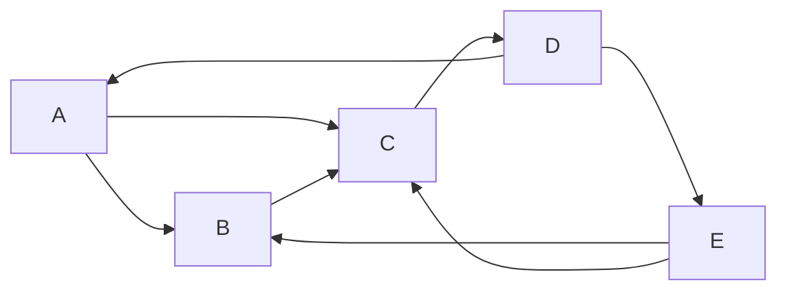

# Spark GraphX原理与代码实例讲解

## 1. 背景介绍

### 1.1 问题的由来

在当今大数据时代，海量的数据不仅包括结构化的数据,还包括了大量的非结构化数据,如社交网络、物联网、生物信息等领域产生的数据。这些数据通常可以用图(Graph)的形式来表示和处理,因此图计算(Graph Computing)应运而生。传统的图计算框架如Pregel、GraphLab等,在处理大规模图数据时存在诸多问题,如可扩展性差、编程模型复杂等。

### 1.2 研究现状

Apache Spark是一种快速、通用的大数据处理引擎,它提供了GraphX作为分布式图计算框架。GraphX充分利用了Spark的RDD(Resilient Distributed Dataset)数据抽象,并针对图数据提供了一组优化的图计算操作符和图算法库。GraphX具有以下优势:

1. 基于数据流模型,支持迭代式图计算。
2. 通过Spark RDD提供了容错和内存计算能力。
3. 支持图数据并行加载和图算法并行执行。
4. 提供丰富的图算法库,如PageRank、连通分量等。
5. 支持在同一个应用程序中混合图计算和其他数据处理工作负载。

### 1.3 研究意义

深入理解GraphX的原理和实现,对于高效利用Spark进行大规模图计算至关重要。本文将全面剖析GraphX的核心概念、算法原理、数学模型,并通过实例代码讲解其实现细节,帮助读者掌握GraphX的使用方法和底层机制。此外,本文还将探讨GraphX在实际应用场景中的应用,以及未来的发展趋势和挑战。

### 1.4 本文结构

本文首先介绍GraphX的核心概念和数据结构,然后详细阐述其核心算法原理和数学模型,并通过实例代码讲解其实现细节。接下来,本文将探讨GraphX在实际应用场景中的应用,并推荐相关工具和学习资源。最后,本文总结GraphX的研究成果,展望其未来发展趋势和面临的挑战。

## 2. 核心概念与联系

GraphX将图(Graph)建模为一种数据结构,包含以下核心概念:

1. **顶点(Vertex)**: 表示图中的节点,可以携带属性数据。
2. **边(Edge)**: 表示连接两个顶点的关系,也可以携带属性数据。
3. **属性图(Property Graph)**: 由顶点和边组成的属性图,允许顶点和边附加属性数据。
4. **视图(View)**: 对属性图的子集进行透视,用于高效执行图算法。

GraphX基于Spark的RDD数据抽象,将属性图分解为以下RDD:

1. **VertexRDD**: 表示顶点的RDD,每个元素为(vertexId, vertexData)对。
2. **EdgeRDD**: 表示边的RDD,每个元素为Edge对象,包含源顶点Id、目标顶点Id和边数据。

GraphX提供了一组图计算操作符,如`mapVertices`、`mapEdges`等,用于对顶点和边执行并行转换。此外,GraphX还提供了诸如PageRank、连通分量等常用图算法的实现。

## 3. 核心算法原理 & 具体操作步骤

### 3.1 算法原理概述

GraphX的核心算法原理基于**顶点程序(Vertex Program)模型**和**图视图(Graph View)抽象**。

**顶点程序模型**将图计算任务分解为对每个顶点执行的顶点程序,程序在迭代过程中更新顶点的状态,直到达到收敛条件。顶点程序的执行遵循以下步骤:

1. 初始化每个顶点的状态。
2. 在每次迭代中,每个顶点收集来自邻居的消息,并根据消息和当前状态更新自身状态。
3. 将新状态发送给邻居作为下一次迭代的消息。
4. 重复步骤2和3,直到达到收敛条件或达到最大迭代次数。

**图视图抽象**则提供了一种高效的方式来执行图算法。GraphX将属性图分解为顶点和边的RDD,并提供了一组优化的图操作符,如`mapVertices`、`mapEdges`等,用于对顶点和边执行并行转换。这些操作符利用了Spark的RDD抽象,可以高效地在集群上执行图计算任务。

### 3.2 算法步骤详解

以PageRank算法为例,其基于顶点程序模型的具体步骤如下:

1. **初始化**:为每个顶点分配初始的PageRank值,通常设置为1/N(N为顶点总数)。
2. **消息发送**:每个顶点将自身的PageRank值平均分配给所有出边的目标顶点,作为消息发送给邻居。
3. **消息接收**:每个顶点收集来自所有入边的消息,并将它们求和作为新的PageRank值。
4. **收敛检测**:计算PageRank值的变化量,如果小于给定阈值或达到最大迭代次数,则算法收敛,否则进入下一轮迭代。

在GraphX中,PageRank算法的实现利用了`GraphOps`类提供的图操作符,如`mapVertices`、`sendMsg`等。以下是一个简化的PageRank实现示例:

```scala
// 初始化
val initialGraph = graph.mapVertices((id, attr) => 1.0 / numVertices)

// 定义消息发送函数
def sendMsgFunc(triplet: EdgeTriplet[Double, Double]): Iterator[(VertexId, Double)] = {
  Iterator((triplet.dstId, triplet.srcAttr / triplet.srcAttr.getDegree))
}

// 定义消息聚合函数
def mergeMessageFunc(a: Double, b: Double): Double = a + b

// 执行PageRank迭代
val rankedGraph = initialGraph.iterateWithTermination(maxIterations)(
  (graph: Graph[Double, Double]) => {
    val msgGraph = graph.mapTriplets(sendMsgFunc, tripletFields = TripletFields.Src)
    val newRanks = msgGraph.vertices.innerJoin(msgGraph.messages)(mergeMessageFunc)
    graph.outerJoinVertices(newRanks)((id, oldRank, msgSum) => resetProb + (1.0 - resetProb) * msgSum)
  }
)
```

在上述示例中,我们首先使用`mapVertices`操作符为每个顶点初始化PageRank值。然后,我们定义了`sendMsgFunc`函数,用于在每次迭代中将顶点的PageRank值发送给邻居。`mergeMessageFunc`函数则用于聚合收到的消息,计算新的PageRank值。最后,我们使用`iterateWithTermination`操作符执行PageRank迭代,直到收敛或达到最大迭代次数。

### 3.3 算法优缺点

**优点**:

1. **高效并行**:基于Spark的RDD抽象,可以高效地在集群上执行图计算任务。
2. **容错性**:利用Spark的容错机制,可以从故障中自动恢复。
3. **内存计算**:充分利用内存进行计算,提高性能。
4. **丰富的算法库**:提供了常用图算法的实现,如PageRank、连通分量等。
5. **灵活的编程模型**:支持在同一个应用程序中混合图计算和其他数据处理工作负载。

**缺点**:

1. **内存限制**:对于超大规模图,可能会受到集群内存容量的限制。
2. **算法局限性**:目前GraphX提供的算法库还相对有限,无法满足所有场景的需求。
3. **性能瓶颈**:在某些特定场景下,可能会遇到性能瓶颈,需要进行优化。

### 3.4 算法应用领域

GraphX可以广泛应用于各种需要图计算的领域,包括但不限于:

1. **社交网络分析**:分析社交网络中的用户关系、影响力传播等。
2. **网页排名**:实现PageRank等网页排名算法。
3. **推荐系统**:基于图构建商品或用户的相似性网络,进行个性化推荐。
4. **金融风险分析**:分析金融网络中的风险传播路径。
5. **生物信息学**:分析基因调控网络、蛋白质互作网络等。
6. **交通网络分析**:分析交通网络中的路径规划、拥堵预测等。

## 4. 数学模型和公式 & 详细讲解 & 举例说明

### 4.1 数学模型构建

GraphX中的许多图算法都基于特定的数学模型。以PageRank算法为例,它基于以下数学模型:

设$G=(V,E)$为一个有向图,其中$V$为顶点集合,$ E\subseteq V\times V $为边集合。对于任意顶点$v\in V$,定义$\text{In}(v)$为指向$v$的入边集合,$ \text{Out}(v) $为从$v$出发的出边集合。

PageRank算法的核心思想是,一个网页的重要性不仅取决于它被其他网页链接的次数,还取决于链接它的网页的重要性。具体来说,PageRank算法将每个网页$v$的重要性$\text{PR}(v)$定义为:

$$\text{PR}(v) = (1-d) + d\sum_{u\in\text{In}(v)}\frac{\text{PR}(u)}{|\text{Out}(u)|}$$

其中,$ d $是一个阻尼系数(damping factor),通常取值0.85。该公式表示,网页$v$的PageRank值是由两部分组成:

1. $(1-d)$,表示每个网页都有一个基础重要性分数。
2. $d\sum_{u\in\text{In}(v)}\frac{\text{PR}(u)}{|\text{Out}(u)|}$,表示$v$从所有链接它的网页$u$那里获得的重要性分数之和,其中每个$u$的贡献按照$u$的出边数进行了归一化。

### 4.2 公式推导过程

我们可以将上述PageRank公式矩阵化,从而更好地理解其数学本质。

设$\boldsymbol{PR}$为所有网页的PageRank值构成的列向量,$ \boldsymbol{M} $为转移概率矩阵(Transition Probability Matrix),其中$M_{ij}$表示从网页$i$到网页$j$的转移概率。则PageRank公式可以写为:

$$\boldsymbol{PR} = (1-d)\boldsymbol{e} + d\boldsymbol{M}\boldsymbol{PR}$$

其中,$ \boldsymbol{e} $是所有元素为1的列向量,表示每个网页的基础重要性分数。

进一步推导,我们可以得到:

$$\boldsymbol{PR} = (1-d)(I - d\boldsymbol{M})^{-1}\boldsymbol{e}$$

其中,$ I $是单位矩阵。这个公式表明,PageRank值是由$(I - d\boldsymbol{M})^{-1}$这个矩阵和基础重要性向量$ \boldsymbol{e} $共同决定的。

在实践中,我们通常使用迭代法来计算PageRank值,而不是直接求解上述矩阵方程。这是因为直接求解矩阵方程的计算复杂度较高,而迭代法可以利用GraphX的并行计算能力,更加高效。

### 4.3 案例分析与讲解

为了更好地理解PageRank算法,我们来分析一个具体的案例。假设有一个由5个网页组成的小型网络,其链接关系如下图所示:



我们可以构建该网络的转移概率矩阵$\boldsymbol{M}$:

$$\boldsymbol{M} = \begin{pmatrix}
0 & 1/2 & 1/2 & 0 & 0 \\
0 & 0 & 1/1 & 0 & 0 \\
0 & 0 & 0 & 1/1 & 0 \\
1/2 & 0 & 0 & 0 & 1/2 \\
0 & 1/2 & 1/2 & 0 & 0
\end{pmatrix}$$

设阻尼系数$d=0.85$,初始PageRank值向量$\boldsymbol{PR}_0 = (0.2, 0.2, 0.2, 0.2, 0.2)^T$,则第一次迭代后的PageRank值为:

$$\begin{aligned}
\boldsymbol{PR}_1 &=