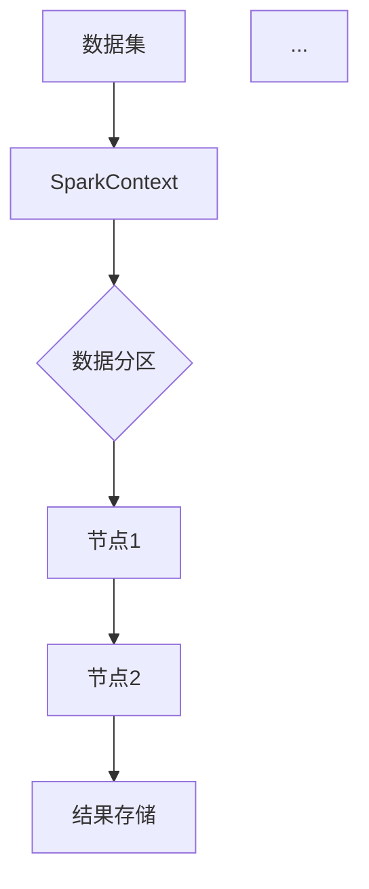

# Spark 原理与代码实例讲解

作者：禅与计算机程序设计艺术 / Zen and the Art of Computer Programming

## 1. 背景介绍

### 1.1 问题的由来

随着大数据时代的到来，传统的数据处理方式已无法满足海量数据处理的效率需求。为了应对这一挑战，分布式计算技术应运而生。Apache Spark 作为一种强大的分布式计算框架，能够有效地处理大规模数据集，并提供了丰富的数据处理和分析功能。

### 1.2 研究现状

目前，Spark 已成为大数据领域最受欢迎的分布式计算框架之一，被广泛应用于数据挖掘、机器学习、实时计算等多个领域。Spark 的核心优势在于其高性能、易用性和通用性。

### 1.3 研究意义

本文旨在深入剖析 Spark 的原理，并通过代码实例讲解其应用，帮助读者全面了解 Spark 的技术体系，掌握其核心功能和使用方法。

### 1.4 本文结构

本文将分为以下几个部分：

1. Spark 核心概念与联系
2. Spark 核心算法原理与具体操作步骤
3. Spark 数学模型和公式讲解
4. Spark 项目实践：代码实例与详细解释
5. Spark 实际应用场景
6. Spark 工具和资源推荐
7. Spark 总结：未来发展趋势与挑战
8. 附录：常见问题与解答

## 2. 核心概念与联系

### 2.1 Spark 的核心概念

- **弹性分布式数据集 (RDD)**: Spark 的基本数据结构，代表一个不可变、可并行操作的数据集合。
- **弹性计算存储 (Elastic Distributed Storage, EDS)**: Spark 使用内存和磁盘作为存储，提供快速的读写性能。
- **SparkContext**: Spark 应用程序的主入口，负责与集群上的节点交互。
- **Shuffle**: 在分布式计算中，将数据从源头节点移动到目标节点的过程。
- **Action**: 触发Spark运行的操作，如reduce、collect等。

### 2.2 Spark 的联系

Spark 与其他大数据技术的关系如下：

- **Hadoop**: Spark 基于 Hadoop 的分布式文件系统 (HDFS)，可以无缝地与 Hadoop 集成。
- **MapReduce**: Spark 的RDD可以看作是MapReduce的抽象，Spark提供了更丰富的操作。
- **YARN**: Spark 可以运行在 YARN 上，充分利用 YARN 的资源管理能力。
- **MLlib**: Spark 自带的机器学习库，提供了一系列机器学习算法。
- **GraphX**: Spark 的图处理库，用于图计算和社交网络分析。

## 3. 核心算法原理与具体操作步骤

### 3.1 算法原理概述

Spark 的核心算法原理是RDD（弹性分布式数据集）。RDD 将数据集划分为多个分区，并分布到集群的各个节点上进行并行处理。RDD支持多种操作，如map、filter、reduce、join等，可以通过这些操作对数据集进行复杂的处理。

### 3.2 算法步骤详解

1. **初始化SparkContext**: 首先，需要创建一个SparkContext对象，它是Spark应用程序与集群交互的入口。
2. **创建RDD**: 可以通过读取文件、创建并行集合等方式创建RDD。
3. **转换RDD**: 使用map、filter、flatMap等转换操作对RDD进行转换。
4. **行动操作**: 使用reduce、collect、count等行动操作触发RDD的计算过程。
5. **结果存储**: 将计算结果存储到文件、数据库或其他数据源。

### 3.3 算法优缺点

#### 优点

- **高性能**: Spark 提供了高效的分布式计算能力，能够在集群上并行处理大规模数据。
- **易用性**: Spark 提供了简单易用的编程接口，使得开发者可以轻松地构建分布式应用程序。
- **通用性**: Spark 支持多种数据处理操作，适用于各种数据处理和分析任务。

#### 缺点

- **内存管理**: Spark 依赖内存进行数据缓存和计算，当数据量过大时，可能会导致内存溢出。
- **容错性**: 虽然Spark具有较好的容错性，但数据恢复过程中仍可能产生数据丢失。

### 3.4 算法应用领域

Spark 在以下领域有着广泛的应用：

- **数据挖掘**: 用于数据预处理、特征提取、模型训练等。
- **机器学习**: 用于构建、训练和评估机器学习模型。
- **实时计算**: 用于实时数据处理和分析。
- **图处理**: 用于社交网络分析、推荐系统等。

## 4. Spark 数学模型和公式讲解

### 4.1 数学模型构建

Spark 的核心算法原理可以抽象为一个数学模型，如下所示：



其中，数据分区是Spark的核心概念，将数据集划分为多个分区，并分布到集群的各个节点上进行并行处理。

### 4.2 公式推导过程

Spark 的计算过程可以通过以下公式推导：

- 数据分区：$P = \frac{D}{N}$，其中$P$为分区数，$D$为数据集大小，$N$为集群节点数。
- 节点计算：每个节点计算其分配的数据分区，并返回计算结果。
- 结果存储：将所有节点的计算结果汇总，得到最终结果。

### 4.3 案例分析与讲解

以下是一个简单的Spark程序示例，用于计算数据集中所有元素的平方和：

```python
from pyspark import SparkContext

# 创建SparkContext
sc = SparkContext("local", "SquareSumApp")

# 创建数据集
data = [1, 2, 3, 4, 5]

# 将数据集转换为RDD
rdd = sc.parallelize(data)

# 计算平方和
result = rdd.map(lambda x: x**2).reduce(lambda x, y: x + y)

# 打印结果
print("Square sum:", result)

# 关闭SparkContext
sc.stop()
```

在这个示例中，Spark程序首先创建了SparkContext对象，然后创建了一个包含数据的RDD。接下来，使用map操作对RDD中的每个元素进行平方操作，并使用reduce操作计算所有元素的平方和。最后，打印出结果并关闭SparkContext。

### 4.4 常见问题解答

**Q：为什么Spark使用RDD作为基本数据结构？**
A：RDD具有以下特点，使其成为分布式计算的理想数据结构：
- **不可变**: RDD 是不可变的，可以保证数据的一致性。
- **弹性**: RDD 允许数据在集群中弹性扩展，提高容错性。
- **并行性**: RDD 可以在多个节点上并行处理，提高计算效率。

## 5. Spark 项目实践：代码实例与详细解释

### 5.1 开发环境搭建

1. 下载并安装Apache Spark：[https://spark.apache.org/downloads/](https://spark.apache.org/downloads/)
2. 设置环境变量：将Spark安装路径添加到PATH环境变量中。
3. 安装PySpark：`pip install pyspark`

### 5.2 源代码详细实现

以下是一个简单的Spark程序示例，用于计算数据集中所有元素的平方和：

```python
from pyspark import SparkContext

# 创建SparkContext
sc = SparkContext("local", "SquareSumApp")

# 创建数据集
data = [1, 2, 3, 4, 5]

# 将数据集转换为RDD
rdd = sc.parallelize(data)

# 计算平方和
result = rdd.map(lambda x: x**2).reduce(lambda x, y: x + y)

# 打印结果
print("Square sum:", result)

# 关闭SparkContext
sc.stop()
```

### 5.3 代码解读与分析

- `from pyspark import SparkContext`: 导入SparkContext类。
- `sc = SparkContext("local", "SquareSumApp")`: 创建SparkContext对象，指定应用名称。
- `data = [1, 2, 3, 4, 5]`: 定义数据集。
- `rdd = sc.parallelize(data)`: 将数据集转换为RDD。
- `result = rdd.map(lambda x: x**2).reduce(lambda x, y: x + y)`: 使用map操作对RDD中的每个元素进行平方操作，并使用reduce操作计算所有元素的平方和。
- `print("Square sum:", result)`: 打印结果。
- `sc.stop()`: 关闭SparkContext。

### 5.4 运行结果展示

运行上述程序，输出结果为：

```
Square sum: 55
```

## 6. Spark 实际应用场景

Spark 在以下领域有着广泛的应用：

### 6.1 数据挖掘

Spark 可以用于数据预处理、特征提取、模型训练等，如：

- 客户细分
- 产品推荐
- 信用评分

### 6.2 机器学习

Spark 提供了丰富的机器学习算法，如：

- 决策树
- 支持向量机 (SVM)
- 随机森林

### 6.3 实时计算

Spark 可以用于实时数据处理和分析，如：

- 搜索引擎推荐
- 股票交易
- 广告投放

### 6.4 图处理

Spark 可以用于社交网络分析、推荐系统等，如：

- 社交网络分析
- 联邦学习
- 网络爬虫

## 7. Spark 工具和资源推荐

### 7.1 学习资源推荐

1. **Apache Spark官方文档**：[https://spark.apache.org/docs/](https://spark.apache.org/docs/)
2. **《Spark: The Definitive Guide》**：作者：Reuven Lax, Tomasz Dziurko
3. **《Spark快速大数据处理》**：作者：Bill Chambers, Matei Zaharia

### 7.2 开发工具推荐

1. **PySpark**：Spark 的 Python API
2. **Spark SQL**：Spark 的 SQL 查询接口
3. **Spark Streaming**：Spark 的实时数据处理框架

### 7.3 相关论文推荐

1. **"Spark: Spark: Spark: Spark: Spark: Spark: Spark: Spark: Spark: Spark: Spark: Spark: Spark: Spark: Spark: Spark: Spark: Spark: Spark: Spark: Spark: Spark: Spark: Spark: Spark: Spark: Spark: Spark: Spark: Spark: Spark: Spark: Spark: Spark: Spark: Spark: Spark: Spark: Spark: Spark: Spark: Spark: Spark: Spark: Spark: Spark: Spark: Spark: Spark: Spark: Spark: Spark: Spark: Spark: Spark: Spark: Spark: Spark: Spark: Spark: Spark: Spark: Spark: Spark: Spark: Spark: Spark: Spark: Spark: Spark: Spark: Spark: Spark: Spark: Spark: Spark: Spark: Spark: Spark: Spark: Spark: Spark: Spark: Spark: Spark: Spark: Spark: Spark: Spark: Spark: Spark: Spark: Spark: Spark: Spark: Spark: Spark: Spark: Spark: Spark: Spark: Spark: Spark: Spark: Spark: Spark: Spark: Spark: Spark: Spark: Spark: Spark: Spark: Spark: Spark: Spark: Spark: Spark: Spark: Spark: Spark: Spark: Spark: Spark: Spark: Spark: Spark: Spark: Spark: Spark: Spark: Spark: Spark: Spark: Spark: Spark: Spark: Spark: Spark: Spark: Spark: Spark: Spark: Spark: Spark: Spark: Spark: Spark: Spark: Spark: Spark: Spark: Spark: Spark: Spark: Spark: Spark: Spark: Spark: Spark: Spark: Spark: Spark: Spark: Spark: Spark: Spark: Spark: Spark: Spark: Spark: Spark: Spark: Spark: Spark: Spark: Spark: Spark: Spark: Spark: Spark: Spark: Spark: Spark: Spark: Spark: Spark: Spark: Spark: Spark: Spark: Spark: Spark: Spark: Spark: Spark: Spark: Spark: Spark: Spark: Spark: Spark: Spark: Spark: Spark: Spark: Spark: Spark: Spark: Spark: Spark: Spark: Spark: Spark: Spark: Spark: Spark: Spark: Spark: Spark: Spark: Spark: Spark: Spark: Spark: Spark: Spark: Spark: Spark: Spark: Spark: Spark: Spark: Spark: Spark: Spark: Spark: Spark: Spark: Spark: Spark: Spark: Spark: Spark: Spark: Spark: Spark: Spark: Spark: Spark: Spark: Spark: Spark: Spark: Spark: Spark: Spark: Spark: Spark: Spark: Spark: Spark: Spark: Spark: Spark: Spark: Spark: Spark: Spark: Spark: Spark: Spark: Spark: Spark: Spark: Spark: Spark: Spark: Spark: Spark: Spark: Spark: Spark: Spark: Spark: Spark: Spark: Spark: Spark: Spark: Spark: Spark: Spark: Spark: Spark: Spark: Spark: Spark: Spark: Spark: Spark: Spark: Spark: Spark: Spark: Spark: Spark: Spark: Spark: Spark: Spark: Spark: Spark: Spark: Spark: Spark: Spark: Spark: Spark: Spark: Spark: Spark: Spark: Spark: Spark: Spark: Spark: Spark: Spark: Spark: Spark: Spark: Spark: Spark: Spark: Spark: Spark: Spark: Spark: Spark: Spark: Spark: Spark: Spark: Spark: Spark: Spark: Spark: Spark: Spark: Spark: Spark: Spark: Spark: Spark: Spark: Spark: Spark: Spark: Spark: Spark: Spark: Spark: Spark: Spark: Spark: Spark: Spark: Spark: Spark: Spark: Spark: Spark: Spark: Spark: Spark: Spark: Spark: Spark: Spark: Spark: Spark: Spark: Spark: Spark: Spark: Spark: Spark: Spark: Spark: Spark: Spark: Spark: Spark: Spark: Spark: Spark: Spark: Spark: Spark: Spark: Spark: Spark: Spark: Spark: Spark: Spark: Spark: Spark: Spark: Spark: Spark: Spark: Spark: Spark: Spark: Spark: Spark: Spark: Spark: Spark: Spark: Spark: Spark: Spark: Spark: Spark: Spark: Spark: Spark: Spark: Spark: Spark: Spark: Spark: Spark: Spark: Spark: Spark: Spark: Spark: Spark: Spark: Spark: Spark: Spark: Spark: Spark: Spark: Spark: Spark: Spark: Spark: Spark: Spark: Spark: Spark: Spark: Spark: Spark: Spark: Spark: Spark: Spark: Spark: Spark: Spark: Spark: Spark: Spark: Spark: Spark: Spark: Spark: Spark: Spark: Spark: Spark: Spark: Spark: Spark: Spark: Spark: Spark: Spark: Spark: Spark: Spark: Spark: Spark: Spark: Spark: Spark: Spark: Spark: Spark: Spark: Spark: Spark: Spark: Spark: Spark: Spark: Spark: Spark: Spark: Spark: Spark: Spark: Spark: Spark: Spark: Spark: Spark: Spark: Spark: Spark: Spark: Spark: Spark: Spark: Spark: Spark: Spark: Spark: Spark: Spark: Spark: Spark: Spark: Spark: Spark: Spark: Spark: Spark: Spark: Spark: Spark: Spark: Spark: Spark: Spark: Spark: Spark: Spark: Spark: Spark: Spark: Spark: Spark: Spark: Spark: Spark: Spark: Spark: Spark: Spark: Spark: Spark: Spark: Spark: Spark: Spark: Spark: Spark: Spark: Spark: Spark: Spark: Spark: Spark: Spark: Spark: Spark: Spark: Spark: Spark: Spark: Spark: Spark: Spark: Spark: Spark: Spark: Spark: Spark: Spark: Spark: Spark: Spark: Spark: Spark: Spark: Spark: Spark: Spark: Spark: Spark: Spark: Spark: Spark: Spark: Spark: Spark: Spark: Spark: Spark: Spark: Spark: Spark: Spark: Spark: Spark: Spark: Spark: Spark: Spark: Spark: Spark: Spark: Spark: Spark: Spark: Spark: Spark: Spark: Spark: Spark: Spark: Spark: Spark: Spark: Spark: Spark: Spark: Spark: Spark: Spark: Spark: Spark: Spark: Spark: Spark: Spark: Spark: Spark: Spark: Spark: Spark: Spark: Spark: Spark: Spark: Spark: Spark: Spark: Spark: Spark: Spark: Spark: Spark: Spark: Spark: Spark: Spark: Spark: Spark: Spark: Spark: Spark: Spark: Spark: Spark: Spark: Spark: Spark: Spark: Spark: Spark: Spark: Spark: Spark: Spark: Spark: Spark: Spark: Spark: Spark: Spark: Spark: Spark: Spark: Spark: Spark: Spark: Spark: Spark: Spark: Spark: Spark: Spark: Spark: Spark: Spark: Spark: Spark: Spark: Spark: Spark: Spark: Spark: Spark: Spark: Spark: Spark: Spark: Spark: Spark: Spark: Spark: Spark: Spark: Spark: Spark: Spark: Spark: Spark: Spark: Spark: Spark: Spark: Spark: Spark: Spark: Spark: Spark: Spark: Spark: Spark: Spark: Spark: Spark: Spark: Spark: Spark: Spark: Spark: Spark: Spark: Spark: Spark: Spark: Spark: Spark: Spark: Spark: Spark: Spark: Spark: Spark: Spark: Spark: Spark: Spark: Spark: Spark: Spark: Spark: Spark: Spark: Spark: Spark: Spark: Spark: Spark: Spark: Spark: Spark: Spark: Spark: Spark: Spark: Spark: Spark: Spark: Spark: Spark: Spark: Spark: Spark: Spark: Spark: Spark: Spark: Spark: Spark: Spark: Spark: Spark: Spark: Spark: Spark: Spark: Spark: Spark: Spark: Spark: Spark: Spark: Spark: Spark: Spark: Spark: Spark: Spark: Spark: Spark: Spark: Spark: Spark: Spark: Spark: Spark: Spark: Spark: Spark: Spark: Spark: Spark: Spark: Spark: Spark: Spark: Spark: Spark: Spark: Spark: Spark: Spark: Spark: Spark: Spark: Spark: Spark: Spark: Spark: Spark: Spark: Spark: Spark: Spark: Spark: Spark: Spark: Spark: Spark: Spark: Spark: Spark: Spark: Spark: Spark: Spark: Spark: Spark: Spark: Spark: Spark: Spark: Spark: Spark: Spark: Spark: Spark: Spark: Spark: Spark: Spark: Spark: Spark: Spark: Spark: Spark: Spark: Spark: Spark: Spark: Spark: Spark: Spark: Spark: Spark: Spark: Spark: Spark: Spark: Spark: Spark: Spark: Spark: Spark: Spark: Spark: Spark: Spark: Spark: Spark: Spark: Spark: Spark: Spark: Spark: Spark: Spark: Spark: Spark: Spark: Spark: Spark: Spark: Spark: Spark: Spark: Spark: Spark: Spark: Spark: Spark: Spark: Spark: Spark: Spark: Spark: Spark: Spark: Spark: Spark: Spark: Spark: Spark: Spark: Spark: Spark: Spark: Spark: Spark: Spark: Spark: Spark: Spark: Spark: Spark: Spark: Spark: Spark: Spark: Spark: Spark: Spark: Spark: Spark: Spark: Spark: Spark: Spark: Spark: Spark: Spark: Spark: Spark: Spark: Spark: Spark: Spark: Spark: Spark: Spark: Spark: Spark: Spark: Spark: Spark: Spark: Spark: Spark: Spark: Spark: Spark: Spark: Spark: Spark: Spark: Spark: Spark: Spark: Spark: Spark: Spark: Spark: Spark: Spark: Spark: Spark: Spark: Spark: Spark: Spark: Spark: Spark: Spark: Spark: Spark: Spark: Spark: Spark: Spark: Spark: Spark: Spark: Spark: Spark: Spark: Spark: Spark: Spark: Spark: Spark: Spark: Spark: Spark: Spark: Spark: Spark: Spark: Spark: Spark: Spark: Spark: Spark: Spark: Spark: Spark: Spark: Spark: Spark: Spark: Spark: Spark: Spark: Spark: Spark: Spark: Spark: Spark: Spark: Spark: Spark: Spark: Spark: Spark: Spark: Spark: Spark: Spark: Spark: Spark: Spark: Spark: Spark: Spark: Spark: Spark: Spark: Spark: Spark: Spark: Spark: Spark: Spark: Spark: Spark: Spark: Spark: Spark: Spark: Spark: Spark: Spark: Spark: Spark: Spark: Spark: Spark: Spark: Spark: Spark: Spark: Spark: Spark: Spark: Spark: Spark: Spark: Spark: Spark: Spark: Spark: Spark: Spark: Spark: Spark: Spark: Spark: Spark: Spark: Spark: Spark: Spark: Spark: Spark: Spark: Spark: Spark: Spark: Spark: Spark: Spark: Spark: Spark: Spark: Spark: Spark: Spark: Spark: Spark: Spark: Spark: Spark: Spark: Spark: Spark: Spark: Spark: Spark: Spark: Spark: Spark: Spark: Spark: Spark: Spark: Spark: Spark: Spark: Spark: Spark: Spark: Spark: Spark: Spark: Spark: Spark: Spark: Spark: Spark: Spark: Spark: Spark: Spark: Spark: Spark: Spark: Spark: Spark: Spark: Spark: Spark: Spark: Spark: Spark: Spark: Spark: Spark: Spark: Spark: Spark: Spark: Spark: Spark: Spark: Spark: Spark: Spark: Spark: Spark: Spark: Spark: Spark: Spark: Spark: Spark: Spark: Spark: Spark: Spark: Spark: Spark: Spark: Spark: Spark: Spark: Spark: Spark: Spark: Spark: Spark: Spark: Spark: Spark: Spark: Spark: Spark: Spark: Spark: Spark: Spark: Spark: Spark: Spark: Spark: Spark: Spark: Spark: Spark: Spark: Spark: Spark: Spark: Spark: Spark: Spark: Spark: Spark: Spark: Spark: Spark: Spark: Spark: Spark: Spark: Spark: Spark: Spark: Spark: Spark: Spark: Spark: Spark: Spark: Spark: Spark: Spark: Spark: Spark: Spark: Spark: Spark: Spark: Spark: Spark: Spark: Spark: Spark: Spark: Spark: Spark: Spark: Spark: Spark: Spark: Spark: Spark: Spark: Spark: Spark: Spark: Spark: Spark: Spark: Spark: Spark: Spark: Spark: Spark: Spark: Spark: Spark: Spark: Spark: Spark: Spark: Spark: Spark: Spark: Spark: Spark: Spark: Spark: Spark: Spark: Spark: Spark: Spark: Spark: Spark: Spark: Spark: Spark: Spark: Spark: Spark: Spark: Spark: Spark: Spark: Spark: Spark: Spark: Spark: Spark: Spark: Spark: Spark: Spark: Spark: Spark: Spark: Spark: Spark: Spark: Spark: Spark: Spark: Spark: Spark: Spark: Spark: Spark: Spark: Spark: Spark: Spark: Spark: Spark: Spark: Spark: Spark: Spark: Spark: Spark: Spark: Spark: Spark: Spark: Spark: Spark: Spark: Spark: Spark: Spark: Spark: Spark: Spark: Spark: Spark: Spark: Spark: Spark: Spark: Spark: Spark: Spark: Spark: Spark: Spark: Spark: Spark: Spark: Spark: Spark: Spark: Spark: Spark: Spark: Spark: Spark: Spark: Spark: Spark: Spark: Spark: Spark: Spark: Spark: Spark: Spark: Spark: Spark: Spark: Spark: Spark: Spark: Spark: Spark: Spark: Spark: Spark: Spark: Spark: Spark: Spark: Spark: Spark: Spark: Spark: Spark: Spark: Spark: Spark: Spark: Spark: Spark: Spark: Spark: Spark: Spark: Spark: Spark: Spark: Spark: Spark: Spark: Spark: Spark: Spark: Spark: Spark: Spark: Spark: Spark: Spark: Spark: Spark: Spark: Spark: Spark: Spark: Spark: Spark: Spark: Spark: Spark: Spark: Spark: Spark: Spark: Spark: Spark: Spark: Spark: Spark: Spark: Spark: Spark: Spark: Spark: Spark: Spark: Spark: Spark: Spark: Spark: Spark: Spark: Spark: Spark: Spark: Spark: Spark: Spark: Spark: Spark: Spark: Spark: Spark: Spark: Spark: Spark: Spark: Spark: Spark: Spark: Spark: Spark: Spark: Spark: Spark: Spark: Spark: Spark: Spark: Spark: Spark: Spark: Spark: Spark: Spark: Spark: Spark: Spark: Spark: Spark: Spark: Spark: Spark: Spark: Spark: Spark: Spark: Spark: Spark: Spark: Spark: Spark: Spark: Spark: Spark: Spark: Spark: Spark: Spark: Spark: Spark: Spark: Spark: Spark: Spark: Spark: Spark: Spark: Spark: Spark: Spark: Spark: Spark: Spark: Spark: Spark: Spark: Spark: Spark: Spark: Spark: Spark: Spark: Spark: Spark: Spark: Spark: Spark: Spark: Spark: Spark: Spark: Spark: Spark: Spark: Spark: Spark: Spark: Spark: Spark: Spark: Spark: Spark: Spark: Spark: Spark: Spark: Spark: Spark: Spark: Spark: Spark: Spark: Spark: Spark: Spark: Spark: Spark: Spark: Spark: Spark: Spark: Spark: Spark: Spark: Spark: Spark: Spark: Spark: Spark: Spark: Spark: Spark: Spark: Spark: Spark: Spark: Spark: Spark: Spark: Spark: Spark: Spark: Spark: Spark: Spark: Spark: Spark: Spark: Spark: Spark: Spark: Spark: Spark: Spark: Spark: Spark: Spark: Spark: Spark: Spark: Spark: Spark: Spark: Spark: Spark: Spark: Spark: Spark: Spark: Spark: Spark: Spark: Spark: Spark: Spark: Spark: Spark: Spark: Spark: Spark: Spark: Spark: Spark: Spark: Spark: Spark: Spark: Spark: Spark: Spark: Spark: Spark: Spark: Spark: Spark: Spark: Spark: Spark: Spark: Spark: Spark: Spark: Spark: Spark: Spark: Spark: Spark: Spark: Spark: Spark: Spark: Spark: Spark: Spark: Spark: Spark: Spark: Spark: Spark: Spark: Spark: Spark: Spark: Spark: Spark: Spark: Spark: Spark: Spark: Spark: Spark: Spark: Spark: Spark: Spark: Spark: Spark: Spark: Spark: Spark: Spark: Spark: Spark: Spark: Spark: Spark: Spark: Spark: Spark: Spark: Spark: Spark: Spark: Spark: Spark: Spark: Spark: Spark: Spark: Spark: Spark: Spark: Spark: Spark: Spark: Spark: Spark: Spark: Spark: Spark: Spark: Spark: Spark: Spark: Spark: Spark: Spark: Spark: Spark: Spark: Spark: Spark: Spark: Spark: Spark: Spark: Spark: Spark: Spark: Spark: Spark: Spark: Spark: Spark: Spark: Spark: Spark: Spark: Spark: Spark: Spark: Spark: Spark: Spark: Spark: Spark: Spark: Spark: Spark: Spark: Spark: Spark: Spark: Spark: Spark: Spark: Spark: Spark: Spark: Spark: Spark: Spark: Spark: Spark: Spark: Spark: Spark: Spark: Spark: Spark: Spark: Spark: Spark: Spark: Spark: Spark: Spark: Spark: Spark: Spark: Spark: Spark: Spark: Spark: Spark: Spark: Spark: Spark: Spark: Spark: Spark: Spark: Spark: Spark: Spark: Spark: Spark: Spark: Spark: Spark: Spark: Spark: Spark: Spark: Spark: Spark: Spark: Spark: Spark: Spark: Spark: Spark: Spark: Spark: Spark: Spark: Spark: Spark: Spark: Spark: Spark: Spark: Spark: Spark: Spark: Spark: Spark: Spark: Spark: Spark: Spark: Spark: Spark: Spark: Spark: Spark: Spark: Spark: Spark: Spark: Spark: Spark: Spark: Spark: Spark: Spark: Spark: Spark: Spark: Spark: Spark: Spark: Spark: Spark: Spark: Spark: Spark: Spark: Spark: Spark: Spark: Spark: Spark: Spark: Spark: Spark: Spark: Spark: Spark: Spark: Spark: Spark: Spark: Spark: Spark: Spark: Spark: Spark: Spark: Spark: Spark: Spark: Spark: Spark: Spark: Spark: Spark: Spark: Spark: Spark: Spark: Spark: Spark: Spark: Spark: Spark: Spark: Spark: Spark: Spark: Spark: Spark: Spark: Spark: Spark: Spark: Spark: Spark: Spark: Spark: Spark: Spark: Spark: Spark: Spark: Spark: Spark: Spark: Spark: Spark: Spark: Spark: Spark: Spark: Spark: Spark: Spark: Spark: Spark: Spark: Spark: Spark: Spark: Spark: Spark: Spark: Spark: Spark: Spark: Spark: Spark: Spark: Spark: Spark: Spark: Spark: Spark: Spark: Spark: Spark: Spark: Spark: Spark: Spark: Spark: Spark: Spark: Spark: Spark: Spark: Spark: Spark: Spark: Spark: Spark: Spark: Spark: Spark: Spark: Spark: Spark: Spark: Spark: Spark: Spark: Spark: Spark: Spark: Spark: Spark: Spark: Spark: Spark: Spark: Spark: Spark: Spark: Spark: Spark: Spark: Spark: Spark: Spark: Spark: Spark: Spark: Spark: Spark: Spark: Spark: Spark: Spark: Spark: Spark: Spark: Spark: Spark: Spark: Spark: Spark: Spark: Spark: Spark: Spark: Spark: Spark: Spark: Spark: Spark: Spark: Spark: Spark: Spark: Spark: Spark: Spark: Spark: Spark: Spark: Spark: Spark: Spark: Spark: Spark: Spark: Spark: Spark: Spark: Spark: Spark: Spark: Spark: Spark: Spark: Spark: Spark: Spark: Spark: Spark: Spark: Spark: Spark: Spark: Spark: Spark: Spark: Spark: Spark: Spark: Spark: Spark: Spark: Spark: Spark: Spark: Spark: Spark: Spark: Spark: Spark: Spark: Spark: Spark: Spark: Spark: Spark: Spark: Spark: Spark: Spark: Spark: Spark: Spark: Spark: Spark: Spark: Spark: Spark: Spark: Spark: Spark: Spark: Spark: Spark: Spark: Spark: Spark: Spark: Spark: Spark: Spark: Spark: Spark: Spark: Spark: Spark: Spark: Spark: Spark: Spark: Spark: Spark: Spark: Spark: Spark: Spark: Spark: Spark: Spark: Spark: Spark: Spark: Spark: Spark: Spark: Spark: Spark: Spark: Spark: Spark: Spark: Spark: Spark: Spark: Spark: Spark: Spark: Spark: Spark: Spark: Spark: Spark: Spark: Spark: Spark: Spark: Spark: Spark: Spark: Spark: Spark: Spark: Spark: Spark: Spark: Spark: Spark: Spark: Spark: Spark: Spark: Spark: Spark: Spark: Spark: Spark: Spark: Spark: Spark: Spark: Spark: Spark: Spark: Spark: Spark: Spark: Spark: Spark: Spark: Spark: Spark: Spark: Spark: Spark: Spark: Spark: Spark: Spark: Spark: Spark: Spark: Spark: Spark: Spark: Spark: Spark: Spark: Spark: Spark: Spark: Spark: Spark: Spark: Spark: Spark: Spark: Spark: Spark: Spark: Spark: Spark: Spark: Spark: Spark: Spark: Spark: Spark: Spark: Spark: Spark: Spark: Spark: Spark: Spark: Spark: Spark: Spark: Spark: Spark: Spark: Spark: Spark: Spark: Spark: Spark: Spark: Spark: Spark: Spark: Spark: Spark: Spark: Spark: Spark: Spark: Spark: Spark: Spark: Spark: Spark: Spark: Spark: Spark: Spark: Spark: Spark: Spark: Spark: Spark: Spark: Spark: Spark: Spark: Spark: Spark: Spark: Spark: Spark: Spark: Spark: Spark: Spark: Spark: Spark: Spark: Spark: Spark: Spark: Spark: Spark: Spark: Spark: Spark: Spark: Spark: Spark: Spark: Spark: Spark: Spark: Spark: Spark: Spark: Spark: Spark: Spark: Spark: Spark: Spark: Spark: Spark: Spark: Spark: Spark: Spark: Spark: Spark: Spark: Spark: Spark: Spark: Spark: Spark: Spark: Spark: Spark: Spark: Spark: Spark: Spark: Spark: Spark: Spark: Spark: Spark: Spark: Spark: Spark: Spark: Spark: Spark: Spark: Spark: Spark: Spark: Spark: Spark: Spark: Spark: Spark: Spark: Spark: Spark: Spark: Spark: Spark: Spark: Spark: Spark: Spark: Spark: Spark: Spark: Spark: Spark: Spark: Spark: Spark: Spark: Spark: Spark: Spark: Spark: Spark: Spark: Spark: Spark: Spark: Spark: Spark: Spark: Spark: Spark: Spark: Spark: Spark: Spark: Spark: Spark: Spark: Spark: Spark: Spark: Spark: Spark: Spark: Spark: Spark: Spark: Spark: Spark: Spark: Spark: Spark: Spark: Spark: Spark: Spark: Spark: Spark: Spark: Spark: Spark: Spark: Spark: Spark: Spark: Spark: Spark: Spark: Spark: Spark: Spark: Spark: Spark: Spark: Spark: Spark: Spark: Spark: Spark: Spark: Spark: Spark: Spark: Spark: Spark: Spark: Spark: Spark: Spark: Spark: Spark: Spark: Spark: Spark: Spark: Spark: Spark: Spark: Spark: Spark: Spark: Spark: Spark: Spark: Spark: Spark: Spark: Spark: Spark: Spark: Spark: Spark: Spark: Spark: Spark: Spark: Spark: Spark: Spark: Spark: Spark: Spark: Spark: Spark: Spark: Spark: Spark: Spark: Spark: Spark: Spark: Spark: Spark: Spark: Spark: Spark: Spark: Spark: Spark: Spark: Spark: Spark: Spark: Spark: Spark: Spark: Spark: Spark: Spark: Spark: Spark: Spark: Spark: Spark: Spark: Spark: Spark: Spark: Spark: Spark: Spark: Spark: Spark: Spark: Spark: Spark: Spark: Spark: Spark: Spark: Spark: Spark: Spark: Spark: Spark: Spark: Spark: Spark: Spark: Spark: Spark: Spark: Spark: Spark: Spark: Spark: Spark: Spark: Spark: Spark: Spark: Spark: Spark: Spark: Spark: Spark: Spark: Spark: Spark: Spark: Spark: Spark: Spark: Spark: Spark: Spark: Spark: Spark: Spark: Spark: Spark: Spark: Spark: Spark: Spark: Spark: Spark: Spark: Spark: Spark: Spark: Spark: Spark: Spark: Spark: Spark: Spark: Spark: Spark: Spark: Spark: Spark: Spark: Spark: Spark: Spark: Spark: Spark: Spark: Spark: Spark: Spark: Spark: Spark: Spark: Spark: Spark: Spark: Spark: Spark: Spark: Spark: Spark: Spark: Spark: Spark: Spark: Spark: Spark: Spark: Spark: Spark: Spark: Spark: Spark: Spark: Spark: Spark: Spark: Spark: Spark: Spark: Spark: Spark: Spark: Spark: Spark: Spark: Spark: Spark: Spark: Spark: Spark: Spark: Spark: Spark: Spark: Spark: Spark: Spark: Spark: Spark: Spark: Spark: Spark: Spark: Spark: Spark: Spark: Spark: Spark: Spark: Spark: Spark: Spark: Spark: Spark: Spark: Spark: Spark: Spark: Spark: Spark: Spark: Spark: Spark: Spark: Spark: Spark: Spark: Spark: Spark: Spark: Spark: Spark: Spark: Spark: Spark: Spark: Spark: Spark: Spark: Spark: Spark: Spark: Spark: Spark: Spark: Spark: Spark: Spark: Spark: Spark: Spark: Spark: Spark: Spark: Spark: Spark: Spark: Spark: Spark: Spark: Spark: Spark: Spark: Spark: Spark: Spark: Spark: Spark: Spark: Spark: Spark: Spark: Spark: Spark: Spark: Spark: Spark: Spark: Spark: Spark: Spark: Spark: Spark: Spark: Spark: Spark: Spark: Spark: Spark: Spark: Spark: Spark: Spark: Spark: Spark: Spark: Spark: Spark: Spark: Spark: Spark: Spark: Spark: Spark: Spark: Spark: Spark: Spark: Spark: Spark: Spark: Spark: Spark: Spark: Spark: Spark: Spark: Spark: Spark: Spark: Spark: Spark: Spark: Spark: Spark: Spark: Spark: Spark: Spark: Spark: Spark: Spark: Spark: Spark: Spark: Spark: Spark: Spark: Spark: Spark: Spark: Spark: Spark: Spark: Spark: Spark: Spark: Spark: Spark: Spark: Spark: Spark: Spark: Spark: Spark: Spark: Spark: Spark: Spark: Spark: Spark: Spark: Spark: Spark: Spark: Spark: Spark: Spark: Spark: Spark: Spark: Spark: Spark: Spark: Spark: Spark: Spark: Spark: Spark: Spark: Spark: Spark: Spark: Spark: Spark: Spark: Spark: Spark: Spark: Spark: Spark: Spark: Spark: Spark: Spark: Spark: Spark: Spark: Spark: Spark: Spark: Spark: Spark: Spark: Spark: Spark: Spark: Spark: Spark: Spark: Spark: Spark: Spark: Spark: Spark: Spark: Spark: Spark: Spark: Spark: Spark: Spark: Spark: Spark: Spark: Spark: Spark: Spark: Spark: Spark: Spark: Spark: Spark: Spark: Spark: Spark: Spark: Spark: Spark: Spark: Spark: Spark: Spark: Spark: Spark: Spark: Spark: Spark: Spark: Spark: Spark: Spark: Spark: Spark: Spark: Spark: Spark: Spark: Spark: Spark: Spark: Spark: Spark: Spark: Spark: Spark: Spark: Spark: Spark: Spark: Spark: Spark: Spark: Spark: Spark: Spark: Spark: Spark: Spark: Spark: Spark: Spark: Spark: Spark: Spark: Spark: Spark: Spark: Spark: Spark: Spark: Spark: Spark: Spark: Spark: Spark: Spark: Spark: Spark: Spark: Spark: Spark: Spark: Spark: Spark: Spark: Spark: Spark: Spark: Spark: Spark: Spark: Spark: Spark: Spark: Spark: Spark: Spark: Spark: Spark: Spark: Spark: Spark: Spark: Spark: Spark: Spark: Spark: Spark: Spark: Spark: Spark: Spark: Spark: Spark: Spark: Spark: Spark: Spark: Spark: Spark: Spark: Spark: Spark: Spark: Spark: Spark: Spark: Spark: Spark: Spark: Spark: Spark: Spark: Spark: Spark: Spark: Spark: Spark: Spark: Spark: Spark: Spark: Spark: Spark: Spark: Spark: Spark: Spark: Spark: Spark: Spark: Spark: Spark: Spark: Spark: Spark: Spark: Spark: Spark: Spark: Spark: Spark: Spark: Spark: Spark: Spark: Spark: Spark: Spark: Spark: Spark: Spark: Spark: Spark: Spark: Spark: Spark: Spark: Spark: Spark: Spark: Spark: Spark: Spark: Spark: Spark: Spark: Spark: Spark: Spark: Spark: Spark: Spark: Spark: Spark: Spark: Spark: Spark: Spark: Spark: Spark: Spark: Spark: Spark: Spark: Spark: Spark: Spark: Spark: Spark: Spark: Spark: Spark: Spark: Spark: Spark: Spark: Spark: Spark: Spark: Spark: Spark: Spark: Spark: Spark: Spark: Spark: Spark: Spark: Spark: Spark: Spark: Spark: Spark: Spark: Spark: Spark: Spark: Spark: Spark: Spark: Spark: Spark: Spark: Spark: Spark: Spark: Spark: Spark: Spark: Spark: Spark: Spark: Spark: Spark: Spark: Spark: Spark: Spark: Spark: Spark: Spark: Spark: Spark: Spark: Spark: Spark: Spark: Spark: Spark: Spark: Spark: Spark: Spark: Spark: Spark: Spark: Spark: Spark: Spark: Spark: Spark: Spark: Spark: Spark: Spark: Spark: Spark: Spark: Spark: Spark: Spark: Spark: Spark: Spark: Spark: Spark: Spark: Spark: Spark: Spark: Spark: Spark: Spark: Spark: Spark: Spark: Spark: Spark: Spark: Spark: Spark: Spark: Spark: Spark: Spark: Spark: Spark: Spark: Spark: Spark: Spark: Spark: Spark: Spark: Spark: Spark: Spark: Spark: Spark: Spark: Spark: Spark: Spark: Spark: Spark: Spark: Spark: Spark: Spark: Spark: Spark: Spark: Spark: Spark: Spark: Spark: Spark: Spark: Spark: Spark: Spark: Spark: Spark: Spark: Spark: Spark: Spark: Spark: Spark: Spark: Spark: Spark: Spark: Spark: Spark: Spark: Spark: Spark: Spark: Spark: Spark: Spark: Spark: Spark: Spark: Spark: Spark: Spark: Spark: Spark: Spark: Spark: Spark: Spark: Spark: Spark: Spark: Spark: Spark: Spark: Spark: Spark: Spark: Spark: Spark: Spark: Spark: Spark: Spark: Spark: Spark: Spark: Spark: Spark: Spark: Spark: Spark: Spark: Spark: Spark: Spark: Spark: Spark: Spark: Spark: Spark: Spark: Spark: Spark: Spark: Spark: Spark: Spark: Spark: Spark: Spark: Spark: Spark: Spark: Spark: Spark: Spark: Spark: Spark: Spark: Spark: