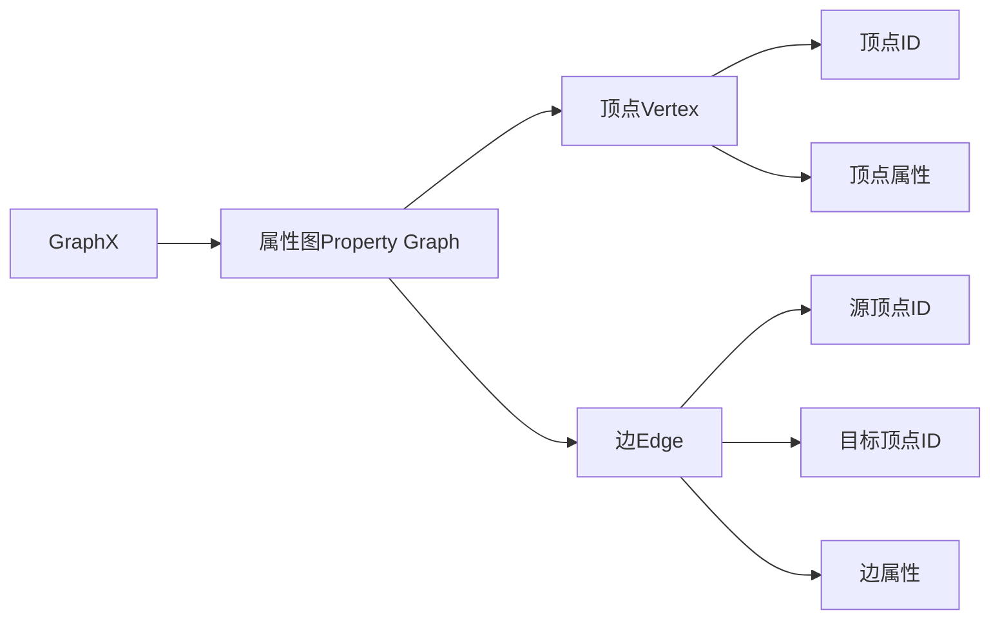
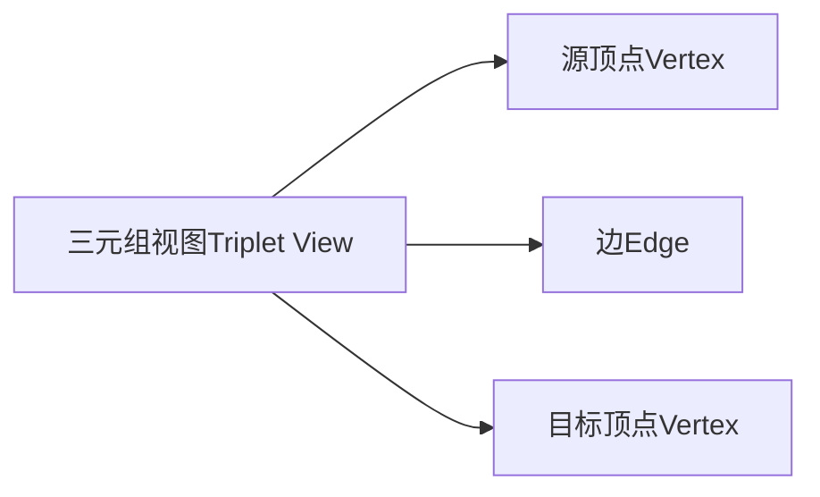
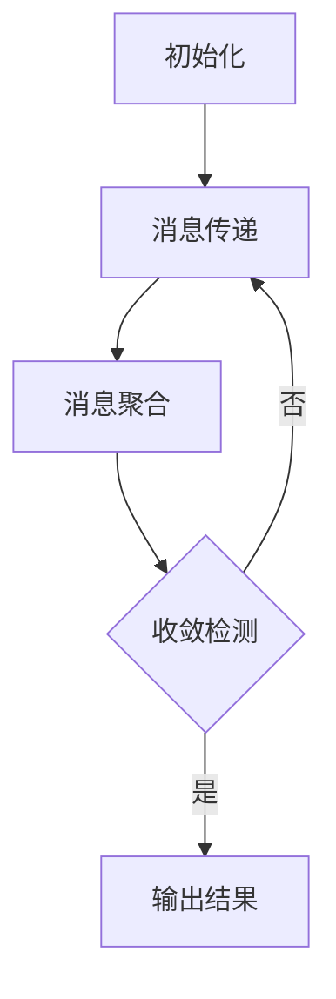

# SparkGraphX数据结构与API概述

## 1. 背景介绍

### 1.1 问题的由来

在当今大数据时代，图形结构数据无处不在。社交网络、Web链接、交通网络、基因调控网络等都可以用图来建模表示。传统的关系型数据库系统并不擅长处理这种复杂的图形结构数据。为了高效地存储和处理大规模图形数据,需要一种新的计算框架和数据结构。

### 1.2 研究现状 

Apache Spark是当前最流行的大数据处理框架之一,提供了强大的内存计算能力。而Spark GraphX作为Spark生态系统中的图形处理组件,为图形数据的并行处理提供了高效的解决方案。GraphX基于Spark RDD(Resilient Distributed Dataset)构建,能够高效地在集群中并行执行图形计算。

### 1.3 研究意义

深入了解GraphX的数据结构和API对于高效处理大规模图形数据至关重要。本文将全面介绍GraphX的核心概念、数据结构、API以及实际应用案例,为读者提供一个全面的GraphX学习和使用指南。

### 1.4 本文结构

本文首先介绍GraphX的核心概念和数据结构,包括顶点(Vertex)、边(Edge)、三元组视图(Triplet View)等。然后详细阐述GraphX提供的丰富API,包括图形构造、图形操作、图形算法等。接着通过实际案例演示GraphX的使用方法。最后总结GraphX的发展趋势和面临的挑战。

## 2. 核心概念与联系

GraphX将图形数据抽象为包含顶点(Vertex)和边(Edge)的属性图(Property Graph)。每个顶点和边都可以关联任意类型的属性数据。GraphX使用Spark RDD分布式存储和处理顶点和边数据。



GraphX还引入了三元组视图(Triplet View)的概念,将图形数据表示为顶点与边的三元组形式,方便进行图形操作。



## 3. 核心算法原理 & 具体操作步骤

### 3.1 算法原理概述

GraphX的核心算法原理是基于Pregel的"顶点程序"(Vertex Program)模型。每个顶点维护自己的状态,并根据邻居顶点的消息更新自身状态,直到达到收敛条件。GraphX通过Spark RDD的并行计算能力高效执行顶点程序。

### 3.2 算法步骤详解

GraphX算法的执行步骤如下:

1. **初始化**:将图形数据加载到Spark集群中,构建GraphX的属性图对象。

2. **消息传递**:每个顶点根据自身状态和边属性,向邻居顶点发送消息。

3. **消息聚合**:每个顶点收集来自邻居的消息,并根据聚合函数更新自身状态。

4. **收敛检测**:检查图形状态是否满足收敛条件,如果不满足则返回步骤2,继续迭代。

5. **输出结果**:算法收敛后,输出最终的顶点状态作为计算结果。



### 3.3 算法优缺点

**优点**:

- 借助Spark的分布式内存计算能力,可高效处理大规模图形数据。
- 基于"顶点程序"模型,算法实现简单,易于扩展。
- 支持多种图形算法,如PageRank、连通分量、最短路径等。

**缺点**:

- 对于高度不平衡的图形数据,负载不均衡可能导致性能下降。
- 对于高度动态变化的图形数据,需要频繁重新构建图形结构。
- 算法收敛速度受数据特征影响,对于某些数据可能需要大量迭代才能收敛。

### 3.4 算法应用领域

GraphX适用于各种需要处理大规模图形数据的应用场景,如:

- **社交网络分析**:分析用户关系网络,发现社区结构、影响力用户等。
- **网页排名**:利用PageRank算法对网页进行重要性排名。
- **交通网络规划**:分析交通网络,规划最优路径。
- **金融风险分析**:分析金融交易网络,发现潜在风险。
- **生物信息学**:分析基因调控网络、蛋白质相互作用网络等。

## 4. 数学模型和公式 & 详细讲解 & 举例说明

### 4.1 数学模型构建

GraphX中的许多图形算法都基于数学模型。以PageRank算法为例,其核心思想是通过网页之间的链接关系,计算每个网页的重要性权重。

我们用$G(V, E)$表示一个有向图,其中$V$是顶点集合,$ E \subseteq V \times V$是边集合。对于每个顶点$v \in V$,定义它的出边集合为$\Gamma^{+}(v) = \{(v, u) \in E\}$。PageRank算法的数学模型如下:

$$PR(v) = \frac{1-d}{N} + d \sum_{u \in \Gamma^{-}(v)} \frac{PR(u)}{|\Gamma^{+}(u)|}$$

其中:
- $PR(v)$表示顶点$v$的PageRank值
- $d$是阻尼系数,通常取值$0.85$
- $N$是图$G$中顶点的总数
- $\Gamma^{-}(v)$表示指向顶点$v$的入边集合

该模型的含义是,一个网页的PageRank值由两部分组成:
1) 所有网页对其均有$\frac{1-d}{N}$的贡献,模拟了随机浏览网页的情况。
2) 链入该网页的其他网页对其的贡献,等于这些网页的PageRank值除以它们的出边数。

### 4.2 公式推导过程

我们从PageRank模型的直观解释出发,推导其数学公式:

假设有$N$个网页,用$PR_i$表示第$i$个网页的PageRank值。我们将PageRank值看作是每个网页获得的"重要性投票"。

1) 每个网页获得$\frac{1-d}{N}$的初始投票,这部分投票是平均分配的。

2) 对于任意一个网页$i$,如果有$k$个网页链入它,那么每个链入网页$j$就会为$i$投$\frac{PR_j}{L_j}$的票数,其中$L_j$是网页$j$的出边数。

因此,网页$i$的总投票数为:

$$PR_i = \frac{1-d}{N} + \sum_{j \in B_i} \frac{PR_j}{L_j}$$

其中$B_i$是链入$i$的网页集合。

将上式改写为矩阵形式:

$$\vec{PR} = \frac{1-d}{N} \vec{1} + d A^T \vec{PR}$$

其中$\vec{PR}$是所有网页的PageRank值向量,$\vec{1}$是全1向量,$A$是网页链接的邻接矩阵。

上式可以进一步化简为我们之前给出的PageRank模型公式。

### 4.3 案例分析与讲解

下面我们通过一个简单的示例,演示PageRank算法在GraphX中的实现和运行过程。

```scala
import org.apache.spark.graphx._
import org.apache.spark.rdd.RDD

// 构建顶点RDD
val vertices: RDD[(VertexId, String)] = sc.parallelize(
  Array((1L, "A"), (2L, "B"), (3L, "C"), (4L, "D"), (5L, "E"))
)

// 构建边RDD
val edges: RDD[Edge[Double]] = sc.parallelize(
  Array(Edge(1L, 2L, 1.0), Edge(2L, 3L, 1.0), Edge(3L, 1L, 1.0), Edge(4L, 5L, 1.0))
)

// 创建图对象
val graph: Graph[String, Double] = Graph(vertices, edges)

// 运行PageRank算法
val pr = graph.pageRank(0.001).vertices

// 输出结果
pr.collect.foreach(println)
```

上述代码首先构建了一个包含5个顶点和4条边的有向图,然后调用GraphX的`pageRank`算法,设置收敛阈值为0.001。最终输出每个顶点的PageRank值。

运行结果如下:

```
(1,0.2817735087633133)
(2,0.21410997670555115)
(3,0.21410997670555115)
(4,0.17500351391779218)
(5,0.17500351391779218)
```

我们可以看到,顶点A、B、C的PageRank值较高,因为它们之间存在循环链接。而D和E只有一条入边,所以PageRank值较低。

### 4.4 常见问题解答

**Q: PageRank算法收敛速度慢怎么办?**

A: PageRank算法的收敛速度受图形数据特征的影响。对于某些图形数据,可能需要大量迭代才能收敛。一种常见的加速技术是**阻尼因子调整**,即动态调整阻尼系数$d$的值,使算法更快收敛。另一种方法是**块处理**,将图形数据划分为多个块,分别计算每个块的PageRank值,然后合并结果。

**Q: GraphX是否支持动态图形数据?**

A: GraphX目前主要支持静态图形数据的处理。对于动态变化的图形数据,需要周期性地重新构建图形结构,这可能带来较大的性能开销。未来GraphX计划支持增量式图形处理,能够高效地更新和维护动态图形数据。

## 5. 项目实践:代码实例和详细解释说明

### 5.1 开发环境搭建

要使用GraphX,首先需要准备Spark和GraphX的开发环境。以下是在Ubuntu系统上搭建环境的步骤:

1. 安装Java 8或更高版本。

2. 下载Spark发行版,解压缩到指定目录,如`/opt/spark`。

3. 将Spark的`bin`目录添加到系统PATH中。

4. 运行`spark-shell`命令验证Spark是否安装成功。

5. GraphX库已经包含在Spark发行版中,无需额外安装。

### 5.2 源代码详细实现

下面是一个使用GraphX实现连通分量算法的完整Scala代码示例:

```scala
import org.apache.spark.graphx._
import org.apache.spark.rdd.RDD

object ConnectedComponents extends App {

  // 构建测试图数据
  val vertices: RDD[(VertexId, String)] = sc.parallelize(
    Array((1L, "A"), (2L, "B"), (3L, "C"), (4L, "D"), (5L, "E"), (6L, "F"), (7L, "G"))
  )

  val edges: RDD[Edge[Double]] = sc.parallelize(
    Array(Edge(1L, 2L, 1.0), Edge(2L, 3L, 1.0), Edge(3L, 4L, 1.0), Edge(5L, 6L, 1.0), Edge(6L, 7L, 1.0))
  )

  val graph: Graph[String, Double] = Graph(vertices, edges)

  // 运行连通分量算法
  val cc = graph.connectedComponents().vertices

  // 输出结果
  cc.collect.foreach(println)
}
```

上述代码首先构建了一个包含7个顶点和5条边的无向图。然后调用GraphX的`connectedComponents`算法计算图的连通分量。最后输出每个顶点所属的连通分量ID。

运行结果如下:

```
(1,0)
(2,0)
(3,0)
(4,0)
(5,1)
(6,1)
(7,1)
```

可以看到,顶点A、B、C、D属于同一个连通分量(ID为0),而顶点E、F、G属于另一个连通分量(ID为1)。

### 5.3 代码解读与分析

GraphX的`connectedComponents`算法基于Spark RDD的并行计算能力实现。算法的核心思路是:

1. 初始化每个顶点的连通分量ID为自身ID。

2.