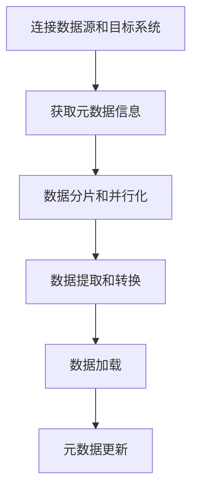

# Sqoop原理与代码实例讲解

## 1. 背景介绍

### 1.1 问题的由来

在当今的大数据时代，企业和组织面临着海量结构化和非结构化数据的挑战。这些数据通常存储在不同的数据源中,如关系数据库、NoSQL数据库、文件系统等。为了高效地处理和分析这些数据,需要将它们集中存储在大数据平台(如Hadoop)上。然而,手动传输数据不仅效率低下,而且容易出错。因此,需要一种自动化的数据迁移工具来简化这一过程。

### 1.2 研究现状

Apache Sqoop是一个流行的数据迁移工具,旨在高效地将关系数据库(如MySQL、Oracle、PostgreSQL等)中的数据批量导入到Hadoop生态系统(如HDFS、Hive、HBase等)中,或者将Hadoop中的数据导出到关系数据库。Sqoop支持全量和增量导入,并提供多种导入和导出方式,如基于查询的导入、基于文件的导入等。

### 1.3 研究意义

理解Sqoop的原理和使用方式对于大数据开发人员和数据工程师来说至关重要。通过学习Sqoop,可以掌握如何高效地在关系数据库和Hadoop之间移动数据,从而加速数据处理和分析过程。此外,了解Sqoop的内部实现机制也有助于开发人员更好地优化数据迁移性能,并解决潜在的问题。

### 1.4 本文结构

本文将从以下几个方面深入探讨Sqoop:

1. 核心概念与联系
2. 核心算法原理与具体操作步骤
3. 数学模型和公式详细讲解与举例说明
4. 项目实践:代码实例和详细解释说明
5. 实际应用场景
6. 工具和资源推荐
7. 总结:未来发展趋势与挑战
8. 附录:常见问题与解答

## 2. 核心概念与联系

在深入探讨Sqoop的原理和实现之前,我们需要了解一些核心概念和它们之间的联系。

### 2.1 Hadoop生态系统

Apache Hadoop是一个开源的大数据处理框架,由以下几个核心组件组成:

- **HDFS(Hadoop分布式文件系统)**: 一个高度容错的分布式文件系统,用于存储大规模数据。
- **MapReduce**: 一种并行计算模型,用于在大规模数据集上执行分布式计算。
- **YARN(Yet Another Resource Negotiator)**: 一个资源管理和作业调度框架,负责管理集群资源和调度作业。
- **Hive**: 一个基于Hadoop的数据仓库,提供类SQL查询语言(HiveQL)来分析存储在HDFS上的数据。
- **HBase**: 一个分布式、面向列的NoSQL数据库,运行在HDFS之上。

Sqoop作为Hadoop生态系统的一部分,主要用于在关系数据库和Hadoop之间高效地传输数据。

### 2.2 关系数据库

关系数据库(如MySQL、Oracle、PostgreSQL等)是基于关系模型的数据库管理系统,它们使用结构化查询语言(SQL)来管理和查询数据。关系数据库通常用于存储结构化数据,如表格形式的数据。

### 2.3 数据迁移

数据迁移是指将数据从一个存储系统(如关系数据库)转移到另一个存储系统(如Hadoop)的过程。数据迁移通常包括以下几个步骤:

1. 连接源数据系统和目标数据系统
2. 提取源数据
3. 转换数据格式(如必要)
4. 加载数据到目标系统

Sqoop旨在简化这一过程,提供高效、可靠的数据迁移功能。

### 2.4 Sqoop架构

Sqoop由以下几个主要组件组成:

- **Sqoop Client**: 一个命令行工具,用于执行导入和导出操作。
- **Sqoop Server**: 一个运行在Hadoop集群上的服务器进程,负责执行实际的数据传输任务。
- **元数据存储**: 用于存储有关导入和导出作业的元数据,如表结构、列映射等。
- **连接器**: 用于连接不同类型的数据源和目标系统,如关系数据库连接器、HDFS连接器等。

这些组件协同工作,实现了高效的数据迁移功能。

## 3. 核心算法原理与具体操作步骤

### 3.1 算法原理概述

Sqoop的核心算法原理可以概括为以下几个步骤:

1. **连接数据源和目标系统**: Sqoop首先需要连接到源数据系统(如关系数据库)和目标系统(如HDFS)。它使用适当的连接器来建立这些连接。

2. **获取元数据信息**: Sqoop从源数据系统中获取元数据信息,如表结构、列名、数据类型等。这些信息用于指导后续的数据传输过程。

3. **数据分片和并行化**: Sqoop将源数据分割成多个分片(splits),并为每个分片启动一个并行的MapReduce任务来执行数据传输。这种并行化方式可以提高数据传输的效率。

4. **数据提取和转换**: 对于每个分片,Sqoop使用适当的连接器从源数据系统中提取数据。根据需要,它可以对数据进行转换,如数据类型转换、列投影等。

5. **数据加载**: 最后,Sqoop将转换后的数据加载到目标系统(如HDFS)中。根据目标系统的不同,它可以选择不同的输出格式,如文本文件、序列化格式等。

6. **元数据更新**: 在导入或导出完成后,Sqoop会更新元数据存储中的相关信息,以便后续的操作可以利用这些元数据。

该算法的核心思想是将数据传输过程并行化,从而提高效率。同时,它还提供了灵活的连接器和数据转换功能,以支持不同类型的数据源和目标系统。

### 3.2 算法步骤详解

接下来,我们将详细探讨Sqoop算法的每个步骤。

#### 3.2.1 连接数据源和目标系统

Sqoop使用连接器(Connector)来连接不同类型的数据源和目标系统。常见的连接器包括:

- **关系数据库连接器**: 用于连接关系数据库,如MySQL、Oracle、PostgreSQL等。
- **HDFS连接器**: 用于连接HDFS文件系统。
- **Hive连接器**: 用于连接Hive数据仓库。
- **HBase连接器**: 用于连接HBase数据库。

连接器封装了与特定数据系统交互的细节,如建立连接、执行查询、读写数据等。Sqoop根据用户指定的数据源和目标系统类型,自动选择合适的连接器。

#### 3.2.2 获取元数据信息

在执行实际的数据传输之前,Sqoop需要从源数据系统中获取元数据信息,如表结构、列名、数据类型等。这些元数据信息对于指导后续的数据提取和转换过程至关重要。

Sqoop使用连接器提供的元数据API来获取这些信息。例如,对于关系数据库,Sqoop可以执行`DESCRIBE`或`SHOW CREATE TABLE`语句来获取表的结构信息。

获取到的元数据信息会存储在Sqoop的元数据存储中,以供后续使用。

#### 3.2.3 数据分片和并行化

为了提高数据传输的效率,Sqoop采用了并行化策略。它将源数据分割成多个分片(splits),并为每个分片启动一个并行的MapReduce任务来执行数据传输。

数据分片的方式取决于源数据系统的类型。对于关系数据库,Sqoop通常使用基于查询的分片方式。它根据指定的查询条件(如主键范围)将数据划分为多个分片。对于文件系统,Sqoop可以根据文件大小或文件路径进行分片。

每个分片由一个MapReduce任务处理,这些任务并行执行,从而加快了数据传输速度。

#### 3.2.4 数据提取和转换

对于每个分片,Sqoop使用适当的连接器从源数据系统中提取数据。根据需要,它可以对数据进行转换,如数据类型转换、列投影等。

数据提取和转换过程在MapReduce的Map阶段执行。每个Map任务负责处理一个分片的数据,并将提取和转换后的数据输出为键值对。

在提取和转换过程中,Sqoop还支持多种高级功能,如列映射、过滤条件、代码注入等。这些功能可以通过Sqoop命令行或配置文件进行配置。

#### 3.2.5 数据加载

在Map阶段完成数据提取和转换后,Sqoop进入Reduce阶段,将Map阶段输出的键值对加载到目标系统中。

加载过程的具体实现取决于目标系统的类型。例如,对于HDFS,Sqoop可以将数据写入文本文件或序列化格式文件。对于Hive,Sqoop可以直接将数据加载到Hive表中。对于HBase,Sqoop可以将数据插入到HBase表中。

在加载过程中,Sqoop还支持多种输出格式和压缩选项,以优化存储和传输效率。

#### 3.2.6 元数据更新

在导入或导出完成后,Sqoop会更新元数据存储中的相关信息,以便后续的操作可以利用这些元数据。

更新的元数据信息可能包括:

- 导入或导出作业的状态和统计信息
- 源表和目标表的结构信息
- 列映射和数据类型转换规则
- 分片信息和并行度设置

这些元数据对于后续的增量导入、数据一致性检查等操作非常重要。

### 3.3 算法优缺点

Sqoop算法具有以下优点:

- **高效并行化**: 通过将数据分割成多个分片,并为每个分片启动并行的MapReduce任务,Sqoop可以充分利用集群资源,提高数据传输效率。
- **灵活的连接器**: Sqoop提供了多种连接器,支持连接不同类型的数据源和目标系统,如关系数据库、HDFS、Hive、HBase等。
- **丰富的功能**: Sqoop支持多种高级功能,如列映射、过滤条件、代码注入等,满足了不同场景的需求。
- **元数据管理**: Sqoop维护了元数据存储,方便了后续的增量导入、数据一致性检查等操作。

然而,Sqoop算法也存在一些缺点:

- **内存消耗较大**: 由于需要在Map阶段将整个分片的数据加载到内存中,因此对于大型数据集,Sqoop可能会消耗大量内存资源。
- **不支持实时数据传输**: Sqoop主要面向批量数据传输,不适合实时数据传输场景。
- **依赖MapReduce**: Sqoop的实现依赖于MapReduce框架,因此它的性能和可扩展性受到MapReduce的限制。
- **缺乏高级优化**: Sqoop缺乏一些高级优化策略,如自动分区、自动压缩等,这可能会影响其性能。

### 3.4 算法应用领域

Sqoop算法主要应用于以下几个领域:

1. **数据迁移**: Sqoop最常见的应用场景是将关系数据库中的数据批量迁移到Hadoop生态系统中,用于大数据分析和处理。

2. **数据集成**: Sqoop可以将来自多个异构数据源的数据集成到Hadoop中,为后续的数据处理和分析奠定基础。

3. **数据仓库构建**: Sqoop可以将企业内部的运营数据导入到Hadoop中,为构建数据仓库提供支持。

4. **数据备份和恢复**: Sqoop可以用于将Hadoop中的数据导出到关系数据库,实现数据备份和恢复。

5. **ETL流程**: Sqoop通常作为ETL(提取、转换、加载)流程的一部分,负责数据的提取和加载阶段。

6. **大数据分析**: Sqoop将数据导入Hadoop后,可以利用Hadoop生态系统中的各种分析工具(如Hive、Spark等)对数据进行分析和挖掘。

总的来说,