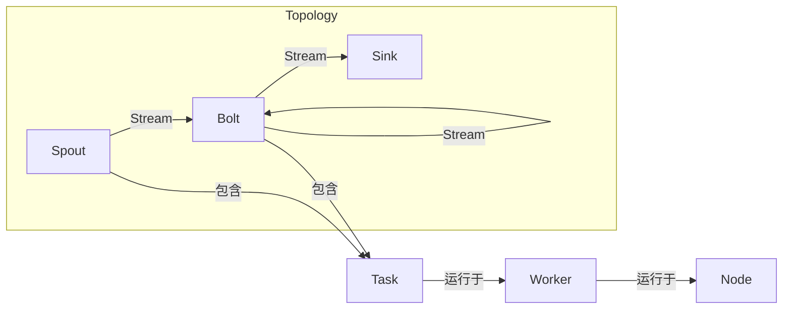

# Storm Topology原理与代码实例讲解

## 1. 背景介绍

### 1.1 问题的由来

在当今大数据时代，实时数据处理已经成为许多企业和组织的关键需求。传统的批处理系统无法满足对实时性的要求,因此出现了一系列新的流式计算框架,其中Apache Storm就是最著名的一种。

随着物联网、社交媒体和移动互联网的快速发展,海量的数据源源不断地产生,这些数据需要被实时处理和分析,以便及时做出反应。例如,电商网站需要实时分析用户行为数据来个性化推荐商品;金融机构需要实时检测可疑交易以防止欺诈;社交网络需要实时处理用户发布的内容以进行内容审核等。

然而,实时数据处理并非一蹴而就。它面临着诸多挑战,如数据源多样性、高吞吐量、低延迟要求、故障容错等。传统的批处理系统如Hadoop MapReduce无法满足实时性要求,因为它们是基于磁盘的,处理延迟较高。为了解决这些问题,Apache Storm应运而生。

### 1.2 研究现状

Apache Storm是一个分布式实时计算系统,最初由Nathan Marz等人在BackType公司开发,后来捐献给Apache软件基金会。它于2011年9月开源,并在2014年9月发布了第一个版本1.0.0。

Storm的核心设计思想是以流为中心,将数据源看作是一个无限流,并以拓扑(Topology)的形式对这些流进行变换和处理。Storm拓扑由Spout(数据源)和Bolt(处理单元)组成,数据以流的形式在Spout和Bolt之间传递。

Storm具有以下主要特点:

- 高吞吐量和低延迟:Storm可以每秒处理数百万个消息,延迟仅为几毫秒。
- 可靠性:Storm提供了至少一次和最多一次的消息处理语义保证。
- 容错性:Storm具有自动故障恢复机制,可以在工作节点出现故障时自动重新分配任务。
- 可扩展性:Storm可以通过简单地添加更多的工作节点来线性扩展。
- 编程简单:Storm提供了基于JVM的友好编程接口,支持多种编程语言。

Storm已被许多大型公司广泛应用,如Twitter、Spotify、Yahoo!、Alibaba等。它适用于各种实时数据处理场景,如实时分析、机器学习、持续计算等。

### 1.3 研究意义

研究Storm Topology的原理和实现对于以下几个方面具有重要意义:

1. **理解实时数据处理架构**:Storm Topology揭示了实时数据处理系统的核心架构和设计理念,有助于我们深入理解这一领域的关键概念和技术。

2. **掌握分布式系统设计**:Storm是一个分布式系统,研究其Topology的原理和实现有助于我们掌握分布式系统设计的一般原则,如数据分区、负载均衡、容错机制等。

3. **提高实时应用开发能力**:通过研究Storm Topology的代码实例,我们可以学习到如何利用Storm开发实时数据处理应用程序,提高相关的开发能力。

4. **优化实时数据处理性能**:深入了解Storm Topology的原理有助于我们优化拓扑结构、调节资源配置,从而提高实时数据处理的性能表现。

5. **推动大数据技术发展**:Storm作为流式计算领域的代表性技术,研究其Topology有助于推动大数据技术在实时数据处理领域的发展和创新。

总之,Storm Topology是实时数据处理系统的核心组成部分,研究其原理和实现对于我们深入理解和掌握实时数据处理技术、开发相关应用程序、优化系统性能等方面都具有重要意义。

### 1.4 本文结构

本文将全面介绍Storm Topology的原理和实现,内容安排如下:

1. 背景介绍:阐述实时数据处理的现状和Storm的发展历程,说明研究意义。

2. 核心概念与联系:介绍Storm Topology的核心概念,如Spout、Bolt、Stream分组策略等,并阐明它们之间的关系。

3. 核心算法原理与具体操作步骤:深入分析Storm Topology的工作原理和算法流程,并给出具体的操作步骤。

4. 数学模型和公式详细讲解与举例说明:建立相关的数学模型,推导关键公式,并结合案例进行讲解。

5. 项目实践:代码实例和详细解释说明:提供Storm Topology的代码实例,并对关键代码进行解读和分析。

6. 实际应用场景:介绍Storm Topology在实际场景中的应用,如实时分析、机器学习等。

7. 工具和资源推荐:推荐Storm Topology相关的学习资源、开发工具和论文等。

8. 总结:未来发展趋势与挑战:总结研究成果,展望未来发展趋势,并分析可能面临的挑战。

9. 附录:常见问题与解答:列出Storm Topology相关的常见问题并给出解答。

通过全面系统的介绍,读者能够深入理解Storm Topology的原理和实现,掌握相关的开发技能,并了解其在实际场景中的应用。

## 2. 核心概念与联系

在深入探讨Storm Topology的原理和实现之前,我们需要先了解一些核心概念,这些概念是构建Storm应用程序的基础。下面将介绍Storm中最关键的几个概念,并阐明它们之间的关系。

### 2.1 Topology

Topology是Storm中最核心的概念,它定义了一个完整的实时数据处理流程,包括数据源(Spout)、数据处理单元(Bolt)以及它们之间的数据流(Stream)。一个Topology就像一个有向无环图,由Spout和Bolt构成节点,Stream构成边。

### 2.2 Spout

Spout是Topology中的数据源,它从外部数据源(如Kafka、文件系统等)读取数据,并将数据以流的形式发射(emit)到Topology中。Spout可以是可靠的(Reliable)或不可靠的(Unreliable),可靠的Spout保证数据至少被处理一次,而不可靠的Spout则不提供任何处理语义保证。

### 2.3 Bolt

Bolt是Topology中的数据处理单元,它从Spout或上游Bolt接收数据流,对数据进行处理(如过滤、转换、聚合等),并将处理结果发射到下游Bolt或存储系统中。Bolt可以执行任意操作,如数据库查询、机器学习算法等。

### 2.4 Stream

Stream是Spout或Bolt发射的数据流,它由无限序列的元组(Tuple)组成。每个元组都包含一组按名称索引的值,可以携带任意类型的数据。Stream连接Spout和Bolt,使得数据可以在Topology中流动。

### 2.5 Stream分组策略

Stream分组策略决定了如何将一个Spout或Bolt的输出流分发到下游Bolt的多个任务中。Storm提供了多种内置的分组策略,如Shuffle Grouping(随机分组)、Fields Grouping(按字段分组)、Global Grouping(全局分组)等。用户也可以自定义分组策略。

### 2.6 Task和Worker

Task是Spout或Bolt的实例,它是真正执行数据处理工作的单元。一个Spout或Bolt可以由多个Task组成,这些Task并行运行以提高处理能力。

Worker是运行Topology的工作进程,它包含了执行同一个Topology中所有Task的线程。一个Worker运行在一个工作节点(Node)上,多个Worker可以运行在同一个节点上。

上述核心概念之间的关系如下所示:

其中,Topology由Spout、Bolt和Stream组成,Spout和Bolt包含多个Task,Task运行于Worker进程中,Worker运行于工作节点(Node)上。

通过上述概念和它们之间的关系,我们可以构建出复杂的实时数据处理应用程序。下一节将深入探讨Storm Topology的核心原理和算法流程。

## 3. 核心算法原理与具体操作步骤

### 3.1 算法原理概述

Storm Topology的核心算法原理可以概括为以下几个方面:

1. **流式数据模型**

Storm将数据源视为一个无限流,通过Spout不断发射数据元组(Tuple)进入Topology。这些元组在Topology中按照有向无环图的拓扑结构流动,经过一系列Bolt的转换和处理,最终到达终端节点(如数据库、文件系统等)。

2. **数据分区和并行计算**

为了提高处理能力,Storm采用了数据分区和任务并行的策略。每个Spout或Bolt都可以由多个Task实例组成,这些Task在多个Worker进程中并行运行。数据流通过分组策略(Stream Grouping)分发到下游Bolt的不同Task中进行处理。

3. **容错与可靠性机制**

Storm提供了至少一次和最多一次的消息处理语义保证。当某个Task失败时,Storm会自动重新分配该Task到其他Worker节点上,并从最后一次成功处理的位置重新处理数据,以确保数据不会丢失。此外,Storm还支持记录数据源的重放(replay)以实现精确一次的语义。

4. **动态扩展与缩减**

Storm支持在运行时动态地添加或删除Worker节点,从而实现无缝扩展或缩减Topology的处理能力。当需要增加或减少资源时,Storm会自动在新节点上启动或关闭相应的Task,并在必要时对数据流进行重新分区。

5. **流控与反压机制**

为了防止下游节点被暴力输入的数据流压垮,Storm采用了基于TCP的流控和反压机制。当下游节点的输入缓冲区满载时,它会通知上游节点暂停发射数据,直到缓冲区有足够的空间再继续发射,从而避免了数据丢失和系统过载。

总的来说,Storm Topology的核心算法思想是将数据源建模为无限流,并通过数据分区、并行计算、容错机制、动态扩展和流控等策略,实现高吞吐、低延迟、可靠和可伸缩的实时数据处理。

### 3.2 算法步骤详解

Storm Topology的工作流程可以概括为以下几个主要步骤:

1. **提交Topology**

用户通过编程方式定义一个Topology,包括Spout、Bolt、Stream分组策略等,然后将该Topology提交到Storm集群。

2. **分发任务调度**

Storm的Nimbus组件(类似于Hadoop的JobTracker)负责将Topology中的Spout和Bolt任务分发到各个Worker节点上执行。它根据集群资源情况和任务数量,计算出每个Worker需要运行多少个Task。

3. **Task初始化**

每个Worker进程启动后,会加载相应的Spout或Bolt任务,并进行初始化操作,如连接外部数据源、创建缓冲区等。

4. **Spout发射数据流**

Spout Task开始从外部数据源(如Kafka、文件系统等)不断消费数据,并将数据打包成元组(Tuple)发射到输出Stream中。

5. **数据分组与路由**

Spout的输出Stream根据预定义的分组策略(如Shuffle Grouping、Fields Grouping等),将元组分发到下游Bolt Task的输入队列中。

6. **Bolt执行处理**

Bolt Task从输入队列中取出元组,并对其执行相应的处理操作,如过滤、转换、聚合等。处理完成后,Bolt可以选择将结果发射到新的Stream中,交给下游Bolt继续处理。

7. **容错与重新调度**

如果某个Task失败,Storm的Supervisor组件会监控到该情况,并将失败的Task重新调度到其他Worker节点上执行,以确保数据处理的连续性和可靠性。

8. **结果持久化**

经过一系列Bolt的处理后,最终的结果数据将被发射到终端Bolt,由终端Bolt将结果持久化到外部系统中,如数据库、文件系统等。

9. **动态扩展与缩减**

根据实际需求,用户可以在Topology运行时动态地增加或减少Worker节点数量,从而扩大