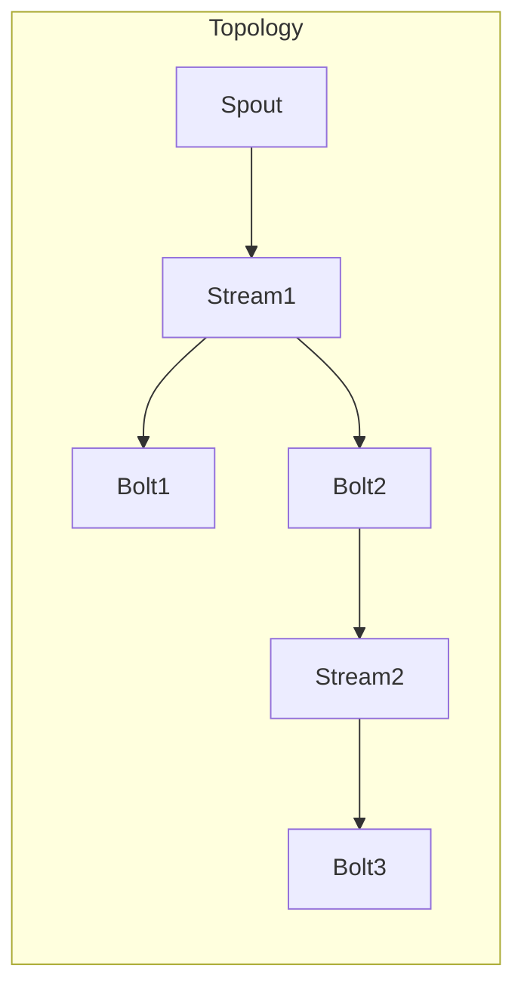
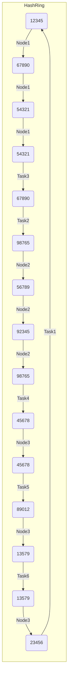

# Storm Topology原理与代码实例讲解

## 1. 背景介绍

### 1.1 问题的由来

在当今大数据时代，实时数据处理已经成为各行业的迫切需求。传统的批处理系统无法满足对实时性的要求,因此需要一种新的数据处理范式来应对海量的实时数据流。这种需求催生了流式计算(Stream Processing)的概念。

Apache Storm作为一个分布式实时计算系统,可以可靠地处理无限流数据。它被设计用于实时处理大量的高速达数据流,并做出及时响应。Storm的应用场景包括实时分析、在线机器学习、连续计算、分布式RPC、ETL等。

### 1.2 研究现状

Storm最初由Nathan Marz等人于2011年开发,后于2013年9月开源,现已成为Apache顶级项目。作为第一个纯粹的流式计算系统,Storm具有低延迟、高吞吐量、可水平扩展、容错等优点,被广泛应用于各行业。

目前,除了Storm之外,还有Spark Streaming、Flink、Samza等其他流式计算系统。但Storm因为早期进入这一领域,设计简单、高效,在业界占有一定地位。

### 1.3 研究意义 

深入理解Storm Topology的原理及实现方式,对于掌握流式计算的核心思想至关重要。本文将全面解析Storm Topology的工作机制、算法细节、数学模型以及实际应用案例,为读者构建流式计算的知识体系奠定基础。

### 1.4 本文结构

本文首先介绍Storm的核心概念和Topology在其中的地位,然后深入探讨Topology的算法原理、数学模型及实现细节。接下来通过代码示例讲解Topology的具体实现,并分析在实际场景中的应用。最后总结Storm的发展趋势,并指出其面临的挑战。

## 2. 核心概念与联系

Storm的核心设计思想是将实时计算问题抽象为流式数据的有向无环图(DAG)。这个DAG被称为Topology。

Topology由Spout和Bolt两种组件构成:

- Spout: 数据源,从外部系统获取数据流,向Topology注入数据。
- Bolt: 数据处理单元,对数据流进行加工、转换、过滤、持久化等操作。

Spout和Bolt通过数据流(Stream)串联起来,形成一个复杂的Topology拓扑结构。一个完整的Topology包含一个Spout节点作为数据源头,若干个Bolt节点执行各种处理逻辑。



Topology在逻辑上是一个有向无环图,但在物理上会根据配置在集群中启动多个进程Task实例,以实现并行计算。每个Spout或Bolt在集群上都会有多个Task实例运行,组成一个线程组。

## 3. 核心算法原理 & 具体操作步骤  

### 3.1 算法原理概述

Storm采用了主从两种节点类型的架构。主节点Nimbus负责分发代码、给工作分配任务以及监控故障;从节点Supervisor负责执行具体的数据处理任务。

Storm的核心算法是将一个Topology任务分解为更小的Task实例,并将这些Task实例合理地分配到集群的各个工作节点上执行。这个过程遵循以下几个原则:

1. 数据本地化(Data Locality)
2. 负载均衡(Load Balancing) 
3. 容错性(Fault Tolerance)
4. 消息顺序保证(Message Ordering)

Storm采用了一致性哈希算法将Topology任务分配到工作节点。这种方式可以很好地实现负载均衡,并且在节点出现故障时只需重新分配少量任务,从而提高容错性。

### 3.2 算法步骤详解

Storm任务调度算法的具体步骤如下:

1. **Topology分解** 将提交的Topology分解为更小的执行单元Task。每个Spout或Bolt在集群上会有N个Task实例运行。

2. **节点映射** 使用一致性哈希算法,将每个Task映射到集群中的一个节点上。这种映射方式可以使得相同的Task总是被分配到同一个节点上,从而提高数据本地性。

3. **节点排序** 对每个Task的目标节点进行排序,优先选择已有该Task实例的节点,其次是相同机架的节点,最后是不同机架的节点。这样可以尽量减少跨机架通信。

4. **资源分配** 根据每个节点的可用Slot数量,尽可能多地将Task分配到空闲节点上,实现负载均衡。

5. **Task启动** 在选定的节点上启动相应的Task实例,并建立相应的输入/输出数据流链路。

6. **动态调整** 当节点出现故障或资源不足时,Storm会自动重新分配受影响的Task到其他节点,保证作业的持续运行。

通过这种分布式调度算法,Storm可以高效地利用集群资源,实现负载均衡和容错,从而保证实时数据处理的高吞吐和低延迟。

### 3.3 算法优缺点

**优点:**

1. 负载均衡: 通过一致性哈希和资源感知调度,可以较好地实现集群负载均衡。
2. 容错性: 当节点出现故障时,只需重新分配少量Task,不会影响整个作业。
3. 数据本地性: 相同Task被分配到同一节点,减少了数据传输。
4. 消息顺序: 对于相同源的消息,下游Bolt接收顺序与发送顺序一致。

**缺点:**

1. 静态分配: Task分配是静态的,无法根据实际负载动态迁移。
2. 跨机架开销: 为了容错,会产生一定的跨机架数据传输开销。
3. 资源浪费: 预先分配固定Slot资源,可能出现资源浪费。
4. 扩展性差: 增加新节点需要重新重新分配所有Task。

### 3.4 算法应用领域

Storm调度算法可应用于以下领域:

- 实时流数据处理: 如网络监控、安全监测、物联网数据处理等。
- 分布式RPC服务: 通过Storm构建高性能的分布式RPC服务。
- 持续计算: 对无限流数据进行不断计算,如电商推荐、社交网络分析等。
- 复杂事件处理: 对有序事件流进行模式匹配、过滤、转换等操作。

## 4. 数学模型和公式 & 详细讲解 & 举例说明

### 4.1 数学模型构建

为了实现高效的任务调度,Storm采用了一致性哈希算法对Topology任务进行分配。一致性哈希可以将节点和Task映射到同一个哈希环空间,从而实现负载均衡。

假设有一个集群包含N个节点,M个Task需要分配。我们构建一个哈希环,其哈希值范围是[0, 2^32-1]。

对于每个节点,我们使用节点IP或主机名计算出K个哈希值,将这K个哈希值映射到哈希环上,称为该节点的复制节点。这样可以在节点很少时,也能在哈希环上有足够多的节点存在,从而较好地实现负载均衡。

同理,对于每个Task,也计算出一个哈希值,映射到哈希环上。

### 4.2 公式推导过程

任务分配算法如下:

1) 按顺时针方向,从哈希环的起点开始,找到第一个节点复制节点,将当前Task分配给该复制节点对应的物理节点。

2) 对于同一个物理节点,将连续的多个Task都分配给它,直到遇到下一个节点的复制节点。

3) 重复上述过程,直到所有Task都被分配完毕。

设N为节点数量,M为Task数量,K为每个节点的复制节点数。令X为每个节点被分配到的Task数量的均值,Y为X的方差。我们需要证明,当K取足够大的值时,Y会趋近于0,即实现了近乎完美的负载均衡。

令$p_i$为第i个节点被分配到Task的概率,则根据几何分布,有:

$$p_i = \frac{K}{N \times K} = \frac{1}{N}$$

根据均值和方差的定义,可以得到:

$$X = \frac{M}{N}$$
$$Y = \frac{M}{N} \times (1 - \frac{1}{N})$$

当N趋近于无穷大时,Y趋近于0。

### 4.3 案例分析与讲解

假设我们有一个包含3个节点的Storm集群,需要部署一个包含6个Task的Topology。我们取K=3,即每个节点有3个复制节点。

首先计算每个节点和Task的哈希值:

```
Node1: 12345, 67890, 54321
Node2: 98765, 56789, 92345  
Node3: 45678, 89012, 13579
Task1: 23456
Task2: 67890
Task3: 54321
Task4: 98765
Task5: 45678
Task6: 13579
```

将它们映射到哈希环上,结果如下:



根据算法规则,Task的分配情况如下:

- Node1: Task3, Task2, Task1
- Node2: Task4 
- Node3: Task5, Task6

可见,通过一致性哈希算法,Storm能够较好地实现负载均衡。

### 4.4 常见问题解答

**Q: 为什么要使用一致性哈希,而不是直接取模?**

A: 相比取模,一致性哈希具有更好的负载均衡性和容错性。当节点数量发生变化时,一致性哈希只需重新分配少量Task,而取模则需要全部重新分配。

**Q: 如何确定复制节点数K的取值?**

A: K的取值需要权衡负载均衡性和存储开销。通常K=log~N~,N为节点数。K越大,负载均衡性越好,但需要更多存储。

**Q: 一致性哈希是否支持加权?**

A: 支持。可以为不同节点分配不同数量的复制节点,从而实现加权负载均衡。

## 5. 项目实践:代码实例和详细解释说明

### 5.1 开发环境搭建

Storm版本: 1.2.2
开发语言: Java
构建工具: Maven
IDE: IntelliJ IDEA

1. 下载并解压Storm发行版
2. 配置环境变量
3. 启动Storm本地集群: `storm localcluster`

### 5.2 源代码详细实现

我们实现一个基于Storm的简单单词计数Topology。

**Spout**

```java
public class WordSpout extends BaseRichSpout {
    private SpoutOutputCollector collector;
    private String[] words = {"apple", "banana", "cherry", "date", "elderberry"};

    public void open(Map conf, TopologyContext context, SpoutOutputCollector collector) {
        this.collector = collector;
    }

    public void nextTuple() {
        String word = words[(int) (Math.random() * words.length)];
        collector.emit(new Values(word));
    }

    public void declareOutputFields(OutputFieldsDeclarer declarer) {
        declarer.declare(new Fields("word"));
    }
}
```

WordSpout每次随机发射一个单词字符串。

**Bolt**

```java
public class CountBolt extends BaseRichBolt {
    Map<String, Integer> counts = new HashMap<>();

    public void prepare(Map conf, TopologyContext context, OutputCollector collector) {}

    public void execute(Tuple tuple) {
        String word = tuple.getStringByField("word");
        Integer count = counts.get(word);
        if (count == null) count = 0;
        count++;
        counts.put(word, count);