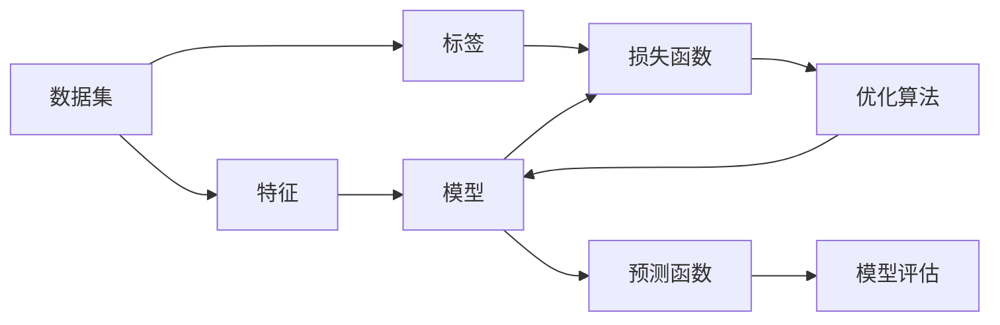

# Supervised Learning 原理与代码实战案例讲解

## 1. 背景介绍
### 1.1 问题的由来
随着大数据时代的到来,各行各业积累了海量的数据,如何从这些数据中挖掘出有价值的信息和知识,成为了一个重要的研究课题。机器学习作为人工智能的核心,为数据分析和预测提供了强大的工具。而监督学习(Supervised Learning)作为机器学习的重要分支,在实际应用中得到了广泛的应用。

### 1.2 研究现状
目前,监督学习已经在图像识别、自然语言处理、语音识别、推荐系统等领域取得了显著的成果。各大科技公司如谷歌、微软、亚马逊等都在大力投入监督学习的研究,并将其应用到实际的产品中。学术界也在监督学习算法的改进和创新上做了大量工作,涌现出了一批优秀的算法如支持向量机(SVM)、随机森林(Random Forest)、XGBoost等。

### 1.3 研究意义
监督学习对于从数据中学习和预测具有重要意义。一方面,海量的数据为监督学习提供了训练的素材,使得训练出鲁棒和高精度的模型成为可能。另一方面,很多问题天然适合用监督学习建模,如根据历史销售数据预测商品未来销量,根据用户特征预测用户是否会流失等。深入研究监督学习,对于数据驱动的智能决策至关重要。

### 1.4 本文结构
本文将从以下几个方面对监督学习进行探讨:
- 第2部分介绍监督学习的核心概念与各部分的联系
- 第3部分讲解监督学习的核心算法原理和具体操作步骤
- 第4部分从数学角度对监督学习的模型和公式进行推导和举例说明
- 第5部分通过代码实例和详细解释,演示如何用Python实现监督学习模型
- 第6部分总结监督学习的实际应用场景和未来的发展趋势
- 第7部分推荐监督学习相关的工具、资源和论文
- 第8部分对全文进行总结,讨论监督学习未来的机遇和挑战
- 第9部分的附录解答了监督学习的一些常见问题

## 2. 核心概念与联系
监督学习是一种机器学习范式,它的目标是学习一个模型,使得模型能够对未知数据做出正确的预测。监督学习有以下几个核心概念:

- 数据集(Dataset):包含特征(Feature)和标签(Label)的数据的集合。用来训练和评估模型。
- 特征(Feature):数据的属性,用来作为模型的输入,如图像的像素值,文本的词频等。
- 标签(Label):数据的真实结果,用来作为训练模型时的目标,如图像所属的类别,文本的情感倾向等。
- 模型(Model):根据特征预测标签的函数。监督学习的目标就是学习出一个性能良好的模型。
- 训练(Training):用数据集训练模型以使其能够对新数据做出正确预测的过程。
- 损失函数(Loss Function):用来衡量模型预测值和真实值之间差异的函数。模型训练的目标是最小化损失函数。
- 优化算法(Optimization Algorithm):用来最小化损失函数,更新模型参数的算法,如梯度下降法。
- 评估(Evaluation):在测试集或验证集上评估训练好的模型的性能,如精确率、召回率等。

下图展示了监督学习的核心概念与流程:

从上图可以看出,监督学习的核心是训练一个模型,使其能够从特征预测标签。训练过程通过优化算法最小化损失函数来更新模型参数。训练好的模型可以对新数据的标签做出预测,并在测试集上进行性能评估。

## 3. 核心算法原理 & 具体操作步骤
### 3.1 算法原理概述
监督学习有很多经典算法,它们的原理各不相同,但大体可以分为以下几类:

- 线性模型:通过线性组合特征来预测标签,如线性回归、逻辑回归、支持向量机等。
- 树模型:通过构建决策树来预测标签,如决策树、随机森林、梯度提升树等。
- 神经网络:通过搭建多层神经元,学习特征的高层表示来预测标签,如多层感知机、卷积神经网络等。
- 概率图模型:通过建立变量之间的概率依赖关系来预测标签,如朴素贝叶斯、条件随机场等。
- 基于实例的方法:通过度量新样本和训练样本之间的相似性来预测标签,如K近邻、局部加权回归等。

这些算法的数学原理各不相同,但它们的基本思想是相通的,即通过学习数据中特征和标签之间的关系,构建一个能够从特征预测标签的模型。

### 3.2 算法步骤详解
以线性回归为例,详细讲解监督学习算法的步骤:

1. 数据准备:将数据集分为训练集、验证集和测试集。训练集用来训练模型,验证集用来调参,测试集用来评估模型性能。
2. 特征工程:对特征进行预处理,如缺失值填充、归一化、特征选择等,使其更适合建模。
3. 模型构建:定义线性回归模型 $\hat{y} = w^Tx + b$,其中 $\hat{y}$ 为预测值,$w$ 为权重向量,$b$ 为偏置。
4. 定义损失函数:使用均方误差(MSE)作为损失函数:
$$ J(w,b) = \frac{1}{m} \sum_{i=1}^m (w^Tx^{(i)} + b - y^{(i)})^2 $$
其中 $m$ 为样本数量,$x^{(i)}, y^{(i)}$ 为第 $i$ 个样本的特征和标签。
5. 优化模型:使用梯度下降法最小化损失函数,更新模型参数 $w$ 和 $b$:
$$ w := w - \alpha \frac{\partial J}{\partial w} $$
$$ b := b - \alpha \frac{\partial J}{\partial b} $$
其中 $\alpha$ 为学习率。重复迭代直到模型收敛。
6. 模型评估:在测试集上评估模型的性能,计算均方误差、决定系数等指标。
7. 模型调优:通过调整超参数如学习率、正则化系数等,提升模型性能。可使用验证集进行调参。
8. 模型预测:使用训练好的模型对新样本的标签进行预测。

### 3.3 算法优缺点
线性回归的优点是:
- 模型简单,易于理解和实现。
- 训练和预测速度快。
- 适用于特征和标签呈线性关系的场景。

缺点是:
- 无法拟合非线性关系。
- 对异常值敏感。
- 需要大量的数据才能得到鲁棒的模型。

### 3.4 算法应用领域
线性回归在很多领域都有应用,如:
- 市场趋势预测:根据历史销售数据预测未来的市场需求。
- 房价预测:根据房屋的面积、位置等特征预测房价。
- 广告点击率预测:根据用户的人口统计学特征预测其对广告的点击概率。

## 4. 数学模型和公式 & 详细讲解 & 举例说明
### 4.1 数学模型构建
监督学习可以表示为一个函数逼近问题。假设数据集为 $D = \{(x^{(1)}, y^{(1)}), (x^{(2)}, y^{(2)}), ..., (x^{(m)}, y^{(m)})\}$,其中 $x^{(i)} \in \mathbb{R}^n$ 为第 $i$ 个样本的特征向量, $y^{(i)} \in \mathbb{R}$ 为其对应的标签。我们的目标是学习一个函数 $f: \mathbb{R}^n \rightarrow \mathbb{R}$,使得 $f(x)$ 尽可能逼近 $y$。

对于线性回归,模型假设 $f$ 是一个线性函数:
$$ f(x) = w^Tx + b $$

其中 $w \in \mathbb{R}^n$ 为权重向量,$b \in \mathbb{R}$ 为偏置。线性回归的任务就是找到最优的 $w$ 和 $b$ 使得 $f(x)$ 与 $y$ 尽可能接近。

### 4.2 公式推导过程 
为了衡量 $f(x)$ 与 $y$ 的接近程度,引入损失函数。以均方误差为例:
$$ J(w,b) = \frac{1}{m} \sum_{i=1}^m (f(x^{(i)}) - y^{(i)})^2 $$
$$ = \frac{1}{m} \sum_{i=1}^m (w^Tx^{(i)} + b - y^{(i)})^2 $$

我们的优化目标是找到 $w$ 和 $b$ 使得损失函数 $J$ 最小化。一种常用的优化算法是梯度下降法,它的核心思想是:
$$ w := w - \alpha \frac{\partial J}{\partial w} $$
$$ b := b - \alpha \frac{\partial J}{\partial b} $$

其中 $\alpha$ 为学习率。接下来推导 $J$ 对 $w$ 和 $b$ 的偏导数:

$$ \frac{\partial J}{\partial w} = \frac{2}{m} \sum_{i=1}^m (w^Tx^{(i)} + b - y^{(i)}) x^{(i)} $$

$$ \frac{\partial J}{\partial b} = \frac{2}{m} \sum_{i=1}^m (w^Tx^{(i)} + b - y^{(i)}) $$

将偏导数代入梯度下降公式,重复迭代直到收敛,即可得到最优的模型参数 $w$ 和 $b$。

### 4.3 案例分析与讲解
下面以一个简单的一元线性回归为例,演示线性回归的建模过程。假设有如下数据点:

| $x$ | 1 | 2 | 3 | 4 | 5 |
|----|----|----|----|----|----|
| $y$ | 2 | 4 | 6 | 8 | 10 |

可以看出,$y$ 和 $x$ 呈现出明显的线性关系。我们用线性回归建模:
$$ y = wx + b $$

根据梯度下降公式,初始化 $w=0, b=0, \alpha=0.01$,迭代更新参数:
$$ w := w - \alpha \frac{1}{5} \sum_{i=1}^5 (wx^{(i)} + b - y^{(i)}) x^{(i)} $$
$$ b := b - \alpha \frac{1}{5} \sum_{i=1}^5 (wx^{(i)} + b - y^{(i)}) $$

经过100次迭代后,得到 $w=2, b=0$,即模型为:
$$ y = 2x $$

可以看出,该模型完美拟合了数据集,平均误差为0。当然在实际应用中,数据往往不会如此完美,需要更复杂的模型和更多的迭代才能达到较好的拟合效果。

### 4.4 常见问题解答
Q: 什么是欠拟合和过拟合?

A: 欠拟合是指模型过于简单,无法很好地捕捉数据的内在规律,在训练集和测试集上都表现不佳。过拟合是指模型过于复杂,虽然在训练集上表现良好,但在测试集上表现很差,泛化能力不足。一个好的模型应该在欠拟合和过拟合之间取得平衡。

Q: 如何解决过拟合?

A: 常用的解决过拟合的方法有:
- 增大训练集:更多的数据有助于学习到真实的规律。
- 特征选择:去除冗余或无关的特征。
- 正则化:在损失函数中加入对参数的惩罚项,限制模型复杂度。
- 交叉验证:用多个不同划分的训练集和验证集训练和评估模型,取平均值。
- 提前停止